# 用 React Plotly 实现数据可视化

> 原文：<https://betterprogramming.pub/data-visualization-with-react-plotly-2ebe6b0cb14>

## 了解如何在 React 应用程序中显示图表


来源:[斯蒂芬·道森](https://unsplash.com/@srd844)对 [Unsplash](http://unsplash.com) 。

在数据科学或其他研究领域，图表和其他可视化技术至关重要。此外，当涉及到与世界其他地方分享您的发现时，您需要在网站上或在 PDF 文件中呈现这些图表。那么如何展示它们呢？显示图表最常见的方式是通过图像。

“当然，这很好，”你可能会想。但有一个小问题:在更大或像素密集的屏幕上，这些图像会变得模糊。因此，您可能需要提高图像的分辨率。但是这会导致你的网页占用更多的数据。那么，我们如何缓解这个问题呢？

这就是 [Plotly.js](http://plotly.com/javascript) 的用武之地。这是一个开源的 JavaScript 库，可以呈现多达 40 种类型的图表。除此之外，它允许您的情节是可配置的。例如，您可以允许用户放大或缩小:

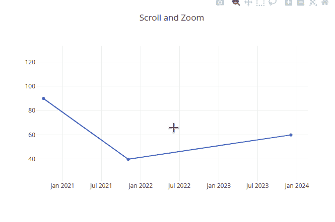

我们开始吧！

# Plotly:渲染图表

## 模块安装

要使用 Plotly，我们需要两个库:

*   `react-plotly.js`:在 React 应用程序中使用图表库
*   `plotly.js`:对`react-plotly.js`的核心依赖

要安装这些程序，请运行以下终端命令:

```
npm install react-plotly.js plotly.js
```

## 基本散点图

在你的`src`文件夹中，创建一个名为`Scatter.js`的文件。顾名思义，这个组件将包含负责呈现散点图的代码。

对于此示例，我们将加载以下数据集:

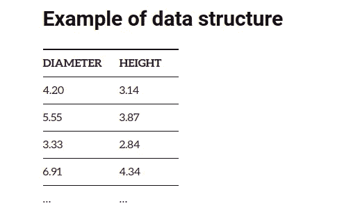

来源:[图表:散点图指南](https://chartio.com/learn/charts/what-is-a-scatter-plot/)

让我们通过代码构建这个数据集的图表。在`/src/Scatter.js`中，编写以下代码:

*   第 4 行:我们的`trace`变量将包含我们的数据集。
*   第 5-6 行:`x`和`y`数组包含我们的坐标。
*   第 7-8 行:我们的`mode`属性告诉 Plotly 为我们的点绘制标记和线条。我们还将我们的`type`属性设置为`scatter`。这将渲染一个散点图。
*   第 13-14 行:呈现`Plot`元素，并将我们的数据作为道具传入。

运行代码。这将是结果:

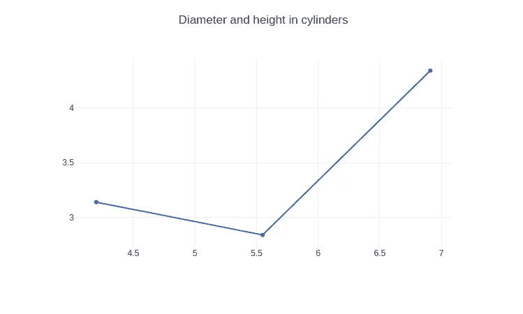

代码的输出

我们甚至可以在同一个图形上呈现多个轨迹，如下所示:

这将是结果:

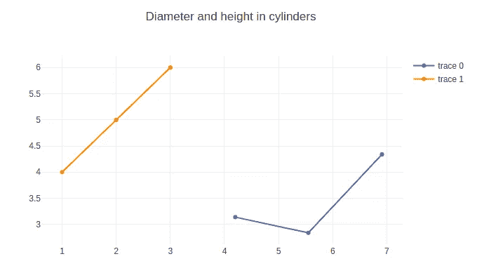

代码的输出

请注意，Plotly 甚至自动为我们显示了图例。在本文的后面，您将学习如何编辑图例的名称。这将使读者更容易识别你的数据。

现在让我们继续创建条形图。

最后，`src/Scatter.js`应该是这样的:

## 条形图

在这一部分，我们将模拟以下数据集:

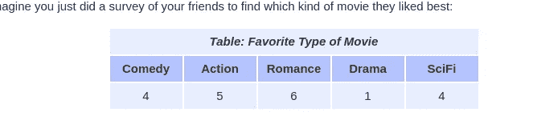

来源:[数学趣味](https://www.mathsisfun.com/data/bar-graphs.html)

在您的`src`文件夹中，创建一个名为`BarChart.js`的 React 组件。在这里，编写以下代码:

*   第 8 行:我们将`type`属性设置为`bar`。这将构建一个条形图。
*   第 13 行:将我们的数据集作为道具传递给`Plot`组件。

运行代码。这将是结果:

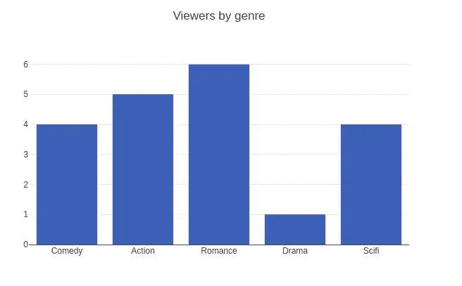

代码的输出

想要水平条形图？没问题！像这样配置您的`data`对象:

注意，我们现在已经相互交换了`x`和`y`数组的值。而且，我们还将`orientation`属性设置为`h`。这会将方向更改为水平。

这将是结果:


我们甚至可以制作一个分组条形图，如下所示:

*   第 4-9 行:创建我们的第一个数据组。在第 7 行，我们指定了这个组的名称
*   第 11-16 行:创建第二个表。
*   第 18 行:将这些数据集传递到`data`数组中。
*   第 21 行:将`data`支柱送入`Plot`组件以显示数据。

这将是输出:

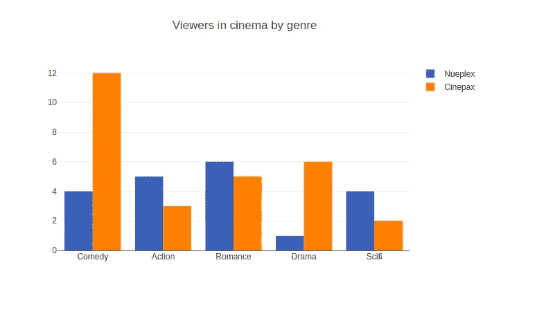

代码的输出

太神奇了！是时候学习用 Plotly 包显示饼图了。

最后，`BarChart.js`应该是这样的:

## 饼图

这里，我们将使用下表中的信息:

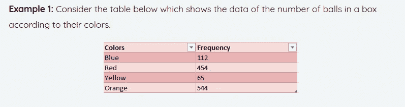

来源: [Formplus](https://www.formpl.us/resources/graph-chart/pie/)

在您的`src`文件夹中，创建一个名为`PieChart.js`的文件。在这里，编写以下代码:

*   第 6-7 行:定义我们的数据集。`values`数组包含我们的频率值，而`labels`数组包含球的颜色。
*   第 8 行:告诉 Plotly 我们要呈现一个饼图。

运行代码。这将是结果:

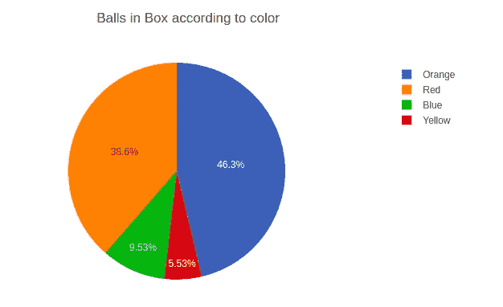

我们完事了。现在让我们在网页上呈现简单的表格。

## 桌子

这里，我们将使用以下数据:

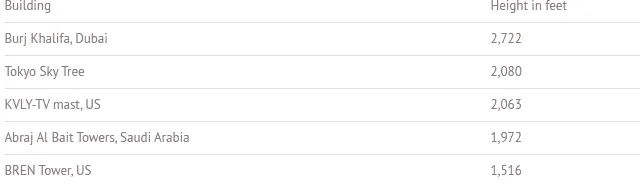

来源:[如何统计](https://www.statisticshowto.com/probability-and-statistics/descriptive-statistics/bar-chart-bar-graph-examples/)

现在让我们用代码实现它。创建一个名为`Table.js`的文件。在这里，编写以下代码:

*   第 4 行:`values`数组包含我们单元格的值。
*   第 8 行:`headers`变量将包含这个表的标题。
*   第 11 行:在这里，我们设置了我们的`type`属性，告诉 Plotly 呈现一个表格元素。
*   第 14 行:将标题居中对齐。

这将是代码的结果。您甚至可以像这样改变列的位置:

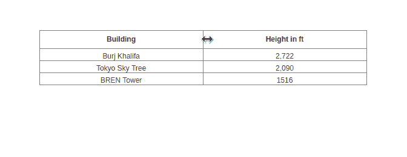

代码的输出

我们甚至可以对表格应用样式。为此，将您的`data`常量修改如下:

*   第 7 行:设置标题的背景颜色。
*   第 8 行:设置字体颜色和大小。
*   第 13 行:设置单元格的字体系列。

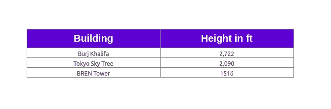

代码的输出

在下一节中，我们将学习如何在同一个图表上呈现多种图表类型。

最后，`src/Table.js`应该是这样的:

## 同一图表上的多种图表类型

在这一部分，我们将学习如何绘制散点图和条形图。

创建一个名为`Mixed.js`的文件，并编写以下代码:

*   第 8 行:告诉 Plotly 我们想用散点图来表示这段数据。
*   第 14 行:指定我们希望以条形图的形式显示这些数据。

这将是结果:


代码的输出

在下一节中，您将学习如何根据自己的喜好更改 Plotly 的默认设置。

# Plotly 配置

## 标记轴

这里，我们将在`BarChart.js`中的条形图上标注我们的 *x* 和 *y* 轴。在`/src/BarChart.js`中，找到下面这段代码:

```
<Plot data={dataVertical} layout={{ title: "Viewers by genre" }} />
```

像这样改变它:

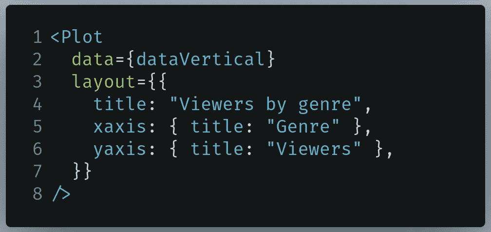

要在 BarChart.js 中编写的代码

*   第 5 行:将`xaxis.title`属性设置为`Genre`。
*   第 6 行:将`yaxis.title`属性设置为`Viewers`。

这将是输出:

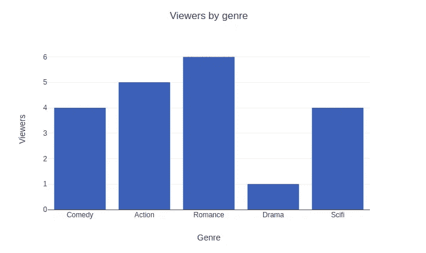

代码的输出

太神奇了！现在让我们学习如何启用滚动缩放。

## 获得滚动缩放

我们可以通过`config`道具来实现。让我们将这个属性添加到我们的`Scatter.js`文件中:


要写入 Scatter.js 的代码

*   第 6 行:将`scrollZoom`属性设置为`true`。


代码的输出

## 更改图例名称

转到`src/Scatter.js`并找到您的`trace1`和`trace2`变量定义:

像这样改变它们:

*   第 6-13 行:在这些数据集上设置`name`属性。

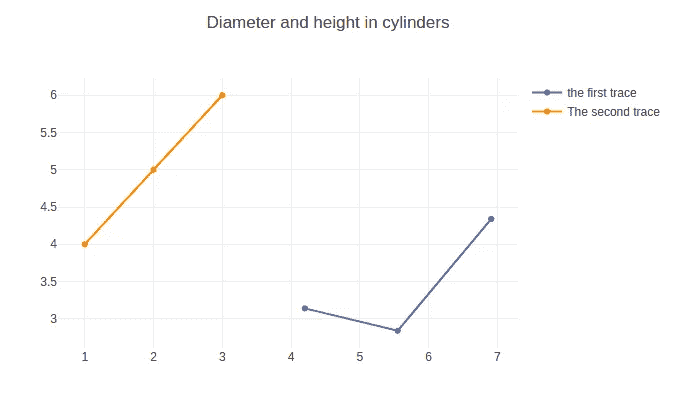

如您所见，我们的代码运行得非常完美！

# 额外资源

*   [如何在 React](https://towardsdatascience.com/how-to-use-plotly-js-in-react-to-visualize-and-interact-with-your-data-ab4c2c67e8f6?gi=c38b1cae1b79) 中使用 plotly . js by[冉(Reine)](https://medium.com/u/441e7a0a4faa?source=post_page-----2ebe6b0cb14--------------------------------)
*   [Plotly.js — W3 学校](https://www.w3schools.com/ai/ai_plotly.asp)
*   [Plotly.js 文档](https://plotly.com/javascript/)

# 结论

如果你从事数据科学，并且想要在前端显示你的图表，那么 Plotly.js 是你的用例的一个极好的选择。执行数据可视化所需的代码很少，因此减少了样板代码的使用和时间浪费。

非常感谢你坚持到最后！