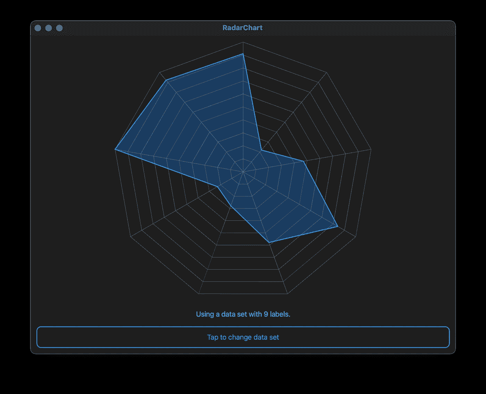
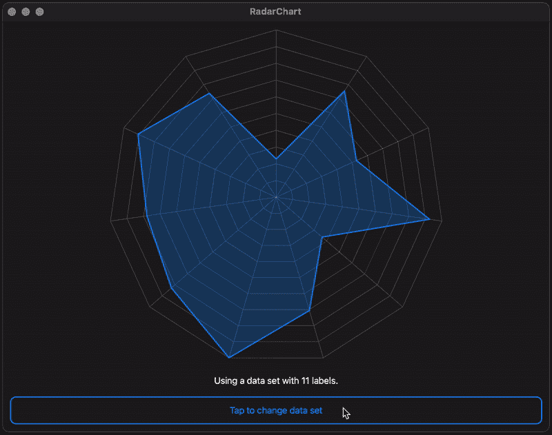

# SwiftUI 数据可视化:雷达图

> 原文：<https://betterprogramming.pub/data-visualization-with-swiftui-radar-charts-64124aa2ac0b>

## 在 SwiftUI 应用中构建漂亮的图表

卢克·切瑟在 [Unsplash](https://unsplash.com?utm_source=medium&utm_medium=referral) 上拍摄的照片。

苹果在 2019 年推出了 SwiftUI，作为一种轻量级和易于使用的方式来创建用户界面。本系列文章将从雷达图开始，探索 SwiftUI 框架如何帮助我们构建干净、简单和令人惊叹的数据可视化工具。

# 什么是雷达图？

雷达图(也称为网状图、蜘蛛图或 Kiviat 图)是一种在同一绘图中用轴表示多个变量的方法，这些轴从同一点开始，但向不同方向延伸。下图显示了一个雷达图的例子，恰好是我们在本文中构建的。真巧！

本文中我们正在构建的雷达图的一个示例。

这种类型的可视化可能适用于以下情况:

*   你正在汇总有多少学生被一所大学的不同项目录取的概况。
*   你试图想象某项技能的相对优势和劣势，以确定你需要练习哪些技能。
*   你展示了进入公司各个部门的资金，以了解你是如何花钱的。

# 我们需要什么？

要创建这样的东西，我们需要了解 SwiftUI 如何使用`Shape`和`Path`类型在显示器上呈现图形。

`Path`的工作方式类似于 UIKit 的`UIBezierPath`和 Core Graphics 的`CGPath`。开发人员用它来描述一条二维曲线，渲染系统可以在绘制过程中描绘出这条曲线。符合`Shape`协议的类型可以封装一个`Path`,并确保渲染描述与绘制区域完全匹配。

`Shapes`和`Paths`在本文中扮演主角。现在我们对它们有了更多的了解，是时候开始编码了。

# 我们怎么给这东西编码？

让我们从创建图标化的、类似网络的背景开始——这是`Shape`类型的完美用例。这样做时，我们需要考虑两件事:

1.  我们可能希望重用这些代码来为各种应用程序创建图表，并且我们的图表需要为每个数据集添加正确的轴数。
2.  我们可能想要改变网络的粒度。如果我们知道数据只能取`1`和`5`之间的整数值，那么添加一公吨的网格线没有任何好处。

我们的`RadarChartGrid`类型的代码做了一些事情:

1.  它实现了`Shape`协议，该协议允许它调整`Path`的描述，以适合它所绘制的矩形。
2.  它使开发人员能够控制数据中类别的数量以及在对轴进行分区时要进行的划分的数量。
3.  它根据可用的维度构造一个`Path`对象。

把轴想象成轮子的辐条。它们从中心的共同原点开始，并且长度都相同。这些性质允许我们把它们当作一个假想圆的半径，并用三角函数画出来。您可以通过查看`path(in:)`方法中的第一个`for`循环来研究细节。

我们也用三角函数在两个轴之间画线。这些计算发生在嵌套的`for`循环中，接近`path(in:)`方法的末尾。

最后需要注意的是，我们将三角函数偏移了 *-π/2* 。偏移会旋转图表，使其看起来更平衡，视觉效果更好。

# 绘制数据

我们绘制数据的方式与绘制背景网页的方式非常相似:使用三角学。看看下面的代码:

我们的`RadarChartPath`在绘制任何东西之前会检查一些先决条件。如果检查失败，我们返回一个空的`Path`对象，它在屏幕上是不可见的。如果它们通过，我们将数据归一化到`[0, 1]`的范围内，并使用归一化的值以与之前相同的方式绘制`Path`。

# 把所有的放在一起

现在我们已经有了基础，是时候把所有东西放在一起，制作一个实际的图表视图了:

把所有东西放在一起的代码足够简单。我们将背景 web 和我们的数据形状放入我们的`body`属性内的`ZStack`中。SwiftUI 还很年轻，没有提供一种便捷的方式来勾勒和填充单个`Shape`类型，所以我们添加了两次`RadarChartPath`(一次创建填充颜色，另一次创建轮廓)。

有了这段相对简单的代码，我们就可以开始可视化我们的数据了:

一个示例应用程序显示了我们的雷达图和随机采样的数据集。

你有兴趣学习更多关于软件开发的知识吗？
**关注我，在我发布新文章时获得通知。**

在下一次之前，您可以阅读更多关于如何处理复杂编程任务的内容。

 [## 在没有头绪的情况下如何编码

### 分解复杂任务并使其正确的指南。

medium.com](https://medium.com/swlh/how-to-code-when-you-dont-have-a-clue-daa842cfd6ea) 

你可以阅读如何在家工作时保持理智。

 [## 如何作为远程开发者保持理智

### 作为远程开发人员的第一年，我学到了 5 个最重要的经验。

medium.com](https://medium.com/swlh/how-to-stay-sane-as-a-remote-developer-48377bae99d3)