# 命令行中的数据争论

> 原文：<https://betterprogramming.pub/data-wrangling-in-the-command-line-af35a609c5f1>

## 学习如何使用 Unix Power Tools 在命令行中获取和操作数据

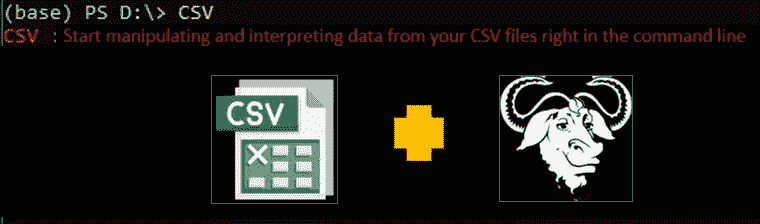

所有图片由作者提供

在本教程中，我们将探讨使用命令行工具的高效方法，以及数据科学家、数据工程师和其他数据相关人员如何利用 Linux 终端的能力进行数据辩论。

如今，从事数据工作的人可以从大量令人兴奋的技术和编程语言中进行选择，用于数据争论、操作和解释，如 Python、R、Julia 和 Apache Spark。也许我们会想到下面这个问题:

为什么您仍然应该关心一项在七十年代开发的用于执行这些数据密集型任务的旧技术呢？

命令行有什么是其他技术和编程语言所没有的？

数据分析是一个令人兴奋的领域，通常需要尖端技术来适当地“提炼石油”，但不幸的是，许多人和公司认为您需要新技术来处理数据争论和数据操作等任务，尽管有许多事情可以通过使用命令行来完成。不仅如此，它只需要很少的设置，有时可以更有效地实现。

您将需要深入了解 Linux 命令，以认识到命令行不仅仅用于安装软件、配置系统和搜索文件。有一些神奇而有用的工具，比如`curl`、`head`和`sort`，可以帮助你获取、组织和操作数据，就像你在 Pandas 或 Spark 中所做的那样。这些是命令行工具的例子，它们将数据作为输入，对其进行处理，并打印结果。Ubuntu 附带了相当多以前安装的程序。在本文中，我们将使用其中一个命令行工具，这是一个 Python 包，你可以通过`pip`像安装任何其他包一样安装，这就是所谓的`csvkit`。

# 获取数据

获取数据然后争论是非常耗时的，那么为什么不在终端中用最简单的方式来表达呢？我们将使用`curl`从[随机用户生成器 API](https://randomuser.me/documentation) 下载假数据，然后我们将使用一个非常好的命令行工具，名为 [bat](https://github.com/sharkdp/bat) ，它是一个`cat`克隆，允许您突出显示语法和其他一些很酷的功能。我们还将使用 [jq](https://stedolan.github.io/jq/) ，这是一个对 JSON 文件进行操作的强大工具。

获取随机数据的命令如下:

```
curl -s "[https://randomuser.me/api/1.2/?results=5&seed=foobar](https://randomuser.me/api/1.2/?results=5&seed=foobar)" > users.json
```

您可能已经注意到，`curl` 下载 API 返回的原始 JSON。没有进行任何解释，响应内容立即打印在标准输出上。在本例中，我们使用重定向操作符(`>`)以 JSON 格式保存响应。

[手册页](https://en.wikipedia.org/wiki/Man_page)的一个非常好的选项是 [tldr](https://tldr.sh/) ，它为您提供了关于特定 Linux 命令的上下文，并提供了该命令的示例和可能的用法。


接下来，我们将检查之前使用`bat`命令生成的 JSON 文件。以下是输出结果:

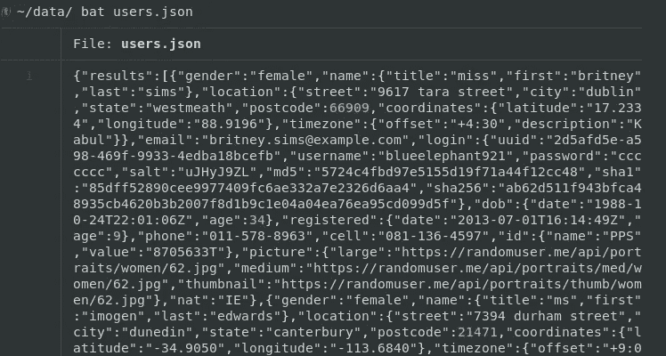

我们可以添加一个管道到`jq`，并以更好的输出可视化 JSON 文件，而不是重定向 API 响应以保存到`users.json`文件:

```
curl -s "[https://randomuser.me/api/1.2/?results=5&seed=foobar](https://randomuser.me/api/1.2/?results=5&seed=foobar)" | jq .
```

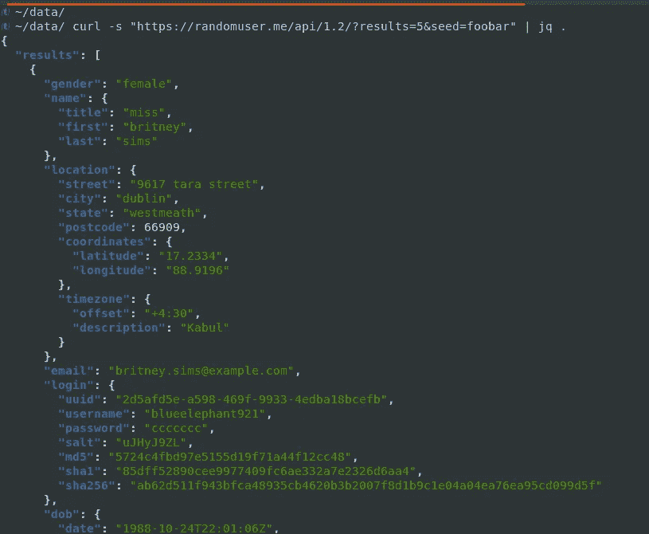

我们可以将提取的 JSON 文件中的重定向操作符传递给`jq`,然后获取 JSON 中的电子邮件，而不是像前面的步骤那样获取一些虚拟数据:

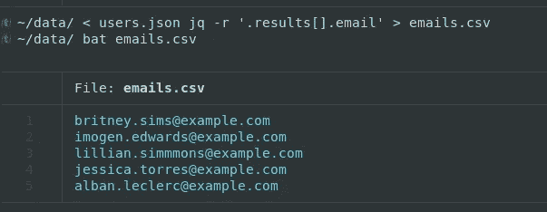

# 数据操作

出于数据操作的目的，我们已经解析并转换为 CSV 格式的数据集似乎有点小，因此我们将使用`curl`从外部存储库下载另一个数据集:

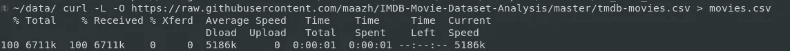

图片来自作者

然后检查 CSV 文件的第一行:

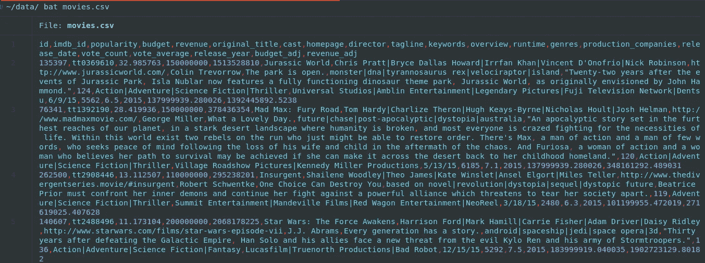

为了生成这个 CSV 文件的一些统计数据，我们将使用一个非常方便的命令行工具，名为 [csvkit](https://csvkit.readthedocs.io/en/1.0.2/tutorial/1_getting_started.html) 。通过运行以下命令，它可以作为任何其他 Python 包从您的终端安装:

```
sudo pip install csvkit
```

csvkit 的第一个有用特性是*in csv*，它允许您在命令行中将 Excel 格式的文件转换为 CSV 格式:

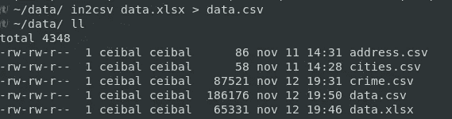

在上面的截图中，我们将 Excel 文件转换为 CSV 文件，然后将输出保存到 CSV 文件。既然我们已经有了一些可以使用的数据，我们可能会想在 Excel 或 Google Docs 中打开它，但是如果我们能在命令行中查看一下不是很好吗？为此，我们有 *csvlook* 。有了它，我们可以通过管道连接到 less 选项，并生成我们先前下载的文件的良好输出:

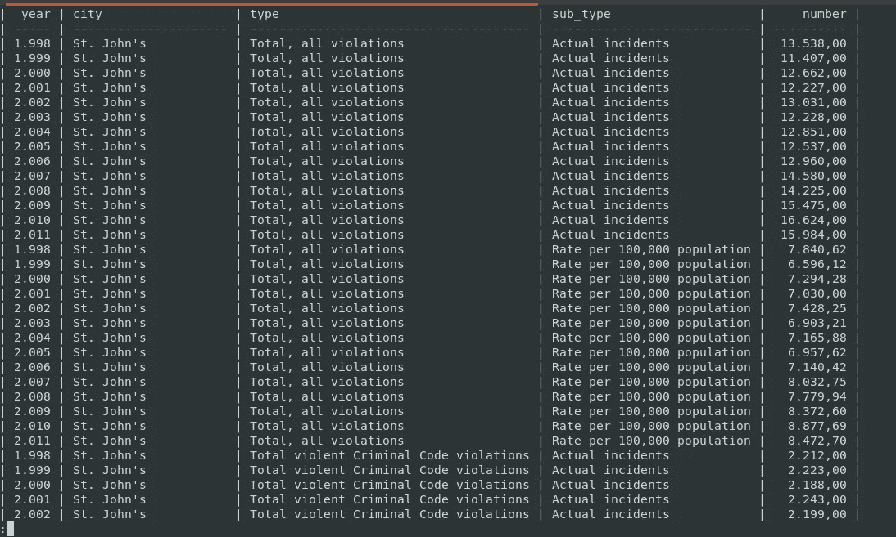

我们还可以结合使用 *csvcut* 和 *csvstat* 工具来获得 CSV 数据集的一些漂亮的统计数据:

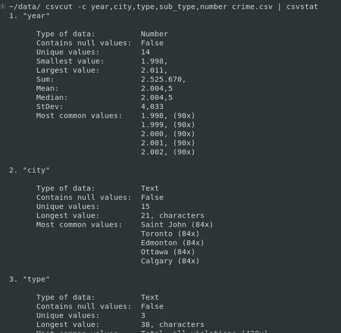

如果在这个 1261 行的数据集中，我们需要查看对应于特定城市的记录，那么我们应该使用 csvkit 的 *csvgrep* 工具。

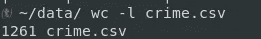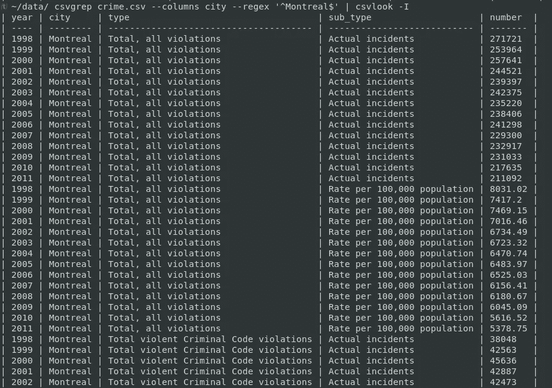

# 查询 CSV 数据

csvkit 有一个名为 *sql2csv 的命令行工具。*它可以通过一个通用接口与许多数据库协同工作，包括 MySQL、Oracle、PostgreSQL、SQLite、Microsoft SQL Server 和 Sybase。顾名思义，sql2csv 以 csv 格式输出文件。

我们将使用`wget` 命令行工具下载一个示例 SQLite 数据库，然后在同一个目录中解压缩它的内容。之后，我们将获得一个. db 文件，以便使用 sql2csv 进行分析:

```
wget https://www.sqlitetutorial.net/wp-content/uploads/2018/03/chinook.zip
```

该数据库包含一家音乐商店的 11 个数据表，我们将在终端中直接探索和检索 SQL 表，而无需连接 SQL 客户端。很酷，不是吗？

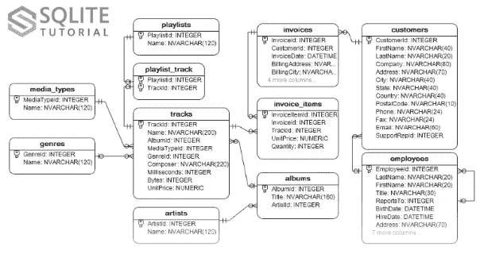

图片来自大数据和商业智能，Packt

我们需要向 sql2csv 传递两个参数，`--db`和`--query`，就像在 sql 编辑器中一样。正如我们在 [ERD](https://en.wikipedia.org/wiki/Entity%E2%80%93relationship_model) 中注意到的，有`artists`和`albums`表:

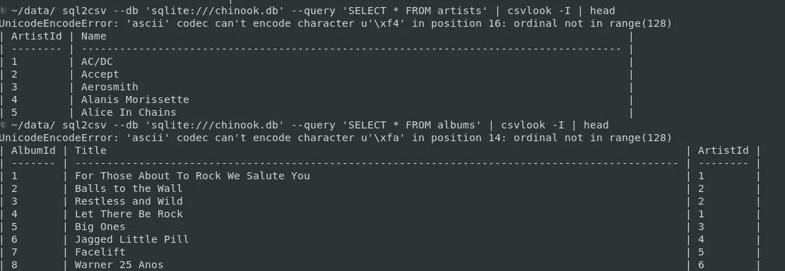

我们可以通过主键`ArtistId`连接两者，并为每个`Artist`对应的`Title`带来一个包含以下内容的表:

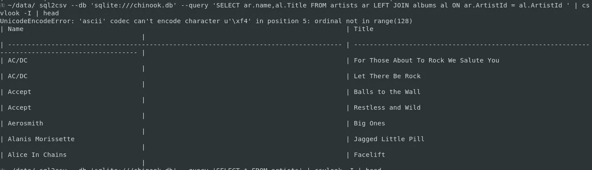

csvsql 工具允许您通过运行以下代码行从 CSV 文件创建数据库表:

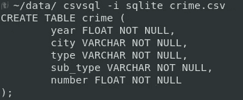

上面的语法将生成 CSV 文件的 create table 语句，但是真正创建数据库表的是下面的语句:

```
csvsql --db sqlite:///crime.db --insert crime.csv
```

# 最后的想法

在本教程中，我们学习了数据人员可以在日常工作中使用的多种有用的命令行工具。它们功能强大，安装简单，因此掌握 Linux 命令行对每个数据科学家和数据工程师的职业生涯都是一个加分项。

在下面的链接中，我将为您留下一个极好的资源，让您了解更多关于命令行工具的信息:

[](https://github.com/jeroenjanssens/data-science-at-the-command-line) [## GitHub-jeroen janssens/命令行数据科学:命令行数据科学

### 此时您不能执行该操作。您已使用另一个标签页或窗口登录。您已在另一个选项卡中注销，或者…

github.com](https://github.com/jeroenjanssens/data-science-at-the-command-line)