# 与 Python 熊猫的数据角力

> 原文：<https://betterprogramming.pub/data-wrangling-with-pandas-57f7f72fe73c>

## 将杂乱的数据转化为干净的、结构良好的数据


照片由[克劳福德·乔利](https://unsplash.com/@crawford?utm_source=medium&utm_medium=referral)在 [Unsplash](https://unsplash.com?utm_source=medium&utm_medium=referral) 拍摄

原始数据可能非常杂乱，但机器学习模型只想要结构良好、干净的数据。数据争论是将原始数据转换成功能性更强的形式的最重要和最基本的步骤。有了适当的争论数据，您将能够创建信息丰富的数据视觉效果，还可以构建高度准确的模型，以便做出更好的预测。

机器学习遵循垃圾输入/垃圾输出原则。如果您想从数据中学习或基于数据进行预测，您需要确保数据构造良好、干净，并且适合您的机器学习模型。

[pandas](https://pandas.pydata.org/) ，构建于 [Numpy](https://numpy.org/) 之上，是一个顶级的 Python 库，为数据操作和分析而开发。这是 Python 中最受欢迎的数据辩论工具。

与熊猫的数据争论是数据科学项目中最容易被忽视的方面之一。在现实世界中，这也是典型的数据科学项目中困难和耗时的一部分，因为数据科学家/分析师几乎 80%的时间都花在清理杂乱的数据上。数据争论包括访问数据、排序数据、重塑数据等等。

如果您使用的是 Anaconda 发行版，默认情况下会安装许多 Python 库。进口熊猫，使用常规别名`pd`。

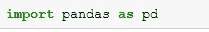

如果 pandas 在默认情况下不可用，您可以按如下方式安装它:

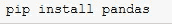

你可以在这里阅读更多关于熊猫[的内容，也可以查看官方](https://medium.com/better-programming/top-10-python-libraries-for-data-science-21e6cd95ca55)[文档](https://pandas.pydata.org/)了解熊猫的构造。

# **导入数据**

数据以不同的形式存储，如 CSV 和 TSV 等平面文件，以及 Excel、 [SAS](https://en.wikipedia.org/wiki/SAS_(software)) 、 [Stata](https://en.wikipedia.org/wiki/Stata) 、 [MATLAB](https://en.wikipedia.org/wiki/MATLAB) 和纯文本等电子表格。它也存储在数据库中——存储在关系数据库中的结构化数据可以使用 [SQL](https://en.wikipedia.org/wiki/SQL) 进行检索。

所有这些数据格式都可以在 pandas 中导入、操作和讨论。我将会写如何在将来用熊猫导入不同的文件格式。这是熊猫导入 CSV 文件的典型方式。

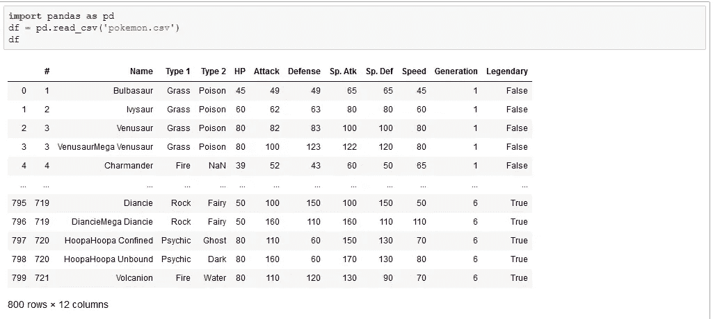

为了更好地理解数据，本节列出了一些常用的操作，以便更好地理解数据帧包含的内容。

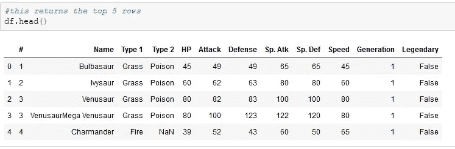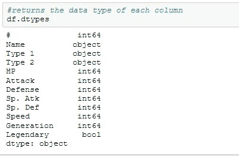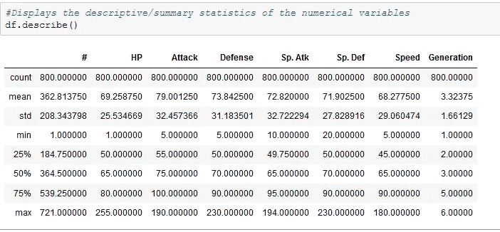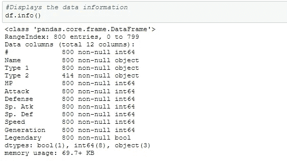

`[sort_values](https://pandas.pydata.org/pandas-docs/stable/reference/api/pandas.DataFrame.sort_values.html)`函数用于按升序(默认)或降序(升序设置为`False`)对数据帧进行排序。

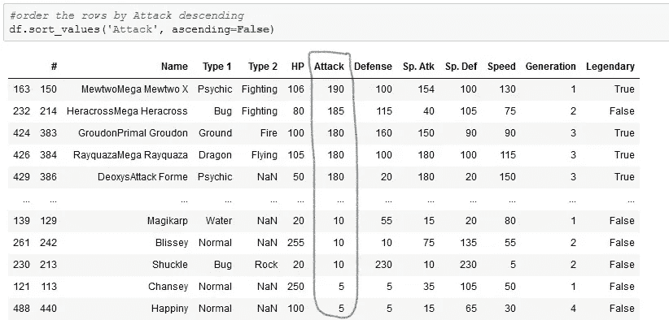

pandas 有一个`merge`功能，可以用来合并两个数据帧。它类似于 SQL 中的`joins`，用于组合来自不同数据帧的观察值。

**注:**我用字典创建了数据框。我使用加拿大的城市、温度(摄氏度)和湿度作为值。

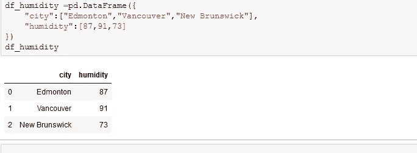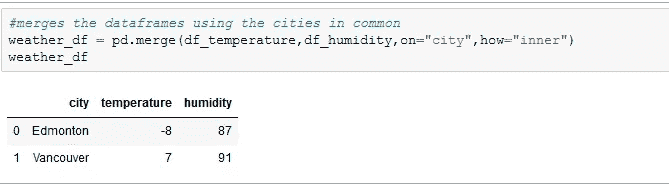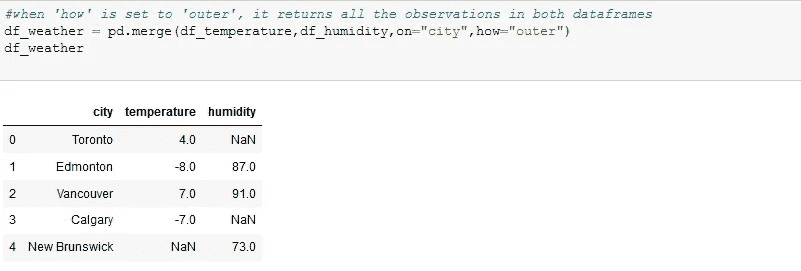

当`how`被设置为`inner`时，两个数据帧中共同的城市被返回到一个新的数据帧中，就像交集是如何在集合中完成的一样。

当`how`设置为`outer`时，两个数据帧被合并并返回到一个新的数据帧中，就像集合中的并集一样。

如果一个观察值只存在于一个数据帧中，则在它不存在的列中返回`NaN`。

`how`也可以设置为`left`和`right`。

你可以浏览一下[文档](https://pandas.pydata.org/pandas-docs/stable/reference/api/pandas.DataFrame.merge.html)来看看用`merge`函数能做些什么。

使用`rename` 操作可以重命名列。你可以在这里阅读更多关于`rename`。假设我们想将`weather_df`数据框架中列名的第一个字母从小写改为大写。我们的做法如下:

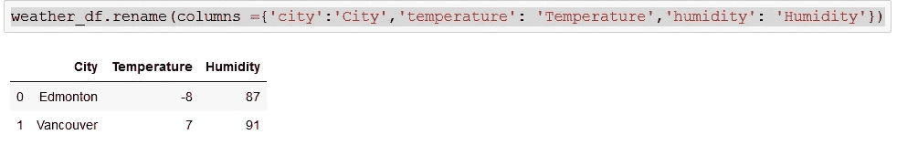

一个`[groupby](https://pandas.pydata.org/pandas-docs/stable/reference/api/pandas.DataFrame.groupby.html)`可以用来对数据进行分组，并基于分组执行操作。它包括拆分、应用函数和组合结果的组合。使用我们的`pokemon.csv`，让我们通过`Type 1`将数据分组来计算每种类型 1 的数量。

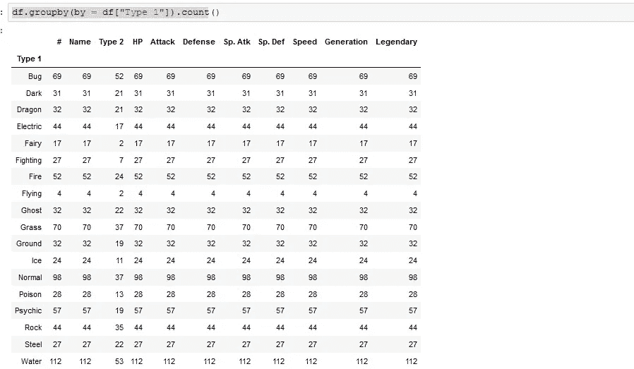

# **检查缺失值**

数据中缺少值是常见的事情。原因可能是人为或技术错误。我们需要大量的数据来获得更好的见解——数据越大，机器学习模型的性能就越好。评估缺失的价值是至关重要的。

在处理缺失值之前，必须很好地理解这个问题:缺失值是否太多，有多少？他们是随机失踪的吗？有规律吗？其他观察值有助于获得缺失值吗？

缺失值可以用不同的形式处理。可以通过不同的方法删除或替换它们。一种常见的方法是用集中趋势的度量来替换缺失值。

我们可以使用以下方法获得所有缺失值的汇总:

```
df.isnull().sum()
#or
df.isna().sum()
```

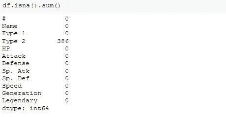

根据您选择处理缺失值的方式，您可以按如下方式删除缺失值:

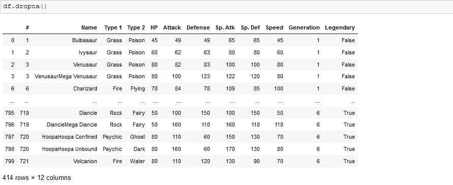

我们可以确认包含缺失值的行已被删除。

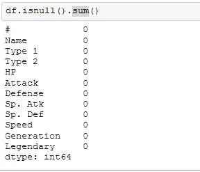

我们可以看到丢失/空值的行已被删除，行数为 414，而初始数据帧中为 800。

许多行已被删除，因此大量信息将会丢失。我们可以用平均值、中值、最大值、众数、零值等来填充它们，而不是丢弃丢失的值。我们也可以根据对数据的理解程度，分别填写每一列。

我们可以使用`.[fillna](https://pandas.pydata.org/pandas-docs/stable/reference/api/pandas.DataFrame.fillna.html)()`用 Type 2 列的模式填充缺失值:

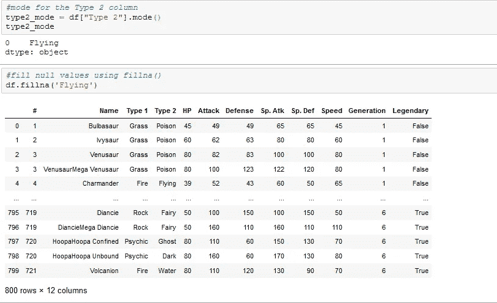

或者使用`.[replace](https://pandas.pydata.org/pandas-docs/stable/reference/api/pandas.DataFrame.replace.html)()`填充缺失的值:

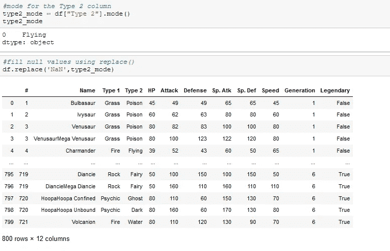

像数据帧和系列这样的 pandas 对象可以很容易地导出到外部文件，并保存到本地机器上的一个目录中。它们可以使用`to_csv`、`to_sql`、`to_excel`、`to_hdf`、`to_json`、`to_html`等不同格式存储。

我们可以将`weather_df`数据帧保存为名为`weather`的 CSV 文件，如下所示:

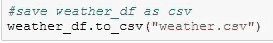

还有许多其他的数据争论操作没有在这里讨论。你知道吗？感谢您的阅读！