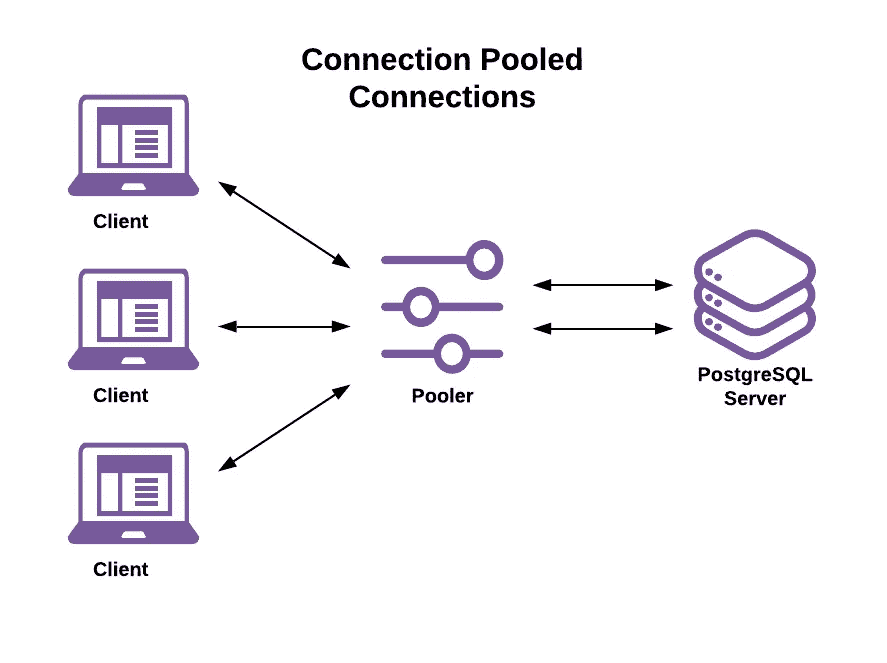

# 使用 PgBouncer 的数据库连接池

> 原文：<https://betterprogramming.pub/database-connection-pooling-with-pgbouncer-d8766a8a2c85>

## Postgres 连接池问题

克里斯·德马利诺在 [Unsplash](https://unsplash.com/s/photos/neon-green?utm_source=unsplash&utm_medium=referral&utm_content=creditCopyText) 上的照片

# 简介:Postgres 连接池问题

当 [Postgres](https://www.postgresql.org/) 在近 25 年前被创建时，开发者决定不为新请求使用线程。相反，他们决定为每个请求创建一个新的进程。他们的理由是，进程不太可能导致内存损坏，而且最终在目标平台(Unix)上创建进程的成本也不是很高。从那以后，这个决定引发了很多讨论。但是开发者坚持他们的决定，并抵制重新架构。

当时，使用流程的决定是正确的。但是现代应用程序(例如微服务)往往需要大量的连接，并且它们使用和释放这些连接的速度非常快。因此，虽然“无线程”的决定在十年前是站得住脚的，但今天 Postgres 无法伸缩是一个严重的问题。幸运的是，这是一个众所周知的问题，开发人员多年来一直在面对和解决这个问题。

那么答案是什么呢？连接池。

在这篇文章中，我们将看看 Postgres 上的连接池和连接池选项。然后，在后续文章中，我们将使用 [Heroku](https://www.heroku.com) 、[PgBouncer 指南、](https://devcenter.heroku.com/articles/best-practices-pgbouncer-configuration)和[Postgres 连接池指南](https://devcenter.heroku.com/articles/postgres-connection-pooling)在应用程序上实现 PgBouncer 连接池

# 什么是连接池？

连接池是开放数据库连接的缓存，可供客户端重用。使用池通过减少对新连接的请求来减轻数据库的压力。池还提高了单个数据库调用的性能，因为不需要花费时间来请求和打开连接。

从高层次来看，连接池是这样工作的:

1.  用户请求数据库连接。
2.  该池检查现有的和可用的缓存连接。
3.  如果找到缓存的连接，它将返回给用户。
4.  如果找不到缓存的连接，则会创建一个新连接，只要该池符合连接池的设置，如最大池大小、数据库允许的最大连接数、每个用户允许的最大连接数等。
5.  如果创建新连接违反了这些设置中的任何一项，请求将被排队，直到连接可用或可以创建新连接。

# 在哪里创建连接池

现在我们已经了解了什么是连接池，让我们来看看当您实现连接池时将面临的第一个决定——将它放在堆栈的什么位置。你有几个选择。您可以在语言级别、在您的客户机上、作为中间件或者作为这些选择的某种混合来创建您的池。与许多技术决策一样，正确的选择通常取决于您的情况。

这里有一些利弊来帮助你决定。

## 语言级

您的库使用专门为您的语言创建的库，在您的代码需要的任何地方本地运行。大多数语言都包含本地或附加的连接池库(例如，Java 的 [JDBC](https://jdbc.postgresql.org/documentation/81/datasource.html) 或 Python 的 [Psycopg](https://www.psycopg.org/) )。

优点:

*   低延迟，因为池与请求者在同一机器上。
*   更好的安全性，因为连接仅限于一个客户端。
*   不需要学习新工具。

缺点:

*   很难监视和控制到数据库的连接，因为您最终可能会有来自多个客户端的多个池。
*   针对您的语言优化，不一定针对 Postgres。

## 客户端级别

您的池与您的代码是分开的，但是与您的客户端应用程序运行在同一台机器上。

优点:

*   低延迟和更好的安全性，类似于语言级别。
*   针对 Postgres 优化，不针对您的语言。

缺点:

*   同样，与语言级别类似，很难监控和控制连接。

## 中间件

您的池在客户机和数据库之间运行，可以在独立的服务器上运行，也可以在与数据库相同的机器上运行。

优点:

*   灵活—数据库可以换出。
*   针对 Postgres 优化，不针对您的语言。
*   连接的集中控制，这使得监视和控制连接更加容易。

缺点:

*   您引入了新的层，因此也带来了新的延迟。
*   跨所有客户端的数据库调用的单点故障。
*   潜在的安全问题，因为您在层之间共享连接。
*   还有一层需要维护。

人才库的理想位置将取决于您的独特情况、技术需求和个人优势。然而，在大多数情况下，中间件可能是您的最佳选择。对于一个拥有许多服务的现代应用程序来说，中间件可以让您更好地控制和了解您的连接。

接下来，让我们深入最常见的用例:Postgres 上的中间件连接池。

# Postgres 中间件连接池选项

Postgres 中间件连接池有两个领先的库: [Pgpool-II](https://www.pgpool.net) 和 [PgBouncer](https://www.pgbouncer.org/) 。详细对比，我推荐[阅读这篇文章](https://www.cybertec-postgresql.com/en/connection-pooling-intro-pgbouncer-and-pgpool-ii/)。让我们快速看一下每种方法的优缺点，因为决定可能很简单。

## Pgpool-II

*   基本连接池
*   还提供负载平衡、复制和其他高级功能

## PgBouncer

*   基本连接池。就是这样。
*   重量轻，性能更好

这通常是一个非常容易的决定。这两个选项都是成熟的解决方案，运行良好，并且拥有坚实的用户基础。决定因素是你是否需要连接池或者更多。Pgpool-II 稍微慢一点，重一点，但是有一些高级特性，比如负载平衡。

另一方面，如果您只需要一个连接池，不需要其他东西，PgBouncer 是您的轻量级快速解决方案。

# 结论

在本文中，我们讨论了*为什么*应该在 Postgres 中创建连接池，以及一些选项。在下一篇文章中，我们将通过一个在 Heroku 上的例子来看一下*如何在 Postgres 中建立 PgBouncer 连接池。*