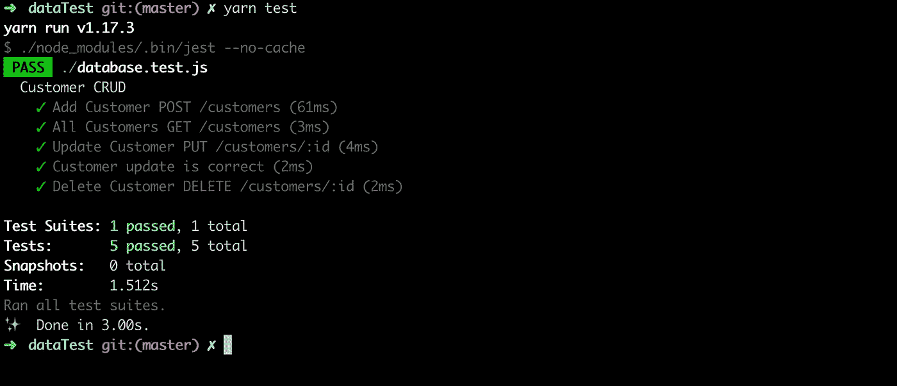

# Jest 简化了数据库测试

> 原文：<https://betterprogramming.pub/database-testing-made-easy-with-jest-db96ad5f1f46>

## 测试数据库并不像你想象的那么困难——知道如何做可能是救命稻草


照片由[法比奥](https://unsplash.com/@fabioha?utm_source=unsplash&utm_medium=referral&utm_content=creditCopyText)在 [Unsplash](https://unsplash.com/s/photos/database?utm_source=unsplash&utm_medium=referral&utm_content=creditCopyText) 上拍摄

测试是软件开发生命周期中非常重要的一部分。通过在整个代码库中预防和检测错误，它避免了大量的返工。

几乎所有的应用程序都以某种形式使用数据库。那么数据库可以测试吗？当然可以。如果获取和发布数据是应用程序的需求，为什么不测试一下呢？有几个库可以用来执行这些任务，但是在这篇关于数据库测试的文章中，Jest 将用于测试，Mongoose 用于与 Mongo 数据库通信。

# **下载依赖关系**

```
$ yarn add jest mongoose dotenv
```

`DotEnv`库用于测试中使用的值。在 Jest 中使用 Mongoose 也需要注意，但是有一个解决方法。创建一个`jest.config.js`文件，然后添加下面的代码。

```
+ jest.config.jsmodule.exports = {
  testEnvironment: 'node'
};
```

创建用于测试的脚本和将包含在测试中的环境变量。这些变量对于如何执行测试很重要。

```
+ package.json"scripts": {
    "test": "./node_modules/.bin/jest --no-cache"
 }+ .envDATABASE=shop
COLLECTION=customersCUSTOMER_NAME=John
[CUSTOMER_EMAIL=john@example.com](mailto:CUSTOMER_EMAIL=bshelling@gmail.com)
[CUSTOMER_EMAIL_ALT=doe@example.com](mailto:CUSTOMER_EMAIL_ALT=test@email.com)
```

# 用描述块创建一个测试文件

一个描述块将测试分组以使它们有组织。在本例中，描述块被标记为“客户 CRUD”。为表示用于与数据库通信的端点而创建的测试。总共将运行五个测试。

```
+ database.test.jsconst mongoose = require('mongoose');
require('dotenv').config();describe('Customer CRUD',() => {});
```

# 设置数据库连接

在运行测试之前，需要用一些其他设置建立到数据库的连接。Jest 有两个函数包含在 describe 块中，`beforeAll`和`afterAll`。`beforeAll`功能将在测试执行前执行所有动作，而`afterAll`功能将在测试完成后执行其动作。

设置包括连接到数据库、创建数据库和创建集合。该数据库将是一个测试数据库，是生产中使用的数据库的副本。在这个例子中，测试数据库被标记为`test_shop`。拆除操作包括删除测试数据库。

```
beforeAll(async () => {

   connection = await mongoose.connect('mongodb://localhost:27017/test_'+process.env.DATABASE,{useNewUrlParser: true, useUnifiedTopology: true });
   db = mongoose.connection;
   const collection = process.env.COLLECTION;
   await db.createCollection(collection);});afterAll(async () => { const collection = "test_"+process.env.COLLECTION;
   await db.dropCollection(collection);
   await db.dropDatabase();
   await db.close();
   await connection.close();});
```

# 阶段测试

第一个测试是将单个客户发布到客户集合中。这首先是因为除非重复这个步骤，否则下一个测试将会失败——但是目标是保持测试精益。因此，添加了一个客户并测试了响应。

```
test("Add Customer POST /customers",async () => {const response = await customers.create({ name: process.env.CUSTOMER_NAME,
      email: process.env.CUSTOMER_EMAIL});
      await response.save();
      expect(response.name).toBe(process.env.CUSTOMER_NAME);});
```

接下来，测试将检查是否有来自响应的客户。因为响应是一个对象数组，所以测试期望数组的长度大于零。

```
test("All Customers GET /customers", async () => { const response = await customers.find({});

   expect(response.length).toBeGreaterThan(0);});
```

更新记录的测试分为两部分。一个测试检查保存时通过的电子邮件，另一个测试查询更新的记录以检查其当前的电子邮件地址。它应该是提供的任何替代电子邮件。

```
test("Update Customer PUT /customers/:id", async () => {
  const response = await customers.updateOne({name: process.env.CUSTOMER_NAME},{email: process.env.CUSTOMER_EMAIL_ALT});
  expect(response.ok).toBeTruthy();
});test("Customer update is correct", async () => {
const responseTwo = await customers.findOne({name: process.env.CUSTOMER_NAME});
expect(responseTwo.email).toBe(process.env.CUSTOMER_EMAIL_ALT);
});
```

最后一个测试很简单。通过期待有效的响应来测试记录的删除:

```
test("Delete Customer DELETE /customers/:id", async() => {
  const response = await customers.deleteOne({name: process.env.CUSTOMER_NAME});
  expect(response.ok).toBe(1);
});
```

# 运行测试

现在，当测试执行时，报告应该返回套件和通过的五个测试。

```
$ yarn test
```



# 完整示例

项目示例

如果你想得到更多这样的帖子，请注册我的时事通讯以获得最新消息。[注册简讯](https://share.hsforms.com/1tVh1vq1ZSHy0JlsTnFBwwg4c0tk)