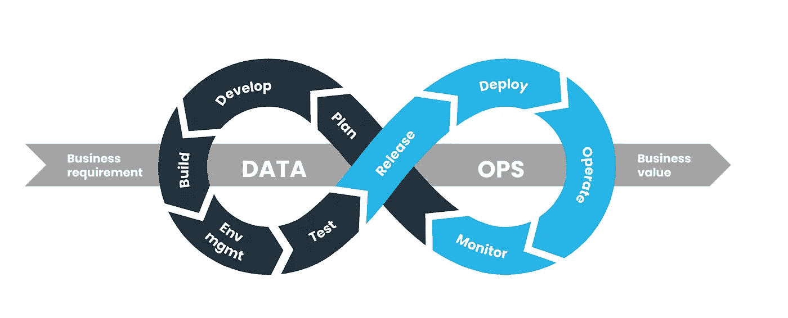
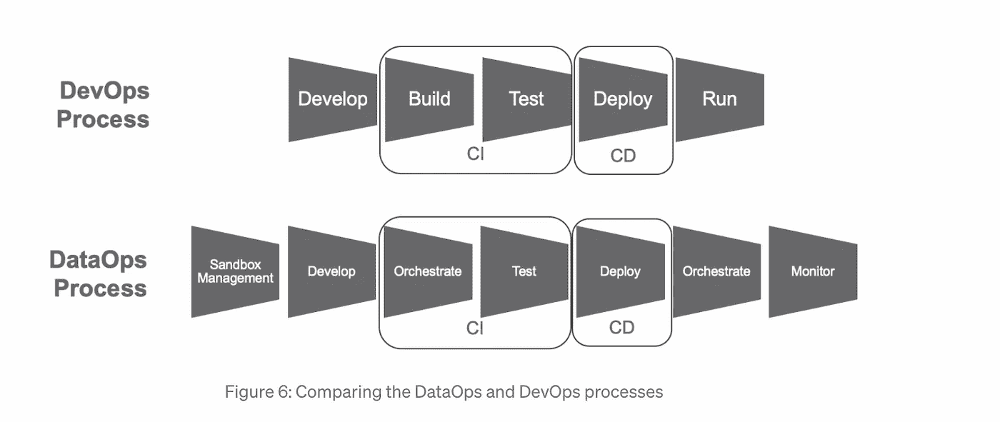

# 数据运营—它是什么？为什么您应该关注它？

> 原文：<https://betterprogramming.pub/dataops-what-is-it-and-why-should-you-care-68557ba2bf7d>

## 实现您梦想中的数据管道的基本概念和可用工具

照片由[西格蒙德](https://unsplash.com/@sigmund?utm_source=medium&utm_medium=referral)在 [Unsplash](https://unsplash.com?utm_source=medium&utm_medium=referral) 拍摄

因此，我意识到我在这方面有点晚了，因为数据运算的概念在我进入技术领域的时候就已经存在了，但我最近偶然发现了这一点，在阅读了它之后，我想可能会有像我一样的人对此感到震惊。有许多好的想法可以单独地、渐进地实现，即使你没有一键完成所有的解决方案，遵循框架中的原则也有很多好处。更重要的是，让这个框架把许多独立的概念都框在一个包里，会让独立的概念更有意义，并给你一个理想的奋斗目标。

# **那么什么是 DataOps，为什么它听起来如此像 DevOps？**

DevOps 是组织内工作方式的原则、最佳实践和工具的组合，可以帮助公司快速开发和交付软件。目标是尽可能自动化产品生命周期(构建、测试、部署等)。这里的关键词是[持续集成](https://en.wikipedia.org/wiki/Continuous_integration) (CI)和[通过利用随需应变的 IT 资源(基础设施即代码)持续交付](https://en.wikipedia.org/wiki/Continuous_delivery) (CD)软件，因此得名——“开发”+“运营”/IT。这在某种程度上是实践的一面或实现，使得 [**敏捷**](https://en.wikipedia.org/wiki/Agile_software_development) 方法成为可能。

[**DataOps**](https://en.wikipedia.org/wiki/DataOps) 简而言之就是应用于数据的 DevOps，这是一个很好的总结，但并没有说明太多问题。每个曾经与更复杂的系统一起工作过的人都知道，从数据产品中传递价值比从软件产品中传递价值有更多的变量。所以，让我们再深入一点。是的，目标是一样的——以可预测和可靠的方式快速交付价值。然而，DataOps 的目标是不仅要解决将数据接收和转换作业、模型和分析作为版本代码交付的挑战，还要解决数据本身的挑战。它试图平衡敏捷性和治理—一个加快交付，另一个保证数据的安全性、质量和可交付性。

就改变人们对不同数据管道组件的看法而言，我在阅读时发现了一些亮点:

*   **提取、加载、转换(ELT)** —数据应该被原始加载，不需要任何不必要的转换到您的数据仓库或湖中。这有利于减少加载时间和摄取作业的复杂性。我们的目标也是不要丢弃任何可能在以后带来价值的东西，方法是让所有东西都保持其原始形式，同时保留转换后的数据和可供分析的数据。在某些情况下，由于法律原因，一些转换是必需的，并且是不可避免的，这时您会看到这个缩写— EtLT。按照同样的思路，不会删除任何数据..永远不会。它只是应该在成本较低的存储解决方案中存档
*   对于那些熟悉 DevOps 的人来说，这里的新概念是生命周期数据库对象的概念。现代数据平台，如雪花，提供了一些高级功能，如时间旅行和零拷贝克隆。此外，还有版本控制和扩展数据湖的解决方案——比如 [lakeFS](https://lakefs.io/) 。
*   **代码设计和可维护性**——这都是关于以组件、模块、库或任何所用框架提供的原子代码实体的形式的小的可重用代码。自然，每个公司都会建立自己的知识库，并把它们变成所有内部项目的标准。很明显，代码应该遵循最佳实践，应用标准样式和格式。良好的文档也很重要。
*   **环境管理—** 从分支机构创建和高效维护长期和短期环境的能力在数据运营中至关重要。

在 [DataOps 宣言](https://dataopsmanifesto.org/en/)中列出了 18 条通用原则，它们听起来确实很像敏捷和 DevOps 原则的混合，你可以在[官方页面](https://dataopsmanifesto.org/en/)上阅读更多相关内容。然而，要将所有这些应用到数据管道中，需要发生重大的思维转变——您需要开始将您的数据视为一种产品。

# “数据产品”有何不同？

通常，人们会将一个能够为企业带来价值的新工作称为“项目”。因此，在某种程度上，数据管道和围绕它的支持数据摄取、消费、处理、可视化和分析的一切都是小项目的集合。然而，这些应该被框定为“产品”。它们之间的主要区别是:

*   一个项目由一个团队在整个项目期间进行管理和开发，并且在交付时有一个结束日期。另一方面，产品有一个支持它的团队，并且没有结束日期
*   一个项目有一个范围和一个目标，它可能会被发布几次，直到它达到那个目标，但是一旦完成了，这个项目也被认为是完成了。另一方面，产品是人们投资的东西，它进化、更新、评审，并不断改进(以敏捷的方式)
*   一个项目的测试被限制在已定义和签署的范围内。另一方面，作为发布过程的一部分，产品具有自动化的单元、回归和集成测试

如果你查找 DataOps，下面的图表(或它的变体)将会出现。它很好地总结了无限的过程——计划、开发、测试和代码交付。它还暗示了在不同阶段与业务(产品涉众)合作的需要，并获得可操作的反馈，以便在下一次迭代中使用。

来源:https://www.dataops.live/

# 理解工具、框架和语言的海洋

通常，一个数据产品比一个孤立的软件产品涉及更多种类的技术。随着时间的推移，随着不同的数据分析师、数据科学家、数据工程师和软件开发人员团队探索更好的选项来满足业务需求，并按照自己的意愿在自己的职业生涯中学习和成长，这些能力会自然地建立起来。

在任何情况下，所有的工具和框架都会直接或间接地生成一些代码，至少如果遵循了所有的原则，并且您已经为您的配置进行了版本控制，并且都以与任何其他软件项目相同的方式进行了设置。

额外的复杂性来自系统设计。数据通常来自多个来源，并且经常在系统中以非线性方式移动，多个流程可能并行运行，并且在不同的阶段可以应用转换。

DataOps 试图通过中央存储库的概念来简化这一点，中央存储库是系统中“任何代码和配置”的唯一来源，通常被称为“数据管道”(这有点模糊，因为我通常想象从源到汇的直管道，考虑到上面的警告)。如果我们想象有一个无所不知的存储库，自动编排数据和处理数据的流程，那么发布变更只需点击一下鼠标。更重要的是，当每个团队都可以看到开发中的变化和任何时刻发生的变化时，跟踪谁做了什么和协作变得更加容易。这减少了由沟通失误引起的潜在错误，并提高了最终数据产品的质量。

让我们来看看 DataOps 试图通过这个神奇的回购来实现的移动部件。

# 管道

当谈到数据操作中的管道时，我们可能会提到两种类型:

*   **开发和部署** —这些是 DevOps 中熟悉的内容。这是 CI/CD 管道，用于构建、测试和发布数据平台的容器、API、库等。
*   **数据** —这是协调所有组件的管道(无论是调度作业、持续运行的 web 服务还是其他)，这些组件实际上将数据从位置 A 移动到位置 B，并应用所有需要的处理。一家公司很可能没有这些东西。

# 乔布斯

这是变数最多的部分。有如此多的选择:

*   它使用了什么技术——雪花、气流、Python、HTTP..
*   是什么触发了它—它是预定的吗，它是等待满足某个条件吗，它是持续运行吗
*   它在哪里运行—在本地服务器中，在私有云中，在您知之甚少的第三方环境中
*   它如何处理错误
*   什么定义了成功

# 数据目录

无论作为管道的一部分编排的工具和服务的数量和类型如何，重要的是它们能够添加和理解元数据。这有助于成为软件组件处理彼此之间的数据通信的语言，并且最终成为调试和业务信息的重要来源。作为管道的维护者，它可以帮助您识别系统中有哪些数据，数据是如何在系统中移动的，并进行跟踪和诊断。了解哪些数据可用以及如何使用这些数据对企业也很有帮助。

有一些数据编目工具促进机器学习增强目录，这些工具应该能够发现数据，管理数据，执行标记，创建语义关系，并允许通过元数据进行简单的关键字搜索。ML 甚至可以推荐转换和自动提供数据和数据管道规范。然而，即使有了 ML，任何数据目录都只能和它所处理的数据和元数据一样好。一个集中编排的数据操作管道“知道”所有关于数据来自哪里、如何测试、转换和处理、最终到达哪里等的信息。

在编排存储库中拥有高质量的元数据和版本控制也将保证数据本身的可靠性和更好的质量。保持这一点很重要，这不仅是因为它增加了商业价值，也是因为公司内部的文化元素，让你的利益相关者信任你和你的工作，从而创造一个更好的工作环境..快乐和平静的人工作得更好。

# 测试

DataOps 中的一个关键概念是测试。它应该是自动化的，并且在任何代码投入生产之前的不同阶段运行。DevOps 的一个重要区别是，数据操作中会出现两次流程编排，一次是针对处理数据的工具和软件，第二次是针对数据本身，即前面几段描述的两条管道。

来源 data kitchen:[https://medium . com/data-ops/data ops-is-not-just-devo PS-for-data-6e 03083157 b 7](https://medium.com/data-ops/dataops-is-not-just-devops-for-data-6e03083157b7)

上面的流程中缺少的是 DataOps 中测试阶段的复杂性也增加了一倍。为了进行适当的回归和集成测试，您需要选择一个有代表性的数据集(这本身不是一项简单的任务)并将其匿名化。此外，通常有些问题只能在管道的更下游处才能发现。因此，对于集成测试，您需要一个几乎端到端的设置。这既是技术上的挑战，也是财务上的挑战——复制一条完整的管道，即使是瞬间复制，成本也太高，而且很难实现。在 DataOps 以最纯粹的形式实施的世界中，这可能是可能的，但在许多情况下，尤其是较小的公司，并不真正拥有这样的资源。更确切地说，我们的目标是在设计系统时使用这些原则作为指导，并尝试实现那些将为您带来最大价值并为您节省最多时间、精力和成本的点点滴滴……对吗？

# 数据操作工具

这在理论上听起来不错，但如何开始实施呢？市场上有一些工具声称可以在这个领域工作，并且确实遵循了这些原则，只是程度不同。较大的有:

*   [解开](https://www.unraveldata.com/dataops/) —提供人工智能驱动的监控和管理。它验证代码，并提供如何改进测试和部署的见解。它面向希望专注于优化管道性能的公司。
*   [数据厨房](https://datakitchen.io/) —更像是您现有管道上的附加组件，提供典型的开发运维组件，如 CI/CD、测试、流程编排和监控
*   [DataOps.live](https://www.dataops.live/) —除了 DevOps 组件，DataOps.live 还提供了一些数据管道的元素，如 ELT/ETL、建模和治理。如果客户使用雪花，那么他们也可以从 db 版本控制和分支功能中受益
*   [Zaloni](https://www.zaloni.com) —与前两个不同，这一个非常注重数据管道，并在一个平台内交付其所有组件。这并不是说他们不提供 DevOps 组件，他们提供。这是一个非常全面的工具，非常适合具有严格治理要求的公司