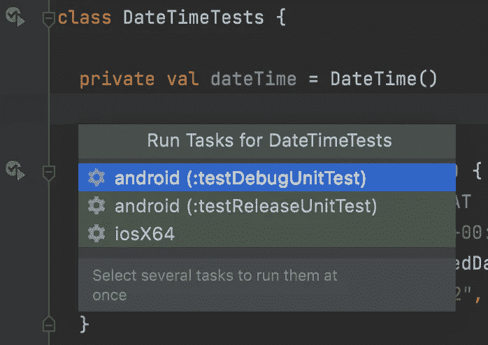
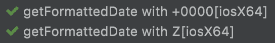

# 使用 Kotlin 多平台进行日期格式化

> 原文：<https://betterprogramming.pub/date-formatting-with-kotlin-multiplatform-1329a2b75bb>

## 使用 1)本地库或 2) kotlinx.datetime 编写一个简单的多平台日期格式化程序

由 [Towfiqu barbhuiya](https://unsplash.com/@towfiqu999999?utm_source=medium&utm_medium=referral) 在 [Unsplash](https://unsplash.com?utm_source=medium&utm_medium=referral) 上拍摄的照片

格式化日期常常让人觉得难以实现。就我个人而言，每次我必须将日期转换为某种格式时，我都会对自己说——又是现在？我们以前不是这样做的吗？应该有一种方法可以编写一次这种代码，而不必再为它费心。

日期格式要求的一个简单例子是，如果(你猜对了)当前日期是 2022 年 6 月 18 日，我们必须显示文本 *18.06.2022* 。应该很容易在多个平台上实现，对吗？当然可以。但是如果你为 Android 和 iOS 写代码，你必须写两次“相同”的格式逻辑，例如，在两个独立的代码库中。

幸运的是，我们可以利用[Kotlin multi platform Mobile](https://kotlinlang.org/lp/mobile/)(KMM)，这使我们能够编写一次相同的代码，并在多个平台上使用。

在这篇文章中，我不会详细介绍 KMM。让我们直奔主题，深入研究代码。

在这篇文章中，我将提出两种选择:

1.  一个纯粹用 Kotlin 编写的通用格式化程序，在这里我们将向`commonMain`、`androidMain`和`iosMain`添加代码，从而引入特定于平台的逻辑；
2.  使用一个名为`kotlinx-datetime`的多平台库(在这里查看回购)，我们将在`commonMain`中保存所有代码。

> 为了简洁起见，我将只关注支持 [ISO 8601](https://en.wikipedia.org/wiki/ISO_8601) 格式的时间戳，以及只支持一种日期格式，即`dd.MM.yyyy`。

# 我们自己的通用格式化程序

让我们定义这个放在`commonMain`中的简单类:

*(是的，* `*DateTime*` *对于这样一个职业来说并不是一个完美的名字。我们可以将其命名为* `*Iso8601TimestampFormatter*` *或类似的名称，但为了简洁起见，我选择了不同的名称。)*

挺基础的。我们传入一个 ISO 8601 时间戳和一个格式(`dd.MM.yyyy`)，它应该返回格式化的日期。

## 那么它在 Android 上看起来怎么样呢？

我们将利用`java.time`API，尽管它要求我们的 Android 最低 SDK 为 26(如果您想在较低的 SDK 版本上使用这些 API，您可以使用 [ThreeTen Backport](https://www.threeten.org/threetenbp/) 或 [desugaring](https://developer.android.com/studio/write/java8-support-table) )。

以下内容应放在`androidMain`:

我们使用`ZonedDateTime` API 解析我们的时间戳，然后通过`DateTimeFormatter`用我们的格式格式化它。

## 那 iOS 呢？

我们将参考`Foundation`框架，而不是使用在 iOS 上无法访问的 Java 库。它包含了我们进行日期格式化所需的所有东西(当然还有更多[和](https://developer.apple.com/documentation/foundation?language=objc))。

让我们将以下内容放入`iosMain`:

我们创建了一个`NSDateFormatter`的实例，并设置了时区、地区和格式。最后，我们调用`stringFromDate()`来获取格式化的字符串。

你可能会问——为什么不使用像`DateFormatter`、`TimeZone`之类的 Swift APIs 呢？？TL；DR 是，在 KMM 目前的状态下，我们无法从 Kotlin 代码中导入任何纯 Swift 模块。然而，导入 Objective-C API(`NS…`)就可以了。更多信息见[此链接](https://kotlinlang.org/docs/native-objc-interop.html)。

## 来测试一下吧！✅

因为我们的测试是独立于平台的，所以只将它们放在`commonTest`中就足够了:

当我们要求 Android Studio 运行测试时，我们被要求使用一个特定的目标(取决于我们的项目是如何配置的):

在 DateTimeTests 中运行所有测试时 Android Studio 的屏幕截图

通常你会在`:testDebugUnitTest`和`iosX64`之间做出选择。无论运行哪一个，我们都可以看到测试通过了:

试验结果

如果你不想通过 Android Studio 的弹出窗口运行测试(或者不得不浪费宝贵的时间在弹出窗口中选择不同的选项)，你可以简单地运行命令`$ ./gradlew :shared:allTests`，它将在所有可能的目标上执行项目中的所有测试。

## 好吧，酷，但是如果可以避免的话，我真的不想写依赖于平台的代码

让我们看看我们是否能避免这一点，然后！Kotlin/JetBrains 的优秀人员创建了`[kotlinx-datetime](https://github.com/Kotlin/kotlinx-datetime)`库，我们接下来会看到这个库。

# 使用 kotlinx-datetime 进行跨平台日期格式化

我推荐阅读这个库的 GitHub 页面上的文档。至于我们的工作，让我们通过将依赖项添加到我们的`commonMain`源集中来开始吧:

现在让我们使用`Instant`和`LocalDateTime`从时间戳中查找日、月、年，最后以字符串形式返回格式化的日期:

> `zeroPrefixed()`扩展函数是我创建的一个函数，用来规避 Kotlin 的标准库[中目前没有非 JVM `String.format()`等价函数的事实](https://stackoverflow.com/a/23088000/554002)，否则我们可以轻松地将整数格式化为带前缀零的字符串。你可以在这里找到`zeroPrefixed()` [的代码](https://gist.github.com/gosr/5dca7ac82c85acd617a2e8660e6a7080)。

## 编写测试(为什么不呢？)

# 结论

我们研究了两种编写在 Android 和 iOS 上都能工作的日期格式化逻辑的方法。

第一种方法需要特定于平台的逻辑，使我们能够直接使用日期时间模式/格式。然而，我们被迫编写代码来迎合每个单独的平台。

显然，需要较少代码的方法是后者。它依赖于一个第三方库，该库目前不支持格式化各种日期时间模式/格式，这就是为什么我们必须自己编写该部分。从好的方面来看，它是一个多平台库，我们不必担心任何特定于平台的 API。

希望你在 Kotlin 中为多种平台编码时有乐趣！