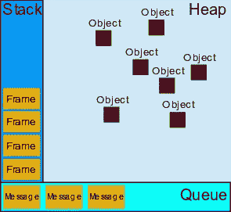

# 揭秘“虚假承诺”

> 原文：<https://betterprogramming.pub/de-mystifying-flushpromises-b13bc2254f95>

## 了解为什么你需要冲水承诺


[Tetiana SHYSHKINA](https://unsplash.com/@shyshkina?utm_source=medium&utm_medium=referral) 在 [Unsplash](https://unsplash.com?utm_source=medium&utm_medium=referral) 上拍摄的照片

这里的标题是对你经常在 LWC 考试中看到的流行的`flushPromises`方法的赞美，它可以采取以下两种形式之一:

```
function flushPromises(){
  return Promise.resolve();
}

function flushPromises() {
  return new Promise((resolve) => {
    setTimeout(resolve, 0);
  });
}
```

如果你曾经想知道这两种形式之间的区别，或者为什么你有时需要几个`flushPromises`或`Promise.resolve`调用来通过你的 jest 测试，我们将不得不进入杂草这里一点。这也是加强您对 JavaScript 的非阻塞架构的理解的机会，因此它的任何异步魔力都不会困扰您。大部分情况下。所以，系好安全带。

如果你在过去几年中做过前端开发，写过 LWC，你可能会遇到 JavaScript 中的 Promises、async/await、setTimeout 和 fetch APIs。所有这些的共同点是它们都是异步函数调用的形式。

换句话说，这些应用程序允许你推迟一个函数的调用，并且不会阻塞主线程，或者说是唯一的线程，因为 JavaScript 是单线程的。JavaScript 运行时处理延迟方法执行的方式是通过事件循环。

JavaScript 中的事件循环之所以得名，是因为它是一个在队列中等待新消息的无限循环。当它发现一个新消息时，它将它推送到调用堆栈进行处理。这些可能是来自 XHR 请求、承诺、`setTimeout`回调、事件监听器等等的回调。这里需要注意的是，有多个具有不同优先级的消息队列，事件循环会在这些队列中检查消息，并且在运行时继续处理下一条消息之前，会完整地处理每条消息。



来源:[https://developer . Mozilla . org/en-US/docs/Web/JavaScript/event loop](https://developer.mozilla.org/en-US/docs/Web/JavaScript/EventLoop)

*有些人可能想知道:如果 JavaScript 是单线程的，那么它如何跟踪* `*setTimeout*` *调用中的计时器何时到期，或者网络调用何时完成，以便将回调推送到消息队列？*

简单的答案是不会。浏览器本身有其他专门用于此目的的非 JS 线程。浏览器为 JavaScript 提供与其通信的 API，统称为 Web APIs。

对于我们的讨论，我们将关注事件循环可能处理的两个消息:任务和微任务。微任务是使用`Promise`、`Async` / `Await`、获取 API 和变异观察器排队的消息。任务是用其他方式调度的回调，特别是使用`setTimeout`。

考虑下面的片段:

```
setTimeout(()=>console.log("Timeout callback"),0); // Task
Promise.resolve()
 .then(()=>console.log("Promise callback")); // Microtask
console.log("I'm synchronous");

/** Output
I'm synchronous
Promise callback
Timeout callback
**/
/** Snippet 1 **/
```

正如所料，首先执行同步代码。然而，尽管`setTimeout`回调被首先调度，我们看到`Promise`回调被首先执行。这是因为微任务的优先级高于任务。作为一名 LWC 开发人员，理解并记住这一点非常重要。请允许我解释原因。

LWC 属性是反应性的。换句话说，当您更改属性值时，如果模板标记中直接或间接(通过 getters)引用了该属性值，则 LWC 运行时会重新呈现该标记，以反映属性的更新值。

这完全在开发人员的控制之外，也就是说，没有办法阻止这种情况发生，也没有办法规定您希望模板何时被重新评估。当您在 LWC 中更改 JS 函数的 reactive 属性时，重新计算将被安排为微任务，这意味着只有在函数完成执行后，重新计算才会发生。

```
<template>
 <p>{myVal}</p>
</template>

****** js file*****

myVal = 0;
changeVal(){
  this.myVal=1;
  this.myVal=2; //the template will be re-evaluated only after this step which means you will never see the value '1' on the page and the step above is redundant.
}
/** Snippet 2 **/
```

让我们考虑这个事实的另一个含义。代码如下:

```
<template>
 <template if:true={renderButton}>
  <lightning-button label="Click"></lightning-button> 
</template>
</template>

****** jest test *****

it("renders button when prop is set",()=>{
  //initialize and add component to DOM here

  element.renderButton=true; //'element' refers to LWC under test
  const btn = element.shadowRoot.querySelector('lightning-button');
  expect(btn).toBeNull();
})
/** Snippet 3 **/
```

如果您希望在设置相关属性后立即呈现按钮，如上面的代码片段所示，那么您就错了。获得新添加按钮的句柄的正确方法是将我们的代码重构为:

```
Promise.resolve().then(()=>{
  const btn = element.shadowRoot.querySelector('lightning-button');
  expect(btn).not.toBeNull(); //we've a reference!
});
/** Snippet 4 **/
```

这是因为当我们在一个`Promise.resolve`调用后面添加我们的代码片段时，它被安排为一个微任务。该微任务仅在模板重估微任务之后执行，该模板重估微任务已经由 LWC 运行时调度。所以模板在回调运行时包含了按钮。注意，您可以在更线性的代码风格中使用 async/await 来代替`Promise` s。

另一点值得注意的是，只有当模板响应于反应性质的改变而改变时，才需要等待模板重新评估。如果您直接操作 DOM，可能会立即“观察”到变化。例如，下面的测试将通过:

```
import LightningButton from "lightning/button";
it("adds button synchronously",()=>{
    // setup "element" LWC and add it to the DOM
    const btn = createElement("lightning-button", { is: LightningButton });
    btn.classList = "jest";
    element.appendChild(btn); //add directly to the DOM
    let theBtn = element.shadowRoot.querySelector("lightning-button.jest");
    expect(theBtn).not.toBeNull(); //no `Promise.resolve` needed!
});
/** Snippet 5 **/
```

回到任务和微任务之间的比较，如上所示(片段 1)，微任务比任务具有更高的优先级。让我们用下面的代码来看看这一事实的一些含义:

```
/*** component.html ***/

<template if:true={showDiv}>
  <div class="dyna"></div>
</template>

/*** component.js ***/

showDiv=true;
@api
unhide(){
  this.showDiv=true;
}

/** jest test **/

it("renders div when method is called",()=>{
  //create component and add it to DOM
  element.unhide();
  Promise.resolve().then(()=>{
    let div = element.shadowRoot.querySelector("div.dyna");
    expect(div).not.toBeNull();
  })
});

/** Snippet 6 **/
```

如代码片段 4 所示，在 jest 测试中添加一个`Promise.resolve`调用允许执行渲染微任务，以响应调用`unhide`时`showDiv`属性的变化。结果，我们看到测试通过了。现在考虑一个微小的变化:

```
/*** component.html ***/

<template if:true={showDiv}>
  <div class="dyna"></div>
</template>

/*** component.js ***/

showDiv=true;
@api
unhide(){
  // the prop is changed only after the apex call returns
  someApexMethod().then(result=>{ 
    this.showDiv=true;
  });
}

/** jest test **/

it("renders div when method is called",()=>{
  //create component and add it to DOM
  element.unhide();
  Promise.resolve().then(()=>{
    let div = element.shadowRoot.querySelector("div.dyna");
    expect(div).not.toBeNull(); //fails!!
  })
});

/** Snippet 7 **/
```

这里，不是立即更改`showDiv`属性，而是首先调用 apex 方法。方法返回后，我们将属性设置为 true 以呈现 div。那么，为什么测试会失败呢？它失败了，因为现在`unhide`方法必须解析 apex 方法 promise，然后在元素出现在模板中之前，响应设置`showDiv`的实际呈现微任务。

> 请注意，在测试中，我们通常让 apex 方法模拟硬编码的结果，因此，它们会立即解析。因此，调用 apex 方法实际上是一个`Promise.resolve`调用。

当我们在 jest 测试中添加一个`Promise.resolve`调用时，对它的回调在组件中对`someApexMethod`的回调之后执行，但是在微任务重新评估模板以响应`showDiv`中的变化之前执行。下面是一个更简单的例子来说明这一点:

```
Promise.resolve().then(()=>console.log(1)).then(()=>console.log(2));
Promise.resolve().then(()=>console.log(3)).then(()=>console.log(4));

/** output **/
1
3
2
4

/** Snippet 8 **/
```

通过测试的一种方法是添加一个微任务来进一步推迟测试断言，如下所示:

```
it("renders div when method is called",()=>{
  //create component and add it to DOM
  element.unhide();
  Promise.resolve()
   .then(()=>{}) //empty function
   .then(()=>{
     let div = element.shadowRoot.querySelector("div.dyna");
     expect(div).not.toBeNull(); //passes
   })
});

/** Snippet 9 **/
```

如果在设置反应性属性之前，组件方法中有多个命令性 apex 方法调用，该怎么办？您必须继续在测试中添加空的`.then`调用，以将您的断言推迟足够长的时间，从而完成模板重新评估。除非您在测试 apex 方法调用之间的中间状态，否则在我看来，这会使您的测试不必要地冗长。因为测试的目标是确保元素被添加到模板中，而不是关心它需要通过多少次回调才能实现。另一种方法是使用`setTimeout`延迟断言，如下面的代码片段所示:

```
it("renders div when method is called",()=>{
  //create component and add it to DOM
  element.unhide();
  setTimeout(()=>{
     let div = element.shadowRoot.querySelector("div.dyna");
     expect(div).not.toBeNull(); //passes
   },0);
});
/** Snippet 10 **/
```

不管`unhide` *、*中有多少 apex 方法，我们只需要一个`setTimeout`调用来延迟断言，因为所有可解析的承诺回调(微任务)都是在事件循环选择断言任务之前执行的。请注意，我们甚至不需要给我们的`setTimeout`调用添加延迟！

这里我想介绍的最后一件事是事件处理程序。考虑下面的代码片段，其中我们在屏幕上有一个按钮和一条消息。在 JS 文件中，我们在同一个按钮上注册了两个事件处理函数。看起来是这样的:

```
 <lightning-button onclick={handleClick} label="Click Me" class="btn">
</lightning-button>
<h2>{message}</h2>

/*** JS ***/

 _message = "Hello";                                                                                                                                                                                          │
                                                                                                                                                                                                               │
  @api                                                                                                                                                                                                         │
  get message() {                                                                                                                                                                                              │
    return this._message;                                                                                                                                                                                      │
  }

reset() {                                                                                                                                                                                                    │
    this._message = "Hello";                                                                                                                                                                                   │
  }

 _handleClickOne = (event) => {                                                                                                                                                                               │
    console.log(">>. in click handler one ");                                                                                                                                                                  │
    this.reset();                                                                                                                                                                                              │
    // event && event.preventDefault() && event.nativeEvent.stopImmediatePropagation() && event.stopPropagation();                                                                                             │
    this._message += " One";                                                                                                                                                                                   │
    Promise.resolve().then(() => (this._message += " Promise"));                                                                                                                                               │
    return false;                                                                                                                                                                                              │
  };                                                                                                                                                                                                           │
                                                                                                                                                                                                               │
  _handleClickTwo = () => {                                                                                                                                                                                    │
    console.log(">>. in click handler two ");                                                                                                                                                                  │
    this._message += " Two";                                                                                                                                                                                   │
  };

/** We are registering two event handlers on the same button **/

_addEventHandlers() {                                                                                                                                                                                        │
    const btn = this.template.querySelector(".btn");                                                                                                                                                           │
    btn.addEventListener("click", this._handleClickOne);                                                                                                                                                       │
    btn.addEventListener("click", this._handleClickTwo);                                                                                                                                                       │
  }                                                                                                                                                                                                            │
                                                                                                                                                                                                               │
  renderedCallback() {                                                                                                                                                                                         │
    if (this._listenersAdded) return;                                                                                                                                                                          │
    this._listenersAdded = true;                                                                                                                                                                               │
    this._addEventHandlers();                                                                                                                                                                                  │
    console.log("listeners added");                                                                                                                                                                            │
  }

/**** Jest Test ***/

it("it should change the message when button is clicked", async () => {
    // component setup
    await Promise.resolve(); //wait for template evaluation
    element.shadowRoot.querySelector(".btn").click();
    await Promise.resolve(); //wait for the Promise in the event handler to e resolved
    expect(element.message).toBe("Hello One Two Promise"); //passes
  });

/** Snippet 11 **/
```

结果似乎很直观。最初，您单击按钮，事件监听器被一个接一个地调用，最后，`Promise`回调被执行。您在屏幕上看到的最后一条消息以及您的玩笑测试是`Hello One Two Promise`。现在，让我们稍微修改一下，使用一个标准的 HTML 按钮来代替`lightning-button.`，其他的都保持不变。

```
<button class="btn" label="Click Me"></button>

/** Snippet 12 **/
```

你会发现测试还是通过了。但是当你把这个组件添加到一个页面上并点击按钮时，猜猜当你点击按钮时会发生什么？

你得到的信息是`Hello One Promise Two`！你不必相信我的话。你自己试试。

发生这种情况是因为标准的 HTML 事件侦听器是作为任务执行的，当从网页触发时，它们按照注册的顺序执行。

把这个应用到上面的例子中，`_handleClickOne`首先被调用。这个方法中的承诺回调被添加到微任务队列中。添加下一个事件监听器`_handleClickTwo`作为在下一个事件循环迭代中执行的任务。然而，如上所述，由于微任务比任务具有更高的优先级，因此在`handleClickTwo`之前执行`Promise`回调。当事件从 JavaScript 而不是 UI 触发时，比如通过调用`button.click()`，所有注册的事件监听器被同步执行，而不是作为任务执行。

因此，我们看到`_handleClickOne`和`_handleClickTwo`在`Promise`回调作为微任务执行之前同步执行。即使从 UI 中单击`lightning-button`也会导致事件监听器同步执行，这与标准 HTML 按钮的行为不同。现在，无论这是设计还是一个错误都是一个猜测。无论如何，如果您遇到这种情况，意识到这种异常会很有帮助。

如果您已经做到了这一步，希望您已经能够收集到一些关于事件循环、任务和微任务的信息，以及它们在 LWC 开发中的相关性。

如果你有兴趣深入这个兔子洞，[这里有 YouTube 上最受欢迎的视频](https://www.youtube.com/watch?v=8aGhZQkoFbQ)。这是谷歌人的另一个作品，有一些更好的视觉效果。