# 使用 React 和 Firebase 的简单电子邮件和谷歌认证

> 原文：<https://betterprogramming.pub/dead-simple-auth-with-react-and-firebase-592e40ff43c5>

用户身份验证和 Firebase 入门

我****用 React 和 Firebase 创建了我最新的应用程序，从中获得了很多乐趣。React 使 UI 开发变得简单，Firebase 使用户认证、数据库管理和分析变得容易。****

****在构建原生应用或快速原型时，我喜欢 Firebase。这是一个很好的工具，知道如何使用它会让你受益匪浅。我说过它对小程序是免费的吗？****

****这里有一个简单的方法来开始使用用户认证和 Firebase。****

****我已经设置了样板文件，如果你想继续编码，你可以在这里克隆 [Github 库](https://github.com/indreklasn/react-fire-auth-example/tree/master)。****

**** [## indreklasn/react-fire-auth-example

### 用 CodeSandbox 创建。通过在…上创建帐户，为 indreklasn/react-fire-auth-example 开发做出贡献

github.com](https://github.com/indreklasn/react-fire-auth-example/tree/master) 

# 这个表格你已经看过一千遍了

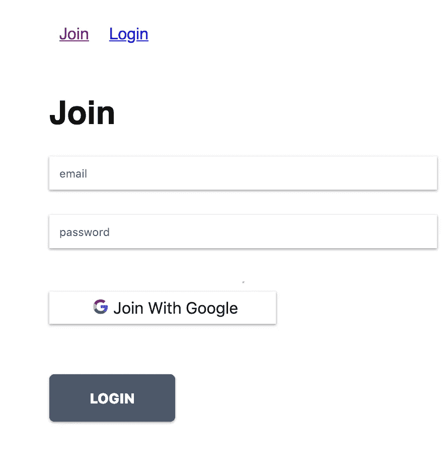

我们的样板文件是什么样的

如果您克隆了存储库或者打开了 CodeSandBox，在`src`文件夹中您应该会看到 4 个主文件。请熟悉项目和文件。到目前为止，我们有一些锅炉代码，标记和样式。本教程涵盖了认证位。

*   `index.js` —渲染 React 应用程序的主文件。
*   `Login.js` —登录表单标记
*   `Join.js` —连接表单标记
*   `Header.js` —顶部导航
*   `routes.js` —申请路线

主要的乐趣发生在`index.js`文件中。

*   我们正在创建一个`isLoggedIn`状态。这将决定我们是否让用户通过我们的保护路线。
*   基于`router.js`文件渲染路线。
*   设置`AuthContext`上下文。这就是为什么我们把状态从`Login.js`提升到`App.js.` 如果上下文语法对你来说是新的，[在继续之前看看这篇文章](https://reactjs.org/docs/context.html)。

注意我们用了钩子。如果钩子对你来说是陌生的，[看看这篇博文](https://codeburst.io/demystifying-react-hooks-a0b56a6254c2)。

 [## 揭秘 React 挂钩

### 你可能听说过 React 的新概念，叫做钩子。钩子在 React 版本 16.8 中发布，它们让…

codeburst.io](https://codeburst.io/demystifying-react-hooks-a0b56a6254c2) 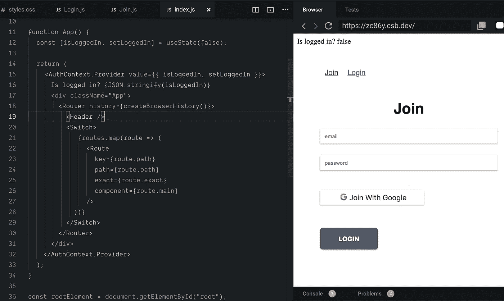

既然我们已经了解了问题的实质，我们终于可以开始实现 Firebase auth 了。

前往 [Firebase 网站](https://firebase.google.com/)并点击“开始”

[https://firebase.google.com/](https://firebase.google.com/)

成功登录后，您应该在项目的仪表板上。点击“新建项目”。

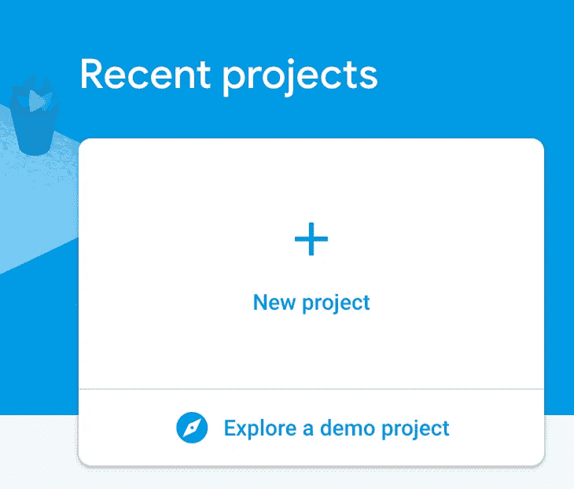

Firebase 项目仪表板

如果一切顺利，您应该会看到这个通知，它带有您给项目起的名字。

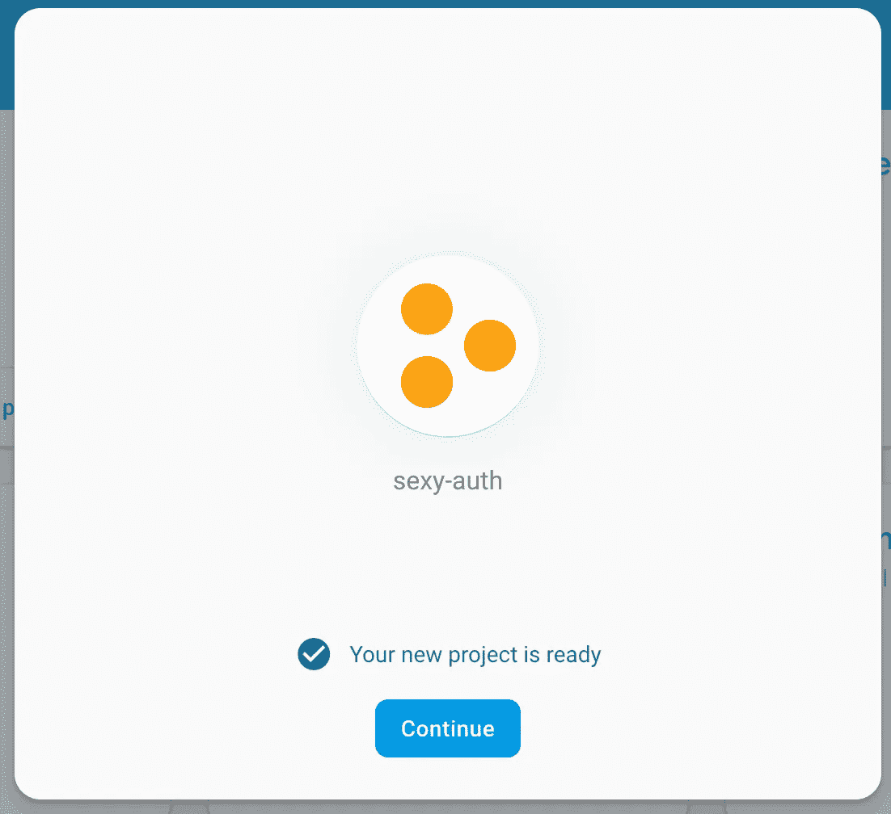

接下来，创建一个 Firebase 应用程序。我们将构建一个 web 应用程序，因此选择 web 应用程序选项。

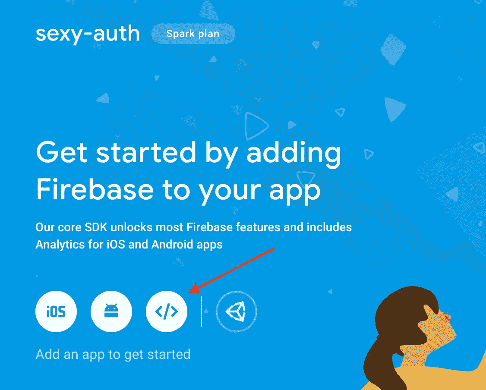

命名您的应用程序，并获取配置变量。将这些放在`src/firebase.config.js`文件中。

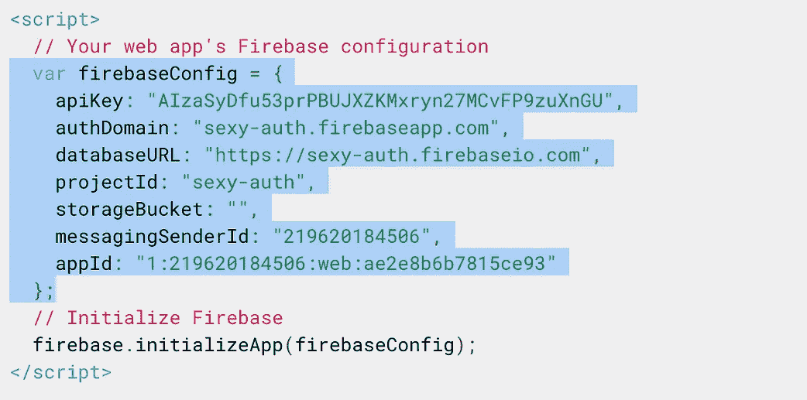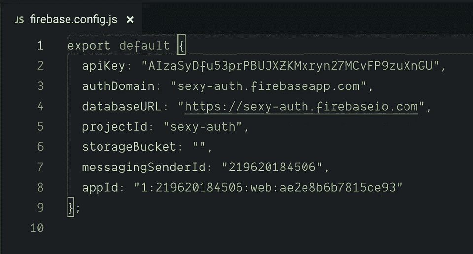

不要向公众展示这些变量。然而，由于这只是一个演示，它的罚款。

酷！我们开始了一个项目，并创建了我们的 firebase 应用程序。现在让我们初始化 Firebase 配置。

# 初始化 Firebase

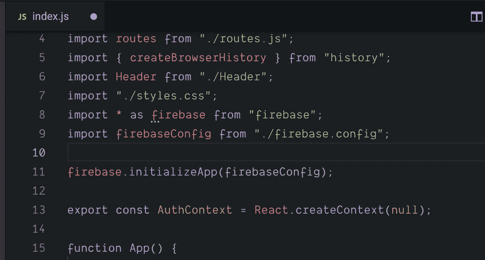

如果我们记录 firebase 对象并且没有看到错误，那么一切都很好。

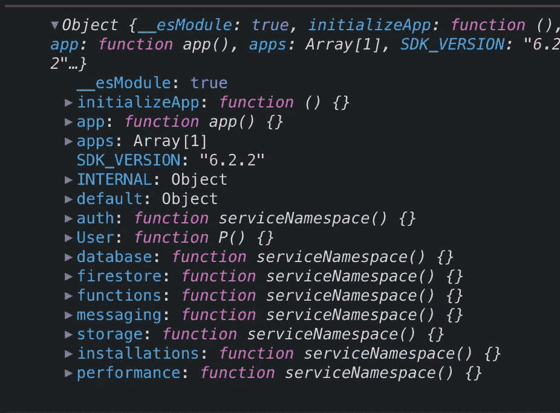

Firebase 给了我们很多。对于这个应用，我们只需要使用`auth`对象。

请记住，我们的目标是创建一个用户，将其存储在数据库中，并管理 auth 会话。

在我们开始编码之前，我们需要从 Firebase 仪表板激活密码和 Google 登录方法。

启用密码和 Google 登录

# 使用电子邮件和密码创建我们的用户

打开`src/Join.js`文件，找到`handleForm`函数。在函数内部，我们将放置用户创建逻辑。

首先，将`firebase`对象导入到`Join.js`文件中，这样我们就可以访问该对象了。

Firebase 为我们提供了一个 API 来直接与数据库实时对话。幸运的是，API 是现代的，并且是基于承诺的。如果你对承诺不熟悉，这里有一个关于承诺的好帖子。

 [## 如何用 async 和 await 改进异步 Javascript 代码

### 如果你有机会观察现代 Javascript 代码——你很有可能见过异步和等待语法…

medium.com](https://medium.com/@indreklasn/improve-your-asynchronous-javascript-code-with-async-and-await-c02fc3813eda) 

我们如何创建用户很简单，在`auth`属性上有一个名为`createUserWithEmailAndPassword`的方法。我们只是传递电子邮件和密码作为参数。

现在您填写表单并提交，一个用户将被创建。

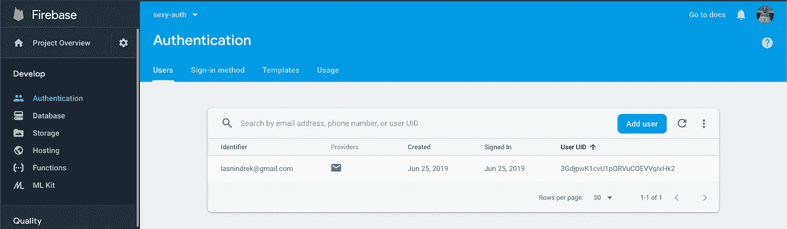

我们的用户出现在数据库中——太神奇了！

# 使用现有用户登录

前往`Login.js`，就像之前一样，导入 firebase 对象。使用现有用户登录很简单——我们使用`signInWithEmailAndPassword`方法并传递我们的电子邮件和密码作为参数。

让我们看看它是否有效。

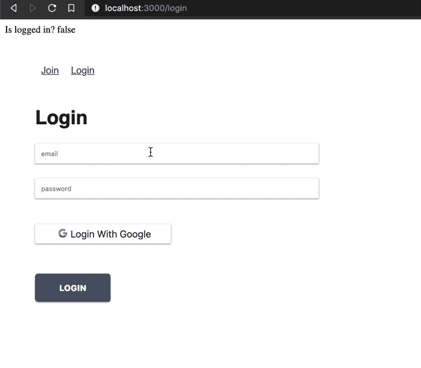

登录

事实上，它正在发挥作用。我们怎么知道？嗯，`is logged in: true`告诉我们已经登录。但是我们怎么才能*真的*知道它是否有效呢？

好问题。当我们向 firebase 发送电子邮件和密码时，Firebase 将尝试解锁用户，并向我们发回响应。继续，注销承诺中的`res`。

Firebase 用户对象

成功认证后，Firebase 会向我们发送大量用户信息(虽然不是敏感信息)。

我们知道它什么时候起作用，但是我们知道什么时候事情*不起作用吗？*

尝试使用不存在的用户或无效的凭据登录:

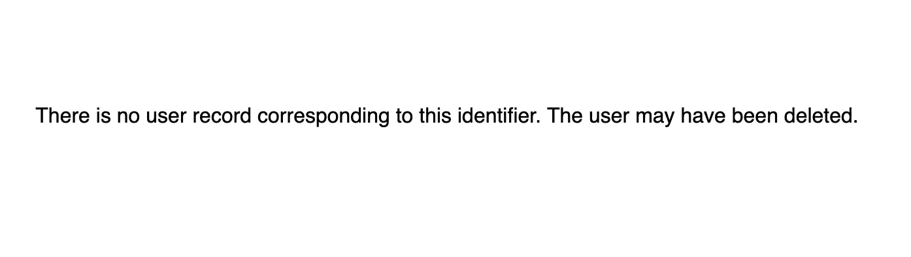

火基误差

当然——Firebase 也会给我们发送一个响应来处理我们的错误。如果您想看看所有的错误消息，请将`e`对象记录在`catch`块中。

好了，创建用户和身份验证工作正常。我们还有一些工作要做。

**用谷歌按钮登录怎么样？或者管理用户会话？如果我们刷新页面，我们的用户将注销。**

[请跟随我进入下一章，我们将探索上述所有内容](https://medium.com/@indreklasn/dead-simple-auth-with-react-and-firebase-part-ii-c32963e21e16?postPublishedType=repub)。

 [## 使用 React 和 Firebase 的简单认证—第二部分

### 到目前为止，我们的初始设置工作正常。我们可以创建用户，用户可以登录。接下来，我们想让用户登录…

medium.com](https://medium.com/@indreklasn/dead-simple-auth-with-react-and-firebase-part-ii-c32963e21e16) 

[这是本章](https://github.com/indreklasn/react-fire-auth-example/tree/chapter-1)的源代码:

 [## indreklasn/react-fire-auth-example

### 用 CodeSandbox 创建。通过在…上创建帐户，为 indreklasn/react-fire-auth-example 开发做出贡献

github.com](https://github.com/indreklasn/react-fire-auth-example/tree/chapter-1)****