# 使用 React 和 Firebase 的简单电子邮件和谷歌认证—第二部分

> 原文：<https://betterprogramming.pub/dead-simple-auth-with-react-and-firebase-part-ii-c32963e21e16>

## 如何让用户登录并保持登录状态

到目前为止，我们的初始设置工作正常。我们可以创建用户，用户可以登录。接下来，我们希望让用户登录谷歌，一旦用户刷新应用程序，就让他们保持登录状态。

如果您没有[阅读第一章](https://medium.com/@indreklasn/dead-simple-auth-with-react-and-firebase-592e40ff43c5)，请在继续之前阅读。

# 谷歌认证

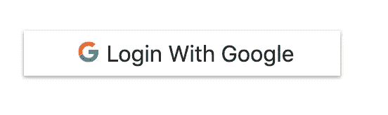

Firebase 让我们的用户可以很容易地注册 Google、Twitter、GitHub 或任何你想使用的第三方认证。

首先，让我们在“使用 Google 登录”按钮上附加一个事件监听器。

接下来，创建`handleGoogleLogin`函数。这是我们处理授权逻辑的地方。

每个登录方法都有一个提供者。我们必须使用 [Google Auth](https://firebase.google.com/docs/reference/js/firebase.auth.GoogleAuthProvider.html) 来设置提供者。

下面是附加到`auth`属性的方法的完整列表。

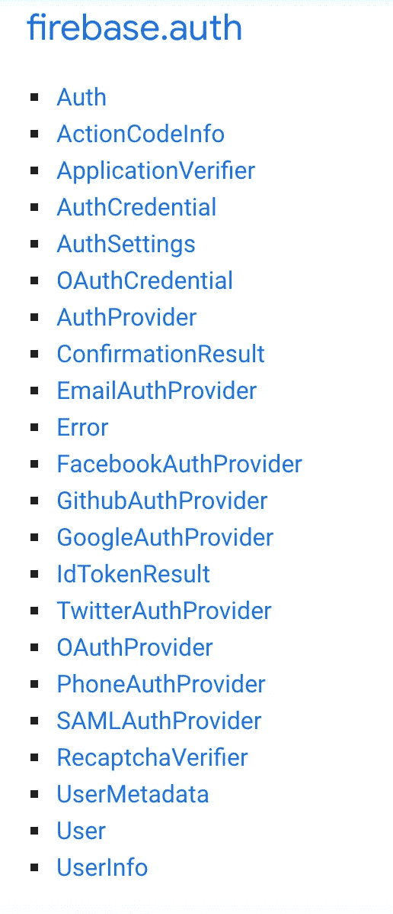

[https://firebase.google.com/docs/reference/js/?hl=en](https://firebase.google.com/docs/reference/js/?hl=en)

一旦我们设置提供商使用谷歌，我们实际上可以让用户现在注册。

您可以通过打开弹出窗口或重定向到登录页面来提示您的用户使用他们的 Google 帐户登录。移动设备上首选重定向方法。

我们所要做的就是调用`signInWithPopup`并传递我们的提供者作为参数。如果承诺成功解决，则登录成功。

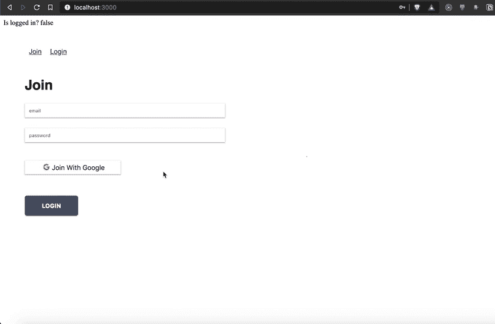

查看您的控制台；如果您取回了用户对象，那么一切都很顺利。另外，请注意，您可以检索 Google provider 的 OAuth 令牌，该令牌可用于使用 Google APIs 获取附加数据。

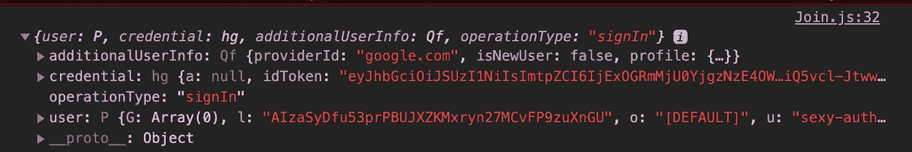

Google 验证用户对象

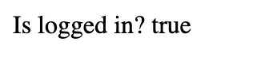

打开 Firebase 仪表板；您应该会看到一个新用户出现。

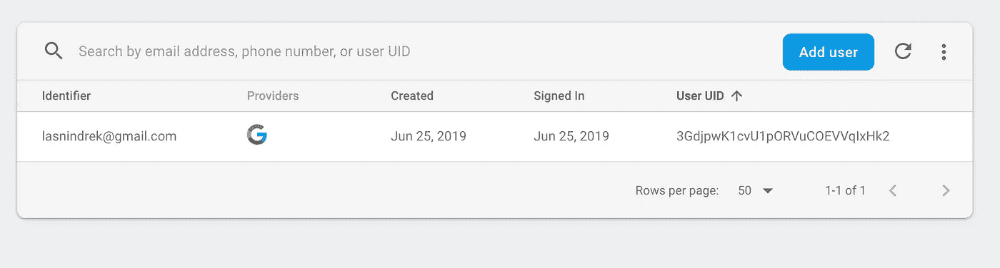

Firebase 用户仪表板

注意“Providers”一栏，它指向 Google。那是 Firebase 它只是工作。

# 用谷歌登录

为了登录，我们使用完全相同的代码。Google auth 足够聪明，可以判断出我们是否有用户。

理想情况下，您希望尽可能多地重用代码以减少重复。我建议使用 util 函数或高阶组件。

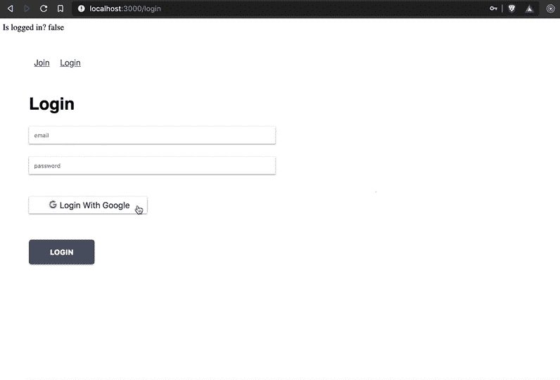

# 受保护的路线

我们有身份验证，但为了什么？通常，身份验证是为了保护路由或控制访问。让我们创建一个`protectedRoutes.js`文件，在其中放置我们想要保护的路由，防止未经授权的用户访问。

不要忘记创建`ReportsView`组件。

接下来，将受保护的路由导入到我们的`index.js`

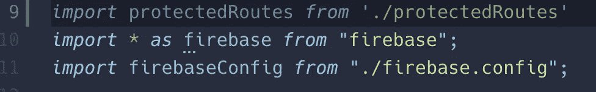

到目前为止，我们有两种类型的路线，守卫和公共路线。让我们越过受保护的路线。

请注意`ProtectedRouteHoc`组件。`ProtectedRouteHoc`组件检查用户是否登录。

现在我们需要创建组件。

`ProtectedRouteHoc`组件相对简单；它只是呈现了被保护的路线。注意这里有一个`if`语句来检查用户是否经过身份验证。如果用户通过了身份验证，就让他们通过。如果没有，重定向到加入屏幕。

不要忘记将组件导入我们的`index.js`。

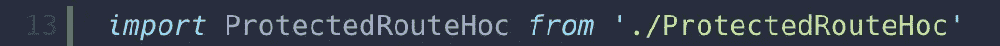

# 向标题导航添加受保护的路线

我们进入 Auth 上下文，并获取`isLoggedIn`属性。请注意我们是如何检查用户是否经过身份验证的。如果答案是肯定的，呈现报告路线。

测试受保护的路由…

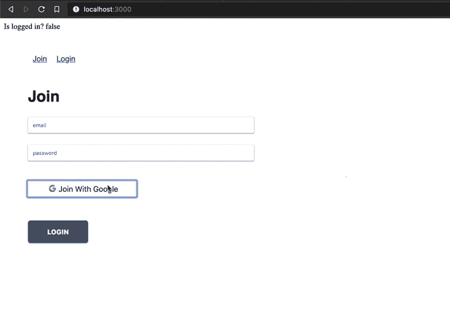

认证后显示受保护的路由

看起来一切正常。如果我们登录，我们就可以访问受保护的路线。

如果我们没有通过身份验证，试图导航到受保护的路线，会发生什么？

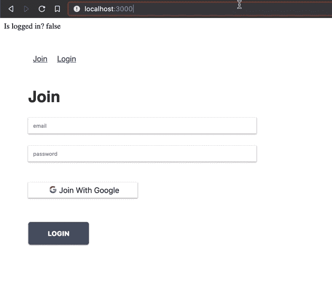

不能；因此有了谨慎的命名。

# 会议

刷新页面。会发生什么？您将自动注销。那不理想。幸运的是，Firebase 让我们可以轻松地管理会话。

前往`Login.js`组件，将您的 Firebase 授权代码包装在`firebase.auth().setPersistence`承诺中。这将为身份验证创建一个会话。

登录，打开开发工具，然后打开应用程序选项卡。我用的是勇敢浏览器。每个现代浏览器都有“应用/存储”选项卡。

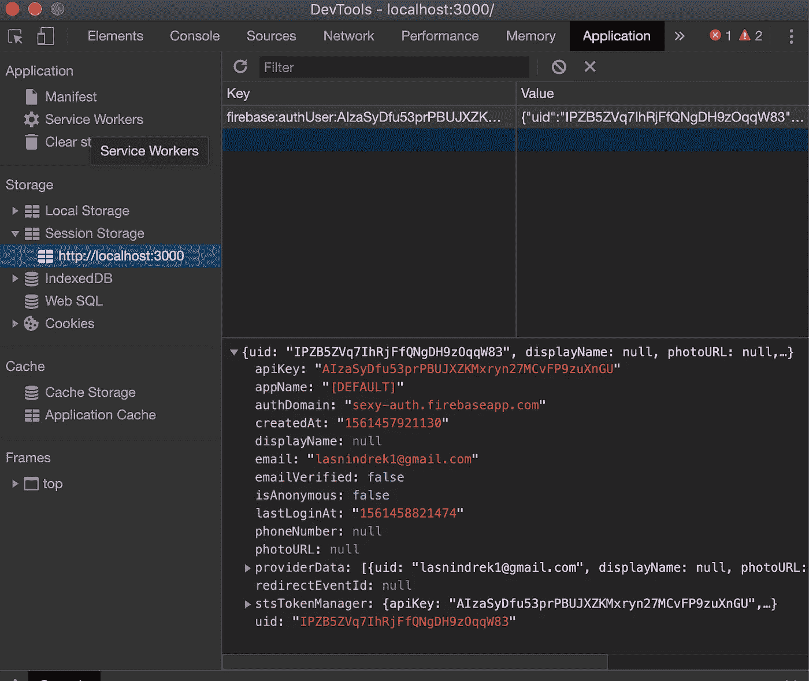

我们存储了会话。在页面加载之前，让我们先阅读会话。

现在每次我们刷新时，`useEffect`钩子调用`readSession`函数。`readSession`函数检查是否已经存在用户会话。

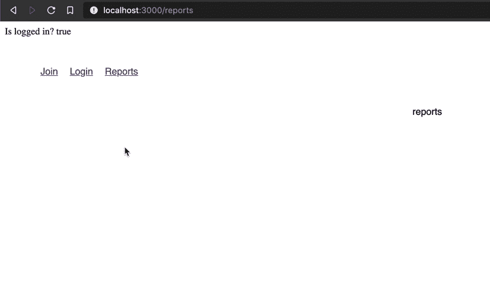

# 奖励:重定向

如果我们登录或注册，什么都不会发生。至少用户是这么想的。让我们在成功认证后重定向到报告页面。

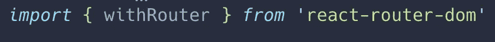

这是一个我们将 React 组件包装在其中的特设组件。

这将把`history`支柱注入组件。

最后，在认证成功时调用`history.push()`方法。

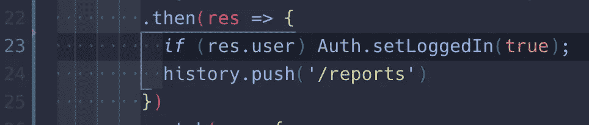

让我们再次尝试登录。

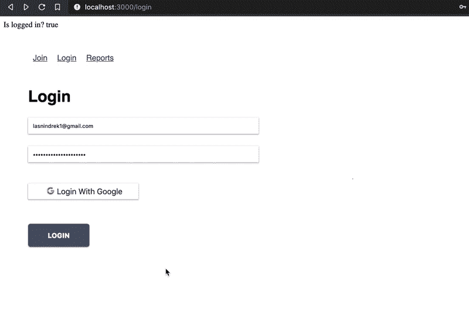

瞧啊。我们的重定向成功了。要真正理解这一点——使用 Google auth and Join 重复相同的过程。

如果您希望用户退出，请清除会话，并将`isLoggedIn`设置为`false`

# 恭喜你，你成功了！

干得好，留下来了。希望您已经了解了 React 和 Firebase 的用户认证工作原理。

如果你想了解更多关于 React 和 Firebase 的知识，那么“[*React with Firebase 之路:你掌握高级 React for business web applications*](https://amzn.to/2STie7h)的旅程”这本书是一个很好的学习工具。

## 下面是[的源代码](https://github.com/indreklasn/react-fire-auth-example/tree/chapter-2)；确保你在正确的分支上。

 [## indreklasn/react-fire-auth-example

### 使用 React 和 Firebase 的简单电子邮件和 Google Auth-indreklasn/React-fire-Auth-example

github.com](https://github.com/indreklasn/react-fire-auth-example/tree/chapter-2) 

感谢阅读，保持敬畏！❤