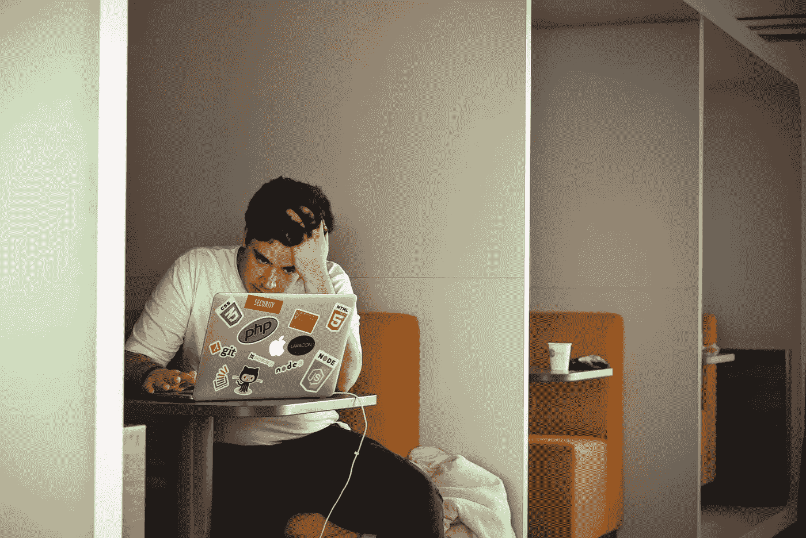

# 应对倦怠:我如何学会停止担忧并欣赏生活

> 原文：<https://betterprogramming.pub/dealing-with-burnout-or-how-i-learned-to-stop-worrying-and-appreciate-life-c1fbf96c0b9a>

## 你也可以

蒂姆·高在 [Unsplash](https://unsplash.com/search/photos/stress?utm_source=unsplash&utm_medium=referral&utm_content=creditCopyText) 上拍摄的照片

近年来，人们一直呼吁加快步伐。你总是听到人们谈论它。有些人认为你应该早起，然后一直工作到睡着。他们声称这是唯一真正的成功之路。但是是吗？

忙碌是一句很棒的原话，但是没有人愿意后退一步，看看这种心态背后最大的陷阱:倦怠。有些人可能已经看到[这篇](https://www.buzzfeednews.com/article/annehelenpetersen/millennials-burnout-generation-debt-work)文章最近在互联网和社交媒体上流传。这不是第一次，也不会是最后一次。这是因为倦怠越来越频繁地出现，而我们这些从事软件开发职业(或爱好)的人极易受到它的影响。

# 我们是如何来到这里的？

软件开发人员易受影响的最大原因之一是因为我们的领域仍然相对年轻，并且由那些永不停止工作的人所主导。比尔·盖茨、史蒂夫·乔布斯、马克·扎克伯格和杰夫·贝索斯都有漫画书般的成功故事。相似之处包括车库、预算紧张和长时间工作。这些在我们的行业中已经变得荣耀，我们被引导去相信，要获得任何程度的成功，我们必须复制它。(有趣的是，他们中的一些人最近也分享了他们对我们每晚应该睡多长时间的想法。)

由[加布里埃尔](https://unsplash.com/photos/E-b_VNmtGJY?utm_source=unsplash&utm_medium=referral&utm_content=creditCopyText)在 [Unsplash](https://unsplash.com/search/photos/ghosts?utm_source=unsplash&utm_medium=referral&utm_content=creditCopyText) 上拍摄的照片

但是困扰我们的不仅仅是开发商过去的幽灵。目前的环境有其自身的绊脚石。很难打开任何类型的社交媒体，而看不到其他开发人员以某种身份讨论工作。总的来说，它会变得势不可挡。在我们的领域中，也有感觉某种类型的冒名顶替综合征的倾向，这会导致一条通往倦怠的双重路径；你觉得你必须加班才能跟上进度，或者你已经因为落后太多而感到疲惫不堪。

这两个都不是真的。

事实上，任何人都可能成为成功的开发人员。有时候(尤其是刚开始的时候)，很难这样看待自己。

# 我们现在在哪里？

当前对工作的态度也影响了这一切。不像其他职业，我们可以把工作量带回家，这意味着我们永远不会远离工作。软件是变化无常和永恒的。总有另一个 bug 要克服，总有另一个特性要编写，总有另一个代码要重构。工作总会召唤你，所以离开它会被证明是非常困难的。

# **我们将何去何从？**

正如他们所说，解决问题的第一步是意识到你已经有了一个问题。说起来容易做起来难。我对倦怠的体验一般都是充满情感的，大多源于之前讨论的内容(对落后的恐惧和对成功的驱动)。这些冲动与我理智的一面发生了冲突，理智告诉我应该休息一下。有时候，我甚至听从理性的一面，并真的这样做了。当我不这样做的时候，情况会迅速恶化。一开始是无法集中注意力。我的意识告诉我要换挡。我真的很喜欢编码，所以这是一项艰巨的任务。但是，当然，当你不能集中注意力时，很难写好代码，因为软件开发需要非常注意细节。

倦怠快车的下一站是嗜睡。在那种情况下，我不仅不能集中注意力，而且我什么也不想做了。如果我没有以某种形式解决我的情况，它可能会演变成轻度抑郁，我说服自己，我所有的想法，想法和代码通常都很糟糕。事实上，当我遇到这种情况时，我的代码会受到影响，这并不奇怪。这不是制作高质量作品的最佳心态。最糟糕的是，这是一个巨大的负反馈循环。它导致人们只想走开。

照片由[mārtiņš·泽姆利克斯](https://unsplash.com/photos/NPFu4GfFZ7E?utm_source=unsplash&utm_medium=referral&utm_content=creditCopyText)在 [Unsplash](https://unsplash.com/search/photos/run?utm_source=unsplash&utm_medium=referral&utm_content=creditCopyText) 拍摄

具有讽刺意味的是，他们早就应该这么做了。战胜倦怠的最好方法之一就是休息一下。散散步，喝喝茶，冥想，读读书，或者和朋友或家人聊聊天。离开一会儿让我清醒一下，这有助于我解决工作中面临的许多问题。我有时会在完全不思考的时候想出解决办法。即使我没有，我回来时也会精神焕发，更有可能解决我之前一直在努力解决的问题。

我发现的另一个解决筋疲力尽问题的方法是安排我的一天来计划小的休息。甚至还有围绕这个想法建立起来的生产率技术。我知道我不是唯一一个倾向于被工作困住，以至于感觉几个小时就像几分钟一样过去的人。如果我在那几个小时里感到富有成效，那么这是一种很棒的感觉。如果我正在与一个算法作斗争，或者未能将我的用户界面调整到我脑海中所看到的样子，那就太痛苦了。一次又一次经历第二种情况是我开始接近精疲力竭的时候。

软件开发作为一个整体需要这样吗？当然不是！是的，仍然会有开发人员需要工作到很晚或者周末的时候，但是那可能是例外而不是期望。

需要的是表面上的平衡。

把我们的一生都集中在工作上会让我们陷入黑暗。全面发展的人造就全面发展的开发者。拥有丰富的经验会让开发者对他们正在编写的软件有不同的看法。创建一个让你的观众喜欢的应用程序的一个万全之策是让你自己成为观众的一部分。我不是说你需要一百万个爱好，但是如果你花时间在厨房里，你不会写一个更好的烹饪书应用程序吗？

由[布鲁克·卡吉尔](https://unsplash.com/photos/WHWYBmtn3_0?utm_source=unsplash&utm_medium=referral&utm_content=creditCopyText)在 [Unsplash](https://unsplash.com/search/photos/happy-work?utm_source=unsplash&utm_medium=referral&utm_content=creditCopyText) 拍摄的照片

作为开发人员，我们不应该再根据我们所做的工作量来评价自己，而应该根据我们所做的工作的质量以及我们给这个职业带来的好处来评价自己。不要通过每天工作 18 小时来对抗冒名顶替综合症，试着指导一些对发展感兴趣的人。这是我最喜欢的避免精疲力尽的方法之一，因为我觉得我在以一种积极的方式为我们的社区做贡献。(我太喜欢它了，所以我开了一个播客！)希望在这个过程中，你会开始把自己比作你开发旅程之初的你，而不是已经在这个领域待了几十年的开发者。这将是真正的标准。

认识到我们的工作不是在一天、一周、一月或一年内完成一个完整的应用程序也是有益的。分解制作应用程序所需的步骤，然后一次专注于一个部分。如果你今天只能抽出时间做第一步，那就太好了！只有在完成第一步后，才能进入第二步。听起来很简单吧？尽管随着代码库的增长，人们很容易被所有想要构建的特性和挥之不去的 bug 分散注意力。继续工作。有时候你会想把工作带回家，做得更多，磨磨蹭蹭。当需要关注第二步时，继续第二步。

迈克尔·马丁内利在 [Unsplash](https://unsplash.com/search/photos/day-off?utm_source=unsplash&utm_medium=referral&utm_content=creditCopyText) 上的照片

# 保持平衡

最终，一切都归结为平衡。这是一个很容易概念化但很难付诸实践的想法。工作明天会给你。用费里斯·布勒不朽的(也可能是被过度引用的)话来说，“生活节奏相当快。如果你不偶尔停下来四处看看，你可能会错过它。”