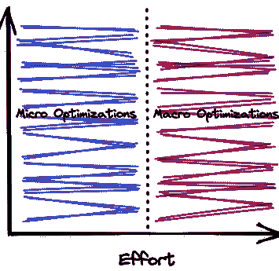
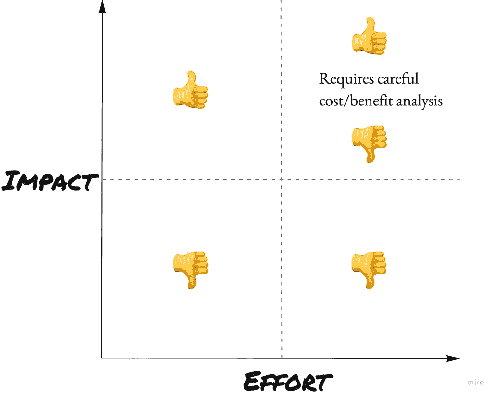
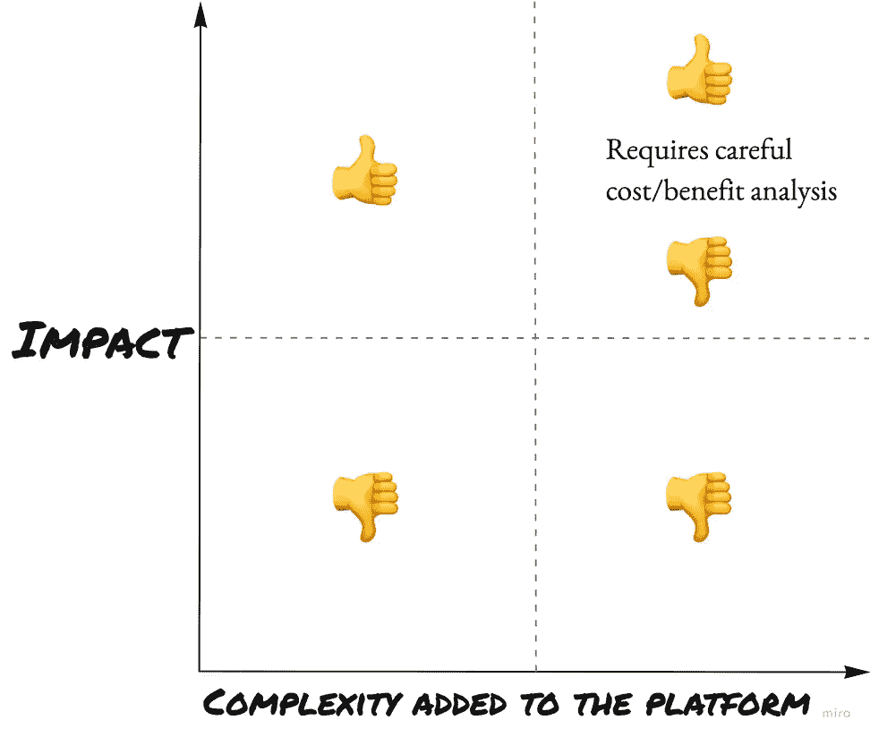

# 处理代码性能—微观和宏观优化

> 原文：<https://betterprogramming.pub/dealing-with-code-performance-micro-and-macro-optimizations-128269484932>

## 作为一名开发人员，我们应该在哪些方面进行性能优化？我们如何衡量影响？阅读这篇文章来学习这个框架

性能优化是任何软件或硬件的修改，使平台更快，更具可扩展性，改善[延迟或吞吐量](https://medium.com/@nbosco/latency-vs-throughput-d7a4459b5cdb)或两者。

你可以花大量的时间在不同的方面来提高性能，但是你最需要关注哪一方面呢？

这篇文章将向你展示我开发的一个框架来对性能变化进行分类。我使用这个框架来了解我的团队或我应该在哪些方面花更多时间来提高绩效，以及在哪些情况下我应该停止在这些方面的工作。用了好几年了，决定写下来分享一下。它并不完美，但对我来说效果很好。

这篇文章使用了延迟改进的例子，但是它也适用于吞吐量改进。

# **宏观和微观优化**

作为开发人员，我们经常会遇到一些可以提高性能的地方。在某些情况下，更改很简单，例如删除不必要的查询，通过批处理避免后端的 N+1 查询，或者消除对前端服务器的不必要调用。在其他情况下，更改更加复杂，需要重新设计解决方案，例如跨系统实现不同的缓存策略，或者实现全新的、更快的服务。

该框架将性能优化分为两种类型:微观和宏观优化:

图一。微观和宏观优化

## 微观优化

它们是应用于非常具体的领域的优化。在大多数情况下，影响通常是中低的(例如，提高使用率低的端点的性能)。在一些罕见的情况下，影响非常大，例如，通过改进身份验证流程来减少所有已验证请求的开销时间。

由于这种努力，最常见的优化变化属于这一类。

一些例子:

*   缓存和批处理特定的 APIs 模型。
*   去除不必要的呼叫。
*   减少内存分配。
*   在前端删除不必要的库。
*   减少客户的一口消费。
*   添加数据库索引。

我看到的属于这一类的优化的一个常见错误是没有防止系统在未来出现同样的性能下降。让我们用一个例子: *Ignacio 通过删除 N + 1 个查询改进了端点 X，但没有阻止任何其他开发人员再次添加 N + 1 个查询*。完整的修复需要 Ignacio 编写测试，防止端点在将来重新添加 N + 1 个查询。[不要错过这关键的一步](https://medium.com/p/7d5346313807)！

关于这一类别的一个有趣的事情是，与调查花费的时间相比，修复问题的时间通常很短。调查可能需要很多天，修复可能只需简单地改变线路，但影响可能是巨大的！

## 宏优化

这是我觉得最好玩的一类。通常，努力程度和范围为中/高。它需要大量的调查、验证和测试，开发者需要证明这些努力是值得的。

这种类型的优化通常会使平台更难理解。一个例子是引入一个新的缓存系统。它以使平台 *Y* 更加复杂为代价，使平台 *X* 快了几倍。

一些例子:

*   跨平台引入新的缓存策略。
*   新技术(数据库、图书馆等。).
*   数据库迁移。
*   模型重新设计。
*   平台的重新架构。

一个宏优化的真实例子:在 [Shopify](https://shopify.com/) ，我们从所有 API 中移除了 *page* param，并用游标取而代之。这允许所有分页查询使用[基于光标的分页](https://ignaciochiazzo.medium.com/paginating-requests-in-apis-d4883d4c1c4c)基，而不是[基于偏移量的分页](https://ignaciochiazzo.medium.com/paginating-requests-in-apis-d4883d4c1c4c)，极大地提高了性能。付出的努力和影响非常大，我们必须让不同的人相信这样做是值得的。如果你想了解更多关于这个变化的信息，请看[这篇文章](https://ignaciochiazzo.medium.com/paginating-requests-in-apis-d4883d4c1c4c)。

# **开发人员花费的最佳时间**

在决定我们应该关注哪些领域时，我们应该关注以下三个主要方面:

*   **影响:**根据平台的不同，有不同的方法来衡量影响(例如，受影响的用户数、请求数/总请求数)。
*   **努力:**需要多少时间和资源。
*   **增加了平台的复杂性:**应用优化后，平台的复杂性增加了多少？宏优化的复杂度通常很高。

图二。微观和宏观优化分类。

必须避免任何宏观优化和低影响的更改！具有高影响力的微优化是必备的。

应该只做一部分具有高影响的宏优化，但是开发人员必须证明这种努力是值得的。

除非影响非常大，否则必须避免任何增加平台高度复杂性的更改！这些优化通常是花费大量时间的项目，会使平台过于复杂，不值得付出努力。它可能以降低平台的可扩展性为代价来解决特定的问题。请参见以下示例:

想象一下，如果 Airbnb 有一个非常复杂的系统来计算价格。“ *stay* 的价格考虑了许多因素，如需求、报价、位置、价格历史、用户位置等等。我们可以根据影响价格的所有因素，引入仅用于定价的缓存层。这可以很好地工作，但是它使系统依赖于这个缓存。任何添加到定价中的新因素都必须使缓存无效，任何错过的因素都会导致金钱损失！

# **结论**

这个框架让您知道哪些性能优化是值得努力的。它并不完美，也不详尽，但对我来说效果很好。

在处理性能时，考虑添加到平台的工作量、影响和复杂性。

最后，性能应该是开发者核心的一部分，不应该被认为是次要的东西。理想情况下，我们交付性能最佳的软件。然而，在实践中，这是非常困难的，并且需要项目后的绩效计划。

在[的下一篇文章](https://medium.com/p/7d5346313807)中学习如何应用这个框架，这篇文章描述了[提高绩效的 6 个步骤](https://medium.com/p/7d5346313807)。

你见过最多的是哪一类？感谢您的阅读。我很想听听你的想法。

感谢 [Alex Watt](https://twitter.com/alexcwatt) 和 [Siddhant Bajaj](https://twitter.com/sidb_97) 审阅这篇文章。