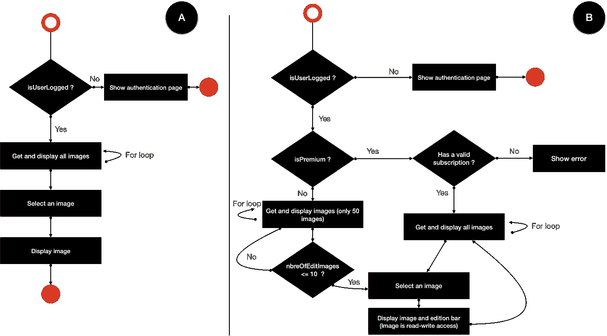
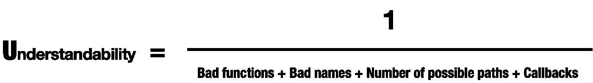
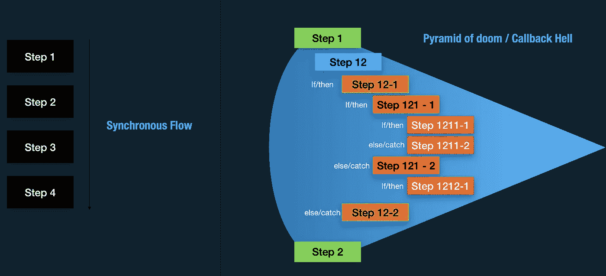
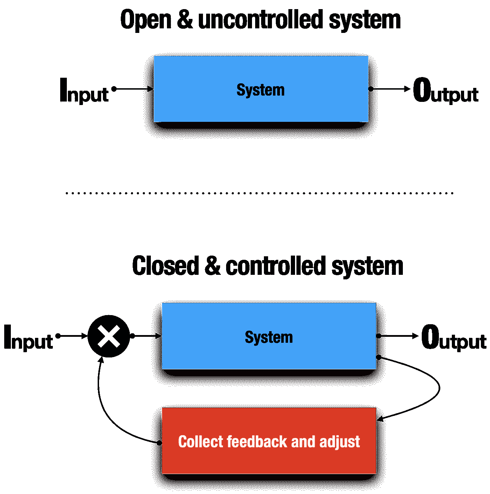
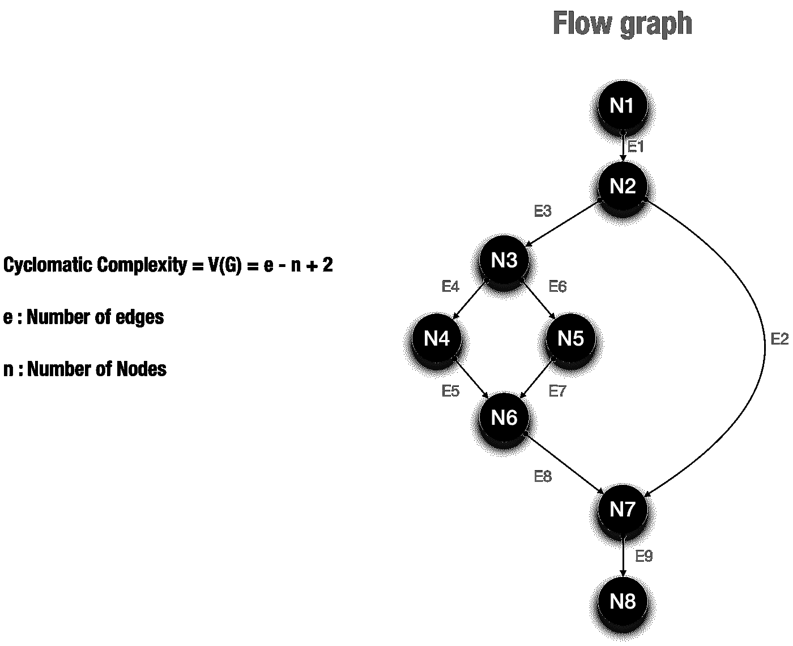
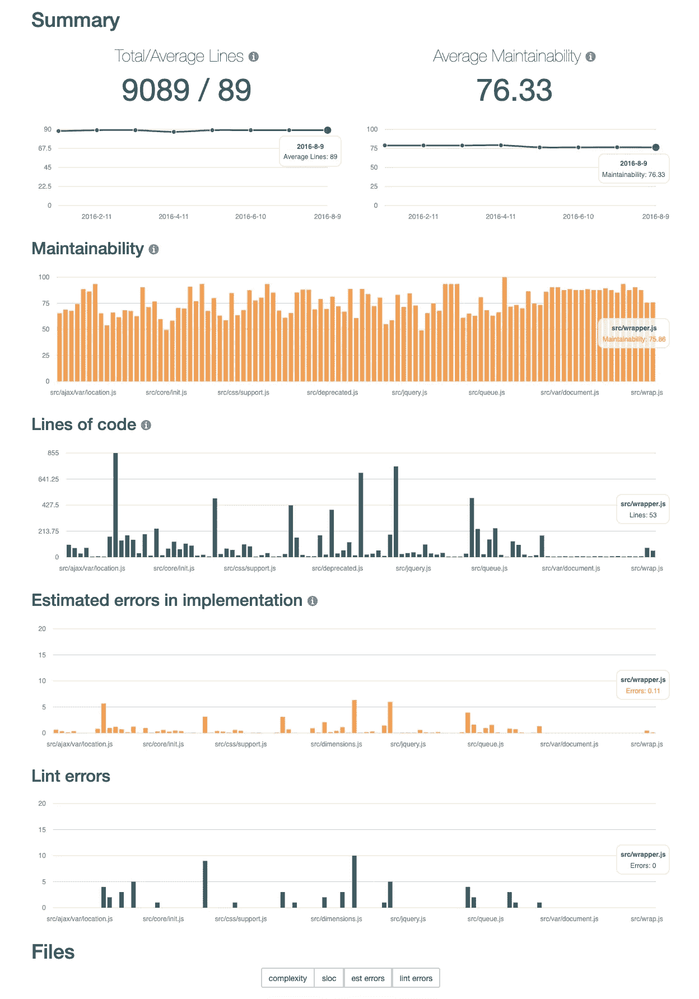

# 处理复杂软件中的代码味道和度量

> 原文：<https://betterprogramming.pub/dealing-with-code-smells-and-metrics-in-complex-software-879f9fc4a767>

## 知道软件复杂性何时出现以及如何处理


照片由 [Flo P](https://unsplash.com/@nattyflo?utm_source=medium&utm_medium=referral) 在 [Unsplash](https://unsplash.com?utm_source=medium&utm_medium=referral) 上拍摄

# 为什么代码复杂性是一个重要而严肃的话题？

> “可靠性的主要敌人是复杂性。复杂系统往往不会被任何人完全理解。如果没有人能够了解一个复杂系统的一小部分，那么就没有人能够预测攻击者破坏该系统的所有方式。”——[实用互联网安全](https://www.springer.com/gp/book/9780387405339)作者约翰·r·瓦卡

如果很复杂，那就是无法理解。如果无法理解，那就是无法解释。如果我们不能理解和解释代码，我们就不能扩展或改变它。如果我们只了解整个系统的一部分，每一次进化都将是代价高昂的，错误和倒退将是无限的。

那么代码中有什么复杂的味道呢？有确定性的方法来衡量复杂性吗？有工具可以自动控制和测量复杂性吗？

让我们一起发现吧！

# 什么时候软件被认为是复杂的(复杂的味道)？

## 复杂性公式

我们可以用这个公式来总结软件的复杂性:


复杂度公式(图片由作者提供)

复杂程度与上述因素成反比:

*   虽然我们的代码很容易测试、理解和扩展，但复杂性很低(< 1 ).
*   When one of the factors decreases, the complexity increases.

Code must be written for the needs of today and for tomorrow’s easy understanding, expansion, and evolution. Complexity is the major constraint that dampens the evolution of software.

Whenever we add new code, we have to ask ourselves: Is it clear enough that we can easily understand it after two years without having viewed it?

The idea is not to fill our code with comments but to write an understandable code.

There are two types of complexities: one related to code and the other related to design. So what are the smells of code and design complexity? How can we detect them?

## Complexity smells

Personally, I consider unit testing as the first level of complexity control. If)代码很难测试，它很复杂。

单元测试是技术控制的一种手段，可理解性是人类控制的一种手段:如果代码不直观，它就是复杂的。例如，如果我们的同事在理解代码方面有困难，不要试图说服他们:这很复杂！

可扩展性是通过理解现有代码(之前)、进行更改(中)和影响(之后)所花费的时间来衡量的。如果这个时间是高的，那么它是复杂的。如果产生的无序度很大，那么这个设计就是糟糕的。

可扩展性衡量我们的设计和架构有多健壮、灵活和超前。

那么是什么使得代码难以测试和理解呢？是什么让软件难以扩展？让我们看看。

## 是什么让代码难以测试？

让我们看看这两个流程图:



简单和复杂的流程图(图片由作者提供)

怎么了?

流程图 A 清晰、简单、易于理解。

流程图 B 很复杂，很难理解。为什么？

因为:

*   许多决策分支(if/else)
*   大量嵌套的决策分支


可测性公式(图片由作者提供)

为什么？软件是为用户制作的，每一条路径都是单元测试必须覆盖和达到的可能用例。我们不能等待出现错误，但是由于单元测试，我们可以预见。

单元测试是开发的代码很好地响应需求并在任何条件下(空、空、服务器关闭、错误等)都表现良好的第一个验证器。单元测试就像我们的第一批软件用户。

## 是什么让代码难以理解？



易懂公式(图片由作者提供)

**功能不好的气味有哪些？**

让我们来看看这个例子:

```
function doSomething(lastName, firstName, gender, birthDay, birthPlace, address, phones, socialLinks) {
  if (!lastName
    || !lastName.length
    || !firstName
    || !firstName.length
    || !gender
    || !gender.length)
    return "User information unavailable !";
  const nameLine = `${gender.toUpperCase()} ${firstName} - ${lastName}`;
  let birthdayLine = '';
  if (birthDay && birthDay.length) {
    if (birthPlace && birthPlace.length) {
      birthdayLine = `Burn the ${birthDay} at ${birthPlace}`;
    } else {
      birthdayLine = `Burn the ${birthDay}`;
    }
  }
  let addressLines = [];
  if (address
    && address.zipCode
    && address.zipCode.length
    && address.address1
    && address.address1.length) {
    addressLines.push(`Address : ${address.address1}`);
    addressLines.push(`Zip Code : ${address.zipCode}`);
    if (address.city && address.city.length) {
      addressLines.push(`City : ${address.city}`);
    }
    if (address.state && address.state.length) {
      addressLines.push(`State : ${address.state}`);
    }
  }
  if (phones
    && Array.isArray(phones)
    && phones.length) {
    for (let i = 0; i < phones.length; i++) {
      const phone = phones[i];
      if (phone.type
        && phone.type.length
        && phone.value
        && phone.value.length) {
        phones[i] = `Phone ${phone.type} : ${phone.value}`;
      }
    }
  }
  if (socialLinks
    && Array.isArray(socialLinks)
    && socialLinks.length) {
    for (let i = 0; i < socialLinks.length; i++) {
      const link = socialLinks[i];
      if (link.type
        && link.type.length
        && link.value
        && link.value.length) {
          socialLinks[i] = `Social ${link.type} : ${link.value}`;
      }
    }
  }
  return ([
    nameLine,
    birthdayLine,
    addressLines,
    phones,
    socialLinks,
  ])
}
```

**怎么了？**

*   函数的意图不清楚(错误的名称:doSomething)
*   大型函数:许多语句
*   许多责任
*   许多参数:我们必须记住每个参数的顺序和类型
*   许多决策路径
*   副作用(电话和社交链接突变)
*   输出格式:我们必须记住返回值的顺序

糟糕的函数是难以理解的复杂代码的最明显的气味和症状。

**恶名**

让我们看看这个例子:

```
const format = m => {
  if (m === 0) return `00`;
  if (m < 10)  return `0${m}`;
  if (m >= 10) return `${m}`;
}
```

这个函数计算什么？它是为了什么目的而创造的？什么是`m`？它是一个匿名函数:它没有明确的角色，也没有明确的意图。

每个函数和变量都是为特定的角色和意图而创建的，名字必须简单明了地说出和表达出来(不要依赖注释)。

现在让我们来看看这个增强的示例:

```
const formatAmountValue = amount => {
  if (amount === 0) return `00`;
  if (amount < 10)  return `0${amount}`;
  if (amount >= 10) return `${amount}`;
}
```

现在很清楚，这个函数的作用是根据功能需求格式化金额。很容易找到并调试这个函数。

功能名称比技术名称更有表现力。随着时间的推移，我们忘记了技术上的*为什么是*，但是功能上的是直观的。

**回调**

> “首先，我们的大脑以顺序的、阻塞的、单线程的语义方式计划事情，但是回调以一种相当非线性的、非顺序的方式表达异步流，这使得对这样的代码进行适当的推理变得更加困难。对代码进行不合理的推理是导致严重错误的不良代码。”— [你不知道的 JS: Async &性能](https://www.oreilly.com/library/view/you-dont-know/9781491905197/)凯尔·辛普森。

让我们看看下面的例子:

```
axios.get(‘/get/users’)
 .then(function(response) {
 document.getElementById(‘users’).innerHTML = response.data.map((user) => (
 ‘<li class=”row”>’ +
 ‘’ +
 ‘<div class=”col-md-3">’ +
 ‘<strong>’ + user.name + ‘</strong>’ +
 ‘<div>Github: <a href=”[https://github.com/'](https://github.com/') + user.github + ‘“ target=”_blank”>’ + user.github + ‘</a></div>’ +
 ‘<div>Twitter: <a href=”[https://twitter.com/'](https://twitter.com/') + user.twitter + ‘“ target=”_blank”>’ + user.twitter + ‘</a></div>’ +
 ‘</div>’ +
 ‘</li><br/>’
 )).join(‘’);
 })
 .catch(function(err) {
 document.getElementById(‘users’).innerHTML = ‘<li class=”text-danger”>’ + err.message + ‘</li>’;
 });
```

很难理解代码的意图:每个块在哪里开始，在哪里结束？代码流不是顺序的，但它会偏离，创建新的并行分支，并深入(get => then => map)。



同步流与回调流(图片由作者提供)

如果我们希望在显示最终结果之前获得每个用户的详细信息，该怎么办？

```
axios.get('/get/users')
  .then(function(response) {
      **response.data.map((user) => {
          axios.get(`/get/user?id=${user.id}`)
            .then(function(response) {
              ...
            })
            .catch(function(err) {
              ...
            });
        };
      });**
  }.catch(function(err) {
    document.getElementById('users').innerHTML = '<li class="text-danger">' + err.message + '</li>';
  });
```

很难思考和理解输出代码。

> “我们需要比试镜更好的东西。”—你不知道的 JS: Async & Performance 作者凯尔·辛普森。

## 是什么让软件难以扩展？


扩展公式(图片由作者提供)

扩展软件与设计和架构高度相关。如果代码结构良好且模块化，并且变更图清晰且定义良好，那么扩展将会很容易。

当我们想要扩展或修改软件时，我们在将来收获架构设计和定义活动的回报。面向未来的设计！


可扩展和进化的设计(图片由作者提供)

当我们在开发中前进时，有没有一种确定的方法来度量复杂的程度或水平？

# 有哪些可用的指标？

## 为什么指标很重要？



受控与非受控系统(图片由作者提供)

一个不受控制的系统随着时间的推移以任意和不确定的方式进化:它的状态没有任何回报，也不能进行优化。

然而，受控系统遵循明确定义的路径，其演化是可预测和可优化的。

每当我们在开发中前进时，度量帮助我们遵循最佳路径以获得良好的软件质量，如果必要的话，它们会纠正我们。

## 圈复杂度(McCabe 公式)

圈复杂度是根据代码中的路径数计算的。这正是我们想要的，让我们来看看。

```
(1) start
(2)if (X) then 
(3) if (Y) then 
(4)   perform A
      perform B
    else 
(5)   perform C
      perform D
(6) endif 
(7) endif
(8) end
```



圈复杂度计算(图片由作者提供)

```
e = 9
n = 8
Cyclomatic Complexity = 9 - 8 + 2 = 4
```

V(G)是条件分支的数量。
V(G) = 1 对于一个只由顺序语句组成的程序。

圈数越高，函数的执行路径就越多，理解起来就越困难。

**提示:**以下情况圈数加一:`if` (…)、`for` (…)、 `while` (…)、`case` …:、`catch` (…)、`&&`、`||`、`?`、`#if`、`#ifdef`、`#ifnde` f、`#elif`。

```
int sumOfPrimes(int max) {              **// +1**
  int total = 0;
  OUT: for (int i = 1; i <= max; ++i) { **// +1**
    for (int j = 2; j < i; ++j) {       **// +1**
      if (i % j == 0) {                 **// +1**
        continue OUT;
      }
    }
    total += i;
  }
  return total;
} **// Cyclomatic Complexity 4**
```

循环数高的模块和函数比循环数低的模块需要更多的测试用例。

每个函数必须有至少和它的圈数一样多的测试用例。

如何通过圈数控制代码复杂度:

*   **如果圈数是 1-10，**那么代码是结构化的、写得好的、高度可测试的，成本和工作量更少。
*   **如果圈数是 10–20，**那么代码是复杂的，可测试性中等，成本和工作量中等。
*   **如果圈数是 20–40，**那么代码非常复杂，弱可测试性，并且成本和工作量很高。
*   **如果圈数是> 40，**根本不可测试，成本和精力都很高。

在周期的早期使用这个度量标准可以降低拥有复杂代码的风险。

关于圈复杂度的更多信息:

[](http://www.mccabe.com/iq_research.htm) [## 麦凯布智商研究图书馆

### 麦凯布智商研究图书馆我们已经为您提供了所有的研究工具，您将需要确认麦凯布是…

www.mccabe.com](http://www.mccabe.com/iq_research.htm) 

## 认知复杂性

> “认知复杂性打破了使用数学模型评估软件可维护性的惯例。它从圈复杂度设置的先例开始，但使用人类的判断来评估应该如何计算结构，并决定应该向模型中添加什么。”认知复杂性:一种测量可理解性的新方法。

那是什么意思？让我们看看。

**代码 A:**

```
int sumOfPrimes(int max) {              // +1
  int total = 0;
  OUT: for (int i = 1; i <= max; ++i) { // +1
    for (int j = 2; j < i; ++j) {       // +1
      if (i % j == 0) {                 // +1
        continue OUT;
      }
    }
    total += i;
  }
  return total;
} // Cyclomatic Complexity 4
```

**代码 B:**

```
String getWords(int number) {   // +1
    switch (number) {
      case 1:                   // +1
        return "one";
      case 2:                   // +1
        return "a couple";
      default:                  // +1
        return "lots";
    }
  } // Cyclomatic Complexity 4
```

这两个代码的圈复杂度是 4。然而，如果我们依靠人类的理解，我们可以看到代码 A 比代码 b 更复杂。

所以让我们看看认知复杂性是如何重新审视这两个代码的。

**代码 A:**

```
 // Cyclomatic   Cognitive
int sumOfPrimes(int max) {              // +1
  int total = 0;
  OUT: for (int i = 1; i <= max; ++i) { // +1    +1
    for (int j = 2; j < i; ++j) {       // +1    +2 (nesting=1)
      if (i % j == 0) {                 // +1    +3 (nesting=2)
        continue OUT;                   // +1
      }
    }
    total += i;
  }
  return total;
}                                       // =4     =7
```

**代码 B:**

```
// Cyclomatic Complexity    Cognitive Complexity
String getWords(int number) { //          +1
  switch (number) {           //                                  +1
    case 1:                   //          +1
      return "one";
    case 2:                   //          +1
      return "a couple";
    default:                  //          +1
      return "lots";
  }
}                             //          =4                      =1
```

似乎更符合逻辑，更正确。那么认知复杂性是如何工作的呢？

 [## SonarSource 博客

### SonarSource 构建世界级的代码质量和代码安全工具。我们的产品，SonarLint，SonarQube 和 SonarCloud…

blog.sonarsource.com](https://blog.sonarsource.com/cognitive-complexity-because-testability-understandability) 

## 软件熵

> “热力学第二定律原则上规定，一个封闭系统的无序度不能减少，只能保持不变或增加。这种无序的一个量度是熵。这个定律对软件系统来说似乎也是合理的；当一个系统被修改时，它的无序度，或者说熵，往往会增加。这就是所谓的软件熵。”—[https://en.wikipedia.org/wiki/Software_entropy](https://en.wikipedia.org/wiki/Software_entropy)

从技术上讲，熵(无序)可以通过以下方式来衡量:

*   源代码管理系统中每次提交时更改的文件数
*   我们引入的错误、失败和回归的数量

这是我们通过添加或修改特征，从上一个平衡状态引入的无序度。

如果每次变化带来越来越多的 bug 或失败，那么熵就在增加。

如果熵很高，那么代码就很复杂，设计也很糟糕。

对抗熵的唯一方法是代码审查、频繁的代码审查和重构。

## 霍尔斯特德度量

我认为霍尔斯特德度量是最合理、最准确、最接近书面代码的。为什么？让我们看看。

首先，代码是由什么组成的？

代码=操作数+运算符

**运算符:** main，()，{}，int，scanf，&，=，+，/，printf，，；
**操作数:**变量(a，b，c，I)，常量(1，2，3)。

对于给定的函数，考虑:

```
n1 = the number of distinct operators
n2 = the number of distinct operands
N1 = the total number of operators
N2 = the total number of operands
```

从这些数字中，可以计算出几个重要的指标:

```
Program length (N) = N = N1 + N2
Vocabulary size (n) = n = n1 + n2
Program volume (V) = V = N * log2(n)
Difficulty level (D) = D = ( n1 / 2 ) * ( N2 / n2 )
Effort to implement (E) = E = V * D
Time to implement (T) = T = E / 18
Number of delivered bugs (B) = B = (E^2/3) / 3000
```

厉害！Halstead 度量密切依赖于我们写了什么，以及我们如何根据代码(操作数和运算符)进行推理。他们衡量功能的整体质量。

让我们看一个例子来更好地理解:

```
main(){
    int a, b, c, avg;
    scanf("%d %d %d", &a, &b, &c);
    avg = (a + b + c) / 3;
    printf("avg = %d", avg);
}The unique operators are: 
main, (), {}, int, scanf, &, =, +, /, printf, ,, ;The unique operands are: 
a, b, c, avg, "%d %d %d", 3, "avg = %d"n1 = 12, n2 = 7, n = 19
N1 = 27, N2 = 15, N = 42
V = 42 * log2(19) = 178.4
D = 12/2 * 15/7 = 12.85
E = 12.85 * 178.4 = 2292.44
T = 2292.44/18 = 127.357 seconds
B = 0.05
```

**霍尔斯特德卷(五)**描述了一个算法实现的大小。如果函数要保持清晰易懂，它的体积必须小:运算符数量少，操作数数量少，词汇量小(小函数)。函数的体积应该至少为 20，最多为 1，000。大于 1，000 的体积表明该函数可能做了太多的事情。

**难度等级(D)** 与操作数总数和唯一操作数数之比成正比。如果在程序中多次使用相同的操作数，就更容易出错。

**实现(E)或理解一个程序的努力**与程序的量和难度成正比。大型函数具有较高的(E)。

**交付的 bug 数量(B)** 估计实现中的错误数量。一个文件中交付的 bug 应该少于两个。

Halstead metrics 是一种基于我们所写的和我们如何思考来有效地测量和预测代码的复杂性和质量的重要方法。

在软件开发中，一切都是可测量和可预测的。

关于霍尔斯特德指标的更多详情:

[](https://www.verifysoft.com/en_halstead_metrics.html) [## 霍尔斯特德度量

### 使用 Testwell CMT++和 CMTJava(复杂性测量工具)测量霍尔斯特德指标霍尔斯特德复杂性指标…

www.verifysoft.com](https://www.verifysoft.com/en_halstead_metrics.html) 

## 保养率指数

可维护性指数表明何时重写代码比修改代码更便宜和/或风险更小。让我们看看怎么做。

维修性指数= MI = MIwoc + MIcw

**MIwoc** :无注释的维修性指标
**MIcw** :维修性指标注释权重

**MIwoc**= 171 5.2 * lnV 0.23 * G 16.2 * lnL

```
**V** is the Halstead Volume.
**G** is the total Cyclomatic Complexity.
**L** is the number of Source Lines of Code (SLOC).
```

太棒了——一个汇集了所有指标的指标！

MIcw = 50 * sin(√2.4 * C)

```
**C** average percent of lines of comments.
```

心肌梗塞病例:

*   85 及以上:**良好的**可维护性
*   65–85:**中等**可维护性
*   < 65: **维护困难**

MI 值甚至可以是负值:(

关于可维护性指数的更多细节:

[](http://web.archive.org/web/20021120101304/http://www.stsc.hill.af.mil/crosstalk/2001/08/welker.html) [## STSC 相声-软件可维护性指数重温-2001 年 8 月

### 爱达荷国家工程和环境实验室软件可维护性指数在…

web.archive.org](http://web.archive.org/web/20021120101304/http://www.stsc.hill.af.mil/crosstalk/2001/08/welker.html) 

## 模块性(内聚力、传出耦合、传入耦合和不稳定性指标)

[](/inside-software-modularity-and-related-metrics-2e5af2b447dc) [## 我们如何度量软件的模块性和依赖性？

### 什么是模块化，有哪些度量标准可以用来衡量模块化？

better 编程. pub](/inside-software-modularity-and-related-metrics-2e5af2b447dc) 

有什么工具可以自动测量这些指标吗？

# 有哪些可用的工具？

## 静态分析器 JavaScript 代码的 ESlint

除了确保最佳实践，ESLint 还可用于检测一些已知的复杂气味:

[](https://eslint.org/docs/rules/complexity) [## 复杂性-规则

### 圈复杂度衡量程序源代码中线性独立路径的数量。这个规则…

eslint.org](https://eslint.org/docs/rules/complexity) 

我们可以找到一些规则来限制:

*   圈复杂度(`[complexity](https://eslint.org/docs/rules/complexity)`)
*   功能最大深度(`[max-depth](https://eslint.org/docs/rules/max-depth)`
*   功能最大行数(`[max-lines-per-function](https://eslint.org/docs/rules/max-lines-per-function)`
*   函数 max 语句(`[max-statements](https://eslint.org/docs/rules/max-statements)`)
*   函数最大参数(`[max-params](https://eslint.org/docs/rules/max-params)`)
*   最大嵌套回调(`[max-nested-callbacks](https://eslint.org/docs/rules/max-nested-callbacks)`)

强烈建议从开发开始就激活和配置这些规则，以免欠债。

## 静态分析器——Sonar for Java 代码

正如 ESLint 对于 JavaScript 代码很强大一样，Sonar 对于 Java 代码也很强大。

 [## 规则浏览器

### 编辑描述

rules.sonarsource.com](https://rules.sonarsource.com/java) 

我认为声纳是唯一引入认知复杂性概念的工具:

[](https://www.sonarsource.com/resources/white-papers/cognitive-complexity.html) [## 认知复杂性

### 认知复杂性提供了一种新的衡量代码理解难度的方法——这让开发人员感到…

www.sonarsource.com](https://www.sonarsource.com/resources/white-papers/cognitive-complexity.html) 

## ES6-Plato — JavaScript 源代码复杂性可视化工具

[](https://github.com/es-analysis/plato) [## es-分析/柏拉图

### JavaScript 源代码可视化、静态分析和复杂性工具- es-analysis/plato

github.com](https://github.com/es-analysis/plato) 

一个报告示例:



ES6-柏拉图—作者图片

正如我们所看到的，MI 分数考虑了 Halstead 容量、圈复杂度和每个源文件的行数。

使用 Halstead 提供的错误分数来计算估计的错误数。

复杂度分数基于圈复杂度的计算:

[](https://github.com/the-simian/es6-plato/blob/master/lib/reporters/complexity/index.js#L48) [## -猿人/es6-柏拉图

### JavaScript 源代码可视化、静态分析和复杂性工具- the-simian/es6-plato

github.com](https://github.com/the-simian/es6-plato/blob/master/lib/reporters/complexity/index.js#L48) 

## Git 改变历史和拉请求

我认为 Git 的变化历史和拉取请求是度量熵和所产生的无序的最确定和早期的指标。

如果一个小的改变改变了许多文件，那么出现错误和退化的风险将会很高。

# 结论

在本文中，我们发现了为什么复杂性很重要，原因是什么，以及哪些参数和工具可用于处理复杂性。

当代码难以测试、理解和扩展时，就被认为是复杂的。

多决策路径、大函数、回调和缺乏模块化是复杂性最重要的特征。

强烈建议在开发过程中使用提到的各种度量标准来控制复杂性的发展，这样你就不会背上沉重的债务。工具使控制变得容易和自动化。

我们强调了主要指标和原因。然而，还有其他非技术的但是人为的原因，比如这些公理:“单元测试很难做和维护”，“我没有时间”，“我改天再回顾它”，以及“它有效，不要碰它！”

如果我们的开发文化不改变，度量、公式、数学和理论就没有附加值:如果我们继续将单元测试视为道具或争议的主题，如果我们不使用工具，如果我们继续将代码视为一组要编写的行，而不是质量活动的反映。

技术和人为因素必须存在，并且必须相互配合以达到最佳和必要的质量等级。

战斗的最后一个公理:“太晚了。”完美的软件是不存在的，但是每一个软件在其生命周期中都在不断地迭代改进。你只需要计划允许这种灵活性的结构。

谢谢你看了我的故事。

你可以在**GitHub:【https://github.com/helabenkhalfallah】T2 找到我**