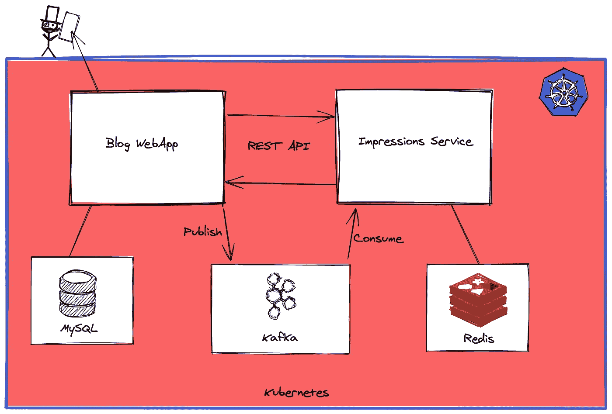
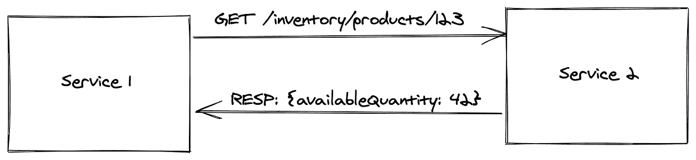
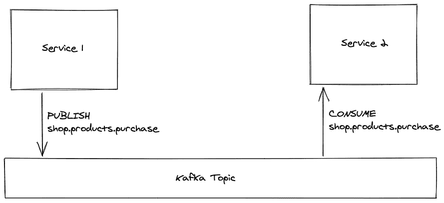
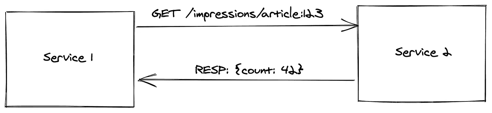
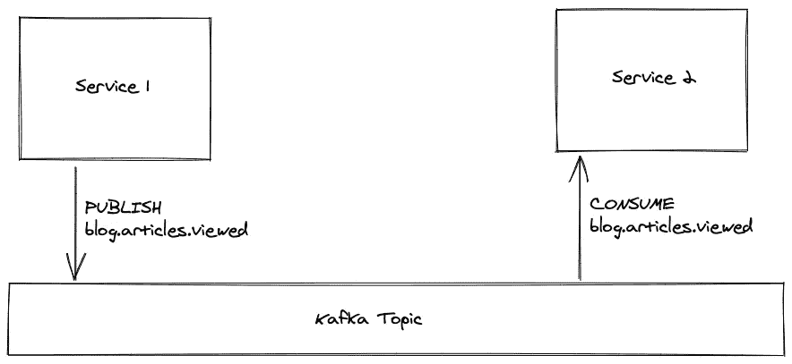
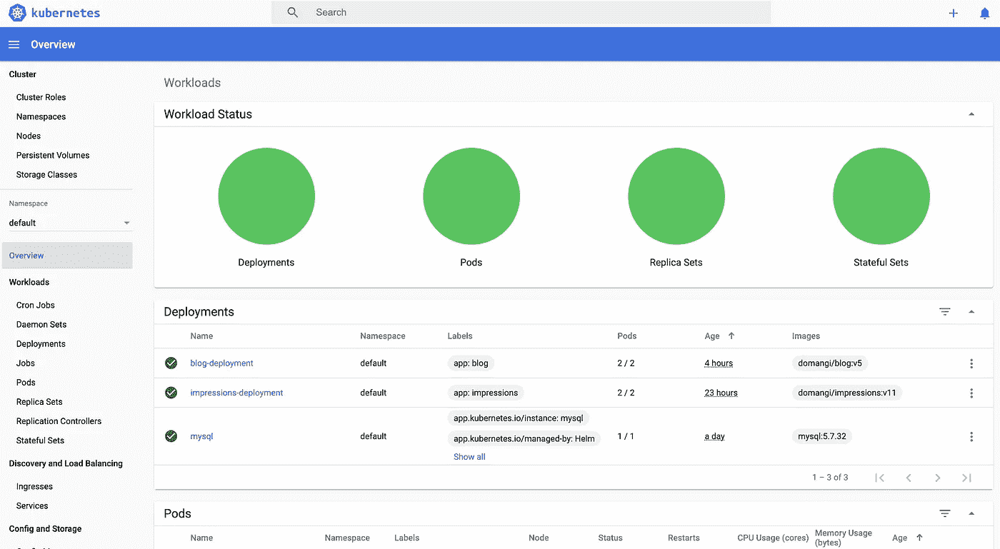
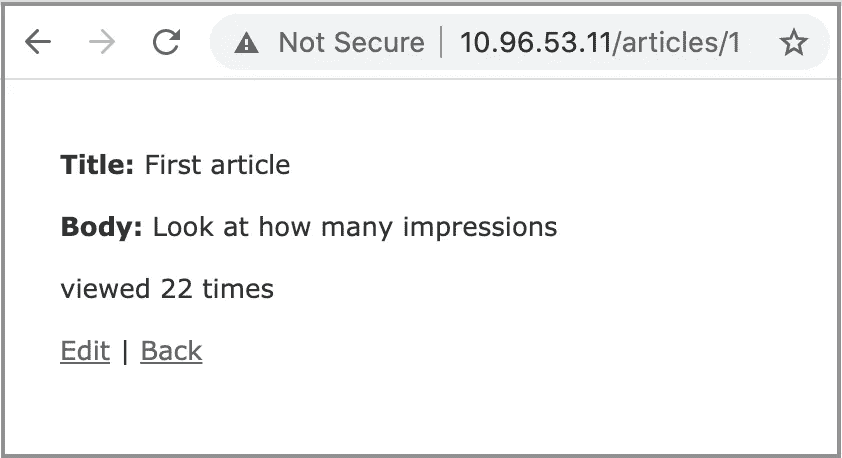

# 在 Kubernetes 中处理数据和通信

> 原文：<https://betterprogramming.pub/dealing-with-data-and-communication-in-kubernetes-4b1c940719af>

## 从使用 minikube 进行本地开发环境设置到启动自己的博客应用程序



作者图片

不久前，我在 Udemy 上做了一个名为“[微服务软件架构:模式和技术](https://www.udemy.com/course/microservices-software-architecture-patterns-and-techniques/)”的在线课程。在本课程中，讲师详细描述了微服务架构带来的主要挑战以及可能的解决方案。在学习有关服务注册、服务发现、故障转移机制和健康 API 的课程时，我想，“感谢上帝，我们有 Kubernetes，它为我们提供了大部分现成的解决方案，这样我们就可以专注于实现我们的业务逻辑了。”

尽管您从 Kubernetes 获得了很多，但微服务架构的某些方面需要您亲自解决。其中最重要的是数据和通信，它解决了以下问题:

你如何存储你的数据？

服务如何交换这些数据？

在本文中，我将向您展示如何使用 minikube 建立本地 Kubernetes 集群。通过实现一个非常基本的例子，我将描述如何在微服务架构中处理数据和通信。

示例应用程序本身非常简单:一个博客应用程序，允许您创建和查看文章，并查看文章页面上显示的印象计数器。博客逻辑将被实现为一个 Ruby on Rails 应用程序，它将文章存储在 MySQL 数据库中——而 impressions 逻辑将由一个用 Elixir 编写的独立应用程序处理，该应用程序使用 Redis 作为 Impressions 计数器的键值存储。我们将使用 Kafka 来更新印象计数器。

我将带您一步一步地完成设置:从第一次在您的本地机器上启动 minikube 到从您的浏览器访问 blog 应用程序并看到计数器增加。

## 我们将详细做些什么

1.  设置迷你库
2.  部署 MySQL
3.  部署 Redis
4.  部署卡夫卡
5.  部署 Impressions API
6.  部署博客应用程序

在每一步之后，我将提供一个小测试，您可以运行它来确保一切都为您工作。

MySQL、Redis 和 Kafka 将使用 Helm 部署，Helm 是 Kubernetes 应用程序的包管理器。基本上，它将允许我们用一个简单的命令来安装这些服务器。

对于 Impressions API 和 Blog 应用程序，我将提供所需的所有 Kubernetes 配置文件。

# 我们需要卡夫卡做什么？

我们的架构由几部分组成:一个 MySQL 服务器存储博客的文章，一个 Redis 数据库管理印象计数器。但是为什么我们也需要卡夫卡呢？

## 每个服务规则一个数据库

要理解我们为什么需要 Kafka，我们先说一下微服务中的数据。

通常，在 monolith 应用程序中，您有一个可以从代码的每个部分访问的数据库。这非常简单快捷。

但是，当您有多个应用程序时，如何存储您的数据呢？

假设您有一个电子商务平台，其中一个服务负责用户资料，另一个服务负责发送电子邮件推荐。用户资料服务负责所有用户数据(包括姓名和电子邮件)，而推荐服务只是将产品与用户 id 相关联，并使用它们向用户发送推荐电子邮件。推荐服务需要访问用户数据，比如姓名和电子邮件。

由于推荐需要读取用户简档数据，最简单的解决方案可能是共享相同的数据库凭证，并让推荐服务直接从数据库中查询用户简档。这个解决方案看起来简单快捷，但是问题会很快出现。

应用程序会根据新的需求不断变化，而这些变化通常也要求数据库模式发生变化。如果许多应用程序直接访问同一个数据库，那么很难在确保没有其他应用程序中断的情况下进行这些更改。在我们的示例中，想想如果我们需要将“name”字段更改为“firstname”和“lastname”会发生什么。更改模式后，推荐应用程序会崩溃，因为它试图访问数据库中不再存在的“name”字段。

这就是为什么在微服务架构中使用“共享数据库”是一种已知的反模式。

**规则是每个服务一个数据库**。

换句话说，每个应用程序都有自己的数据库，只能由自己直接访问。如果其他服务需要属于该应用程序的一些信息，它们需要请求。在我们之前的例子中，推荐服务会询问用户简档服务——“你能给我用户 123 的名字和电子邮件吗？”—用户服务将返回请求的数据。

将数据库和数据之间的应用程序公开给外部，使我们能够实现适当的弃用过程。例如，当用户简档服务将单个字段“姓名”更改为“名字”和“姓氏”时，它可以继续将“姓名”字段作为“名字”和“姓氏”的串联返回给推荐服务同时，它可以通知所有其他应用程序切换到新的字段。一旦它从接收到的请求中知道不再使用不赞成使用的字段，旧的“name”字段映射可以被移除。

## 服务之间的通信

我们现在知道，每个服务都有自己的数据库，访问这些数据的唯一方式是通过拥有它的服务。因此，服务之间需要进行大量的通信，以获取和提供在 monolith 应用程序中可以直接访问的数据。由于每个服务只能直接访问它所负责的应用程序数据的一部分，因此它需要不断地将这些数据与来自其他服务的数据集成在一起。

一般来说，有两种类型的通信:同步和异步。

**同步通信**，或者说请求-响应，发生在一个服务正在执行一个动作，并且需要立即从另一个服务获得信息的时候。例如，您有一个库存服务，允许您了解产品的当前可用性，还有一个服务充当电子商务前端。当前端服务接收到呈现特定产品页面的请求时，对库存服务进行同步调用，例如 REST 调用。这个调用返回特定产品的当前状态，然后呈现给最终用户。



使用 REST API 的同步通信

然而，在其他情况下，这种类型的交流不是很有用。假设您有一个搜索服务，它负责索引您的所有产品，以便用户可以随时找到可用的产品。该服务希望隐藏缺货的产品，这样用户就不会迷失在他们买不到的产品中。使用同步通信来检查产品可用性意味着搜索服务需要频繁地向库存服务发出请求——这样它就可以删除缺货的产品。当然，这并不理想。

在这种情况下，我们不想不断地询问是否发生了变化。我们希望数据的所有者(服务)在发生变化时通知其他应用程序，以便任何感兴趣的人都可以对变化做出反应。在这种情况下，我们谈到异步通信，或发布-订阅，其中当他们的应用程序上的某些内容发生变化时，数据所有者发布一条消息，这可能会引起其他应用程序的兴趣。

例如，正在购买的产品(→库存更新→可能状态更新)。然后，其他应用程序可以使用这些消息并执行它们的任务。再举一个例子，搜索服务可以读取关于正在购买的产品的消息，并决定通过从所有必要的服务获取更新的信息来重新索引该产品。



使用 Kafka 的异步通信

异步通信可以使用不同的技术实现，但最常用的是 AMQP 和卡夫卡。在这个例子中，我们将使用卡夫卡。

总而言之，我们说过每个应用程序都有自己的数据库，这些数据只能通过应用程序来访问。由于这些数据的一部分是其他服务需要的，甚至是更新的，我们需要实现服务之间的通信，特别是两种类型的通信:用于同步通信的 REST API 端点和用于异步通信的 Kafka Publisher 和 Consumers。

我们现在将一步一步地看如何添加所需的块，直到我们有一个工作的微服务架构来运行我们的博客应用程序。我们将能够从浏览器访问这个应用程序，这样我们就可以看到文章的印象计数器随着每次刷新而增加。

# 示例应用程序

现在，让我们来看看示例应用程序。如前所述，这个示例应用程序将是一个简单的博客应用程序，允许您创建和查看文章，并看到每篇文章的浏览量增加。博客逻辑和印象计数逻辑将在两个不同的服务上实现，这允许您处理两种通信类型:同步和异步。

同步通信将需要在博客应用程序上显示一篇文章的页面浏览量。这将通过 REST API 调用调用 impressions 服务来完成。



需要异步通信来通知 impressions 服务页面已被查看。换句话说，当博客应用程序收到一个呈现文章的请求时，它会发布一个关于 Kafka 主题的新消息`blog.articles.viewed`。这将指定文章的`id`的有效负载，更准确地说，是 urn(统一资源名——我们的应用程序中的一个全局唯一标识符)。订阅该队列的 impressions 服务将使用该消息，读取有效负载中的 urn，并递增相关的计数器。



现在，我将一步一步地向您介绍这个示例。我不会详细介绍实际应用的实现，因为这会让这篇文章更长，但是我会在这个 GitHub [repo](https://github.com/domangi/blog-impressions-k8) 中提供所有使用的代码。这个 repo 还将拥有用于启动这两个应用程序的 Kubernetes 配置文件。

# 第一步。设置 Minikube

minikube 是当地的 Kubernetess 它致力于使 Kubernetes 易于学习和开发。

我们需要做的第一件事是按照[官方指南](https://minikube.sigs.k8s.io/docs/start/)在我们的本地机器上安装 minikube。

如果您运行的是 macOS(否则请查看指南)，安装 minikube 应该像通过 brew 安装一样简单。使用以下命令:

```
$ brew install minikube
```

安装 minikube 后，我们可以启动我们的第一个本地 Kubernetes 集群，如下所示:

```
$ minikube start
```

## 测试 Minikube 设置

正如开始时所承诺的，对于每一步，我们都将进行测试，以确保一切都按预期运行。为了测试 minikube 的工作情况，让我们创建一个临时测试容器，如下所示:

```
$ kubectl run -it --rm --restart=Never test-pod --image=alpine sh
```

如果一切正常，我们应该能看到新的外壳。命令中的`--rm`选项确保当我们离开 pod 时，pod 被删除，这可以通过在 shell 中键入`exit`来实现。

## Minikube 仪表板

测试一切正常的另一种方法是启动 Kubernetes 仪表板，如下所示:

```
$ minikube dashboard
```

该命令将在您的默认浏览器中打开仪表板，从中您可以查看和管理您的 Kubernetes 集群。这是仪表板的图像:



Kubernetes 仪表板

# 第二步。部署 MySQL

可以想象，我不是第一个尝试在 Kubernetes 上部署 MySQL 服务器的人。就像你会在 RubyGems 上寻找一个 Ruby 库来解决你的 RubyOnRails 应用程序中的一个常见问题一样，你也可以在[https://artifacthub.io/](https://artifacthub.io/)上寻找提供你正在寻找的 Kubernetes 应用程序的导航图。事实上， [Helm](https://helm.sh/) 是 Kubernetes 的包经理。

但是，在我们可以使用头盔之前，我们需要安装它。在 macOS 上，您可以使用 brew:

```
$ brew install helm
```

如果这不是你的选择，请查看[官方指南](https://helm.sh/docs/intro/install/)了解更多详情。

现在我们已经安装了 Helm，让我们使用它来安装 MySQL，如下所示:

```
$ helm repo add t3n https://storage.googleapis.com/t3n-helm-charts $ helm install mysql t3n/mysql --version 1.0.0
```

您可以在[图表页面](https://artifacthub.io/packages/helm/t3n/mysql)上找到关于配置选项的更多详细信息。

完成这一步后，将部署一个 MySQL 服务器，可以使用主机名`mysql`从集群访问该服务器。如果你想把它叫做`mysql-service`，你必须运行`helm install mysql-service t3n/mysql --version 1.0.0`，然后你可以访问你在主机`mysql-service`的 MySQL 服务器。

## 测试 MySQL 服务器

为了测试它是否工作，我们首先需要获得数据库根密码，然后我们将创建一个运行 Ubuntu 的虚拟 pod，安装一个 MySQL 客户端，并访问 MySQL 数据库。

我们可以使用 minikube 仪表板获得`mysql_root_password`(在“secrets”下，找到 MySQL 条目，然后单击 mysql-root-password 旁边的眼睛。


来自 Minikube Dashboard 的 MySQL 密码

或者，我们可以使用以下命令从命令行获取密码:

```
$ kubectl get secret --namespace default mysql -o jsonpath="{.data.mysql-root-password}" | base64 --decode; echo# YOURPASSWORDHERE
```

现在我们有了密码，让我们启动一个新的运行 Ubuntu 的临时 pod，安装 mysql-client，并使用主机名`mysql`访问我们的 mysql 服务——这个名称是我们之前给 MySQL 安装起的。以下是命令:

```
$ kubectl run -it --rm --restart=Never test-pod --image=ubuntu:16.04 sh
# apt-get update && apt-get install mysql-client -y
...
...
... INSTALLING STUFF
...
...# mysql -h mysql -p
Enter password:Welcome to the MySQL monitor.  Commands end with ; or \g.
Your MySQL connection id is 22059
Server version: 5.7.32 MySQL Community Server (GPL)Copyright (c) 2000, 2021, Oracle and/or its affiliates.Oracle is a registered trademark of Oracle Corporation and/or its
affiliates. Other names may be trademarks of their respective
owners.Type 'help;' or '\h' for help. Type '\c' to clear the current input statement.mysql>
```

太好了。我们测试了 MySQL 服务器正在运行，并且我们可以使用`mysql`作为主机名从不同的 pod 访问它。

# 第三步。部署 Redis

与 MySQL 一样，Redis 也可以使用 Helm 部署。这一次，我们向安装程序传递一个设置，这样就可以不用密码访问 Redis。使用以下命令:

```
$ helm repo add bitnami [https://charts.bitnami.com/bitnami](https://charts.bitnami.com/bitnami)$ helm install redis bitnami/redis --set usePassword=false
```

查看[图表安装页面](https://artifacthub.io/packages/helm/bitnami/redis)了解更多详情。

## 测试 Redis 服务器

和以前一样，我们希望确保 Redis 服务器正在运行，并且可以使用主机名`redis-mater`从另一个 pod 访问它。

我们可以再次使用运行 Ubuntu 的临时 pod，安装`redis-tools`，并尝试使用以下命令访问我们的 Redis 服务器:

```
$ kubectl run -it --rm --restart=Never test-pod --image=ubuntu:16.04 sh
root@ubuntu:/# apt-get update && apt-get install redis-tools -y
root@ubuntu:/# redis-cli -h redis-master
redis-master:6379> PING
PONG
```

完成了。我们确保我们的 Redis 服务器正在运行，并且可以从主机名`redis-master`的其他 pod 访问它。

# 第四步。添加 Kafka 服务

我们想要部署的最后一个基础架构模块是 Kafka。幸运的是，我们可以使用 Helm(手动部署 Kafka 可能是一个令人头疼的问题，:D)。以下是命令:

```
$ helm repo add bitnami [https://charts.bitnami.com/bitnami](https://charts.bitnami.com/bitnami)$ helm install kafka --set replicaCount=1 bitnami/kafka
```

我手动将`replicationCount`设置为`1`，因为我的本地机器有点问题，而且由于我在本教程中并不关心 Kafka 复制，所以我只是将其设置为`1`。

你可以在[舵图表页面](https://artifacthub.io/packages/helm/bitnami/kafka)上找到所有可能安装选项的更多细节。

## 测试 Kafka 部署

为了测试我们的 Kafka 部署是否按预期工作，我们将使用 Kafka (bootstrap)服务器和主机`kafka`来验证发布到主题的消息是否被正确使用。

首先，让我们创建一个 pod，我们可以在其上运行 Kafka-consumer 或 Kafka-producer。为此，我们将使用以下命令:

```
$ kubectl run kafka-client --restart='Never' --image docker.io/bitnami/kafka:2.7.0-debian-10-r35 --namespace default --command -- sleep infinity
```

现在，我们可以在这个 pod 上打开一个 shell，并使用以下命令启动一个主题为`test-topic`的消费者:

```
$ kubectl exec -it kafka-client bash
# kafka-console-consumer.sh --bootstrap-server kafka:9092 --topic test-topic --from-beginning
```

现在，我们打开 pod 上的另一个 shell，并使用它通过以下命令生成新的`test-topic`:

```
$ kubectl exec -it kafka-client bash
# kafka-console-producer.sh --bootstrap-server kafka:9092 --topic test-topic
> This is my first message
```

当您按下 enter 键时，您应该会看到消费者 shell 上出现以下消息:

```
# kafka-console-consumer.sh --bootstrap-server kafka:9092 --topic test-topic --from-beginning
This is my first message
```

太好了。我们已经完成了基础设施的设置。我们有一个可以在主机`mysql`访问的 MySQL 服务器，一个可以在主机`redis-master`访问的 Redis 服务器，以及一个可以在`kafka:9092`访问的 Kaka Broker。

现在是时候添加我们自己的应用程序了。

# 第五步。添加印象服务

impressions 服务是一个 Elixir 应用程序，它做两件简单的事情:

1.  它使用 Kafka 主题`blog.article.viewed`,并使用 Kafka 消息有效负载中指定的密钥递增 Redis 计数器
2.  它公开了一个 REST 端点来获取特定键的当前计数

不要太深入应用程序的实现细节(你可以在 [GitHub](https://github.com/domangi/blog-impressions-k8/tree/main/impressions) 上查看)，这里唯一要注意的是应用程序需要与 Kafka 和 Redis 交互。应用程序假设完整的 Kafka URL 在名为`KAFKA_URL`的环境变量中定义，Redis 主机和端口在`REDIS_HOST`和`REDIS_PORT`中定义。该应用程序的 docker 映像在 Docker Hub 上以`domangi/impressions:v11`的名称公开发布。

现在让我们定义运行服务所需的所有 Kubernetes 配置，它们是:

*   定义环境变量的配置图
*   描述我们期望状态的部署，包括运行哪个 docker 映像和使用多少副本
*   使用特定主机名从集群访问应用程序的服务

## 印象配置图

这个 configmap 被命名为`impressions-configmap`，并将在 impressions 部署中用于访问三个所需的环境变量。

## 印象部署

这将运行我们的印象服务器。`domangi/impressions`是服务器的 docker 镜像。使用`envFrom -> configMapRef`,我们告诉部署在它创建的所有 pod 中使用`impressions-configmap`中定义的环境变量。

## 印象服务

最后一步是定义一个服务，允许集群中的其他 pod“作为服务”访问应用程序。使用 Kubernetes，您不需要修改应用程序来使用不熟悉的服务发现机制。Kubernetes 为一组 pod 提供它们自己的 IP 地址和一个 DNS 名称，并可以在它们之间进行负载平衡。在这种情况下，端口 80 处的`impressions-service`将允许您访问端口 4000 处的`impressions pods`之一。

我们现在可以应用这些配置文件并测试我们的 impressions 部署，如下所示:

```
$ kubectl apply -f impressions-configmap.yml
$ kubectl apply -f impressions-deployment.yml
$ kubectl apply -f impressions-service.yml
```

在继续测试之前，从 Kubernetes 仪表板或使用命令行`kubectl get deployment impressions-deployment`检查所有副本是否正在运行。

## 测试印象服务

为了测试 impressions 服务，我们将启动一个 pod 并使用`curl`与 impressions REST API 进行交互。然后，我们将使用 Kafka 客户端在`blog.article.viewed`上发布一条新消息，并验证从 REST API 返回的计数器是否更新如下:

```
$ kubectl run -it --rm --restart=Never test-pod --image=ubuntu:16.04 sh# apt-get update && apt-get install curl -y
...
... installing stuff
...# curl impressions-service/impressions/blog:article:123
{"urn":"blog:article:123","count":0}
```

看起来 REST API 可以在`impressions-service`访问。现在让我们打开我们的`kafka-client pod`，用一个`kafka-console-producer`来模拟一个带有 urn `blog:article:123`的页面视图。

```
### see kafka deployment step if you don't have a kafka-client pod
$ kubectl exec -it kafka-client bash
# kafka-console-producer.sh --bootstrap-server kafka:9092 --topic blog.article.viewed
> blog:article:123
```

现在让我们再次调用 urn `blog:article:123`的 REST 端点，我们应该看到计数器已经增加了:

```
#  curl impressions-service/impressions/blog:article:123
{"urn":"blog:article:123","count":1}
```

没错。我们已经确保我们的 impressions 应用程序使用主题为`blog.article.viewed`的消息，并且它递增与发布的 Kafka 消息中包含的 urn 相关联的计数器——该消息由 rest 端点返回。

# 第六步。添加博客 Webapp

部署实现以下博客逻辑的 web 应用程序的最后一步:创建和查看文章，并通过 impressions 服务跟踪不断增长的文章浏览量。这次我们将使用 MySQL 作为数据库，因此除了`KAFKA_URL`之外，我们还需要所有的数据库环境变量，如`DATABASE_NAME`、`DATABASE_HOST`、`DATABASE_PORT`、`DATABASE_USERNAME`和`DATABASE_PASSWORD`。由于我们将使用 impressions-service REST API 来获取文章印象数以呈现在页面上，我们还需要定义`IMPRESSIONS_SERVICE_URL`。

`DATABASE_PASSWORD`将从我们通过 Helm 添加 MySQL 服务器时创建的 MySQL secret 定义中直接访问。所有其他环境变量都将在配置图中定义。

应用程序的 docker 映像在 Docker Hub 上以`domangi/blog:v5`的名称公开发布。

像以前一样，我们将创建一个 configMap，它将被用作部署和服务。

## 博客配置图

这个 configmap 被命名为`blog-configmap`，将在 blog 部署中用于访问数据库环境变量，以及访问 Kafka 和 Impressions Rest API 所需的变量。

## 博客部署

在这里，我们定义了我们想要的运行实例的数量，两个副本，它们将使用在`blog-configmap`中定义的所有环境变量来运行映像`domangi/blog`。然后我们将添加一个新的`DATABASE_PASSWORD` env 变量，它的值必须取自名为`mysql`的`secret`配置文件，特别是，将使用与键`mysql-root-password`相关联的值。

## 博客服务

和以前一样，我们为我们的部署定义了一个类似 DNS 的服务。在本例中，我们指定了`type: LoadBalancer`，因为我们想要分配一个`external-ip`地址，这样我们就可以从 Kubernetes 集群外部访问它。

我们现在可以应用这些配置文件并测试我们的博客部署，如下所示:

```
$ kubectl apply -f blog-configmap.yml
$ kubectl apply -f blog-deployment.yml
$ kubectl apply -f blog-service.yml
```

如果您检查`blog-service`的状态，您会发现`external-ip`访问从未被分配:

```
NAME           TYPE           CLUSTER-IP      EXTERNAL-IP
blog-service   LoadBalancer   10.96.53.11     <pending>
```

为了分配`external-ip`,我们需要在一个新的终端中运行`minikube tunnel`。更多细节参见[文档](https://minikube.sigs.k8s.io/docs/commands/tunnel/)。

## 测试博客服务器

在这种情况下，测试将包括使用浏览器中的应用程序并检查计数器是否增加。您可以从 Kubernetes dashboard(在 services 部分)或使用如下命令行来获取公共 ip 地址:

```
$ kubectl get service blog-service
NAME           TYPE           CLUSTER-IP    EXTERNAL-IP
blog-service   LoadBalancer   10.96.53.11   10.96.53.11$ open http://10.96.53.11
```

这将打开您的浏览器，并向您显示博客应用程序，您可以在其中创建新文章并查看它们。如果一切正常，您应该会看到一个不断增加的印象计数器。



有效:)


基思·卢克在 [Unsplash](https://unsplash.com?utm_source=medium&utm_medium=referral) 上拍摄的照片

让我们回顾一下我们所做的。在本文中，我们做了以下工作:

1.  如何为当地的 Kubernetes 开发建立 minikube
2.  如何使用 Helm 在 Kubernetes 上安装常见的应用程序，如 MySQL、Redis 和 Kafka
3.  如何在 Kubernetes 上运行自己的 docker 映像，定义配置映射、部署和服务
4.  如何通过使用类型为`LoadBalancer`的服务从浏览器访问您的应用程序，以及如何运行`minikube tunnel`来获得分配的外部 ip

就是这样！我希望你喜欢这篇文章。请在下面留下评论，让我知道你对它的看法！

# 参考

*   https://minikube.sigs.k8s.io/docs/start/
*   [https://coding bee . net/tutorials/kubernetes/using-docker-with-minikube](https://codingbee.net/tutorials/kubernetes/using-docker-with-minikube)
*   [https://helm.sh/](https://helm.sh/)
*   [https://github.com/domangi/blog-impressions-k8](https://github.com/domangi/blog-impressions-k8)
*   [https://www . udemy . com/course/micro services-software-architecture-patterns-and-techniques/](https://www.udemy.com/course/microservices-software-architecture-patterns-and-techniques/)