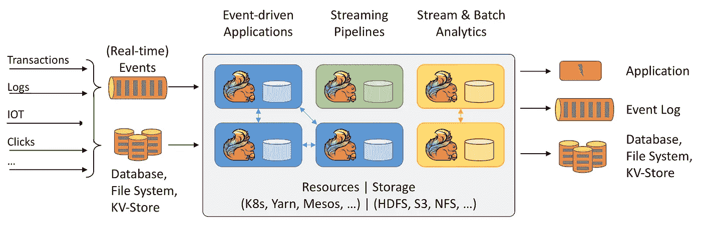

# 像奔流的河流一样快速处理数据

> 原文：<https://betterprogramming.pub/dealing-with-data-as-swift-as-a-coursing-river-a5a86a5b168a>

## 三种流分析技术以及为什么要考虑它们

若昂·布兰科在 [Unsplash](https://unsplash.com/s/photos/stream?utm_source=unsplash&utm_medium=referral&utm_content=creditCopyText) 上的照片

在我那个时代，数据库和应用程序通常只在深夜所有人都睡着的时候同步。

现在，在现代社会，每个人都希望他们的数据在第一时间更新(如果不是在数据出现之前神奇地更新的话)。

大公司和财富 500 强公司依靠这些数据来预测消费者的口味或估计市场的供求力量。

与此同时，普通人依赖数据——从打电话到预订航班。拥有尽可能最新的数据可以为公司节省或创造数亿美元。

由于其有效加速决策过程的潜力，流数据系统可以帮助分析师、机器学习研究人员和数据科学家开发基于实时数据的指标和模型。

# **什么是分布式流处理？**

简而言之，分布式流处理是一种专门为无限数据集设计的数据处理引擎。

本质上，它们就像它们听起来的那样:只要互联网存在，大数据流就会包含更多的数据。

流允许在启动和运行的同时，更长时间地连续实时处理无限的数据。事实是，这些类型的系统很难实现——甚至更难维护——因为它需要的不仅仅是好的软件。

它还需要与设计良好的网络相结合，以帮助系统在有效处理数据的同时具有容错能力。

正因为如此，有许多开源和托管服务可以帮助工程师将流式传输的一些好处抽象到更高级别的模块中。

在我们深入探讨之前，让我们先来谈谈你可能决定使用流媒体服务的几个原因。

# **分布式数据流的特征**

分布式数据流具有一些非常重要的特性，这些特性构成了它的优缺点。其中一些如下:

## **容错**

在节点或网络出现故障的情况下，该引擎可以快速恢复，并从它停止的地方开始处理。为此，这些类型的框架通常会不时地在流状态上使用检查点(这有时是可以配置的)。

## **性能**

说到性能，分布式流包括延迟和可伸缩性。理想情况下，这种类型的引擎需要具有最小的延迟以获得最大的吞吐量。

## **保证交货**

最重要的是，这个系统保证在给定时间内处理特定数量的数据。给出的选项有[至少一次、最多一次和正好一次。](https://stackoverflow.com/questions/44204973/difference-between-exactly-once-and-at-least-once-guarantees)

# **三个分布式数据流系统**

谈到流媒体系统，有很多选择。就个人而言，我们不喜欢跟风。此外，我们认为至少了解许多数据流系统是从哪里开始的是很重要的。

所以这里有五个选项你可以考虑。

# **阿帕奇风暴**

[https://storm.apache.org/](https://storm.apache.org/)

## **什么是风暴？**

Storm 是一个流行的分布式实时计算系统，它使用简单的处理模型来处理大数据，以执行强大的抽象。这个框架——由 Twitter 开发的开源项目——被吹捧为实时 Hadoop。

它可以用来处理新数据或更新数据库。Storm 的分布函数等待调用消息，这些消息在被接收时，在查询中被计算以构造结果。

## **暴风有什么独特之处？**

该软件由 [Nathan Marz](https://www.linkedin.com/in/nathanmarz/) 于 2011 年开发，旨在利用更高的吞吐量，同时在几秒钟内处理多个节点。

Storm 软件在微批处理上只有几毫秒的延迟，这显然使它成为一个可靠的数据处理器。可靠性是帮助 Storm 作为实时计算数据处理系统脱颖而出的一个因素。

Apache Storm 基于“快速失败，自动重启”的现象，这允许它在节点失败的情况下重启进程，而不干扰整个操作。这种方法使它具有容错能力。

此外，Storm 的标准配置使其立即适合生产。这种技术是用户友好的和健壮的，这使得它在中小型企业和大型组织中很受欢迎。

# **弗林克**

[https://flink.apache.org/](https://flink.apache.org/)

## **什么是 Flink？**

Apache Flink 是另一个流行的开源分布式数据流引擎，它对有界和无界数据流执行有状态计算。这个框架是用 Scala 和 Java 编写的，非常适合复杂的数据流计算。

通过连续流处理，Flink 处理窗体中或键控或非键控窗口中的数据。

## Flink 有什么独特之处？

该系统易于安装，只需在[命令行界面](https://ci.apache.org/projects/flink/flink-docs-stable/ops/cli.html)上发出一条命令即可开始工作。

Flink 在机器学习和数据分析领域最受欢迎，它与 Gelly 一起创建数据流编程模型。Flink 支持时间戳，这使得回滚或重放作业非常方便。

它使用保存点来帮助系统操作，以确保在节点崩溃时跨故障提供正确的结果。这个框架处理实时数据和流数据，因此它是记录和数据批处理的理想选择。

Flink 也被认为是 MapReduce 的一个很好的替代品——因为它被设计成可以运行任何规模的状态流。这个框架独立于 Hadoop，但它可以与 Hadoop 集成，以存储、写入或处理数据。

# **卡夫卡**

[https://dzone.com/articles/what-is-kafka](https://dzone.com/articles/what-is-kafka)

## **卡夫卡是什么？**

Apache Kafka 框架是一个分布式发布-订阅消息传递系统，它从不同的源系统接收数据流。

这个软件是用 Java 和 Scala 编写的。它用于实时大数据流，可用于进行实时分析。该系统不仅可扩展、快速、耐用，而且具有容错能力。

由于其更高的可靠性和吞吐量，Kafka 被广泛用于跟踪服务呼叫和物联网传感器数据。

## **卡夫卡简史**

那么谁用卡夫卡呢？嗯，它起源于 LinkedIn，提供了一种在 Hadoop 系统中加载并行数据的机制。后来，在 2011 年，它成为了 Apache 旗下的一个开源项目，现在 LinkedIn 正在使用它来跟踪运营指标和活动数据。Twitter 也使用它——与 Storm 配对——来建立一个流处理基础设施。

## **是什么让 Kafka 作为一个软件脱颖而出？**

Kafka 是我们个人最喜欢的分布式数据流系统，因为它操作简单。同样对于 Amazon 来说，Kafka 的托管服务版本使得在 AWS 堆栈中实现起来更加容易。

较新版本的 Kafka 不仅提供了灾难恢复来改善客户端的应用程序处理，还减少了对 Java 的依赖，以便进行数据流分析。总的来说，个人感觉这是最容易管理的服务。

# 但是流媒体值得吗？

根据使用情况，流数据工具可以提供很多好处。它们可以帮助提供实时管理和处理数据的能力。

这可以带来更好的通知和决策。

此外，流式传输和分析数据的能力可以让机器学习模型有能力提供更好的输出。

尽管与日常批处理作业相比，这些系统通常更难实现，但在许多情况下，投资回报是值得的。

我们希望这有助于你为不同的流媒体工具做好准备。

祝你发展顺利。