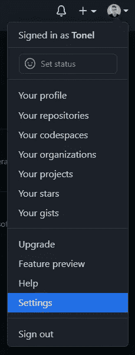
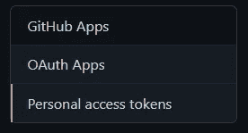
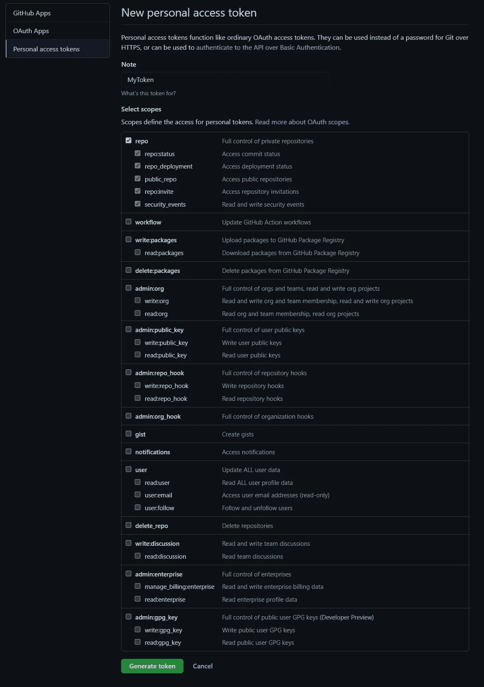
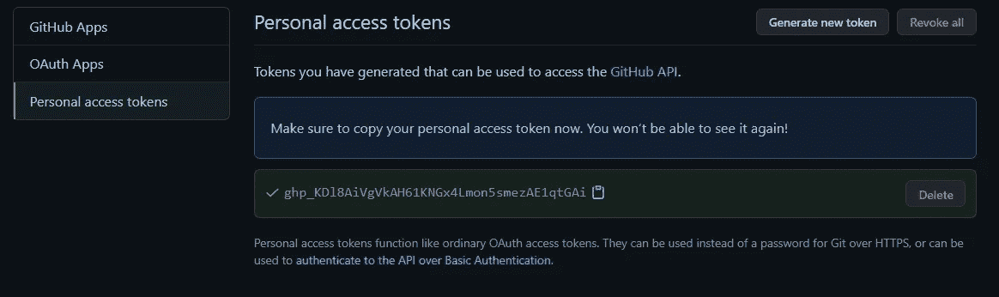
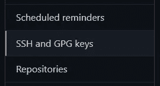
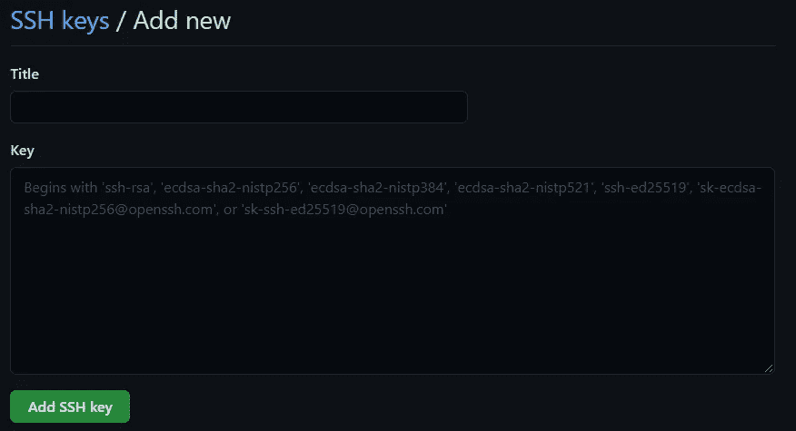

# 处理 GitHub 密码认证不被接受

> 原文：<https://betterprogramming.pub/dealing-with-github-password-authentication-deprecation-1b59ced90065>

## 不要等到最后一天才更新你的 GitHub 认证方法


在 [Unsplash](https://unsplash.com?utm_source=medium&utm_medium=referral) 上由 [Franck](https://unsplash.com/@franckinjapan?utm_source=medium&utm_medium=referral) 拍摄的照片。

正如 [GitHub 在 2020 年 12 月宣布](https://github.blog/2020-12-15-token-authentication-requirements-for-git-operations/)的那样，从 2021 年 8 月 13 日开始，将不再接受账号密码来认证 Git 操作。换句话说，密码身份验证已经过时，不再有效。

它将被以下两种方法之一替换:

1.  [个人接入令牌认证](https://docs.github.com/en/free-pro-team@latest/github/authenticating-to-github/creating-a-personal-access-token)
2.  [SSH 密钥认证](https://docs.github.com/en/free-pro-team@latest/github/authenticating-to-github/connecting-to-github-with-ssh)

让我们看看您需要做些什么来避免身份验证问题，并采用两个建议的解决方案之一。

# 1.个人访问令牌认证

首先，让我们深入研究 PATs(个人访问令牌)。然后，您将看到如何为 GitHub 存储库配置基于 PAT 的认证。正确的 PAT 具有以下四个特征:

1.  独特性:它与 GitHub 不同，可以根据设备或用途生成。
2.  可撤销:可以在任何时候单独撤销，而无需更新任何凭据。
3.  有限:根据定义，它的范围很窄，只提供对有限操作集的访问。
4.  Random: 与密码不同，它不受字典或蛮力攻击。

请注意，您应该将 pat 视为密码。保持它们的秘密，将它们作为环境变量使用，而不是将它们硬编码到您的应用程序中。

现在，让我们看看如何将您的 GitHub 远程身份验证从密码更改为个人访问令牌。

1.  [验证您的电子邮件地址](https://docs.github.com/en/github/getting-started-with-github/verifying-your-email-address)。
2.  在任一 GitHub 页面的右上角，点击你的个人资料照片，然后点击“设置”



3.在“设置”页面的左侧栏中，点击“开发者设置”


4.在“开发者设置”页面的左侧栏中，点击“个人访问令牌”



5.点击“生成新令牌”


6.为您的令牌命名，并选择您想要授予它的范围和权限。请注意，如果您想使用您的令牌从命令行访问存储库，您必须选择“repo”*选项*。**

**

*7.点击“生成令牌”按钮，然后按照 GitHub 的要求输入您的密码。*

*8.将令牌复制到剪贴板，并将其存储在安全的地方。请记住，出于安全原因，离开此页面后，您将无法再次看到令牌。*

**

*定义一个有效的 PAT 后，在 HTTPS 上执行 Git 操作时，可以用它代替密码。*

*例如，在命令行上，您可以输入以下内容:*

```
*$ git clone https://github.com/<USERNAME>/<REPO>.git
Username: *your_username*
Password: *your_token**
```

*另外，您可以在本地更新遥控器。首先，通过启动`git remote remove origin`移除你的旧遥控器(假设你的遥控器叫做`origin`)。然后，以下列格式再次添加它:*

```
*git remote add origin https://<TOKEN>@github.com/<USERNAME>/<REPO>.git*
```

*瞧啊！在执行 Git 操作时，您将不再需要使用您的 GitHub 帐户密码。这样，当它停止工作时，你将避免问题。*

# *2.SSH 密钥认证*

*让我们看一下如何将 GitHub 远程认证从密码更改为 SSH 密钥的分步指南。*

1.  *[如果您还没有 SSH 密钥的话，生成一个 SSH 密钥](https://docs.github.com/en/github/authenticating-to-github/connecting-to-github-with-ssh/generating-a-new-ssh-key-and-adding-it-to-the-ssh-agent)。*
2.  *将您的 SSH 公钥复制到您的剪贴板。您应该能够在隐藏的`.ssh`文件夹中找到它(如果您是 Windows 用户，请使用`C:\Users\<USERNAME>\.ssh`)。移动到那里，打开`.pub`文件，复制它的内容，同时注意不要添加新行或空白。*
3.  *在任一 GitHub 页面的右上角，点击你的个人资料照片，然后点击“设置”*

**

*4.在“设置”页面的左侧栏，点击“SSH 和 GPG 键”*

**

*5.点击【新建 SSH 密钥】按钮。*

**

*6.给你的 SSH 密钥起一个描述性的标题，并将你在第 2 步中复制的内容粘贴到“密钥”文本区域。*

**

*7.点击“添加 SSH 密钥”按钮，然后按照 GitHub 的要求输入您的密码。*

*要测试一切是否按预期进行，请启动以下命令:*

```
*$ ssh -T git@github.com*
```

*您应该会收到以下消息:*

```
*Hi <USERNAME>! You've successfully authenticated, but GitHub does not provide shell access.*
```

*现在，你所要做的就是在本地更新你的遥控器。首先，通过启动`git remote remove origin`移除你的旧遥控器(假设你的遥控器叫做`origin`)。然后，以下列格式再次添加它:*

```
*git remote add origin git@github.com:<USERNAME>/<REPO>.git*
```

*瞧啊！当尝试执行与您的 GitHub 帐户相关的 Git 操作时，现在将请求您的 SSH 私有密钥密码短语，而不是您的帐户密码。*

# *结论*

*GitHub 基于密码的认证已被弃用，很快将不再有效。从 8 月 13 日开始，如果你想在你的 GitHub 库上执行 Git 操作，你将使用两种方法中的一种来代替它。设置个人访问令牌认证或 SSH 密钥认证并不是一项复杂的任务，本文旨在解释如何做到这一点。*

*感谢阅读！我希望这篇文章对你有所帮助。如果有任何问题、意见或建议，请随时联系我。*