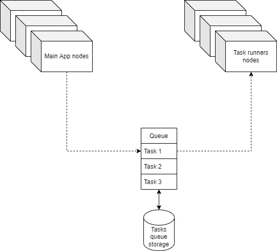
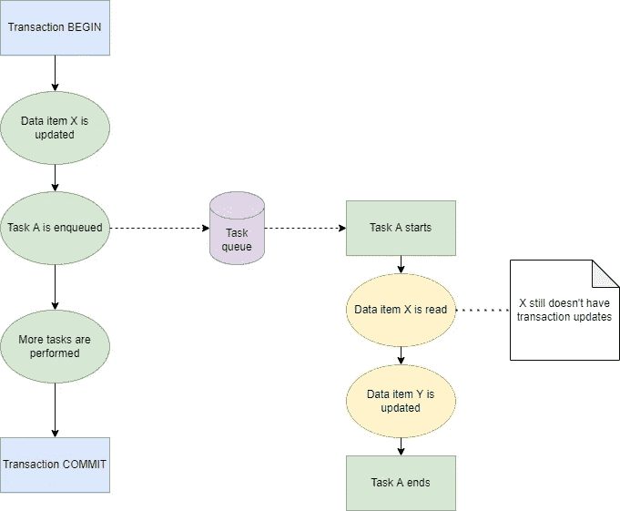
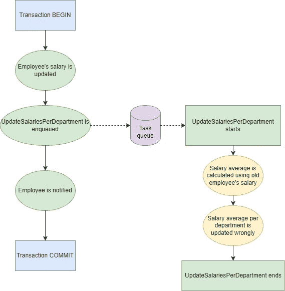
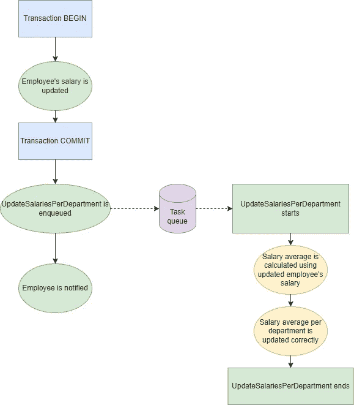

# 在企业应用程序中使用事务和异步任务时处理不一致的读取

> 原文：<https://betterprogramming.pub/dealing-with-inconsistent-reads-when-using-transactions-and-async-tasks-in-enterprise-applications-2ea053d3f5b9>

## 一个常见问题和避免它的快速方法

由 [Unsplash](https://unsplash.com?utm_source=medium&utm_medium=referral) 上的 [Shubham Dhage](https://unsplash.com/@theshubhamdhage?utm_source=medium&utm_medium=referral) 拍摄的照片

通常，企业应用程序利用事务性数据库特性来确保一组数据库操作被完全转储到数据库本身——从前一个到最后一个——防止那些操作被部分应用。

尽管如此，对事务中正在修改的数据的每个读操作都将反映该事务的更改，只要它是在成功应用事务之后执行的。

许多企业应用程序必须处理大量的流量，从而导致复杂的读/写场景，并发性问题经常发生。

如果在数据项被事务修改的同时对其执行读操作，则可能会检索到数据项的旧版本，该旧版本没有应用事务的更改。在事务完全完成之前执行的每个读取操作都可能会以这种方式运行。

将异步任务处理与事务结合使用时，会出现这些并发读/写场景的一个特例。通常，当执行特定的业务操作时，需要执行一个或多个异步任务。

大多数情况下，这些任务与特定的应用程序实现细节相关，因此它们可以在未来的任何时刻执行。为了实现这一点，任务通常使用排队机制进行排队，一个或多个*任务运行器*可以从中异步获取并执行它们。该环境的常见设置如下所示:

一个包含三个主要进程的基础设施设置的例子:主应用程序、任务运行程序和排队机制

# 问题是

当任务在事务成功完成之前被触发，并且那些任务对那些事务可能正在使用的相同数据块执行读/写操作时，问题就出现了。

这种情况导致使用旧版本的数据执行任务，从而在应用程序中产生不一致性。下图试图更好地描述这种情况:

显示任务“A”中执行的读取操作可能不一致的执行流程

请注意，为了实现这一场景，在事务期间排队的任务应该立即被任务运行器进程接受。如果任务运行者开始一个任务需要更长的时间，那么到任务开始时，事务可能已经完成了，问题就不存在了。在任务排队时拥有一个空队列是一种理想的情况，在这种情况下很可能会发生这个问题，因为任务会立即被一个空闲的任务运行程序占用。

# 一个有希望描述的例子

为了更好地描述问题本身，将提供一个简单的快速示例。使用它作为一个快速的帮助来阐明问题在实际情况下可能是什么样子，而不是它实际上是什么样子的一个明确定义的指导。在实践中，这个问题可能会导致更加复杂和难以诊断的情况。

通常，大型计算结果存储在它们自己的数据库表中，以避免在每次应用程序功能请求这些结果时，一次又一次地重复相同的计算。

假设一个员工的工资很少修改，一个公司有几千个员工，经常要求每个部门员工的平均工资；可以实现一个异步任务，在每次更新雇员的工资时更新`average_per_department`表。该实现的快速 PHP 框架如下所示:

为此，执行流程如下所示:

显示“UpdateSalariesPerDepartment”任务如何不一致地读取雇员的工资的执行流

一旦`UpdateSalariesPerDepartment`任务被排队，假设一个空闲的任务运行器可用，它将被立即执行，因此执行 *run* 实现。

因此，该任务将读取不一致的旧数据，并使用旧员工的工资版本进行平均计算。因此，该任务实际上不会对存储的平均值做出任何改变。

# 解决方案

虽然这个问题在实际生产环境中很难诊断和检测，但解决方案似乎很简单:需要对被事务修改的数据项进行操作的异步任务，应该在所有事务更改都被转储到数据库中后触发。

因为这些是异步任务，所以它们的执行被延迟到事务完成之后也没有关系。

此外，这样做的主要好处是确保任务总是用受影响数据项的最新版本来执行。

查看前面的示例，应用的解决方法如下所示:

请注意，如果事务性操作被回滚，异步任务永远不会被触发。另一方面，一旦成功完成了员工的工资修改并提交了事务，平均工资更新任务就会排队，并发送员工通知。执行流程已更改，现在看起来如下所示:

显示“UpdateSalariesPerDepartment”任务如何始终一致地读写数据库的执行流

现在`UpdateSalariesPerDepartment` 任务总是在雇员的工资更新后执行，不管任何时候有多少空闲的任务运行者。

每个部门的平均值总是与员工的工资完全一致。