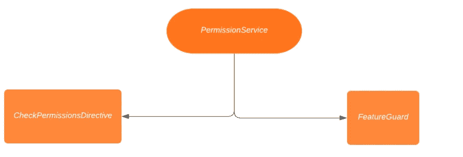
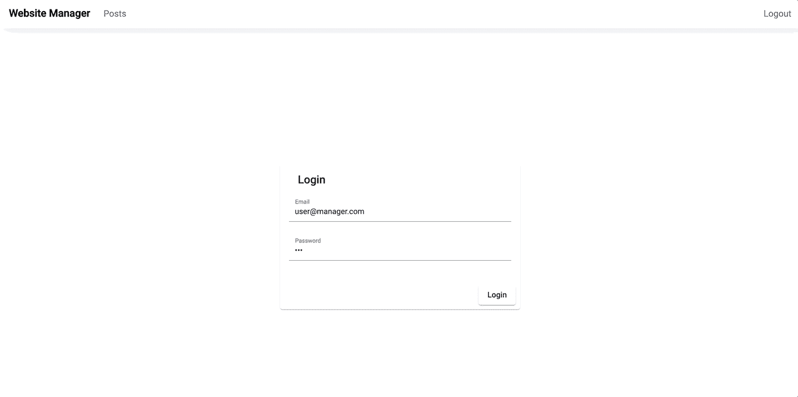
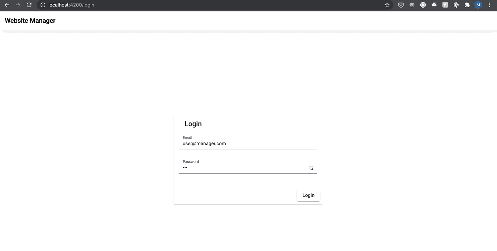
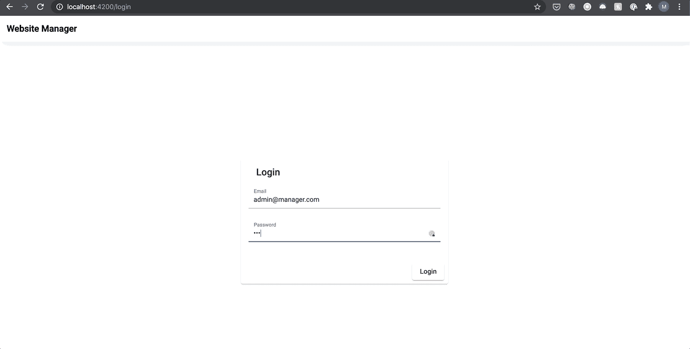

# 在 Angular 和 NgRx 中处理权限

> 原文：<https://betterprogramming.pub/dealing-with-permissions-in-angular-and-ngrx-de0c9e77bd0f>

## 使用 Angular 和 NgRx 对路线和组件进行许可和角色处理的基本指南


由[波格丹一世·卡伦科](https://unsplash.com/@bogdan_karlenko?utm_source=unsplash&utm_medium=referral&utm_content=creditCopyText)在 [Unsplash](https://unsplash.com/s/photos/routes?utm_source=unsplash&utm_medium=referral&utm_content=creditCopyText) 上拍摄的照片

当您的系统不断增长时，几乎可以肯定它最终会达到需要某种权限或角色管理的状态。这可以用许多不同的方式建模，具有不同目的的不同默认用户角色，或者甚至更精细的方法，其中每个特性具有不同的访问级别，并且每个用户在您的系统中具有单独的权限。

虽然每种情况都是独一无二的，但同样的概念也适用于 Angular 中的每一种情况，因为它们的相同目的是限制系统的特定部分。

# 警卫、服务和指令

为了控制用户能看到什么或不能看到什么，我们需要限制整个页面，或者为这个特定的用户删除页面的某些部分。为了限制用户对页面的访问，我们可以使用 [CanActivate guards](https://angular.io/api/router/CanActivate) ，这基本上是一个具有 CanActivate 方法的类，它将决定用户是否应该看到特定的页面。这是在显示页面之前计算的，也可以用于重定向。

*简单启动保护装置的例子*

使用 CanActivate guards 只能为我们解决一部分问题。移除页面的特定按钮/动作或者在同一页面上显示完全不同的布局怎么样？这可以通过角度方向来解决。角度指令是一个特定的装饰器，可以附加到 DOM 中的任何元素上，以应用自定义行为，比如自定义 CSS、逻辑，甚至是 DOM 元素可见性的控制。

下面是一个使用`appRequiredField`指令的代码示例(一个虚构的指令，将输入标记为必需，并在需要时显示错误)。

```
<div class="form-group">
  <label>User email</label>
  <input type="text" placeholder="Email" appRequiredField/>
</div>
```

当使用这两个概念来处理应用程序中的权限时，在指令和保护中会有重复的代码。处理这个问题的一个好方法是将所有东西抽象成一个服务。

服务是在 Angular 应用程序的不同类之间共享相关信息的一种不可思议的方式。您可以使用[依赖注入](https://angular.io/guide/dependency-injection)将您的服务注入到您的防护和指令中，这样就有了一个集中的地方来访问您的用户数据，并计算用户是否应该看到他们试图访问的系统的特定部分。

最终，我们会有一个这样的结构:



溶液结构

# 溶液结构

让我们用一个网站的例子来实现我们的解决方案，并演示它在实践中应该如何工作。我们的例子是一个有简单帖子列表的网站管理器。普通用户应该只能看到帖子，只有管理员用户可以编辑或删除帖子。该网站由一个简单的登录页面、一个帖子页面和一个编辑页面组成:



我们不仅需要处理编辑和删除按钮的可视化，还需要阻止对整个编辑页面的访问，以防用户使用 URL 直接访问页面。

对于这个解决方案，想法是有一个`CheckPermissionsDirective`来处理特定页面上的按钮是否可见(在我们的例子中，是编辑/删除按钮)，还有一个`FeatureGuard`来处理整个页面是否可访问(在我们的例子中，是编辑页面)。这两个地方消耗一个`PermissionService`来验证用户。

# 编写权限服务

该服务的目标应该是验证用户访问，因此该服务需要一个公共验证方法，该方法将接收所有必要的信息来正确验证该用户。

在我们的示例应用程序中，我们为每个用户设计了一个权限系统，其中有一个列表`FeaturePermissions`，它是一个将特性与权限相关联的对象，比如`none`、`view`或`admin`。并且只有当您拥有特定功能的必要权限时，才能访问系统的每个部分。

按照这个结构，在我们的`checkPermission`函数中，我们将需要用户、特性和权限。使用这些参数，该函数将检查该用户是否具有该特性所需的访问权限。

该函数接收用户、特征和许可。它获取用户拥有的特性的具体信息`FeaturePermission`,然后检查用户是否应该能够访问它。在我们的应用程序中，该功能的管理员也应该看到只有该功能的`view`权限的用户看到的一切。这就是为什么在`view`权限案例中，只有当用户对该特性拥有`none`的权限时，它才返回`false`。

只有一个`checkPermission`函数的简单服务很容易被一个简单的函数所取代，但是拥有一个完整的`PermissionService`可以为可伸缩性和边缘情况提供更多的灵活性。

# 写入功能保护

因为所有的验证逻辑都已经在我们的`PermissionService`中考虑到了，对于我们的保护和指示，我们只需要适当地为我们的服务提供正确的数据。对于`FeatureGuard`，我们将在路由器中传递特性和许可数据。

```
{
  path: 'posts/:id',
  canActivate: [FeatureGuard],
  data: { feature: Features.Posts, permission: Permission.Admin },
  component: PostEditComponent,
},
```

对于用户信息，假设登录后您将您的用户存储在商店中，您可以轻松地访问`FeatureGuard`中的商店，并将其传递给`PermissionService`。

# 写检查权限指导

因为我们正在处理 HTML 节点可见性，我们的指令将被称为[结构指令](https://angular.io/guide/structural-directives)。特性和权限将被注入到我们将使用指令的地方，用户将来自商店。

# 结果

在实现了这个权限处理结构之后，预期的行为是对于只具有帖子功能的查看权限的用户，编辑页面应该是不可访问的，并且编辑和删除按钮应该是不可见的。

## 拥有帖子查看权限的用户



## 对帖子具有管理员权限的用户



# 额外信息

所有这些代码都可以在 [GitHub](https://github.com/msmadeira/art00-ngrx-permissions) 中找到。主节点的状态有一个完全实现的功能演示。一个预许可处理分支有一个还没有实现许可处理系统的演示，适合那些想自己实现的人。