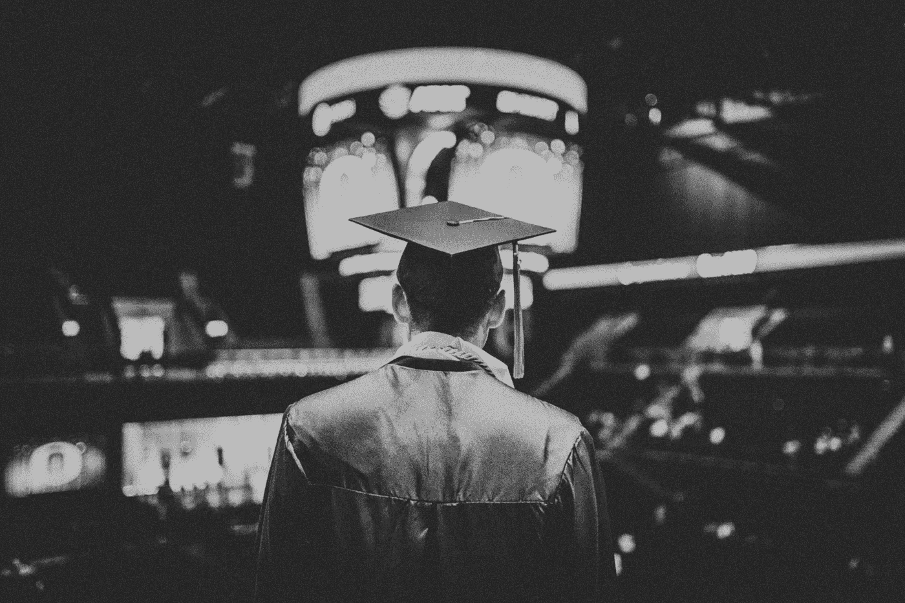

# 亲爱的初级开发人员

> 原文：<https://betterprogramming.pub/dear-junior-developer-99baedf36cd4>

## 再呆一会儿，等待事情的发展——那将会是如此美妙

科尔·凯斯特在 [Unsplash](https://unsplash.com/@annadayadev/likes?utm_source=unsplash&utm_medium=referral&utm_content=creditCopyText) 上的照片

> "我们都在努力尽可能优雅地摆脱困境。"

让我告诉你一些我希望在大约五年前，当我开始成为一名自学成才的开发人员时就能告诉自己的事情。

让我们不要用我们不知道更好时所做的最初几个选择来定义我们的生活。*我们今天所做的将决定我们的未来。*

不要害怕重新开始——回到起点。

问题是让你的过去来定义你。在你应该更清楚的时候不改变事情——现在*这是一个问题。*

# 开始吧

在迈出第一步之前，你哪儿也去不了。你不动就不能前进。如果你不开始走路，你将永远学不会跑步。

除非你愿意摔倒，撞车，甚至受伤，否则你永远也学不会骑自行车。

*那么，就开始吧。*

有趣的是，无论我们选择什么样的冒险，甚至是减肥或健康饮食这样的日常活动，我们总能想出一百个事情不会成功的原因，如果我们甚至梦想成为一名开发者——一名自学成才的开发者，又会怎样呢？

如果我们试着想一想原因，也许——也许它能起作用？

*为什么从那个角度看问题如此困难？*

仅仅因为这违背了我们的本性。这违背了我们的制度、教育和文化。*不要随大流*，他们连自己是谁，想要什么都不知道！

如果我们不去尝试，我们将永远不会知道，如果我们不去尝试，我们将永远看不到那里有什么。任何值得拥有的东西都会来自我们舒适区之外——就像我常说的，我们必须为梦想做我们必须做的事情！

从小处着手。参加一个速成班——互联网上有很多免费的东西。我有很多文章、免费工具、免费教程，只需点击几下鼠标——现在听听你自己，你的借口是什么？

# 你有能力

如果你不鞭策自己，你将永远看不到自己真正的能力。如果你不挑战自己的极限和宽容，你永远不知道自己能走多远。如果你不离开你的舒适区，你永远不会知道外面有什么。

安逸中没有什么令人兴奋的。如果你梦想成为更多的人——如果你想过比现在更好的生活，如果你想创造比自己更大的东西——准备好坐过山车吧！

你需要让不舒服变得舒服，因为这是在大事上取得成功的必要条件。

它会要求很多，会要求你所拥有的一切，所以你必须愿意接受这个事实，那永远不会容易。这需要时间。你肯定会哭，但重要的是你如何应对。不要半途而废！

当事情变得困难时，是时候停止逃避了，是时候勇敢的接受这个事实，除了你自己，没有人能帮助你，没有人会来救你。运气不会降临——你必须成为发现它的人。

但好的一面是你有能力。你只需要先处理好自己，因为有时候我们是自己的敌人，是自己的局限——*真正的战斗在你自己内心。*

*在你能改变世界之前，你必须先改变你自己。*

# 你可以明天再试一次

有时候事情并不像我们计划的那样发展。没关系，我们可以明天再试。

在我们看到任何结果之前，我们可以把事情搞砸一百次。这就是追逐梦想和努力变得更好的原因——失败总是不可避免的。这是人生的一部分，也是旅程的一部分，所以长大吧，像个男人一样，比你所有的借口都强大，做得更好。

休息一天，放松一下——如果这需要几天的独处和平静，那就休息一下，好好休息，回到你的原因，重新调整你自己，如果必要的话重组你的计划，但是你不要放弃！

车轮将继续转动。简而言之，这就是生活。你只需要坚持下去，多呆一会儿，然后等待事情的发展——那将会是如此的美好。

我收到了一些来自其他有抱负的开发人员的消息，说我很幸运——我可能真的很幸运，但是他们忘了问一个关于时间的问题。我什么时候走运了？

在经历了所有的失败后，我很幸运。

我确实成为了我梦寐以求的开发人员——但只是在连续工作和学习了四年之后。我仍然熬夜，我仍然把大部分周末花在学习和阅读上，因为现在我更清楚了。

我已经记不清有多少次被拒绝，有多少次我在最后期限和项目上搞砸了。有时候你必须吞下一些东西，这样你明天才能做得更好。

我已经接受了这个事实，我曾经是这个房间里最愚蠢的人，和另外八个计算机科学毕业生一起工作，但是我总是出现，比他们更早更晚。在大学时代，我是足球场上最早来也是最后一个离开的人。这些是引导我走向成功的真正技能。

回想起来，这是我经历过的最好的事情之一——我变得比他们更坚强，更强壮。

# 他们不比你聪明

成为一名开发人员——一名自学成才的开发人员——是最艰难的旅程之一。这不仅仅是技术技能的问题——它的意义远不止于此。成功需要某种性格——足智多谋、坚韧不拔、努力工作和乐观。

很快你就会将自己暴露在真实的世界中——真实的交易，与大人物(从计算机工程师、系统架构师到计算机科学毕业生)一起工作的真实的企业压力——有毒项目，然后就是你，如果你发现甚至有一个人与你同路，你将是幸运的。

但是如果你没有，那么不要太害怕——他们并不比你聪明。他们可能只是从高中的早期就开始领先了——这没关系。重要的是“现在”。重要的是你接受了挑战，你得到了工作，你在为自己工作。

没有什么比移山的人更好了——当你知道你想要什么，你要去哪里，宇宙最终会让路。

目标越大，疯狂的牺牲就越大。晚睡早起只是成功人士宣扬的事情之一。杰夫·贝索斯想在亚马逊之前做在线零售，所以他创建了亚马逊。

你今天看到的一切都是由不比你聪明的人建造的。不管你想建立什么，一个应用程序或网站，学习工具，然后建立它们。

你不能梦想成为你想要的最好的人，然后选择回到床上，而不是起床让它发生——事情不是那样的。当你想要什么的时候，努力去争取，努力去实现。

*最后但同样重要的是——我真为你骄傲！*

非常感谢您的阅读！