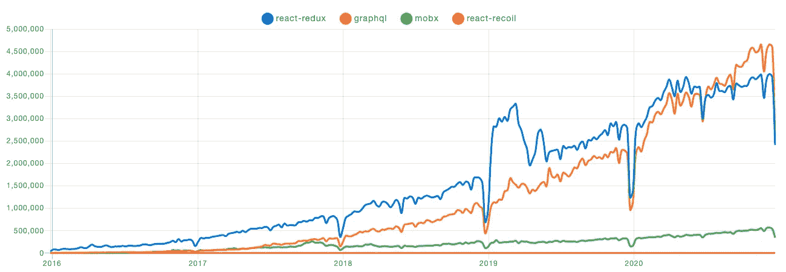

# 用 React 钩子去抖你复杂的选择器

> 原文：<https://betterprogramming.pub/debounce-your-complex-selectors-with-react-hooks-97c315f0db90>

## 反跳依赖饥饿反应冗余选择器


照片由[蒂姆·马歇尔](https://unsplash.com/@timmarshall?utm_source=medium&utm_medium=referral)在 [Unsplash](https://unsplash.com?utm_source=medium&utm_medium=referral) 拍摄

Redux 在 2015 年变得超级流行，直到今天，它仍在许多大型代码库中使用。它是由丹·阿布拉莫夫创立的，它解决了当时的一个特殊挑战:国家管理。到目前为止，在最好的状态管理工具上还没有明显的赢家，但是幸运的是，我们有相当多的选择。这完全取决于您的场景和个人偏好。

从 npm 趋势来看，Redux 仍然被广泛使用。



由于 Redux 非常成熟，我们有大量的配套工具和 Redux 实用程序。最近，`react-redux`被移植到了 Hooks，这太棒了，它帮助我们摆脱了旧的容器/组件方法。

Redux 有它的缺点——这是毫无疑问的。我们将关注当选择器依赖于许多缩减器时，它的效率会有多低。随着应用程序的增长，缩减器/选择器及其复杂性也在增长。您可能会发现自己处于一个选择器依赖于多个缩减器的场景中。如果那个选择器的消费者只是一个轻的组件，你就没事，但是如果你的组件很贵，你就麻烦了。您有阻塞 UI 线程的风险。

# 依赖关系过多的选择器

想象你有这个 Redux 商店:

```
- classes: [...],
- exercises: [...],
- teachers: [...],
...
```

你有这些选择器:

```
// this will be aschematic exampleimport { createSelector } from 'reselect';export const teachersSelectors = (state: GlobalState) =>  state.teachers;export const classesSelector = (state: GlobalState) =>  state.classes;...export const listClassesWithTeachersAndExercises = createSelector(
 classesSelector,
 exercisesSelectors,
 teachersSelectors) => // some logic to put together all the data
```

选择器`listClassesWithTeachersAndExercises`
依赖于一些不同的存储属性。这意味着一旦这些改变，它将被重新计算。

现在让我们有一个 REST 端点，它返回用户类及其数据依赖项。

```
[GET] [https://www.example.com/s](https://www.example.com/getStudentAppointments)tudent/classes// Sample returned data:{ classes: [...],
  included: {
    teachers: [...],
    exercises: [...],
  }
}
```

**注意:**当将所有这些信息转储到 reducer 中时，我们的`listAppoinmentsWithTeachersAndExercises`选择器将在每次 reducer-dependency 更新时被重新计算。在这种情况下，它将被重新计算:

*   一次当类被添加到`store.classes`
*   有一次教师被加到了`store.teachers`
*   一次当练习被添加到`store.exercises`

那是 Redux 的标准行为，对此我们无能为力/想做点什么。通常这没什么，我们可以忍受。但是如果我们必须渲染一个超级昂贵的组件呢？

那个昂贵的组件可能会阻塞 UI 线程，这是我们想要避免的。让用户界面冻结几毫秒对用户的 UX 感知有负面影响。您的 web 应用程序必须随时响应。

即使它没有阻塞 UI 线程，考虑性能也是一个好习惯。可能会有使用过时硬件的用户在查看你的应用。

在不久的将来，当并发模式正式发布时，我们将有更多的工具来解决这个问题。现在，我们只是停留在默认的 React 渲染阻塞行为。

对此我们能做些什么？

# **去抖拯救世界**

去抖是现在流行的技术。它主要用于搜索自动完成功能。为了避免在每次击键时发出请求，所做的是对端点`http`的调用去抖。一旦用户停止输入，端点就被调用。

在我们的场景中，可以把每次 Redux store 更新看作是用户的一次击键。我们将继续去抖我们的选择器，直到所有的存储更新都被执行。我们如何做到这一点？我们将创建一个使用`useSelector`钩子的定制钩子。

**注意:**钩子是用 TypeScript 写的。如果对打字稿不感兴趣，可以去掉。不过，我强烈建议使用它们，因为在键入选择器时，更容易知道它们各自应该返回什么。这在大型代码库中特别有用。

让我们来看看这里发生的一些关键事情。

```
// this is were our debounced data will be stored
const [data, setState] = useState<unknown>();
```

每次这个定制钩子被调用时，无论是由`useSelector`还是因为钩子调用者被刷新，我们将:

1.清除先前的超时(如果有)。

```
if (refTimeout.current) {
  clearTimeout(refTimeout.current);
}
```

2.设置一个新的超时时间来更新`data`信息，以防在`time`毫秒内钩子不再刷新。

```
refTimeout.current = setTimeout(() => {
  if (result.current !== selectorData) {
    setState(selectorData);
  }
}, time);
```

如果钩子被卸载了，我们会自己清理以确保我们没有更新一个卸载钩子的`state`。

```
useEffect(() => () => refTimeout.current &&  clearTimeout(refTimeout.current), []);
```

这个钩子的另一个特性是你可以有条件的去抖。如果`time`参数设置为`0`，则不会发生去抖，选择器的结果将立即返回。

```
if (time === 0) {
  return selectorData;
}
```

我们如何使用它？非常简单:

```
const list = useDebounceSelector(listAppoinmentsWithTeachersAndExercises);
```

如果您想有条件地设置超时:

```
const debouncedList = useDebounceSelector(listAppoinmentsWithTeachersAndExercises, 250);// if init variable is true it will not debounce otherwise it will do a 250ms debounceconst conditionallyDebounceList = useDebounceSelector(listAppoinmentsWithTeachersAndExercises, init ? 0 : 250);
```

# **包装**


照片由[米卡·鲍梅斯特](https://unsplash.com/@mbaumi?utm_source=medium&utm_medium=referral)在 [Unsplash](https://unsplash.com?utm_source=medium&utm_medium=referral) 上拍摄

很简单，不是吗？在几行代码中，我们创建了一个可以在任何组件中使用的实用程序挂钩。这将使我们避免在昂贵的组件上做不必要的渲染。当然，这个钩子只在特定的场景下使用，所以要明智地使用它。

如果您想继续钻研 TypeScript，可以阅读我下面的另一篇文章。

[](https://medium.com/better-programming/mastering-typescripts-mapped-types-5fa5700385eb) [## 掌握 TypeScript 的映射类型

### 学习如何像专家一样处理映射类型

medium.com](https://medium.com/better-programming/mastering-typescripts-mapped-types-5fa5700385eb) 

干杯！