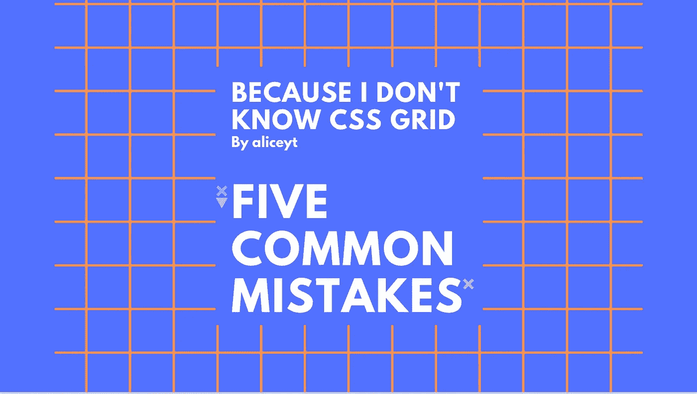
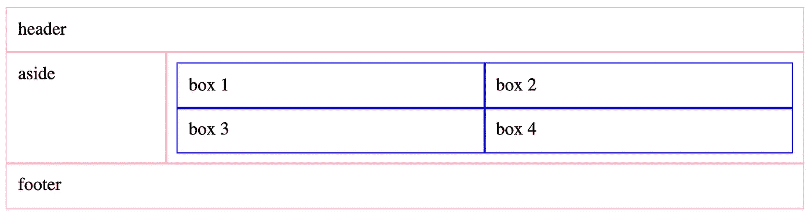
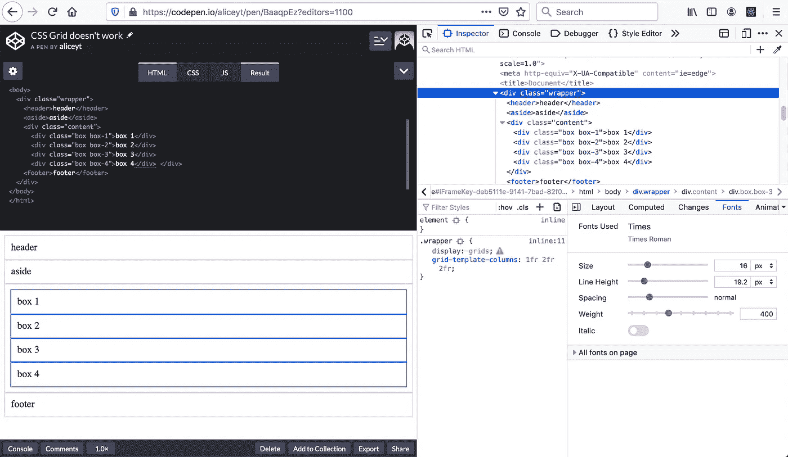
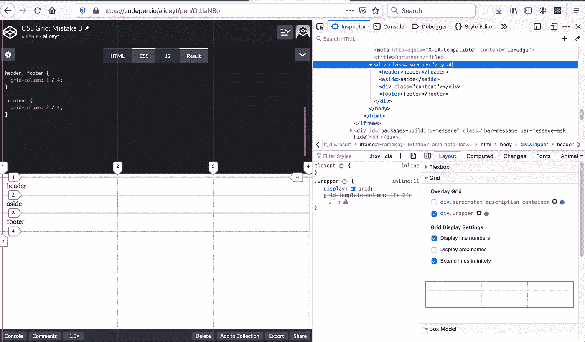
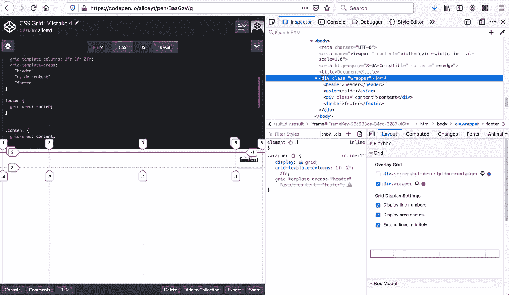
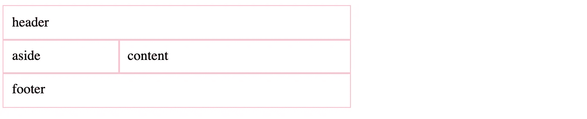
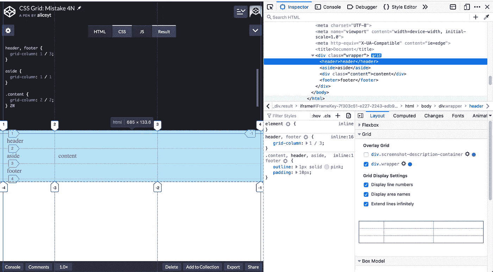
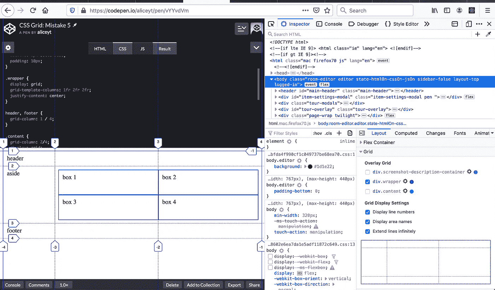
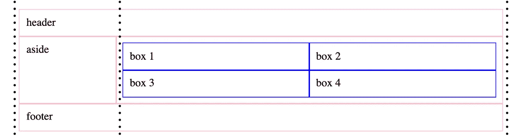

# 用 Firefox DevTools 调试 CSS 网格

> 原文：<https://betterprogramming.pub/debug-css-grid-with-firefox-devtools-949f328aab88>

## 创建网格时的 5 个常见错误

在我学习 CSS 网格之后，我犯了很多错误。无论你犯了什么错误，或者将要犯什么错误，我都可能犯过。犯错误没关系，我们只需要从中吸取教训并改正错误。

在这篇文章中，我将讲述创建网格布局时的五个常见错误。我将使用 Firefox 的内置 DevTools 来调试它们，并分享一些可以减少再次犯同样错误的提示。对齐错误不包括在内，我将在下一篇文章中讨论它们。

如果您是 CSS Grid 的资深用户，欢迎您将我的文章视为娱乐。我早期的错误可能非常愚蠢。如果你是一个新用户，把这个作为不要做什么的一个教训！

# 设置

要打开 DevTools，在 Windows 和 Linux 上选择*工具*>*Web Developer*>*切换工具*或使用键盘快捷键`Ctrl` + `Shift` + `I`或 `F12` ，在 macOS 上使用`Cmd` + `Opt` + `I`。

# 预期的网格设计

我想要的。

# 常见错误 1:混淆复数和单数术语

在声明网格属性时，很容易混淆复数和单数术语:

*   `display: grid`变成了`display: grids`
*   `grid-template-areas`变成了`grid-template-area`
*   `grid-column: 1 / 2`变为`grid-columns: 1 / 2`

## **声明** `**display: grids**` **导致无网格布局**

实施例 1a

通过查看页面布局，我们可以看出**示例 1a** 中有问题。它显示的是单列布局。

**使用开发工具进行诊断:**

*   在 *HTML* 窗格中，查找网格容器(又名父元素)。
*   网格容器在标记视图中将有一个网格图标。由于在**示例 1a** 中的`
`行的标记视图中没有网格图标，因此网格没有应用到元素上。

创建网格时，会显示一个网格图标

*   在*样式*窗格下，显示了`.wrapper` 上带警告图标的划掉的`display`属性。这警告我们有不支持的 CSS 属性或规则，在我们的 CSS 中有无效的值。
*   仔细观察就会发现，错误源于声明了一个无效的值`grids`。

# 声明 Grid-Template-Column: 1fr 2fr 2fr 会导致 Grid-Template-Columns:1fr 1fr 1fr 布局

实施例 1b

你可以通过打开 DevTools 中的 Overlay Grid 来判断**例 1b** 的列轨迹大小是否错误。

**使用开发工具进行诊断:**

*   要打开覆盖网格，在 *HTML* 窗格中，查找带有`
.`的 HTML 行
*   点击网格图标，在*布局*窗格下，选择网格容器`div.wrapper`。
*   网格线显示列轨道的大小是错误的。
*   在*样式*标签下，`.wrapper`上被划掉的`grid-template-column`属性旁边会显示一个警告图标。这警告我们有不支持的 CSS 属性或规则，在我们的 CSS 中有无效的值。
*   在谷歌上搜索`grid-template-column`这个词。它将显示显示`grid-template-columns`的结果，带有一个‘s’。

*提示 1:一般来说，针对单个网格项的属性使用单数形式，而 grid-container 使用复数形式。*

# 错误 2:在非网格项目上应用网格属性

示例 2

在**示例 2** 中，您可以看到 div.box 元素在网格中的位置不正确。框 1 和框 2 不在同一行，框 3 和框 4 也不在同一行。

**使用开发工具进行诊断:**

*   在 *HTML* 窗格中，选择带有`
`的 HTML 行
*   在不遵循网格的每个元素的*样式*选项卡下，检查声明的样式。
*   轻按样式规则旁边的“ⓘ”,以阅读问题所在以及如何解决问题。

*提示二。在编码之前，根据父元素和子元素来可视化布局。网格仅适用于父元素和子元素。*

# 错误 3:网格模板区域属性中缺少值

示例 3

元素不在正确的网格单元中。它们都位于最后一个单元网格单元中。

**使用开发工具进行诊断:**

*   在 *HTML* 窗格中，选择带有`
`的 HTML 行
*   在*样式*选项卡下，请注意`grid-template-areas` 属性已被删除。这意味着它没有被应用。
*   在谷歌上搜索`grid-template-areas`这个词
*   这个错误是由于`grid-template-areas`属性的值输入错误造成的。每行应该有三个命名区域。如果一列中什么都没有，那么应该添加一个形式为`.`的空单元标记。

*提示 3:所有字符串必须有相同的列数，否则声明无效。— W3C*

# 错误 4:按“列号”对列行进行编号

实例 4

您可以看到网格项不在正确的单元格中，并且它们的长度也不正确。

**使用开发工具进行诊断:**

*   要打开覆盖网格，在 *HTML* 窗格中，查找带有`
.`的 HTML 行
*   点击网格图标，在*布局*窗格下，选择网格容器`div.wrapper`。
*   网格线显示数字指示器。
*   `header`和`footer`的网格列值应该是`1 / 4` 而不是`1 / 3`。一旁应该是`grid-column: 1 / 2`，`content`应该是`grid-column: 2 / 3`。

*提示 4:我们使用分栏线来表示项目的位置。列和行线不同于行数和列数。*

# 错误 5:错误计算了所需的列数

实例 5

注意到在前面的例子中重复出现的错误了吗？我自己也差点错过了。

您可以在**示例 5** 中看到网格看起来很好。所有网格项目都被放置在正确的网格单元中。

要发现错误，请画出创建外部网格所需的网格线。

外部网格图

您应该看到网格只需要两列。当我们在`div.wrapper`上声明`grid-template-columns`属性时，不需要考虑框 1–4 的内部网格。

提示 5:当你有嵌套的网格时，在纸笔上画画会有帮助。

# 概述

*   针对单个网格项的属性使用单数形式，而 grid-container 使用复数形式。
*   在编码之前，根据父元素和子元素来可视化布局。
*   所有字符串必须具有相同的列数。
*   使用列线和行线指示项目的位置。
*   在布局设计上绘制列线和行线有助于处理嵌套网格。

# 资源

*   文章中使用的代码可以在我的代码笔中找到
*   [基于 MDN 的 CSS 网格布局](https://developer.mozilla.org/en-US/docs/Web/CSS/CSS_Grid_Layout)
*   [MDN 调试 CSS](https://developer.mozilla.org/en-US/docs/Learn/CSS/Building_blocks/Debugging_CSS)