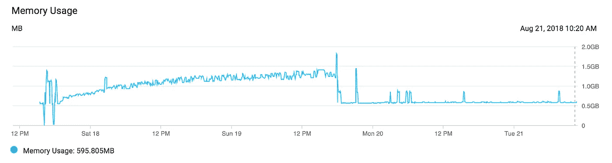
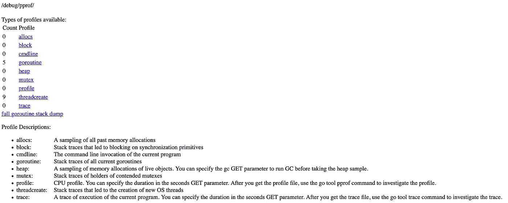
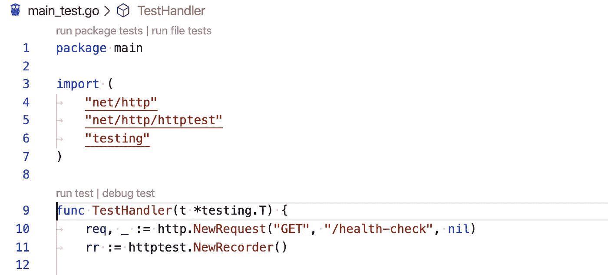

# 像专家一样调试

> 原文：<https://betterprogramming.pub/debug-go-like-a-pro-213d4d74e940>

## 从分析到调试，以及其间的一切


[赞](https://unsplash.com/@zanilic?utm_source=unsplash&utm_medium=referral&utm_content=creditCopyText)在 [Unsplash](https://unsplash.com/s/photos/debug?utm_source=unsplash&utm_medium=referral&utm_content=creditCopyText) 上的照片

一旦你理解了基本知识，Golang 可以让你比以往任何时候都更有效率。但是当事情出错的时候你会怎么做呢？

您可能不知道这一点，但是 Go 本身包含了用于记录和可视化运行时分析数据的 [pprof](https://golang.org/pkg/runtime/pprof/) 。像 [delve](https://github.com/go-delve/delve) 这样的第三方工具增加了对逐行调试的支持。泄漏和竞争检测器可以防范非确定性行为。

如果您以前没有见过或使用过这些工具，它们将很快成为您的 Golang 工具库中的强大补充。

# 为什么我不把所有东西都打印出来呢？

我见过很多开发人员，他们在遇到代码问题时很少打开调试器。我不认为那是错误的。如果您正在编写单元测试，林挺您的代码，并在此过程中进行重构，那么快速和肮脏的方法可以在大多数情况下工作。

相反，我一直在努力解决问题，并意识到插入一些断点并打开一个交互式调试器比不断添加断言和打印语句要快。



显示由 [Kent Gruber](https://medium.com/@KentGruber/tracking-down-a-golang-memory-leak-with-grmon-74569a00a177) 修复内存泄漏的图表示例

例如，有一天我在查看我帮助维护的一个 web 应用程序的内存图。总的内存使用量每天都在慢慢增加，直到服务器需要重启才能保持稳定。这是内存泄漏的一个典型例子。

快速而肮脏的方法建议我们通读代码，确保生成的 [goroutines](https://gobyexample.com/goroutines) 退出，分配的变量得到垃圾收集，连接正确关闭，等等。相反，我们分析了应用程序，并在几分钟内发现了内存泄漏。一个难以捉摸的、单一的语句导致了它——通常是这类错误的情况。

这篇概述将向您介绍一些我几乎每天都在使用的工具，来解决像这样的问题。

# 剖析记录和可视化

首先，让我们用一个正常关闭的 Golang web 服务器发送一些人工流量。然后我们将使用`pprof`工具收集尽可能多的信息。

我们可以通过以下方式确保这一点:

```
$ go run main.go &
$ curl localhost:8080
Hello World!
```

现在，我们可以通过包含以下代码片段来分析 CPU:

我们将使用负载测试工具来彻底测试 web 服务器，以模拟正常到繁忙的流量。我使用测试工具[贝吉塔](https://github.com/tsenart/vegeta)来完成这项工作:

```
$ echo "GET http://localhost:8080" | vegeta attack -duration=5s
Hello world!
...
```

当我们关闭 go web 服务器时，我们将看到一个文件`cpu.prof`，它包含 CPU 配置文件。然后可以用`pprof`工具可视化该轮廓:

```
$ go tool pprof cpu.prof
Type: cpu
Time: Jan 16, 2020 at 4:51pm (EST)
Duration: 9.43s, Total samples = 50ms ( 0.53%)
Entering interactive mode (type "help" for commands, "o" for options)
(pprof) top 10
Showing nodes accounting for 50ms, 100% of 50ms total
Showing top 10 nodes out of 24
      flat  flat%   sum%        cum   cum%
      20ms 40.00% 40.00%       20ms 40.00%  syscall.syscall
... 
```

这是一个好的开始，但是围棋可以做得更好。我们希望在应用程序接收流量时对其进行分析，这样我们就不必依赖模拟流量或添加额外的代码来将分析写入文件。添加`net/http/pprof`导入将自动向我们的 web 服务器添加额外的处理程序:

```
import _ "net/http/pprof"
```

有了它，我们可以通过网络浏览器点击`/debug/pprof/`路线，看到充满信息的`pprof`页面。



导航到/debug/pprof/ route 时您将看到的示例

我们可以通过运行以下命令获得与之前相同的信息:

```
$ go tool pprof -top http://localhost:8080/debug/pprof/heap
```

您还可以:

*   根据配置文件的类型生成图像。
*   创建[火焰图](http://www.brendangregg.com/flamegraphs.html)来可视化应用所花费的时间。
*   跟踪 Goroutines，在泄漏导致服务质量下降之前检测泄漏。

注意，对于生产 web 服务器，我们很少希望避免向外界公开这些信息，而是应该将它们绑定到不同的内部端口。

# 钻研交互式调试器

Delve 被宣传为:

> …一个简单的全功能 Go 调试工具。Delve 应该易于调用和使用。如果你使用调试器，事情很可能不会如你所愿。考虑到这一点，Delve 应该尽可能远离你的方式。

最后，当你有一个需要花很长时间才能解决的问题时，这个方法非常有效。

开始使用该工具相当容易，只需遵循[安装步骤](https://github.com/go-delve/delve/tree/master/Documentation/installation)。添加一条`runtime.Breakpoint()`语句，并使用`dlv`运行您的代码:

```
$ dlv debug main.go
Type 'help' for list of commands.
(dlv) continue
```

一旦你点击断点，你会看到代码块，例如在上面的 web 服务器中，我把`it`放在处理程序中:

```
> main.handler() ./main.go:20 (PC: 0x1495476)
    15:         _ "net/http/pprof"
    16: )
    17:
    18: func handler(w http.ResponseWriter, r *http.Request) {
    19:         runtime.Breakpoint()
=>  20:         fmt.Fprintf(w, "Hello World!\n")
    21: }
    22:
    23: func main() {
    24:         srv := http.Server{
    25:                 Addr:         ":8080",
(dlv)
```

现在，您可以使用`next`或`n`命令逐行执行，或者使用`step`或`s`命令深入研究某个函数。



带有 Golang 扩展的 VS 代码示例显示了 debug test 按钮

如果你喜欢漂亮的 UI 和点击按钮而不是使用键盘， [VS Code](https://code.visualstudio.com/) 有很好的支持。当使用原生测试库编写单元测试时，您会看到一个按钮`debug test`，它将初始化 delve，并让您在交互式会话中通过 VS 代码单步执行代码。

有关使用 VS 代码调试 Go 代码的更多信息，请查看上面的[微软 wiki](https://github.com/Microsoft/vscode-go/wiki/Debugging-Go-code-using-VS-Code) 。

Delve 可以让添加断点、测试断言和深入包变得轻而易举。下次当你遇到一个问题，想知道更多正在发生的事情时，不要害怕使用它。

# 泄漏和竞争检测器

我要介绍的最后一个主题是如何在您的测试中添加 Golang 泄漏和竞争检测器。如果您没有遇到竞态条件或经历过 Goroutine 内存泄漏，那么您应该感到幸运。

2017 年，优步开源了 [goleak](http://github.com/uber-go/goleak) 包，这是一个简单的工具，用于检查如果`Find`发现任何额外的 goroutines，是否会将给定的`TestingT`标记为失败。

看起来是这样的:

```
func TestA(t *testing.T) {
   defer goleak.VerifyNone(t)
   // test logic here.
}
```

当你在做复杂的异步工作时，你可以确保你既避免了倒退，又遵循了第五个原则[](https://the-zen-of-go.netlify.com/)*:*

> *启动 goroutine 之前，要知道它什么时候会停止。*

*最后，在确保你没有 Goleaks 之后，你将想要保护对抗比赛条件。幸好[数据竞争检测器](https://golang.org/doc/articles/race_detector.html)是内置的。考虑竞争检测器文档中的例子:*

*这是一场数据竞赛，可能会导致崩溃和内存损坏。运行带有`-race`标志的代码片段会导致死机，并显示一条有用的错误消息:*

```
*go run -race main.go 
==================
WARNING: DATA RACE
Write at 0x00c0000e2210 by goroutine 8:
  runtime.mapassign_faststr()
      /usr/local/Cellar/go/1.13.6/libexec/src/runtime/map_faststr.go:202 +0x0
  main.main.func1()
      /PATH/main.go:19 +0x5dPrevious write at 0x00c0000e2210 by main goroutine:
  runtime.mapassign_faststr()
      /usr/local/Cellar/go/1.13.6/libexec/src/runtime/map_faststr.go:202 +0x0
  main.main()
      /PATH/main.go:22 +0xc6Goroutine 8 (running) created at:
  main.main()
      /PATH/main.go:18 +0x97
==================
2 b
1 a
Found 1 data race(s)*
```

*虽然您可以在代码执行期间使用该标志，但是在您编写测试时，添加到您的`go test`命令来检测竞争是最有帮助的。*

# *结论*

*这些只是 Golang 生态系统中可以用来帮助观察、调试和防止代码库生产失败的一些很好的工具。如果你想更进一步，我建议你看看:*

*   *分布式跟踪类似于[开放式跟踪 Go](https://opentracing.io/) 。*
*   *使用像 Prometheu s 这样的工具进行时序监控。*
*   *使用 [logrus](https://github.com/sirupsen/logrus) 的结构化测井。*

*有关上面列出的任何工具的更多信息，请查阅参考资料部分的完整文档和手册。*

# *资源*

*   *[运行时 pprof](https://golang.org/pkg/runtime/pprof/) 和[净 pprof](https://golang.org/pkg/net/http/pprof/)*
*   *[去钻研](https://github.com/go-delve/delve)*
*   *[追踪一个 Golang 漏洞](https://medium.com/@KentGruber/tracking-down-a-golang-memory-leak-with-grmon-74569a00a177)*
*   *[Goroutines](https://gobyexample.com/goroutines)*
*   *[贝吉塔负载测试工具](https://github.com/tsenart/vegeta)*
*   *[火焰图](http://www.brendangregg.com/flamegraphs.html)*
*   *[Delve 安装步骤](https://github.com/go-delve/delve/tree/master/Documentation/installation)*
*   *[VS 代码](https://code.visualstudio.com/)*
*   *[使用微软 VS 代码调试 Go 代码](https://github.com/Microsoft/vscode-go/wiki/Debugging-Go-code-using-VS-Code)*
*   *[Goleak](http://github.com/uber-go/goleak)*
*   *[围棋之禅](https://the-zen-of-go.netlify.com/)*
*   *[围棋比赛检测器](https://golang.org/doc/articles/race_detector.html)*
*   *[开启追踪](https://opentracing.io/)*
*   *[普罗米修斯](https://prometheus.io/)*
*   *[日志](https://github.com/sirupsen/logrus)*