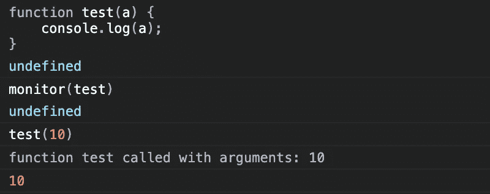
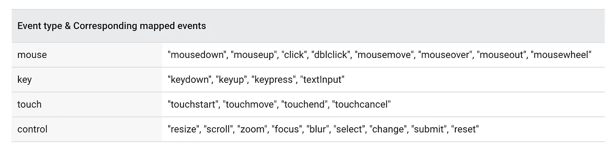
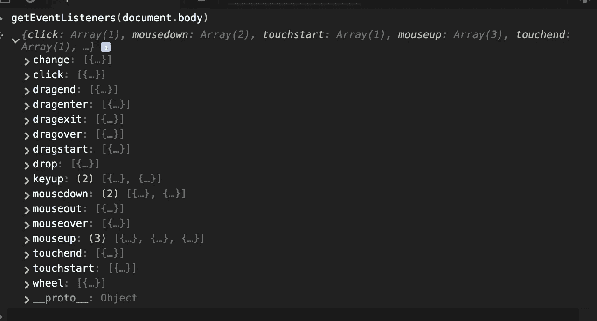
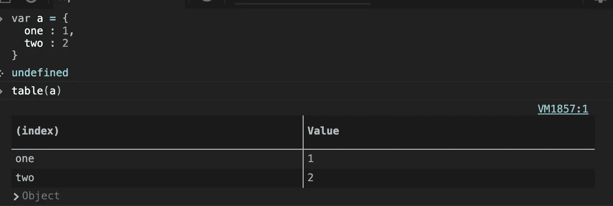

# 使用 Chrome 的 DevTools 像狮子一样调试

> 原文：<https://betterprogramming.pub/debug-like-a-lion-in-chrome-dev-tool-babe1019df3d>

## 更有效地使用 Chrome 开发工具的技巧和诀窍


图片来自[伊万·迪亚兹](https://unsplash.com/@mdi?utm_source=unsplash&utm_medium=referral&utm_content=creditCopyText)

可以用`CMD + option + J`打开 Chrome 的 DevTools。

注意:这个技巧只在 Chrome 控制台上有效。

# 1\. $_

如果您在控制台中键入`$_`,它将在控制台中打印最后计算的表达式。

示例:

```
6 + 6 // 12
$_ // 12
```

我们还可以在`$_`上做手术:

```
$_ * 5 // 60
$_ // 60
```

`$_`将包含表达式返回的值。如果表达式返回`$_`，则为`undefined`。

```
// try in your consolevar a = {} // undefined
$_ // undefined// Similarly
function a () {} ;$_ undefined
```

`$_`可以是任何值(数字/对象/任何东西)。

```
**window**
Window {parent: Window, postMessage: ƒ, blur: ƒ, focus: ƒ, close: ƒ, …}**$_**
Window {parent: Window, postMessage: ƒ, blur: ƒ, focus: ƒ, close: ƒ, …}
```

# 2.监视器(功能)

当我们用任何函数引用调用`monitor`函数时，那么无论何时调用该函数，`function name with arguments passed`都会被打印在控制台中。



使用`unmonitor(function)`停止监控。

# 3.复制(对象)

将对象作为字符串复制到剪贴板。

```
var a = {
  name : 10
}copy(a);
```

# 4.clear() —清除控制台

清除浏览器控制台。

我们还可以通过右键单击控制台来清除控制台历史记录。在那里，我们将有两个选项，一个到`clear console`，另一个清除`console history`。

# 5.$0 — $4 —所选元素历史记录

这将引用从开发工具的 elements 选项卡中选择的最后五个 DOM 元素。如果没有选择任何元素，则返回`undefined`。

*   `$0` →返回最后选择的元素。
*   `$1` →返回倒数第二个选择的，依此类推。

# 6.$(选择器，[startNode])

我们可以使用`$(selector )`而不是在控制台中使用`document.querySelector`进行调试。

```
$(‘img’) -- will return the first img tag.
```

`startNode`指定一个`element`或节点，从中搜索元素。该参数的默认值为`document`。

# 7.$$(选择器，[startNode])

这是控制台中`document.querySelectorAll`的替代选项

```
$$(‘img’) → will return all image elements
```

# 8.调试(功能)—自动调试模式

如果我们想在特定函数处自动停止调试器，那么我们将函数名传递给 debug 函数。

```
function test() {
  console.log("testing");
}debug(test)
```

使用`undebug`停止自动调试模式。

# 9.检查(功能/DOM)

这将基于传递的参数接受 DOM 元素或函数。

传递函数名。

```
function test() {
  console.log("testing");
}
inspect(test); // take you to function definition
```

传递一个 DOM 元素。

```
inspect(document.body)
```

# 10.键(对象)

这将打印传递的对象的键。`Object.keys`的替代。

```
var a = {
  one : 1,
  two : 2
}keys(a)
// (2) ["one", "two"]
```

# 11.值(对象)

这将打印传递的对象的键。`Object.value`的替代品。

```
var a = {
  one : 1,
  two : 2
}values(a)// (2) [1,2]
```

# 12.monitorEvents(元素，[事件名称])

当指定的事件之一在指定的对象上发生时，事件对象被记录到控制台。您可以指定要监视的单个事件或一组事件:

```
monitorEvents(btn, 'click');
```

每当单击一个按钮时，事件对象将被打印在控制台中。

```
monitorEvents(input, ['keypress', 'input', 'keydown'])
```

您还可以指定一个可用的事件“类型”，即映射到预定义事件集的字符串。下表列出了可用的事件类型及其关联的事件映射:



```
monitorEvents(input, "key");
```

使用`unmonitorEvents`停止监控。

# 13.getEventListeners(元素)

返回注册到特定 DOM 元素的事件。



# 14.表格(数据)—打印为表格

以表格格式打印对象。

