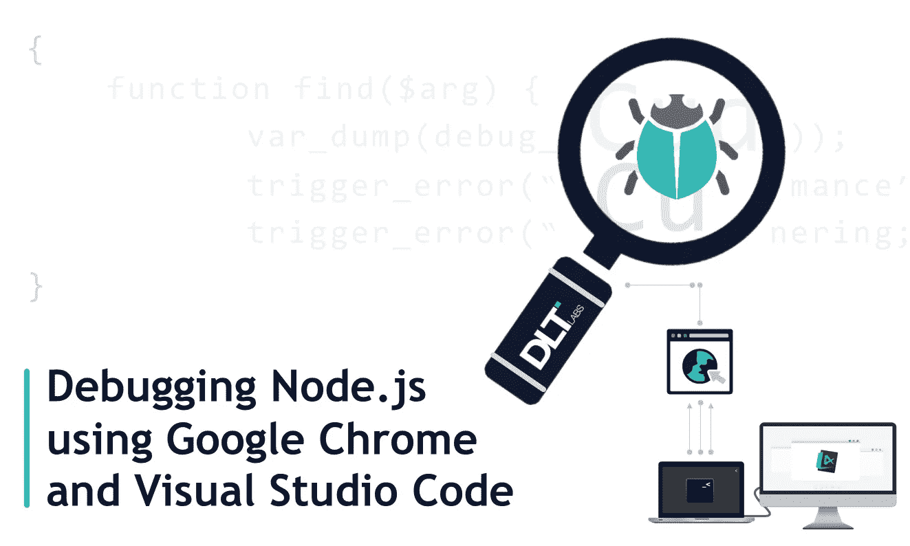
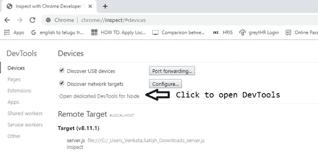
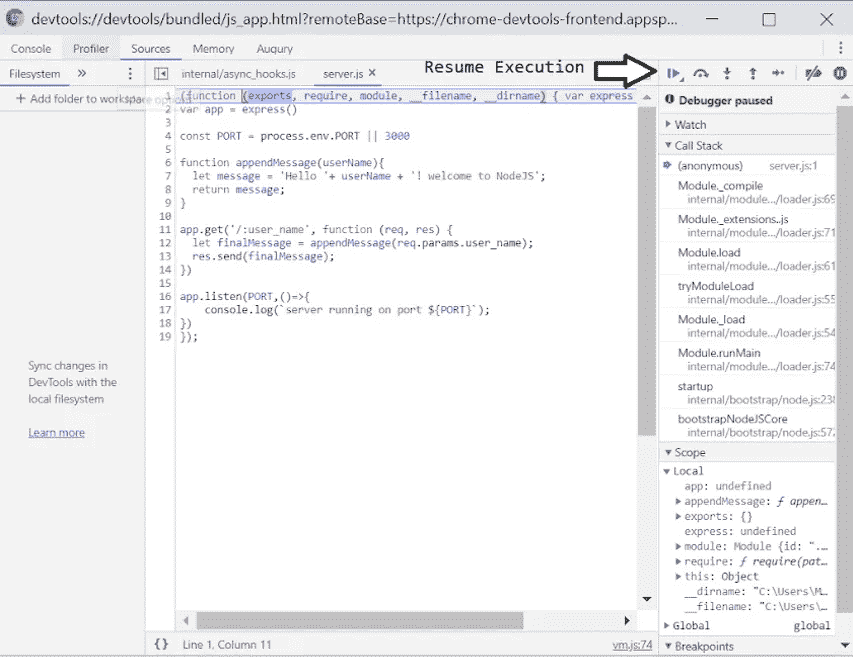
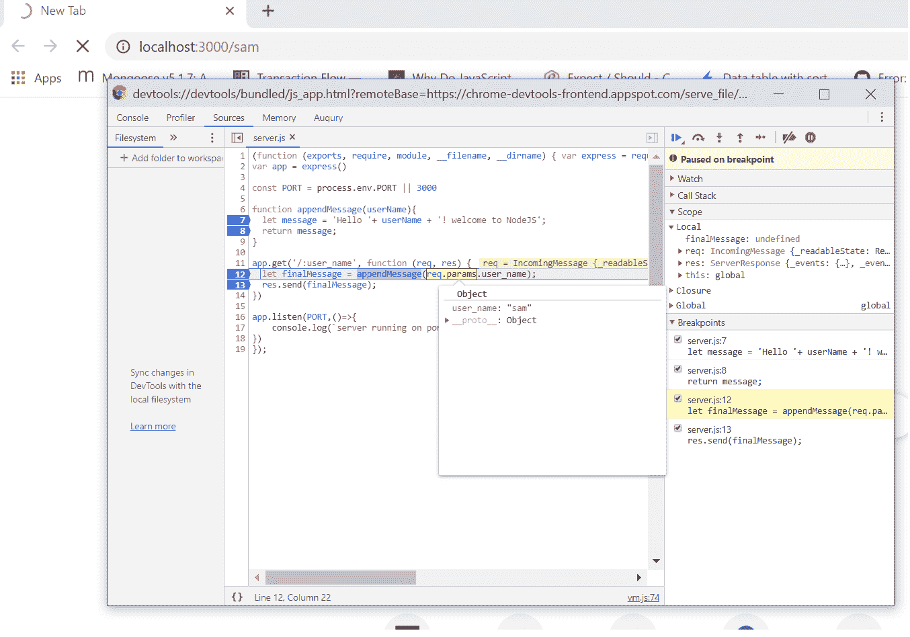
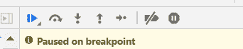
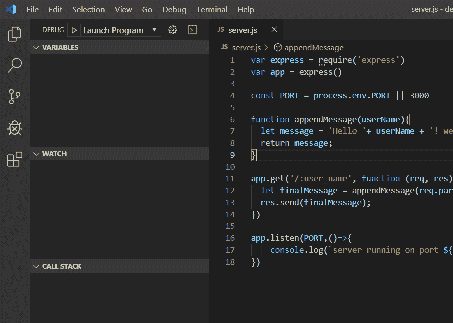
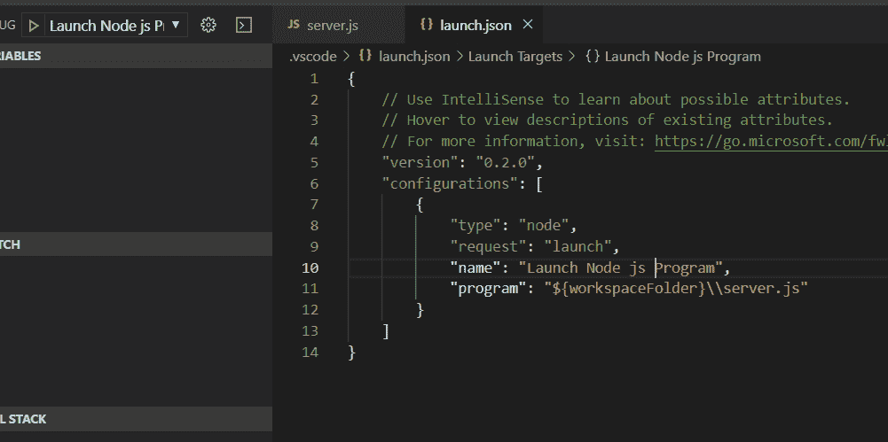
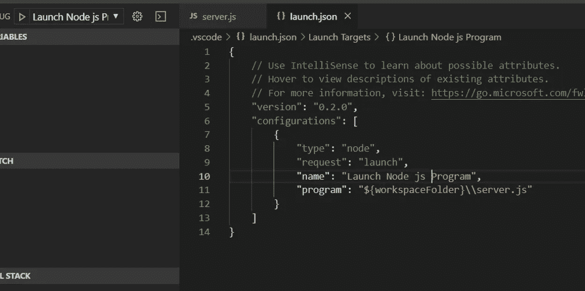
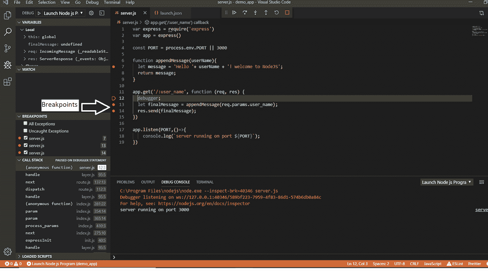
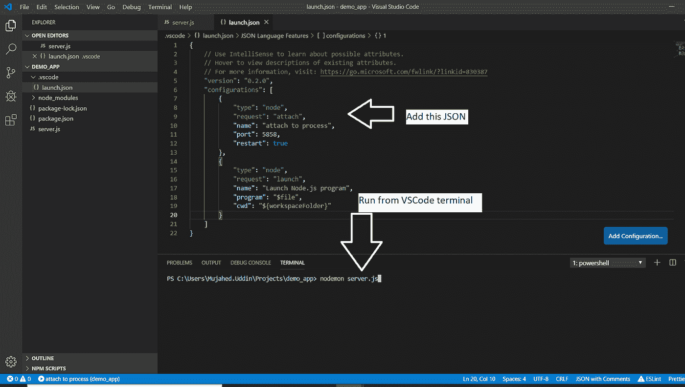

# 使用 Google Chrome 和 Visual Studio 代码调试 Node.js 应用

> 原文：<https://betterprogramming.pub/debug-node-js-using-google-chrome-and-visual-studio-code-5521c5e8f30c>

## 用超能力调试

调试是开发应用程序的重要组成部分，您可以在其中找到并删除错误。在这篇博客中，我们将看到如何通过使用 Google Chrome 浏览器的 DevTools 和 Visual Studio 代码来高效地调试 Node.js 代码。

许多初学者使用`console.log()`来调试代码，这不是一种有效的做法，因为我们需要在代码行中一次又一次地添加 console.log。

这使我们停止应用程序，添加 console.log，并再次启动应用程序。这个过程产生了不必要的代码，降低了我们的工作效率。

在这种情况下，调试工具是救星，因为它们为我们提供了断点、进入/退出函数、重启等功能。

必要时，我们可以暂停执行并检查变量/对象，然后修改它们，而无需在任何时间点重新启动我们的应用程序。

# **使用谷歌 Chrome DevTools 进行调试**

谷歌 Chrome 自带默认的 Node.js 调试工具，所以最好使用最新版本的 Chrome。

要开始调试，让我们用`--inspect-brk`标志运行我们的应用程序。

例子:`$ node --inspect-brk server.js`

下一步是进入 Chrome，打开一个新标签，输入 URL `chrome://inspect/`。

单击“Open dedicated DevTools for Node”开始调试应用程序。在 Chrome DevTools 中查看源代码需要几秒钟时间。

## **用 Chrome 动手调试**

现在，让我们动手操作下面的代码，用`node --inspect-brk server.js` 启动应用程序，打开 Chrome DevTools。

当我们打开 DevTools 时，源代码出现在浏览器中，它是在运行我们的应用程序时加载的，并将在第一行暂停。

单击右上方的播放按钮，如下图所示，继续执行脚本。

现在 Chrome 或任何调试工具都提供了添加断点的功能，您可以在断点处暂停应用程序并检查那些变量和函数。

要添加断点，请单击行号或在装订线或空白处。在“Get API”中添加一些断点，我们希望在这里检查请求对象。

现在，让我们调用 Get API:[http://localhost:3000/Sam，](http://localhost:3000/sam,)我们可以发现 DevTools，它会自动弹出并显示在那些断点处暂停的执行。

我们可以将鼠标悬停在这些行上，以查看在如下所示的范围内接收到的变量或对象。

让我们在右侧探索 Chrome 调试器中的一些重要功能:

1.  监视:在这个部分中，我们可以单击+图标，并添加我们希望在断点处暂停时监视的变量。它们有时不可用或未定义，这取决于作用域以及在断点处是否没有给它们赋值。
2.  调用堆栈:查看函数调用列表。
3.  范围:在范围部分，我们可以查看或编辑具有局部和全局范围的变量。
4.  断点:查看断点列表。

现在，让我们来看看上面的图片，这些箭头按钮位于 Chrome 的右侧。这些图标将帮助我们导航代码的执行。

这些箭头让我们:

*   单步执行下一个函数调用。
*   进入下一个函数调用，查看该函数。
*   跳出当前函数。

注意:我们可以解决它们，进行实验，并探索更多的功能。

# **在 VS 代码中调试**

现在，让我们看看如何使用我们最喜欢的 IDE(集成开发环境)，而不是代码来调试 Node.js，这是强烈推荐的，而不是 Chrome。

打开 VS 代码并点击 Ctrl + Shift + D，这将在 VS 代码中打开一个调试器标签，如下所示。

点击右上方菜单栏上的齿轮图标，这将打开一个`launch.json`文件。按照下图所示的规范配置 JSON。

将程序值从`${workspaceFolder}\\index.js`改为`${workspaceFolder}\\server.js`，因为我们的文件名是`server.js`。

给程序取一个合适的名字。在下图中，我们将我们的程序命名为 *launch Node.js 程序*。

要启动程序并打开调试控制台，单击*运行*按钮。

现在我们可以像在上面的 Chrome 调试器工具中一样添加断点。

或者，如果我们想在那一点暂停执行，我们可以在代码行前添加`debugger`关键字。

例如，我在下图的第 12 行添加了一个调试器。

VS 代码调试器包括其他重要的特性，如监视、调用堆栈、断点和导航面板。

如果我们使用 [Nodemon](https://nodemon.io/) 进行开发，请根据下图更改配置，并仅从 VS 代码终端使用 Nodemon 运行应用程序。

因此，最后，您现在可以使用 Visual Studio 代码或 Google Chrome 来调试 Node.js 应用程序。

调试愉快！

 [## 创建高性能 Node.js 应用程序的 5 个技巧

### 我们分享创建高性能 Node.js 应用程序的 5 个技巧。

dltlabs.medium.com](https://dltlabs.medium.com/5-tips-to-create-high-performance-node-js-applications-e8419d9d158c)