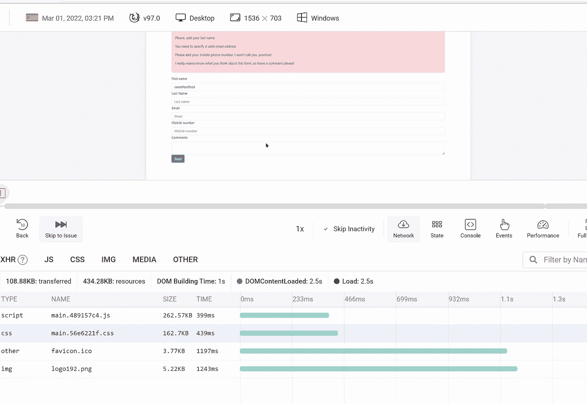
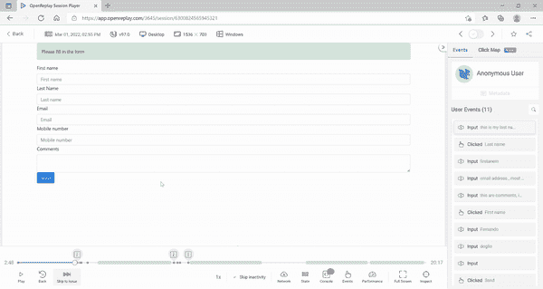
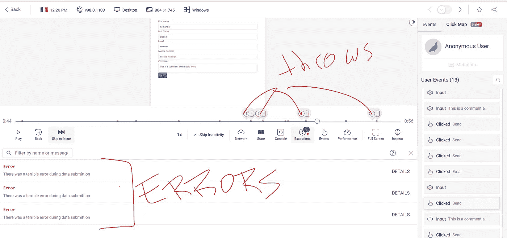
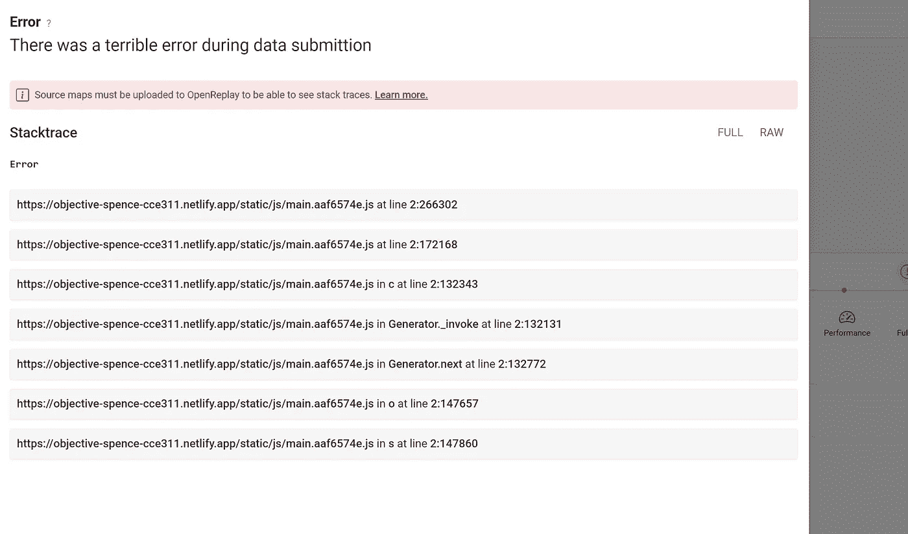
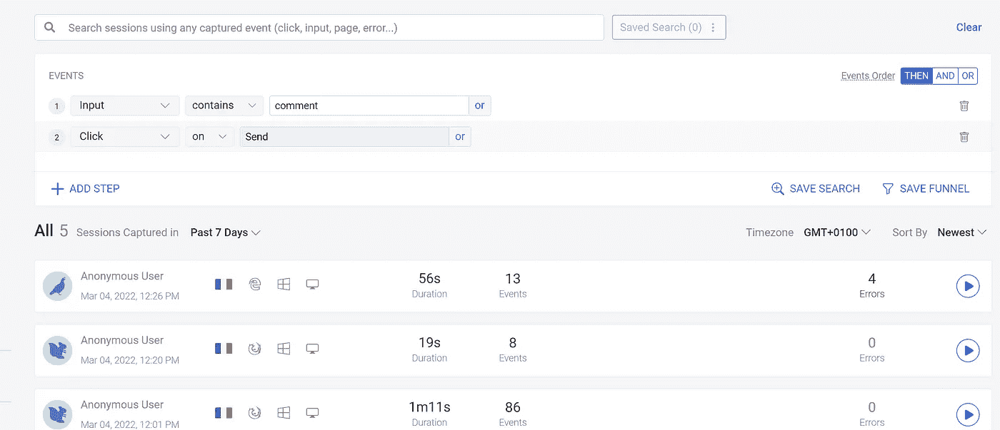

# 使用会话回放工具通过用户的眼睛调试你的应用程序

> 原文：<https://betterprogramming.pub/debug-your-app-through-the-users-eyes-with-a-session-replay-tool-e2a37a4e133a>

## 以及使用会话重放工具的意想不到的好处

原照片由[萨克斯哥鲁达](https://unsplash.com/@sakethgaruda?utm_source=unsplash&utm_medium=referral&utm_content=creditCopyText)在 [Unsplash](https://unsplash.com/s/photos/through-glasses?utm_source=unsplash&utm_medium=referral&utm_content=creditCopyText) 上拍摄，作者编辑

应用程序总是会失败，我们作为开发人员知道这一点，并且我们是唯一真正接受这个事实的人。但我们也知道，每个问题都有解决方案。诚然，这些解决方案并不总是容易找到或构建，但我们可以实现。

事实上，问题不在于构建解决方案，而在于理解问题的根源，以便我们能够解决它们。有时候 bug 很简单，有时候只是缺少了一个分号或者应该是一个`-`的`+`。但其他时候，问题非常复杂，直到真正的用户开始与我们的应用程序交互，我们才能真正找到它们。

即使这样，解决这些问题的传统方法也不是最佳的，所以让我们看看如何使用一种非常特殊的工具来改变这种情况。

# 传统方法的问题是

当你得到一个错误报告时，你通常做什么？你试着复制它，不是吗？你通读你的复制步骤(如果你足够幸运的话)，然后一个接一个地执行它们。

最终，你一定会发现同样的问题，通过更多的挖掘，你可以找到你失眠的原因。

也许吧。

其他时候，错误报告说“用户抱怨应用程序无法工作”，或者更糟的是，“应用程序有时可以工作，但当我点击红色按钮时，它就停止工作了”。你会想知道用户所说的是整个应用程序中 10 个红色按钮中的哪一个，比如

来源 [giphy](https://giphy.com/gifs/harlem-3mn9d5Rc83VMArIuZb)

当然，你可以使用一些工具来联系他们，你可以直接打电话给他们分享他们的屏幕(如果他们知道如何通过缩放来做到这一点)，这样你就可以看到他们在做什么。

这里的关键问题是，您正在处理一个并非源于您的代码，而是源于您的用户行为的 bug。他们以一种你意想不到的方式与你的应用程序交互，这扼杀了你的业务逻辑。

是他们的错吗？没有。但是，在这些情况下找到解决方案并不容易，除非您能够确切地看到他们在做什么，他们在做时看到的错误，并在发生这种情况时检查他们的浏览器窗口以查看 DevTools 细节。

问题是，要做到这一点，当这一切发生时，你需要和他们在一起。对吗？

不对。

# 会话重放拯救

会话重放是一种在稍后的时间里查看别人的浏览器中到底发生了什么的能力。不，我不是在说录制的屏幕截图，那是不够的，因为那不会让你处理细节，检查开发工具，并看到用户看不到的 JavaScript 错误。

我说的是真实 DOM 被一秒一秒改变的直接回放。

多酷啊。

来源 [Giphy](https://giphy.com/gifs/RoadshowPBS-antiques-roadshow-cKhsz2ERmvmdoiNy2z)

有一些工具已经可以让你做到这一点:

*   [例如，SmartLook](https://www.smartlook.com/session-recording-tool/?utm_source=google&utm_medium=cpc&utm_adgroup=Session_replay_new&utm_campaign=MC_L_recordings&utm_term=session%20replay&gclid=Cj0KCQiA64GRBhCZARIsAHOLriLx1avNdsGNMiiT81cXYS9F7SXhxq1MptPnBS5TkdRxpUqCbfX-1BYaAp3JEALw_wcB) 可以让你捕捉网络和手机会话。
*   [Dyantrace](https://www.dynatrace.com/monitoring/platform/session-replay/?utm_source=google&utm_medium=cpc&utm_term=session%20replay&utm_campaign=fr-dem&utm_content=none&gclid=Cj0KCQiA64GRBhCZARIsAHOLriIbd4fleaGg9C23O8rHE11DOivqHKpEfchC_oec8mWz0cYbLMkaReYaAmRTEALw_wcB&gclsrc=aw.ds) 还有一个集成的会话监控工具。

还有很多其他的，但是我今天想说的是 [OpenReplay](https://openreplay.com/) 。为什么特别是那一个？因为它是我发现的唯一一个提供完全可用的开源版本的软件，你可以自己下载并安装。

他们也有一个 SaaS 版本，只要你每个月保持 1k 的会话记录，这个版本是完全免费的。你不需要信用卡来注册，只需点击几下就可以开始。

但事实上，你可以免费为自己安装软件，这意味着你可以完全控制用户保存的数据。毕竟，您正在捕获他们的输入，虽然您确实有能力净化这些信息以避免捕获不需要的数据，但您仍然可以确定正在对其余捕获的信息做什么。考虑到今天的安全问题，这是无价的。

那么你报名的时候得到了什么呢？

## OpenReplay 有什么了不起的？

一旦你注册，你会得到一个 JavaScript 代码片段，你需要把它添加到你的代码中。它的工作很像谷歌分析的片段，你复制粘贴到那里，它就工作了。

当然，你有一个完整的 [SDK](https://docs.openreplay.com/installation/javascript-sdk) 来添加定制事件、问题和许多其他选项。但是只要有了这个片段，您就已经准备好开始了。

下图显示了正在再现的录像的主用户界面:

请注意，在这张截图中，您可以看到应用程序位于顶部，而网络选项卡位于下方。你看到的是我测试应用程序的录像。这里的“网络”选项卡是完全动态的，会根据会话中记录的数据进行实时更新。

现在，这是我自己演奏的一段录音:

请注意，在我点击“点击播放”几秒钟后，黑色鼠标指针开始移动(这是我在录制会话时移动鼠标时原来的鼠标在移动)。当这种情况发生时，多种事物开始移动:

1.  你可以在主屏幕上看到鼠标如何开始移动，我的输入开始神奇地出现在每个字段上。
2.  在右侧，您可以看到用户事件(我的点击和输入)。这些问题在发生时会被突出显示。你可以点击它们，跳到每个事件的时间戳。
3.  在主屏幕的正下方，你可以看到一条时间线，就像一段视频。您可以单击它从会话的一个位置跳到另一个位置。`!`在录制过程中发现了问题。请注意，它们不是会话中的问题，而是我的应用程序中的问题(恶心！)

由于我的应用程序是一个非常简单的表单，OpenReplay 检测到的唯一问题是死点击，即用户点击了我页面上的某个地方，但什么也没有发生。这本身并不是一个错误，但是它表明用户可能试图做一些不能做的事情(比如点击一个死链接)。

现在，在我的测试中，我使用的是这个[基础应用](https://github.com/deleteman/open-replay-tracker-test)，它只提供了一个 React 内置的简单表单。出于测试目的，我在提交表单时添加了一个随机的`throw`语句。在记录一个新的会话并尝试发送表单 4 次后，您可以在回放中看到那些未处理的异常:

时间线显示了我每次点击“发送”按钮时的错误。你甚至可以看到，在截图的时候，我已经点击了 3 次，还有一次，但它仍然没有播在下面的部分，因为它没有发生。

如果我单击那里列出的那些错误，我将获得异常的详细信息，如下所示:

您将获得堆栈跟踪和错误的详细信息。如果您要上传生成代码的映射，您还会得到关于问题的行级细节。

你不能真的用截屏来得到它。

## 你有多少用户？

这并不是一个问题，但是存储和遍历无数次重放会话的想法可能是一个可怕的想法。

幸运的是，OpenReplay 的团队考虑到了这一点，并创建了一个非常强大的搜索功能，允许用户通过点击机制创建复杂的搜索。

看看我配置的以下搜索:

注意到我是如何寻找会话的，在这些会话中，我输入“评论”一词，然后点击“发送”按钮。您还可以添加 AND 和 OR 条件，使其更加有趣。

如果您碰巧知道有一组特定的操作会导致错误或意外行为，您可以在这里直接搜索它，并且只查看遵循该模式的会话。

# 会话重放工具的意想不到的好处

使用这些工具一段时间后，你会意识到这不仅仅是你的开发团队的工具。

这些类型的工具让你深入了解最终用户的想法，这是许多其他部门都希望拥有的。

## 会话回放以分析用户体验

能够观察用户如何与你的应用程序交互是你的 UX 团队梦寐以求的。

虽然他们可能不一定关心网络选项卡或性能选项卡的内容，但他们会非常有兴趣查看像死点击或点击愤怒事件(当用户多次点击同一元素时)这样的问题。例如，这些都是非常说明问题的指标，要么证实了最初 UX 假设的结果，要么提供了调整最初计划所需的输入。

## 通过会话回放支持您的用户

对于支持专家来说也是如此。如果您的客户在使用您的应用程序执行某些操作时遇到问题，他们可以联系在线支持专家，让他们分析会话回放，以了解他们是否做错了什么。这是一个非常强大的 L1 支持工具。尤其是如果你可以这样做，而用户正在积极地使用系统(顺便说一下，这就是 [OpenReplay Assist](https://openreplay.com/feature-assist.html) 所做的)。

会话重放对于开发面向用户的产品的开发团队来说是一个强大的工具。但是它也——可以说——对其他非开发部门同样相关和重要，比如支持和用户体验，所以如果你有能力影响你团队的决策，考虑把这个工具加入他们的武器库。

他们中的许多人会因此而喜欢你，但最重要的是，你的用户会从中获得最大的好处。

如果我已经成功说服你尝试它，给 [OpenReplay](https://openreplay.com/index.html) 一个尝试，它是免费的，所有功能都是默认启用的。

你过去试过会话重放吗？你觉得有用吗？