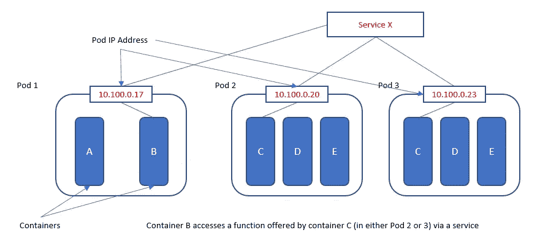
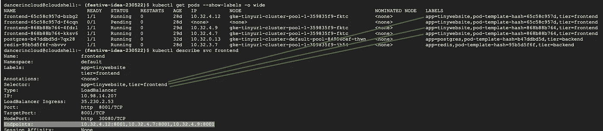

# 通过 5 个简单的步骤调试您的 Kubernetes 服务

> 原文：<https://betterprogramming.pub/debug-your-kubernetes-service-in-5-easy-steps-1457974f024c>

## 了解 Kubernetes 网络和调试服务


信用:[嘘奈杜](https://unsplash.com/@hush52)在 Unsplash 上

在上一篇[帖子](https://medium.com/better-programming/5-easy-tips-for-troubleshooting-your-kubernetes-pods-34f594e03ba6)中，我们调试了 Kubernetes pods。现在，是时候研究 Kubernetes (K8s)服务了，它是一个工作负载的抽象接口(主机+端口),这个工作负载可能由几个 pod 组成。

在我们深入调试之前，这里有一个网络的快速回顾，它是 K8s 服务的基础。

*   pod 中的容器共享相同的网络空间和相同的 IP。
*   所有 pod 都可以通过 IPs 与所有其他 pod 通信。
*   每个节点都可以看到所有 pod，反之亦然。
*   Pods 可以看到所有服务。

这在实践中意味着什么？



K8s 网络(鸣谢:wikipedia.org)

在图中:

*   位于 pod 1 中的容器 B 可以直接将容器 A 寻址为 *localhost* 。
*   容器 B 可以通过其 IP ( `kubectl get pod -o wide`)直接寻址 pod 2。我们知道这不是一个可靠的通信渠道，因为 pod 2 可能会失败，而一个新的 pod 可能会出现在它的位置上。我们不能追逐移动的目标。
*   接下来，容器 B 可以通过`‘Service x’`寻址 pod 2 和 pod 3，绑定它们的 IP 和它们之间的负载平衡；因此，在支持 K8s 上基于微服务的应用方面发挥着关键作用。

虽然对 K8s 的网络内部结构的研究超出了本文的范围，但我将在以后发布一些参考资料以供进一步研究。

现在，我鼓励你花点时间在实践中尝试和理解 Kubernetes 中的网络关系。

例如，您可以启动一个 K8s 测试 pod，并尝试从内部访问其他 pod、节点和服务！这里看到的命令在 pod 中打开了一个 Linux shell。

```
kubectl run -it networktest --image=alpine bin/ash --restart=Never --rm
```

你现在在 K8s 网络空间里，有`wget`、`ping`、`nslookup`、*、*等命令供你实验使用！测试之前在 K8s 集群中列出的网络要求。如`nslookup <servicename>, ping <PodIP>`。

现在让我们回到我们的主题，K8s 服务故障排除，它本质上是一个网络结构。

# 步骤 1:检查服务是否存在

```
kubectl get svc
```

如果服务不存在，可能是服务创建失败，请检查您的服务定义。

# **步骤 2:测试您的服务**

请记住，在群集外部无法访问内部 K8s ClusterIP 服务。有两种方法可以测试它。第一，您可以启动一个测试 pod，SSH 到其中，并尝试访问您的服务，如下所示:

```
kubectl run -it testpod --image=alpine bin/ash --restart=Never --rm
```

这里，我们将一个 alpine Docker 映像作为一个 pod 来从内部测试服务。

```
#works for http services
wget <servicename>:<httpport>#Confirm there is a DNS entry for the service!
nslookup <servicename>
```

或者，您可以将端口转发到您的本地机器并进行本地测试。

```
kubectl port-forward <service_name> 8000:8080
```

您现在可以将该服务称为`localhost:8000`。

# 第 3 步:检查服务是否确实针对相关的 pod

记住，K8s 服务根据标签选择器将入站流量路由到其中一个 pod。流量通过其 IP 路由到目标 pod。
因此，检查服务是否绑定到这些 pod。

```
kubectl describe service <service-name> | grep Endpoints
```

您应该会看到与列出的工作负载相关的所有 pod 的 IP。如果没有，请转到步骤 4。

# 第四步:检查容器标签

确保 K8s 服务中的选择器与 pod 的标签相匹配！

```
kubectl get pods --show-labels
kubectl describe svc <service_name>
```

在下面的截图中，你可以在右边看到豆荚的标签。四个吊舱分别标有`app=tinywebsite` 和`tier=frontend` *、*，与下面的服务选择器`“described”`相匹配。

在这四个匹配的 pod 中，只有三个正在运行，其中的 IP 在突出显示的行中被列为服务的端点。在“IP”一栏也可以看到同样的 IP。



# 步骤 5:确认服务端口与您的 Pod 匹配

最后，确保您的 pods 中的代码实际上监听您为服务指定的`targetPort`(例如，上面截图中看到的端口 8001)！

这很容易，要进一步研究和深入 K8s 网络世界，请参阅下面的文章。据推测，您的 K8s 集群是由一个云提供商托管的，他们应该会处理任何底层的集群级问题。

感谢您的阅读！

# 参考

*   [在 Kubernetes 中部署应用](https://medium.com/better-programming/a-practical-step-by-step-guide-to-understanding-kubernetes-d8be7f82e533)
*   [调试服务](https://kubernetes.io/docs/tasks/debug-application-cluster/debug-service/#does-the-service-exist)
*   [Kubernetes 网络](https://kubernetes.io/docs/concepts/cluster-administration/networking/)