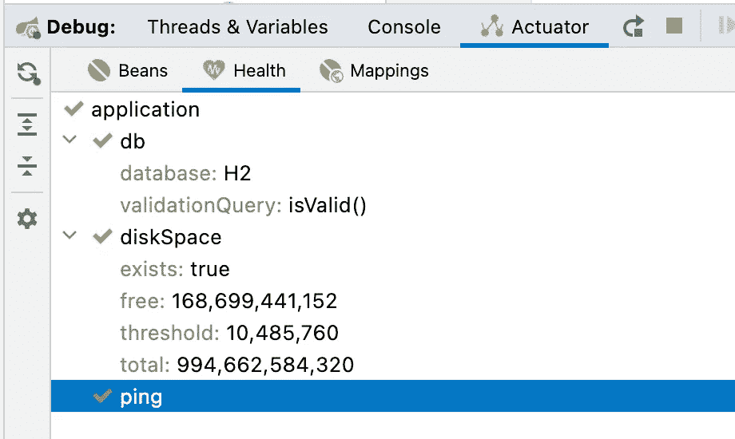

# 使用 JMXTerm 从另一个方向调试

> 原文：<https://betterprogramming.pub/debugging-from-the-other-direction-using-jmxterm-27039fd646d5>

## 本系列的第 3 部分探索了更多调试项目的工具


当跟踪一个 bug 时，我们需要采取类似于钳子的双管齐下的方法，从两侧包裹 bug 模块，并挤压以找到有问题的部分。到目前为止，我们讨论了非常低级的工具。有些可用于调试系统级服务。今天，我们将讨论堆栈的另一面，但仍然是一个非常先进的管理工具。要理解这一点，你需要了解我们所处的领域。

作为开发人员，我们处理代码和应用程序。部署是针对运营/开发人员的，他们的工具通常对我们来说是陌生的。并不是说他们有不好的工具。相反，他们有惊人的工具。但它们通常是为大规模设计的。当您需要管理数以千计的服务器时，您需要一种方法来控制所有这些服务器。为此，我们需要一套不同的工具。

管理工具让我们穿越机器的云，并管理在其上运行的应用程序。我们不需要前者，但后者是对开发者非常有用的强大工具。一些标准实现了应用程序管理，Java 引入了 JMX 来封装它们的差异。JMX 让应用程序和 JDK 本身暴露信息和功能，供外部工具操作。

这是一个显著的特性，它为运行时环境中的动态操作提供了信息和调优杠杆。激活 JMX 超出了本教程的范围，所以我不会讲太多细节，但是你可以在这篇甲骨文文章[这里](https://docs.oracle.com/javadb/10.10.1.2/adminguide/radminjmxenabledisable.html)查看一些基础知识。一旦运行完毕，我们就可以使用可视化工具进行调试，但是我将主要关注命令行工具。这很重要，因为我可以从控制台直接在生产服务器上使用一些工具。

# JMX 是如何工作的？

JMX 公开了管理“bean”(mbean)。这些是代表应用程序中控制点的对象。您的应用程序可以发布自己的 beans，这允许您公开运行时监控和配置的功能。这非常酷，因为您可以导出管理员可以直接连接到仪表板(APM、Prometheus、Grafana 等)的信息。)并将其用于决策。

如果您的服务器有多个并发连接的用户，您可以在 JMX 公开该号码，并且由于 DevOps 的一些连接，它可以出现在公司仪表板中。在您这方面，大多数工作都会公开一个感兴趣的值的 getter。您还可以公开诸如“清除用户”等操作。操作是可以在 JMX bean 上调用的方法。

Spring 还支持通过 actuator 将许多服务器细节公开为管理 beans。这是一个非常酷的功能。你可以在这里了解更多。它揭示了关于应用程序的非常深入的指标，并帮助您直接进入“生产就绪”状态！

# JMXTerm 基础知识

通常，人们通过 web 界面工具或专用管理工具来控制和读取 JMX。如果你能接触到它们中的任何一个，我建议你挑选一个并使用它们，因为它会工作得很好。我在一些公司用过其中的一些，实际上在某些情况下我更喜欢它们。我也喜欢使用 IntelliJ/IDEA Ultimates 对 Actuator 的支持，这是一个非常强大的可视化工具。



同样强大，但不包括可视化方面。从这个意义上来说，当我们需要快速了解服务器上可能陌生的东西时，这非常方便。它对于从服务器内部获得高层次的洞察力也非常有用。我们可以从[这里](https://docs.cyclopsgroup.org/jmxterm)下载`JMXTerm`开始。

下载完成后，我们可以使用以下命令将其连接到服务器:

```
java -jar ~/Downloads/jmxterm-1.0.2-uber.jar --url localhost:30002
```

您应该根据您的连接更新主机名/端口。连接后，我们可以使用提示符列出 JMX 域:

```
$>domains
#following domains are available
JMImplementation
com.sun.management
java.lang
java.nio
java.util.logging
javax.cache
jdk.management.jfr
```

然后，我们可以选择一个特定的领域进行探索。这就是可视化工具的优势所在，因为它可以为您提供更快的层次导航和快速的信息评估。在这种情况下，我只想设置日志记录级别。下面是如何做到这一点:

```
$>domain java.util.logging
#domain is set to java.util.logging
```

我们可以通过列出域中的 beans 来遵循这一点。然后选择我们希望使用的 bean，因为在这个特定的域中只有一个 bean。代码如下:

```
$>beans
#domain = java.util.logging:
java.util.logging:type=Logging
$>bean java.util.logging:type=Logging
#bean is set to java.util.logging:type=Logging
```

我能用这颗豆子做什么？为此，我们使用 info 命令列出 bean 的操作和属性:

```
$>info
#mbean = java.util.logging:type=Logging
#class name = sun.management.ManagementFactoryHelper$PlatformLoggingImpl
# attributes
  %0   - LoggerNames ([Ljava.lang.String;, r)
  %1   - ObjectName (javax.management.ObjectName, r)
# operations
  %0   - java.lang.String getLoggerLevel(java.lang.String p0)
  %1   - java.lang.String getParentLoggerName(java.lang.String p0)
  %2   - void setLoggerLevel(java.lang.String p0,java.lang.String p1)
#there's no notifications
```

一旦我有了这些，我就可以检查当前的日志级别。因为我们没有显式地设置它，所以没有设置它，并且使用了全局缺省值。方法如下:

```
$>run getLoggerLevel "org.apache.tomcat.websocket.WsWebSocketContainer"
#calling operation getLoggerLevel of mbean java.util.logging:type=Logging with params [org.apache.tomcat.websocket.WsWebSocketContainer]
#operation returns:
```

我可以显式地将它设置为`INFO`，然后使用下面的代码再次获取它来验证操作是否按预期工作:

```
$>run setLoggerLevel org.apache.tomcat.websocket.WsWebSocketContainer INFO
#calling operation setLoggerLevel of mbean java.util.logging:type=Logging with params [org.apache.tomcat.websocket.WsWebSocketContainer, INFO]
#operation returns: 
null
$>run getLoggerLevel "org.apache.tomcat.websocket.WsWebSocketContainer"
#calling operation getLoggerLevel of mbean java.util.logging:type=Logging with params [org.apache.tomcat.websocket.WsWebSocketContainer]
#operation returns: 
INFO
```

这只是冰山一角。我们可以得到很多东西，比如 spring 设置，内部 VM 信息等等。在此示例中，我可以使用以下代码直接从控制台查询虚拟机信息:

```
$>domain com.sun.management
#domain is set to com.sun.management
$>beans
#domain = com.sun.management:
com.sun.management:type=DiagnosticCommand
com.sun.management:type=HotSpotDiagnostic
$>bean com.sun.management:type=HotSpotDiagnostic
#bean is set to com.sun.management:type=HotSpotDiagnostic
$>info
#mbean = com.sun.management:type=HotSpotDiagnostic
#class name = com.sun.management.internal.HotSpotDiagnostic
# attributes
  %0   - DiagnosticOptions ([Ljavax.management.openmbean.CompositeData;, r)
  %1   - ObjectName (javax.management.ObjectName, r)
# operations
  %0   - void dumpHeap(java.lang.String p0,boolean p1)
  %1   - javax.management.openmbean.CompositeData getVMOption(java.lang.String p0)
  %2   - void setVMOption(java.lang.String p0,java.lang.String p1)
#there's no notifications
```

# 结论

JMX 是一个非凡的工具，我们通常用它来连接管理控制台。这是值得注意的，你应该为你的项目导出 JMX 设置。话虽如此，您可以通过将 JMX 作为调试过程的一部分来更进一步。

服务器应用程序在没有用户界面的情况下运行，或者有深度的用户界面分离。JMX 通常可以作为一种用户界面甚至命令行界面，就像`JMXTerm`中的情况一样。在这些情况下，我们可以触发调试情况，或者在管理 UI 中观察调试会话的结果。