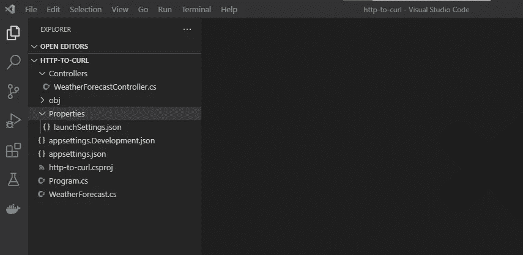
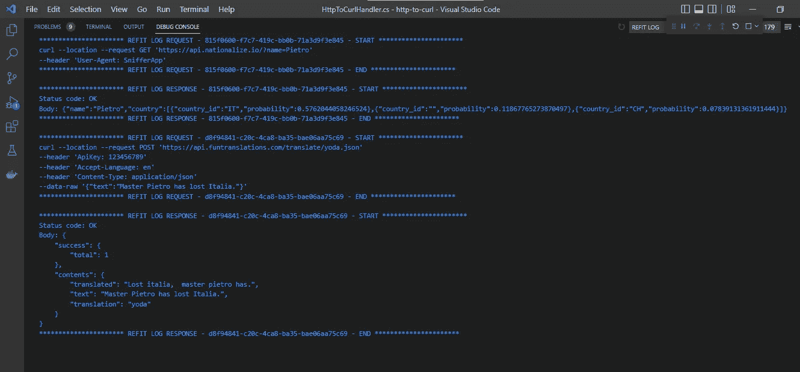

# 中调试 HTTP 请求。网络核心

> 原文：<https://betterprogramming.pub/debugging-http-requests-in-net-core-2d26cb5d4295>

## 拦截请求并自动生成 curl 命令

照片由[冈杜拉·沃格尔](https://pixabay.com/pt/users/guvo59-9285194/?utm_source=link-attribution&utm_medium=referral&utm_campaign=image&utm_content=3540378)从[皮克斯拜](https://pixabay.com/)拍摄

当收到 Web APIs 的 HTTP 请求导致的错误时，通常会通过提取应用程序正在执行的确切请求并准备 curl 命令或 postman 调用来重现问题，从而开始调查问题。

> P OST 更新
> 
> 如果你在这里只是因为你正在寻找一种简单的方法来记录你的 HTTP 呼叫，你可以使用我在这篇文章中创建的 NuGet 包。
> 
> 但是如果你来这里是为了更好地理解它是如何工作的，那就更好了，享受它吧。

这不是一个复杂的任务，但它消耗了很多时间，因为我们需要运行我们的应用程序，识别请求，检查地址，参数，头，键等，将其复制到一个文件，并建立 curl 命令。

有些人甚至花了一些时间，安装嗅探器应用程序，如 [Fiddler](https://www.telerik.com/fiddler) 和 [Wireshark](https://www.wireshark.org/) 来检查来自计算机的所有 HTTP 流量，甚至序列化请求并将其记录到文本文件中，这些方法当然有助于解决问题，但需要安装额外的应用程序或多次编写自定义日志例程。

在本文中，我将展示如何使用 [HTTP 消息处理程序](https://docs.microsoft.com/en-us/aspnet/web-api/overview/advanced/http-message-handlers)来拦截 HTTP 请求，并以一种非常简单快捷的方式为您的请求自动生成 curl 命令。

# 等等，这样做不需要定制代码

> 如果你正在考虑 Asp.Net 6.0 中的本地 HTTP 日志处理程序，你是完全正确的，我们不需要定制代码。
> 
> 如果你使用的是 Asp.Net 6.0，查看这里的文档[并记录你所有的请求，这比本文介绍的技术更容易](https://docs.microsoft.com/en-us/aspnet/core/fundamentals/http-logging/?view=aspnetcore-6.0)

但是，如果您使用的是旧版本，比如 5.0 或 3.1(或更旧)，那么这篇文章可能会对您有所帮助。

继续阅读的另一个原因是了解我们如何利用定制消息处理程序，不仅是为了日志目的，也是为了任何其他需要(如本文后面提到的)

# HTTP 消息处理程序

一个 [HTTP 消息处理器](https://docs.microsoft.com/en-us/aspnet/web-api/overview/advanced/http-message-handlers)是一个接收 HTTP 请求并返回 HTTP 响应的类(就这么简单)。

Asp.Net Web API 有几个内置的消息处理程序，可以创建一个嵌套的(本地的)调用管道。

我们可以创建一个从[delegateing handler](https://docs.microsoft.com/en-us/dotnet/api/system.net.http.delegatinghandler?view=net-6.0)类继承的自定义处理程序，并将其添加到管道中。

# 免费测试 API

在开始创建我们的示例 Web API 之前，我正在搜索用于测试的免费 API，我发现了两个非常有趣的 API:

*   [Nationalize IO](https://nationalize.io/) —这个 API 使用一个 GET 方法，它预测一个给定名字的人的国籍。
*   [Yoda Translator API](https://funtranslations.com/api/yoda/)—Yoda Translator API 使用 POST 方法，将一个英语短语翻译成 Yoda 语言，基本上是倒排原句。

因此，基于这两个 API，我的建议是创建一个新的 Web API，它根据名字预测一个人的国籍，并向 Yoda 翻译器请求短语`Master {NAME} has lost {COUNTRY}`并期待类似于`Lost {COUNTRY}, master {NAME} has`的结果

好看又简单不是，那我们来造吧。

# 创建 Web API

在我们的电脑上创建一个新文件夹，在命令行中键入`mkdir http-to-curl`，然后按回车键。

然后进入运行`cd http-to-curl`的文件夹，创建一个新的运行`dotnet new webapi`的 Web API

现在，让我们安装[改装](https://github.com/reactiveui/refit)依赖项，以便能够用它轻松地发出请求，运行`dotnet add package Refit --version 6.3.2`和`dotnet add package Refit.HttpClientFactory --version 6.3.2`

打开运行`code .`的 Visual Studio 代码，结构肯定和那个很像:

初始应用程序结构

接下来，创建一个新的 API 文件夹并添加`INationalizeApi.cs`类

INationalizeApi 类

另外，添加`IYodaTranslationApi.cs`类

IYodaTranslationApi 类

然后，在`Program.cs`文件中添加改装客户端(第 10 行和第 14 行):

程序类

删除`WeatherForecastController`和`WeatherForecast`类，增加如下`CompositeApiController`

CompositeApiController 类

我们的 API 已经准备好运行了，在控制台中键入`dotnet run`，并通过键入`curl --location --insecure --request GET 'https://localhost:7127/Pietro' --header 'keya:valuea' --header 'keyb:valueb'`发出请求(注意，标题只是为了举例，不安全的选项是为了避免证书，可能您需要将端口调整为与您的应用程序运行时相同)

如果一切正常，您将在命令行上看到以下结果消息:`Lost italia, Pietro has`

任务完成，我们有一个示例应用程序。

# 以卷曲形式转换请求

现在，准备好最精彩的部分，让我们创建我们的定制处理程序，创建检查请求的逻辑，并构建 curl。

HttpToCurlHandlers 类

这个类非常简单，首先，我们覆盖了`SendAsync`方法，它将在请求发生之前执行，对于这里的拦截，基本上需要添加方法来记录请求和响应。

为了更容易地在日志中搜索，我生成了一个 GUID，以便将请求与日志中的响应进行匹配。

日志方法也非常简单，它们开始记录一些硬编码 curl 语法，然后记录地址、方法、头和请求对象的主体。

这里的要点是，应该是完全可定制的，你可以做任何你想做的事情。

最后一步是将处理程序与我们的 Refit 客户端关联起来，为了做到这一点，我们需要在`Program.cs`中添加一个对`.addHttpMessageHandler<HttpToCurlHandler>`方法的调用，以便您可以使用处理程序(第 4 行和第 9 行)并在服务中注册处理程序(第 11 行)

修改我们的现有代码以使用处理程序，看起来必须完全像这样:

添加处理程序后的程序类

# 检查日志

由于我使用`System.Diagnostics.Debug.WriteLine()`方法来记录日志，我们只能在调试模式下运行应用程序时才能看到日志，如果你需要不同的东西，你只需要改变处理程序记录信息的方式。

按 F5 以调试模式启动应用程序，并像我们在上一步中所做的那样再次请求。

在`Debug Console`窗口中查看并过滤`REFIT LOG`，你将能够看到由处理程序生成的所有卷发。

在 Visual Studio 代码上调试控制台窗口

是啊，这是工作。

# 其他用途

正如我在本文开始时解释的那样，HTTP 消息处理程序可以用于任何其他需求，比如授权、头定制、补充信息、加密等等，请放心明智地使用它

# 示例项目和最终考虑事项

如果您想运行我用来创建本文的示例项目，请随意从我的 GitHub 代表 o 中克隆它

我希望这篇文章能像对我一样对你有用，谢谢你读到这里，下次再见