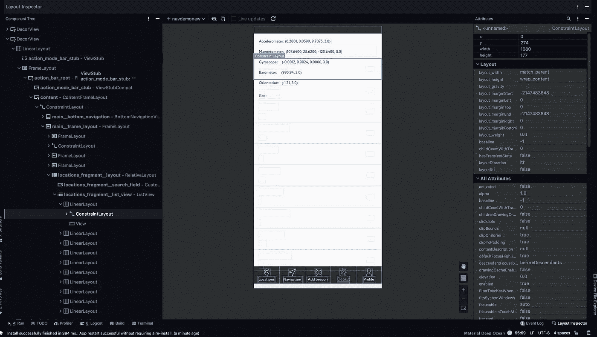
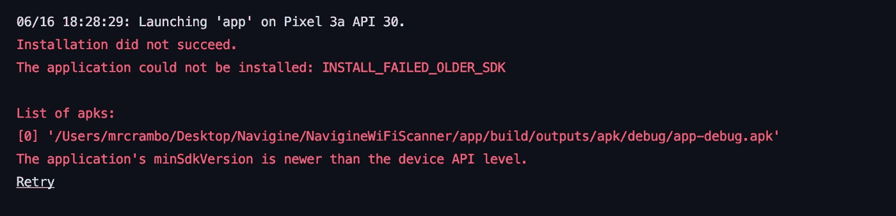

# 新 Android R (API 等级 30)和谷歌 Pixel 的调试问题

> 原文：<https://betterprogramming.pub/debugging-issues-with-the-new-android-r-api-level-30-and-google-pixel-a7343dfcf068>

## 测试新 Android R 时可能遇到的障碍

来自[dribble](https://dribbble.com/shots/9332751-Champagne)的 [Gaspart](https://dribbble.com/Gaspart) 拍照。

你好。我来自 [Navigine](https://clc.to/navigine) 团队。八年来，我们一直提供集成定位移动技术，实现先进的室内导航和邻近解决方案。

在无数次尝试测试新的 Android(它仍然以预览的形式存在)之后，我们决定写一篇文章，讲述我们在这个过程中遇到的障碍和问题。我们还将简要提及新的 Android Studio 4.0 出现的问题。结果有点令人难过，但是让我们更详细地谈论每件事。

# Android Studio 问题

先说一个简单的:新的 Android Studio。尽管它提供了很多机会和创新，但它并不像看上去那么酷。在您的设备上测试应用程序时，即使您收到“应用程序已安装”的消息，第一次尝试时它也不会重新启动。如果你需要频繁地重启应用程序，并且你调试了某种类型的错误，那么这将开始激怒你。

截图来自 Android Studio

下一个 bug 与实时布局检查器有关。当您使用几个片段创建片段管理器并在它们之间切换时，Live Layout Inspector 不会删除上一层，所有元素将相互堆叠。因为我们不使用它，这个 bug 对我们来说一点也不重要。但是，这种行为绝对是 bug。

还值得注意的是，实时更新按钮不起作用，点击按钮进行定期更新会有明显的滞后。

# 使用 Android R 的像素仿真器

我们决定使用新的 Android R 运行 Pixel 3 模拟器。我们下载了新的 Android R SDK，并将其安装到 Pixel 3 模拟器上。您可以使用 AVD 管理器创建它。顺便说一下，在我们启动模拟器后，它经常滞后，不允许我们打开主菜单。但是，当我们决定运行我们的 WiFi 扫描演示应用程序时，主要问题开始了。以下是新 Android APIs 上新 WiFi 扫描机制的代码:

然而，我们无法启动应用程序，因为我们收到了以下可怕的消息——尽管我们将最低 SDK 设置为 21，并且我们的仿真器上有一个新的 Android 30:

截图来自 Android Studio

原来我们的设备被认为是 API 11 而不是 API 30。因此，我们放弃了在模拟器中运行演示应用程序的尝试，并决定等到正式发布。

# 将 Android R 预览版安装到 Real Pixel 3a

这篇文章和我们的测试过程中最悲伤的部分是我们如何将我们的 Pixel 3a 变成了一个无法恢复的死设备。我们按照以下步骤将 Android R 预览版安装到我们的设备中:

*   在开发人员设置中打开调试。
*   将设备连接到计算机。
*   运行命令`adb reboot recovery;`。
*   选择“应用 ADB 更新”选项。
*   运行命令`adb sideload "filename".zip;`。
*   重启设备。

设备找不到有效的操作系统。在寻找答案时，我们发现许多人在更新他们设备的操作系统或安装预览版进行测试后遇到了这个问题。最奇怪的是，这个错误已经存在很多年了，至今谷歌也没有提供任何可能的解决方案。你唯一能做的就是在保修期内更换你的手机，如果它还没有过期的话。

# 结论

正如通常情况下，当一个大的更新出来时，新的 Android 和 Android Studio 有很多 bug 和问题，你必须忍受和报告。我们希望这一切很快得到解决，并且这篇文章将帮助许多开发者，以便他们可以避免这样的问题，并且如果他们试图在他们的 Pixel 手机上测试新的操作系统时要小心。