# 调试 Kubernetes 吊舱:深潜

> 原文：<https://betterprogramming.pub/debugging-kubernetes-pods-deep-dive-d6b2814cd8ce>

## 在本文中，我将讨论使用临时容器调试和排除 Kubernetes pods 故障。


照片由 [Zan](https://unsplash.com/@zanilic?utm_source=medium&utm_medium=referral) 在 [Unsplash](https://unsplash.com?utm_source=medium&utm_medium=referral) 上拍摄

调试 pods 的最简单方法是进入有问题的 pods，并尝试对发生的情况进行故障排除。这是一个简单的方法，但它有许多缺点。

*   正在运行的应用程序窗格可能没有解决现有问题所需的所有工具。
*   如果您想要执行一些需要额外权限的操作，您将需要重新启动当前运行的应用程序窗格的所有窗格，以添加新的要求。
*   他们通过在主 docker 映像中添加调试工具引入了安全风险，如果容器权限被提升也是如此。

因此，让我们探索另一种调试 pod 的方法。

# 使用临时调试容器进行调试

[短暂容器](https://kubernetes.io/docs/concepts/workloads/pods/ephemeral-containers/)在`kubectl exec`不足以进行交互式故障排除时非常有用，因为容器已经崩溃，或者容器映像不包括调试实用程序，如 distroless 映像，或者运行的容器没有调试所需的权限。

临时容器背后的主要思想是 K8S 向现有的 pod 添加一个带有选定的自定义图像的新容器，而不需要重新启动这个 pod。这个新的容器共享可以共享来自目标容器的许多资源，

*   Linux 网络名称空间
*   Linux 进程名称空间
*   对共享卷的访问
*   访问 k8s 节点

我将为这些用例中的每一个给出一个例子。

在开始演示之前，您需要一个版本为 1.23 的 k8s 集群。我推荐使用`[kind](https://kind.sigs.k8s.io/)`，但是您也可以使用任何其他供应器。

因此，让我们首先为我们的演示创建一个集群

# 正在创建种类群集

创建一种新的集群就像运行命令`kind create cluster`一样简单

**示例:**


创建群集后，您需要验证它是否已启动并且可以访问

**示例:**

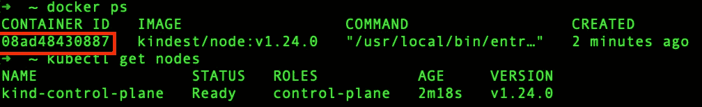

我们所有的操作都将从主`kind`节点执行，因此我们需要通过`docker exec -it <kind-container-id> bash`访问它

**例如:**

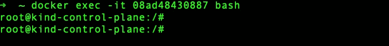

# 创建简单的工作负载

我们将假设我们有一个想要调试的 Nginx 部署，所以让我们用一个副本创建一个 Nginx 部署。这将通过运行以下命令来完成

```
kubectl create deployment nginx --image=nginx
```

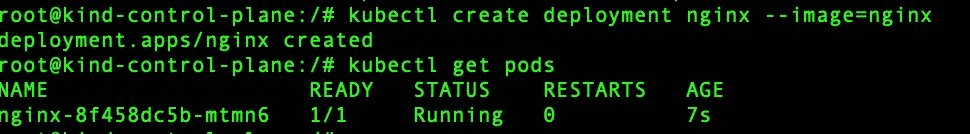

# 网络活动故障排除

排除网络活动故障需要共享网络名称空间，当您将临时容器连接到正在运行的 pod 时，这是默认的 Linux 名称空间。

让我们创建第一个临时容器，我将使用`knicolaka/netshoot`作为新临时容器的图像。该图像包含许多故障排除工具，如`tcpdump`和 strace

```
kubectl debug --it pod-name --image=<ephemeral-container> -- command
```

**举例:**

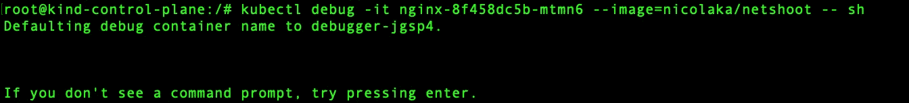

所以让我们确认两个容器共享相同的 Linux 名称空间。打开主节点的新 shell，并运行以下命令

```
systemd-cgls -u kubelet-kubepods-besteffort.slice
```

**示例:**

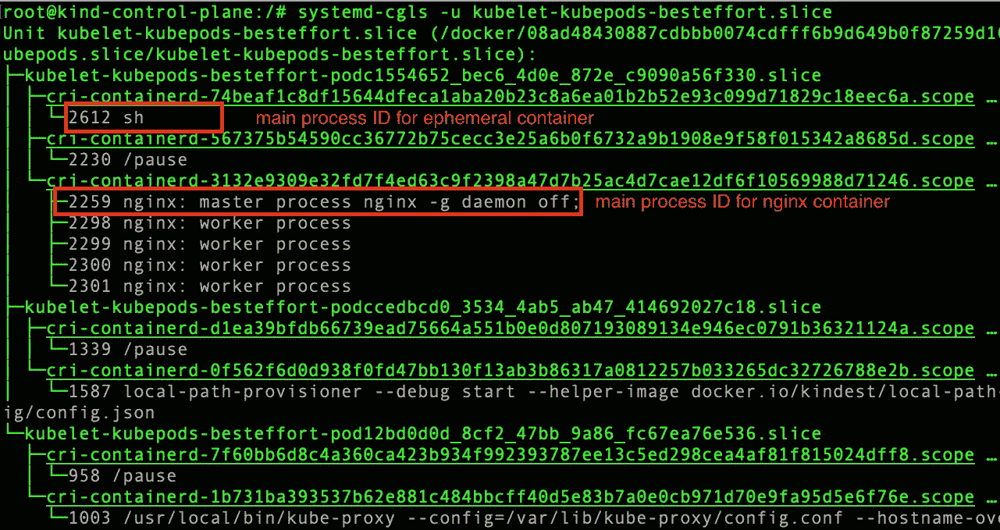

从上面的例子中，我们可以获得两个容器的主进程 id

*   2612 ->临时容器的主进程 ID
*   2259-> Nginx 容器的主进程 ID

现在，让我们检查每个进程的所有 Linux 名称空间

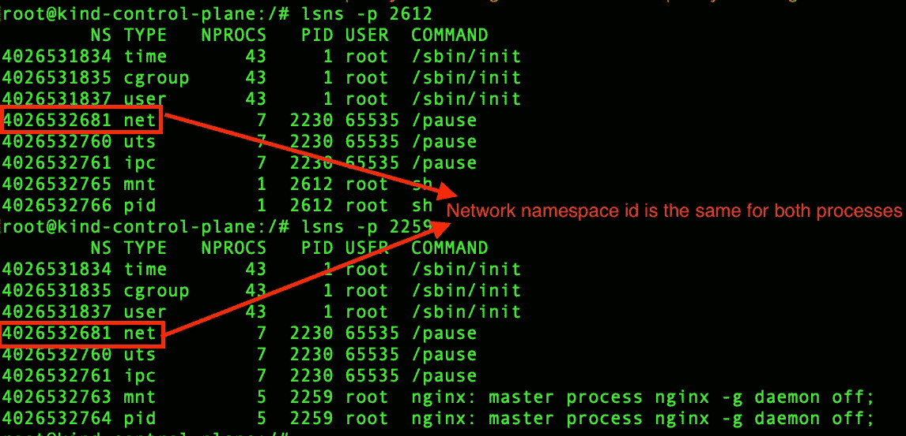

从前面的截图中，我们发现两个进程都有相同的 Linux 网络名称空间 id。

现在让我们从临时容器中转储 Nginx 容器的网络数据包。

在临时容器外壳中，运行以下命令

```
tcpdump -n port 80
```

**示例输出:**

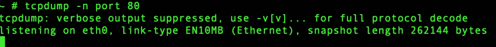

现在，尝试从 k8s 主节点向这个 pod 发送一些请求

```
curl http://pod-ip-adderss
```

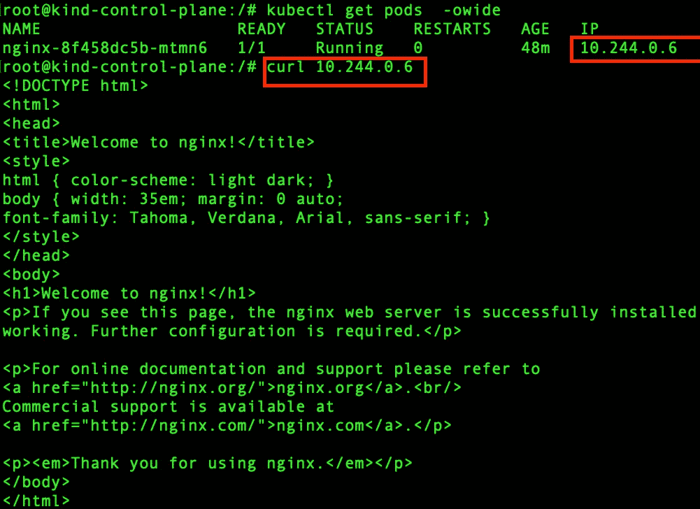

现在，如果您转到临时容器终端，您会发现 TCP 包的转储被打印到输出中:

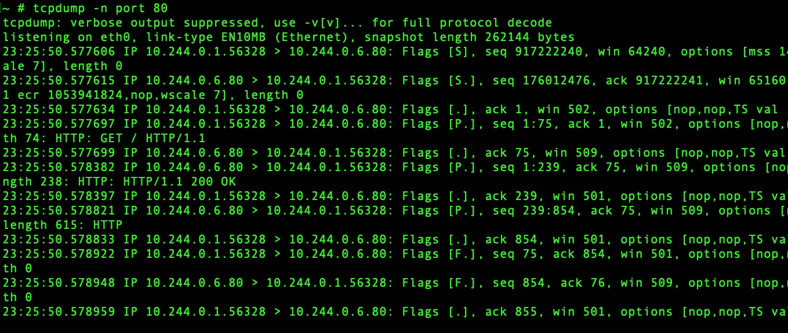

我们完成了第一次演示，现在，我们可以从临时容器中捕获网络数据包。

让我们来看第二个用例。

# 使用临时容器的跟踪/分析过程。

我们的临时容器的下一个用例是从另一个容器跟踪一个容器中运行的进程。

为此，我们需要:

*   这两个容器必须共享同一个 Linux 进程名称空间。
*   短暂的容器必须有 Linux 功能`SYS_PTRACE`

在创建临时容器时，通过添加一个额外的参数`--target=<container-name>`，可以很容易地共享 Linux 进程名称空间

```
kubectk debug -it <pod-name > --image=nicolaka/netshoot --target <container-name> -- bash
```

**例如:**

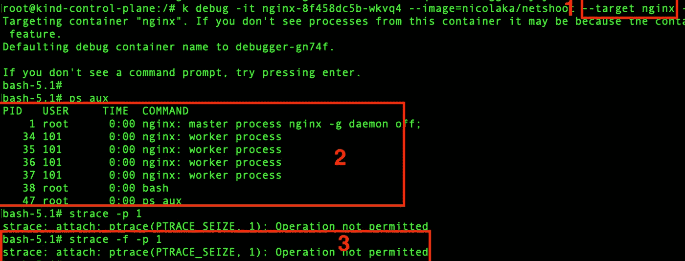

从之前的截图可以看出:

1.  为了共享进程名称空间，我们可以添加一个额外的命令参数`--targer=<cotainer-name>`
2.  从临时容器中，我们可以看到来自`nginx`容器的所有正在运行的进程
3.  我们无法跟踪`nginx`进程，因为临时容器没有发送`ptrace`系统调用所需的权限。strace 命令使用这个系统调用来暂停 Linux 进程，以记录每个`nginx`发送给内核的系统调用。

我们如何解决这个问题？不幸的是，我没有找到从`kubectl`命令向临时容器传递额外权限的方法。所以我们将构造一个 HTTP 请求并发送给 kube API 服务器，而不使用`kubectl`命令。

现在，你可以不经许可就拒绝`strace`。

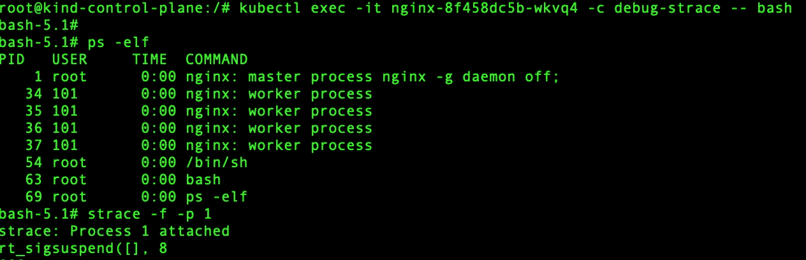

对于这个例子，我添加了一个权限来做`SYS_PTRACE`。但是这取决于您使用的调试器，或者简单地说，您可以给临时容器特权访问。所以你不需要担心你需要允许哪些系统调用。

另外要提到的是，您可以从临时容器中访问`nginx`容器的文件系统。根文件系统在`/proc/<process-id>/root`下。

让我们看看是否可以从临时容器中访问`nginx` config。

**示例:**

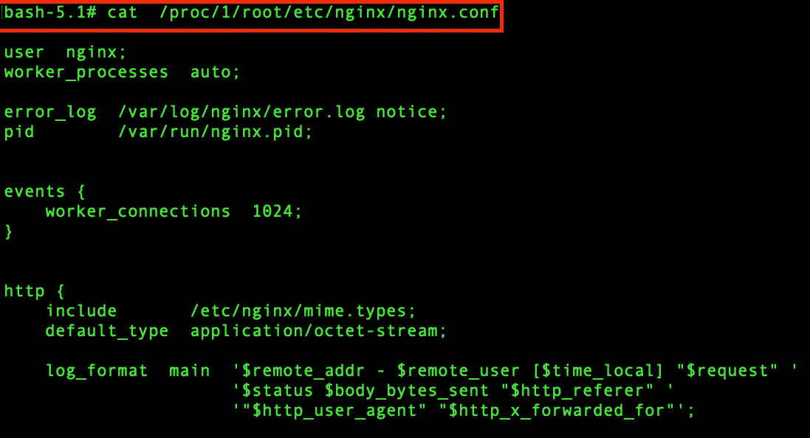

好了，现在让我们开始最后选择的短暂容器用例

# 通过节点上的 shell 进行调试

有时候，您需要访问 k8s 节点，但是您没有对该节点的 ssh 访问或控制台访问。

您可以通过使用临时容器来访问节点

```
kubectl debug node/<node-name> -it --image=<image-name>
```

在节点上创建调试会话时，请记住:

*   `kubectl debug`根据节点名称自动生成新 Pod 的名称。
*   容器在主机 IPC、Network 和 PID 命名空间中运行。
*   节点的根文件系统将安装在`/host`。

如果你希望临时容器的根文件系统与节点相同，你只需要`chroot`到`/host`

**示例:**

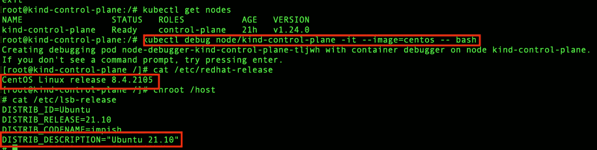

# **参考文献**

*   [https://kubernetes . io/docs/tasks/debug/debug-application/debug-running-pod/](https://kubernetes.io/docs/tasks/debug/debug-application/debug-running-pod/)
*   [https://www . red hat . com/sysadmin/container-namespaces-n 输入](https://www.redhat.com/sysadmin/container-namespaces-nsenter)
*   [https://static . sched . com/hosted _ files/kccncue 2022/70/periodic _ containers . pdf](https://static.sched.com/hosted_files/kccnceu2022/70/Ephemeral_Containers.pdf)