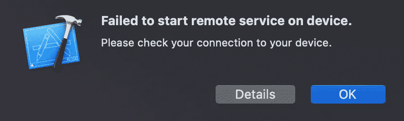
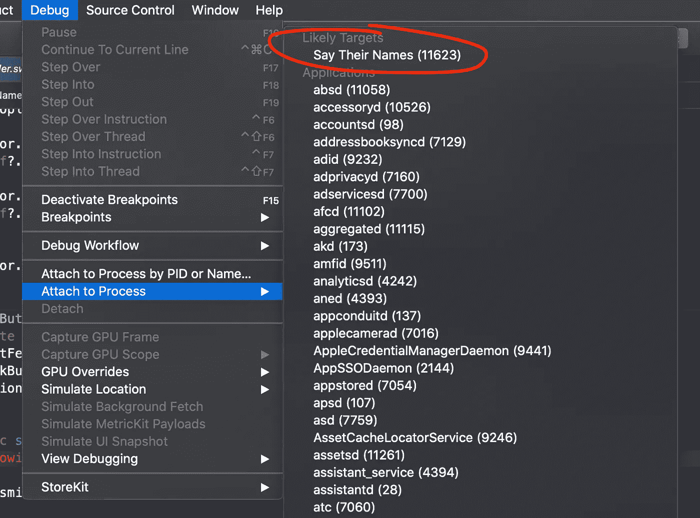

# 使用 Xcode 11 在 iOS 14 上调试

> 原文：<https://betterprogramming.pub/debugging-on-ios-14-with-xcode-11-d332f12f49dd>

最初发布于 2020 年 10 月 12 日[hybridcattt.com](https://hybridcattt.com/blog/debugging-on-ios14-with-xcode-11/)

每年我们都会推出新的主要 iOS 版本来测试我们的应用。幸运的人可以立即升级到最新的 Xcode 12，基于最新的 iOS 14 SDK 构建。其他一些更大的项目可能需要一段时间才能升级。同时，这些项目必须用 Xcode 11 构建。但即使这些应用还不能升级，它们仍有望在最新的 iOS 上运行良好。而解决问题和 bug 需要调试。

我最近面临一个罕见的相机 bug，它只在装有 iOS 14 的 iPhone 11 Pro 上重现。该应用程序尚未升级，是用 Xcode 11 构建的。这个 bug 非常关键，我们不能等到升级到 Xcode 12。

开箱即用，旧版 Xcode 根本无法与 iOS 14 兼容。然而，通过一些技巧，我不仅可以在 iOS 14 上运行，还可以使用断点进行调试等等。

# 概观

Xcode 中常见的运行操作由几个独立的步骤组成:

*   为设备构建。
*   在设备上安装应用程序。
*   启动应用程序。
*   附加调试器。

这些步骤依赖于 Xcode 能够与物理设备通信，并且通信接口可以在 iOS 版本之间变化。因此，调试用旧版本 Xcode 构建的应用程序需要一些技巧。

# 构建并安装 iOS 14 的调试版本

能够运行最新的 iOS 版本是我们每年都要解决的问题。谢天谢地，同样的解决方案每次都有效。

Xcode 应用程序捆绑包包含它知道如何使用的每个 iOS 版本的支持文件。将 iOS 14 的支持添加到 Xcode 11 中，就是将 iOS 14 的设备支持文件复制到 Xcode 11 中。通常，这些设备支持文件可以从并排安装的 Xcode 12 中复制，从同事的机器中复制，或者从流行的共享 repo 中下载。

它已经被广泛讨论过了，所以这里有一篇我喜欢的关于这个话题的文章[。](https://faizmokhtar.com/posts/how-to-fix-xcode-could-not-locate-device-support-files-error-without-updating-your-xcode/)

# 启动应用程序

使用默认设置，调试应用程序版本将在安装后自动尝试在所选设备上启动。不幸的是，Xcode 11 不知道如何在 iOS 14 上启动应用，所以我们每次都会收到这个烦人的错误提示:“无法在设备上启动远程服务。请检查您与设备的连接。



不过，我们仍然可以手动启动应用程序。我们可以通过禁用自动启动来避免每次都弹出错误提示。通过禁用“调试可执行文件”复选框，可以在方案设置中更改此行为:


这将阻止应用程序自动启动并尝试附加调试器。

如果应用程序已经在运行，安装该应用程序会将其终止。这是知道它已被成功重新安装的一种方式。从那以后，只需要用手点击图标就可以启动了。

# 记录

如上所述，用 Xcode 11 构建应用程序，并在设备上手动安装和启动后，就可以测试应用程序了。

如果我们还想查看日志，我们可以在控制台应用程序中查看它们。为了让应用程序的日志显示在那里，我们需要使用相对较新的系统`os`框架来记录它们:

```
import os
...
func logError(_ msg: StaticString, _ params: Any...) {
    os_log(msg, log: OSLog.default, type: .error, params)
}
...
logError("Value: %{public}@", property)
```

使用`%{public}@`而不仅仅是`%@`允许我们即使没有附加调试器也能看到变量。默认情况下，变量是私有的，以防止通过日志泄露敏感数据。[阅读更多关于 SwiftLee](https://www.avanderlee.com/workflow/oslog-unified-logging/) 上统一日志的信息。

可以检查设备日志，可以通过许多参数进行过滤，如应用程序名称、日志级别等:


我用日志级别`.error`记录了我的应用程序的消息，因为它们在每条消息旁边都有一个明显的黄点，这样更容易过滤掉大多数系统消息。

值得一提的是，用`NSLog`记录的消息也会显示在控制台应用程序中。我不建议在 Swift 代码中使用`NSLog`，因为`os_log`是目前苹果平台上的首选登录方式。

到目前为止，我们可以在 iOS 14 上构建、启动和测试应用程序，并使用系统控制台应用程序检查日志，所有这些都是在专门使用 Xcode 11 的情况下进行的。

但是有时仅仅日志是不够的——使用断点进行调试对于 bug 调查来说经常是必要的。

# 断点

可惜 Xcode 11 不知道如何在 iOS 14 上调试应用。但是 Xcode 12 有！为了让断点工作，我们必须在这一步使用 Xcode 12。

有两个选项可以让调试器为已经用 Xcode 11 编译的应用程序运行。我们可以将调试器附加到已经运行的应用程序上，或者让 Xcode 12 也启动应用程序并为我们附加调试器。

## 从 Xcode 12 启动

在使用 Xcode 11 (cmd+B)构建目标后，切换到 Xcode 12，并通过进入菜单选项`Product > Perform Action > Run Without Building`或使用 cmd+control+R 来执行`Run Without Building`，这将安装并启动应用程序，并附加调试器。

使用这种方法，我们不需要在方案设置中禁用自动启动或调试，因为我们在这一步使用 Xcode 12，它知道如何与 iOS 14 设备对话。然而，有一个缺点，那就是我们需要使用 Xcode 12 来运行应用程序。*只有当你总是需要断点，并且总是在 Xcode 版本之间切换的麻烦对你来说是值得的时候，我才会推荐这样做。*

非常感谢杰夫·哈克沃斯的建议！

## 将调试器附加到正在运行的应用程序

如果出于某种原因，你不想使用 Xcode 12 运行，可以手动将调试器附加到已经启动的应用程序(正在运行的进程)。

在测试应用的任何时候，我们都可以在 Xcode 12 中打开项目，并通过进入菜单选项`Debug > Attach to Process`并选择应用的进程来连接调试器。应用程序名称应出现在“幸运目标”下。这可能需要几次尝试，但它的工作！



## Xcode 12 上调试的限制

通过附加调试器(通过从 Xcode 12 运行或手动附加)，可以照常导航断点。我们可以在任何地方停下来，跨过去，走进去，等等。我们也可以正常看到堆栈痕迹。我们可以调试视图层次结构，探索内存图，甚至覆盖文本大小或黑暗模式等环境设置，同时在 iOS 14 设备上运行用 Xcode 11 创建的调试版本。

有一个限制—当在断点处暂停时，对变量的访问非常有限。大多数 Swift 变量都无法查看，调试器命令如`po`也不起作用。那是因为这个错误:`Cannot load Swift type information; AST validation error in <...>: The module file format is too old to be used by this version of the debugger`。然而，`po`似乎在 UI 调试器中工作，我们可以在那里编写任何 Objective-C 代码。这并不理想，但也是我们可以努力的。

对于调试器无法访问 Swift 变量的情况，如上所述，良好的旧日志记录会有所帮助。

尽管调试功能有些有限，但通常能够暂停、单步执行代码路径和查看堆栈帧就足以找到 bug 的原因。

## 如何防止 Xcode 12 意外重建

由于我们使用 Xcode 11 构建，但在 Xcode 12 上运行和调试，我们可能会意外地在 Xcode 12 上重建，并最终测试一个与最初预期非常不同的应用程序版本。为了避免在 Xcode 12 用于调试时意外构建，我们可以为这种情况添加一个条件编译错误:

```
#if compiler(>=5.3)
#error("This project should not be built on Xcode 12")
#endif
```

这段代码可以放在源代码中的任何地方。用低于 5.3 的任何版本的 Swift 编译器编译源代码时，跳过`#error`指令，对应 Xcode 11 或更旧版本。这样，在 Xcode 12 上意外构建甚至在技术上也是不可能的。

# 包扎

即使我们这些没有那么幸运能够马上升级到 Xcode 12 的人也可以在运行 iOS 14 的设备上运行和调试应用程序。完全坚持 Xcode 11 是可能的，偶尔求助于 Xcode 12 来获得断点和额外的东西，比如 UI 调试器。我找到了我的关键错误并修复了它，我希望有一天这些技巧也能帮助其他人。

感谢阅读。我希望你喜欢这篇文章🙌

最初发布于 2020 年 10 月 12 日，hybridcattt.com