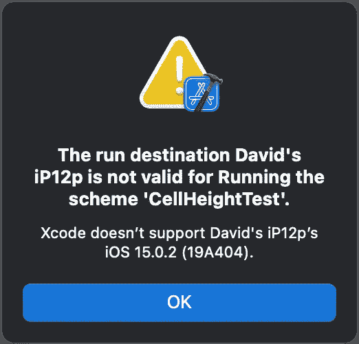
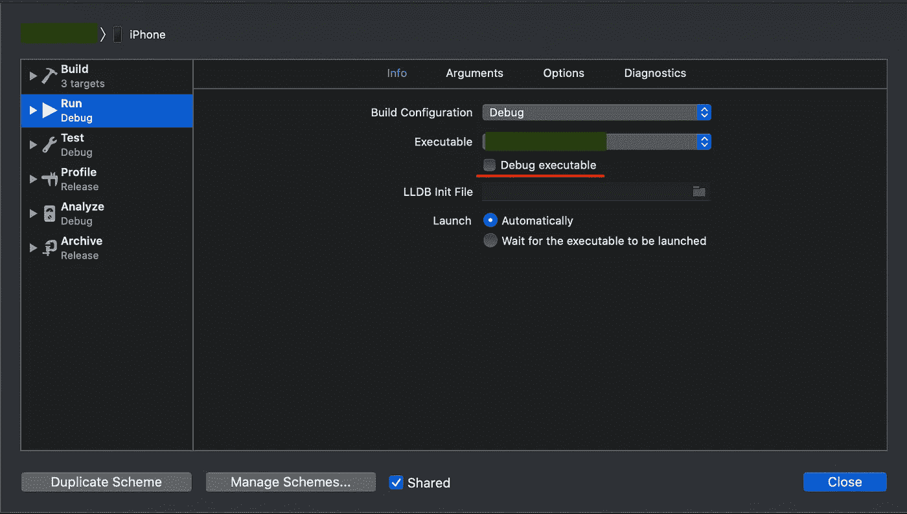
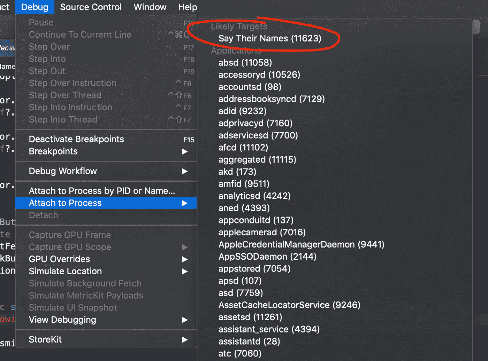
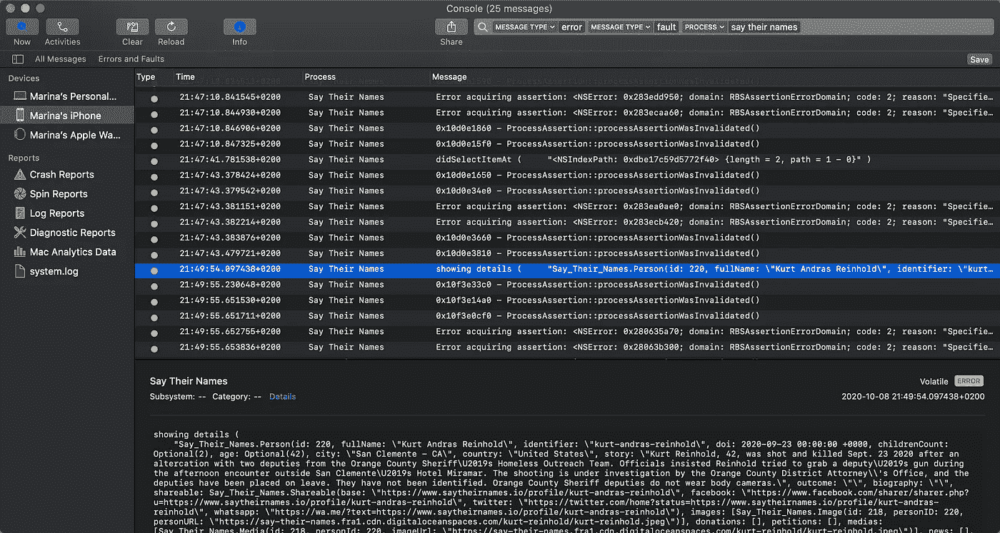

# 使用 Xcode 12 在 iOS 15 上调试

> 原文：<https://betterprogramming.pub/debugging-on-ios-15-with-xcode-12-8d3ca7487bd2>

## 如果你的应用程序仍然需要 Xcode 12.5 来构建，它仍然必须在 iOS 15 上工作良好。本文展示了如何使用 Xcode 12 调试 iOS 15 上的应用程序


在 [Unsplash](https://unsplash.com?utm_source=medium&utm_medium=referral) 上由[伊韦克·诺斯](https://unsplash.com/@imkirk?utm_source=medium&utm_medium=referral)拍摄的照片

每年我们都会推出新的主要 iOS 版本来测试我们的应用。幸运的人可以立即升级到最新的 Xcode 13，基于最新的 iOS 15 SDK 构建。其他一些更大的项目可能需要一段时间来升级，同时必须使用 Xcode 12.5 来构建。

开箱即用，较旧的 Xcode 版本无法与较新的 iOS 版本兼容。如果您尝试在 Xcode 12.5 上使用 iOS 15 设备，该设备将被标记为不受支持，并且在运行时会出现错误:

```
The run destination is not valid for running the scheme. Xcode doesn’t support iOS 15.
```



然而，通过一些技巧，我不仅可以在带有 Xcode 12.5 的 iOS 15 上运行，还可以使用断点进行调试等等。

> *如果你在找去年的帖子，就在这里:* #error("This project should not be built on Xcode 13")
> #endif
> 
> 这段代码可以放在源代码中的任何地方。当使用低于 5.5 的任何版本的 Swift 编译器编译源代码时，跳过`#error`指令，该版本对应于 Xcode 12.5 或更旧版本。这样，在 Xcode 13 上意外构建甚至在技术上也是不可能的。
> 
> # 没有安装 Xcode 13
> 
> 如果由于某种原因无法在机器上安装 Xcode 13，仍然有办法在装有 iOS 15 的设备上运行和调试。
> 
> Xcode 中常见的运行操作由几个独立的步骤组成:
> 
> *   为设备构建。
> *   在设备上安装应用程序。
> *   启动应用程序。
> *   附加调试器。
> 
> 这些步骤依赖于 Xcode 能够与物理设备进行通信，并且 iOS 版本之间的通信接口会发生变化。因此，调试用旧版本 Xcode 构建的应用程序需要一些技巧。
> 
> # 使用 Xcode 12 构建并安装 iOS 15 的调试版本
> 
> 能够运行最新的 iOS 版本是我们以前每年都要解决的问题。谢天谢地，同样的解决方案每次都有效。Xcode 应用程序捆绑包包含它知道如何使用的每个 iOS 版本的支持文件。
> 
> 为了在 Xcode 12.5 中增加对 iOS 15 的支持，我们需要将 iOS 15 的设备支持文件复制到 Xcode 12 中。
> 
> 通常，它们是从 Xcode 13 复制的(从同事的机器上或从流行的共享 repo 下载)。
> 
> 它已经被广泛讨论，所以这里有一篇我喜欢的关于这个主题的文章:[如何修复 Xcode:“找不到设备支持文件”错误](https://faizmokhtar.com/posts/how-to-fix-xcode-could-not-locate-device-support-files-error-without-updating-your-xcode/)。
> 
> # 启动应用程序
> 
> 使用默认设置，调试应用程序版本将在安装后自动尝试在所选设备上启动。可悲的是，Xcode 12.5 并不完全知道如何在 iOS 15 上启动应用程序——它会尝试，但应用程序会在启动屏幕上冻结(至少我是这么体验的)。
> 
> 我们可以通过在启动期间禁用调试来解决冻结问题。别担心，我们可以在 app 成功启动后重新附加调试器。
> 
> 要在启动期间禁用调试，请禁用“调试可执行文件”复选框:
> 
> 
> 
> 禁用此复选框后，应用程序将正常启动，尽管没有调试器。该应用程序可以使用，日志如预期的那样显示在 Xcode 的控制台中。参见下面如何让断点工作。
> 
> # 使用断点调试
> 
> 如果需要适当的调试，我推荐在侧面安装 Xcode 13(更简单的选项)，见上图:[安装 Xcode 13](https://hybridcattt.com/blog/debugging-on-latest-ios-with-older-xcode#with-xcode-13-installed)。如果这不可能，Xcode 12.5 似乎可以调试运行在 iOS 15 上的应用程序，即使没有安装 Xcode 13，尽管可能会有一些微妙的问题。如果这是你唯一的选择，继续阅读，学习如何让它工作。
> 
> 一旦应用程序启动，我们需要手动将调试器连接到正在运行的进程。
> 
> 在测试应用程序的任何时候，我们都可以通过进入菜单选项`Debug > Attach to Process`并选择应用程序的进程来连接调试器。应用程序名称应出现在“可能的目标”下。可能需要几秒钟来连接。
> 
> 
> 
> 一旦成功连接，它会在进程名旁边显示`already being debugged`。
> 
> 可悲的是，一旦附加了调试器，控制台输出就会从 Xcode 的控制台中消失。这是因为控制台被调试器接管，而调试器本身不会将应用程序的标准输出路由到控制台。尽管如此，仍然有一种方法可以访问日志:
> 
> # 记录
> 
> 如果我们还想在手动附加调试器后查看日志，我们可以在控制台应用程序中查看它们。为了让应用程序的日志显示在那里，我们需要使用相对较新的系统`os`框架来记录它们:
> 
> ```
> import os
> ...
> func logError(_ msg: StaticString, _ params: Any...) {
>     os_log(msg, log: OSLog.default, type: .error, params)
> }
> ...
> logError("Value: %{public}@", property)
> ```
> 
> 使用`%{public}@`而不仅仅是`%@`允许我们即使没有附加调试器也能看到变量。默认情况下，变量是私有的，以防止通过日志泄露敏感数据。[阅读更多关于 SwiftLee 上统一日志记录的信息](https://www.avanderlee.com/workflow/oslog-unified-logging/)。
> 
> 可以检查设备日志，可以通过许多参数进行过滤，如应用程序名称、日志级别等:
> 
> 
> 
> 我用日志级别`.error`记录了我的应用程序的消息，因为它们在每条消息旁边都有一个明显的黄点，这样更容易过滤掉大多数系统消息。
> 
> 值得一提的是，用`NSLog`记录的消息也会显示在控制台应用程序中。我不建议在 Swift 代码中使用`NSLog`，因为`os_log`是目前苹果平台上的首选登录方式。

# 包扎

即使我们这些没有那么幸运能够马上升级到 Xcode 13 的人也可以在运行 iOS 15 的设备上运行和调试应用程序。

通过在侧面安装 Xcode 13，我们可以在 iOS 15 上赋予 Xcode 12.5 完整的调试能力。我们还可以在 iOS 15 上构建、启动和测试应用程序，并使用系统控制台应用程序检查日志，而所有这些都只有 Xcode 12.5。

我希望这些技巧也能帮助其他人:)

感谢阅读。我希望你喜欢这篇文章。要获得关于新帖子的通知，[在 Twitter 上关注我](https://twitter.com/hybridcattt)。

*最初发表于*[T5【https://hybridcattt.com】](http://hybridcattt.com/blog/debugging-on-latest-ios-with-older-xcode)*。本帖由作者在 NC SA 4.0* *下* [*CC 授权。*](http://creativecommons.org/licenses/by-nc-sa/4.0/)