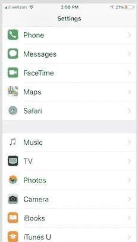
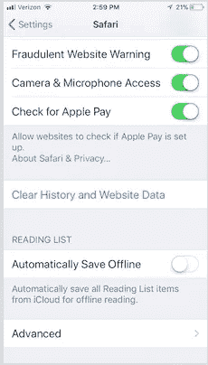
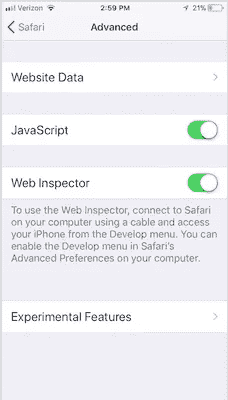
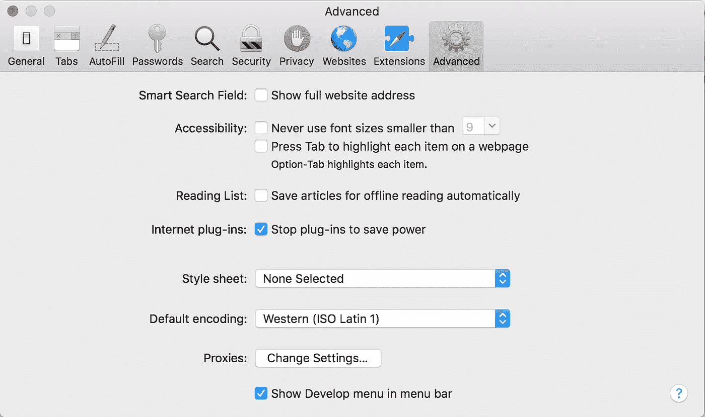
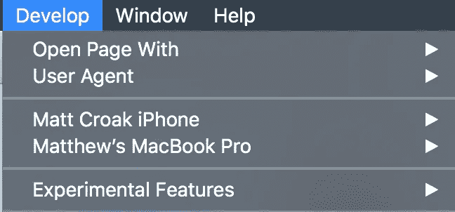
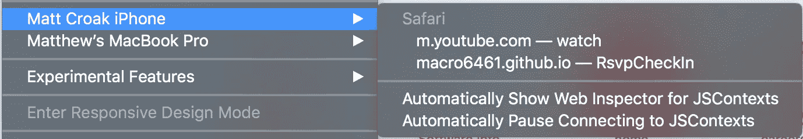
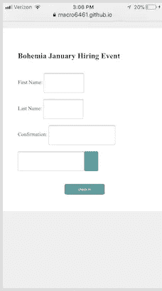
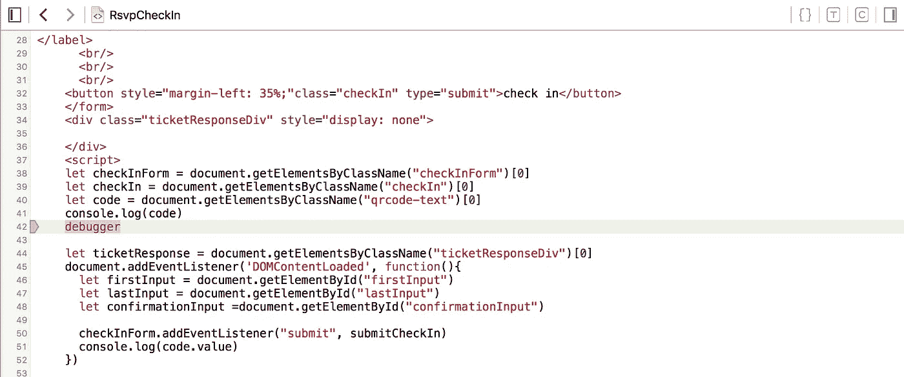
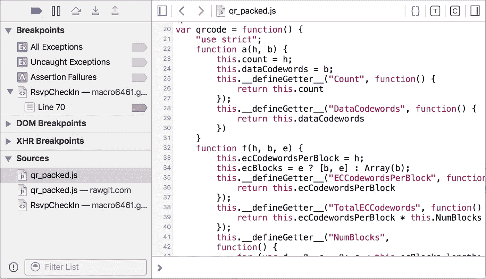
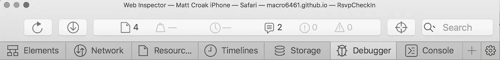

# 使用 Safari 开发工具调试您的 iPhone 移动 Web 应用程序

> 原文：<https://betterprogramming.pub/debugging-your-iphone-mobile-web-app-using-safari-development-tools-71240657c487>

## 如何为您的用户提供出色的移动网络体验

通过 [Pixabay](https://www.google.com/imgres?imgurl=https%3A%2F%2Fcdn.pixabay.com%2Fphoto%2F2016%2F11%2F14%2F14%2F12%2Fvintage-1823625_960_720.png&imgrefurl=https%3A%2F%2Fpixabay.com%2Fillustrations%2Fedward-lear-sketch-vintage-1823625%2F&tbnid=vQdzbXrNeQjMrM&vet=12ahUKEwiD15aJw7PpAhXwxcQBHRTNCE4QMygIegUIARCsAg..i&docid=aBZ5kc5GEYXPRM&w=960&h=565&q=bug%20gif&hl=en&client=firefox-b-d&ved=2ahUKEwiD15aJw7PpAhXwxcQBHRTNCE4QMygIegUIARCsAg) 的插图

我当时正在开发一个移动 web 应用程序，用于扫描二维码以登记某人参加招聘活动，我想确保从二维码解码的数据是正确的。我还想确保我的一个关键函数的条件语句被正确地求值。在谷歌浏览器控制台的帮助下，我可以在笔记本电脑上轻松完成这项工作。

对于那些不熟悉谷歌 Chrome 控制台的人来说，这是一个非常有用的开发工具，你所要做的就是放置调试器、控制台日志等。在您想要调试的代码部分中。

您在控制台打开的情况下运行程序，一旦程序运行到具有调试器的代码行，它就会暂停程序，以便您可以测试函数范围内的变量和其他重要值。更多关于谷歌 Chrome 控制台的信息，请点击[链接](https://developers.google.com/web/tools/chrome-devtools/console/)。

不幸的是，谷歌 Chrome 还没有手机控制台功能。

经过一点点研究，我在 Safari 中找到了一个非常有用的解决方案，这是一个我已经很多年没用过的浏览器。它可以实现与谷歌 Chrome 控制台几乎相同的功能，无需下载或任何额外的工作——除了更改 iPhone 和 Mac 上的一些设置。你可以这样做:

## 在你的 iPhone 上

打开 iPhone 设置，然后选择 Safari。

进入 Safari 设置后，打开高级设置。

在“高级设置”中，启用 JavaScript(如果尚未启用)，然后启用 Web 检查器。

## 在你的电脑上

转到您的 Safari 偏好设置，在“高级”标签下，选中“在菜单栏中显示开发菜单”旁边的框

现在，您应该会在书签和窗口之间看到一个 Develop 选项卡。连接电话后，单击电话名称旁边的箭头。

这将打开另一个下拉列表，列出您在手机上打开的浏览器。

你必须在手机上打开浏览器窗口，否则你不会在下拉列表中看到它。当您看到项目的 URL 时，请选择它。这将打开 Safari 控制台。

Safari 控制台打开后，您现在可以在移动网络浏览器上看到控制台和 DOM 之间的交互。

你可以看到它的工作方式与 Chrome 控制台相似。当您打开检查器并将鼠标悬停在 HTML 元素上时，该元素将在 DOM 中高亮显示。

现在，您所要做的就是将调试器和控制台日志放在代码中所需的位置，并开始调试。

为了单步调试调试器，而不是仅仅恢复整个程序，请单击窗口左上角的页面图标。若要单步执行调试器后的下一行，请单击“暂停”按钮右侧的箭头。

Safari 控制台也提供了类似 Chrome 控制台的标签。

您看到了 Elements 选项卡，在这里您可以检查 DOM 元素。然后是 Debugger 选项卡，您可以在这里查看您的 JavaScript。“网络”选项卡允许您监控您的网络活动。时间轴选项卡帮助您跟踪请求、渲染和 JavaScript 事件。您还可以看到控制台记录了多少项，并且控制台还提供警告和错误警报。

Safari 开发者工具为开发提供了很多选项和设置，所以可以随意使用它们。你有什么想法？请随意评论您喜欢或不喜欢的功能，以及其他移动调试替代方案。调试愉快！

在此 *将您的免费媒体会员升级为付费会员，每月只需 5 美元，您就可以收到来自各种出版物上数千名作家的无限量无广告故事。这是一个附属链接，你的会员资格的一部分帮助我为我创造的内容获得奖励。谢谢大家！*

# 参考

 [## 如何在 iPhone 的 Safari 中激活调试控制台

### 在 iOS 6 之前，iPhone 的 Safari 网络浏览器有一个内置的调试控制台，开发者可以使用它来跟踪…

www.lifewire.com](https://www.lifewire.com/activate-the-debug-console-in-safari-445798)  [## 在 windows 上远程调试 safari(iphone/ipad)(iOS 11+)

### 安装节点安装 iTunes 并将其连接到您的设备。(您的 iPad/iPhone 上会出现一个弹出窗口，要求您…

link.medium.com](https://link.medium.com/TuBBlUDqh6)  [## 使用控制台 Web 开发人员工具| Google 开发人员

### 了解如何导航 Chrome DevTools JavaScript 控制台。

developers.google.com](https://developers.google.com/web/tools/chrome-devtools/console/)