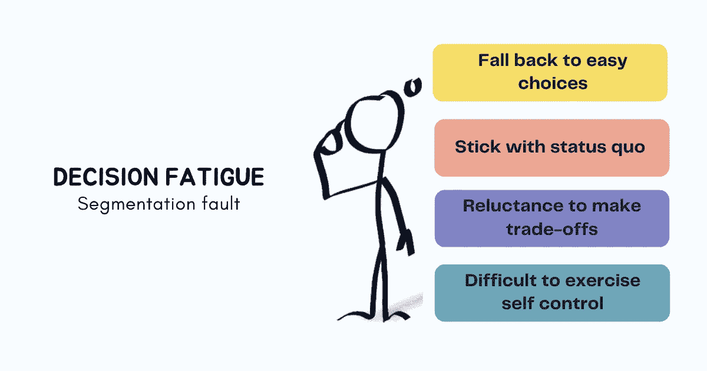

# 决策疲劳:不要挤出你的每一点注意力

> 原文：<https://betterprogramming.pub/decision-fatigue-dont-squeeze-out-every-bit-of-your-attention-cb2de46d87ae>

## 如何做出更好的决策

鸣谢:作者

当我们开始工作时，我们的脑海中充斥着各种想法——我应该回复昨晚收到的电子邮件还是老板的信息，喝杯咖啡怎么样，为什么不开始我整个星期都在逃避的项目，或者只是快速补上我昨天错过的会议…

这些分散在我们一天中的一系列小决定可能在那一刻看起来无害，因为它们似乎只需要我们精神能量的一小部分。但是随着时间的推移，我们继续消耗这个储备池中的能量，我们做决定的心智能力开始枯竭。

与我们可以感受到并即时表达的身体疲劳不同，在做出多个决定后产生的精神疲劳是我们看不到的。

心理学家喜欢称之为“决策疲劳”的“T1”会导致低质量的决策——我们不愿意做出取舍，依赖简单的选择，甚至在做出一系列决定后，可能会发现很难进行自我控制。

> “如果你的工作需要你整天做出艰难的决定，在某个时候你会筋疲力尽，开始寻找保存能量的方法。你会找借口逃避或推迟决定。你会寻找最简单、最安全的选择，通常是维持现状。”—罗伊·鲍梅斯特

在工作中经过长时间的决策后，晚上点一份披萨，而不是一顿健康的饭菜，这表明面对决策疲劳，我们对冲动的自制力下降了。社会心理学家罗伊·鲍梅斯特在他关于决策疲劳的研究中把这种无法自我控制的情况描述为.pdf)*。*

*决策疲劳也解释了为什么我们更不愿意批准新想法，发现很难从大量呈现的选项中选择，并最终在晚上做出糟糕的选择，而不是在早上我们储备的精神能量处于最佳状态时做出这些决定。*

*在我们着手减少甚至避免决策疲劳之前，重要的是要认识到它的症状。知道我们什么时候精神能量不足将会使我们避免做出错误的决定，并找到创造性的方法来为重要的决定节省能量。*

# *如何识别你正经历决策疲劳*

*通过观察这些症状来识别你是否正在经历决策疲劳。*

## *变得鲁莽*

*决策疲劳会导致你冲动行事，而不是花时间去思考你的决定的后果。*

*当你依靠直觉或者仅仅因为一阶结果是积极的而选择一个选项，而没有分析你的决定的二阶效应时，它就会出现。*

*花时间思考你的决定的影响，需要在你的心理阶段考虑多种选择，并对它们进行比较。疲惫的头脑无法提供资源来权衡不同的选择，挑战你的假设，并克服做出深思熟虑的决定所需的潜在障碍。*

> *“需要努力在记忆中同时保持几个需要单独行动的想法，或者需要根据规则结合起来的想法。系统 2 是唯一一个可以遵循规则，在几个属性上比较对象，并在选项之间做出慎重选择的系统。自动化系统 1 不具备这些能力。”—丹尼尔·卡内曼*

*当你的系统 2 深思熟虑的思维模式拒绝合作时，你的系统 1 自动思维开始行动。众所周知，系统 1 是凭冲动行事的，或者用丹尼尔·卡内曼的话来说，“这里遵循的是最省力法则”。他会尽量少想。”*

## *选择现状*

*坚持自己知道的很容易，而探索未知需要跨越从舒适到不适的心理边界。*

> *“想象一些你还没见过的东西将会花费很多精力和努力。这部分解释了为什么人们花更多的时间思考问题(他们见过的东西)而不是解决方案(他们从未见过的东西)。它解释了为什么设定目标感觉如此艰难(很难预见未来)。”—大卫·罗克*

*在一天中做了多个决定后，决策疲劳会让你呆在舒适的泡泡里，抵制改变的想法，因为这很不舒服，需要很多努力和精力。*

*在决策疲劳的影响下，在精神疲惫的状态下做出的决定会对你的未来产生巨大的影响。坚持现状会让你*

*   *投资于沉没成本，而忽视未来的多重机会*
*   *忽略技术进步和市场趋势的变化，这需要你重新评估你的策略*
*   *拒绝可能改变公司游戏规则的新产品提案*
*   *看不到做出能带来巨大回报的小改变的价值*

## *坚持分析麻痹*

*做出一个好的决定需要从几个领域获取知识，将不同的想法结合在一起，在探索这些想法的广度和深度之间保持适当的平衡，建立新的联系，然后瞄准几个看起来有希望的候选人。*

*当你的精神机器疲劳时，你会发现很难处理信息来区分一个想法的好坏。这可能会导致过度思考，倾向于想太多，在没有能力给他们一个具体的方向的情况下在想法上来回移动。*

*决策疲劳可能会让你纠结于根本不存在的问题，得出有偏见的结论，并陷入分析瘫痪，认为可能会有更好的结果。它会导致你去追求一个完美的解决方案，而不是在给定的情况下做出最好的决定。*

## *有太多选择*

*决策疲劳不一定是决策太多造成的。也可能是选择太多的结果。我们更喜欢有选择，即使这些选择不一定会增加我们决策的价值。*

*在工作中，太多的选择会导致设计师浪费数小时来确定正确的蓝色色调。营销人员可能会发现很难选择能给他们带来最大投资回报的渠道。招聘经理可能会承担在众多可能性中最终确定一家招聘机构的任务，工程师可能会在战略规划阶段就次要细节进行争论，以确定要采用的具体策略。*

*选择会让人不知所措，过多的选择会在短时间内消耗你的资源，让你没有精力做进一步的决定。*

> *“学会选择很难。学会做好选择更难。在一个充满无限可能的世界里，学会做出正确的选择更难，或许太难了。”—巴里·施瓦茨*

## *积极应对*

*在决策疲劳的作用下，你大脑的调节能力减弱，导致你失去对情绪的控制。这让你周围的一切感觉比平常更强烈。*

*小错误会让你暴跳如雷，不同意见可能会引起愤怒，你可能会对不符合你期望的事情做出过激反应。*

*如果你没有意识到，你大脑中的开关可能会在许多轮决策后翻转，导致你对周围的人和事做出反应，而不是花时间进行分析并采取适当的行动。*

# *如何克服决策疲劳*

*决策疲劳是真实存在的，但也是完全在你控制之下的事情。*

*只有你能设计一个个人系统，最大化你做出最佳决策的机会，而不是试图挤出你的每一点注意力。*

*运用这五种方法来避免决策疲劳。*

## *1.做一个本质主义者*

*我们从醒来的时候就做了大量的决定——有些是有意识的，有些是无意识的；有些微不足道，有些意义重大；有些是可逆的，有些是不可逆的。*

*如果不控制我们通过选择做出的决定的数量，不把我们最大的精力用在那些对我们的生活产生巨大影响的重大决定上，我们最终可能会表现出糟糕的判断力。*

*受格雷格·麦克欧文(Greg McKeown)的启发，当谈到决策时，我们需要成为本质主义者:“本质主义者的方式意味着通过设计而不是默认来生活。本质主义者不是被动地做出选择，而是有意地将重要的少数与琐碎的多数区分开来，剔除不重要的部分，然后消除障碍，让重要的东西清晰、顺畅地通过。换句话说，本质主义是一种有纪律的、系统的方法，用于确定我们贡献的最高点在哪里，然后使这些事情的执行几乎毫不费力”*

*对抗决策疲劳的第一步是以这样一种方式来组织你的生活:你优先考虑什么需要优先考虑，并把你所有的精力放在正确的事情上。*

*所以让我们跳到这一步，通过预先计划让你的承诺可见。*

## *2.把事情从你的脑海中抹去*

*确定与你的目标和价值观一致的活动，对所有无关紧要的活动说不。然后每天花些时间来计划你每天想要达到的目标。预先计划有两大优势。*

1.  *当你开始新的一天时，你不必考虑什么需要你注意。*
2.  *当你发现自己心烦意乱时，它可以作为一个承诺和参照点。*

*不要每时每刻都在思考下一步该做什么，你可以避免决策疲劳，腾出更多的资源来做真正的工作。它还会帮助你以正确的心态处理那些不在你控制之下的紧急情况。*

*将这种实践付诸行动需要大卫·洛克的建议:“为复杂的想法创造视觉效果是最大化有限能源的一种方式。另一种方法是尽可能减少前额皮质的负荷。这个想法是把概念从你的头脑中拿出来，带到这个世界，把舞台留给最重要的功能。最大限度地减少能源使用，以最大限度地提高性能。”*

*摆脱计划的一个好方法是利用艾森豪威尔的生产力矩阵，根据工作的紧迫性和重要性将工作分成四个象限。*

*下一步是对这些优先级进行排序，以优化资源使用——首先吃掉那只青蛙。*

## *3.吃那只青蛙*

*首先解决你最具挑战性的任务，这需要你的大脑以最佳状态处理信息。*

> *“舞台很快就会耗尽电力，随着灯光变暗，将演员保持在正确的位置并阻止其他人登上舞台变得越来越困难。这种倾向意味着当你头脑清醒时，安排最需要注意力的任务。这可能是在清晨，或者可能是在休息或锻炼之后。当你精力充沛时，做一个艰难的决定可能需要 30 秒钟，而当你精力不充沛时，这是不可能的。”—大卫·罗克*

*通过优先考虑对你的生活有最大积极影响的工作，并将工作的精神需求与你的能量水平相匹配，你将能够在不受决策疲劳影响的情况下做出最佳决策。*

*当事情不如你所愿时，你会怎么做？*

## *4.相信你有更多的意志力*

*尽管我们渴望一个有组织的世界，喜欢掌控一切，但事情并不总是按照计划进行。*

*你可能会在累的时候被迫做出决定。那你应该怎么做——拒绝做决定？嗯，有时候这是不可能的。*

*斯坦福大学心理学教授卡罗尔·德韦克发现，“虽然决策疲劳确实会发生，但它主要影响那些认为意志力很快耗尽的人。”她指出，“只有当人们相信意志力是一种有限的资源时，他们才会在繁重的任务后感到疲劳或精疲力竭，但当他们相信意志力不是如此有限时，他们就不会了。”她指出，“在某些情况下，那些相信意志力没有那么有限的人在完成一项繁重的任务后实际上表现得更好。”*

*这并不意味着，如果你坚持做一个又一个决定，你永远不会感到决策疲劳。相反，它引导你相信一种成长的心态，并在艰难的情况下锻炼你的意志力，即使你的精神资源已经耗尽，你也必须做出决定。*

*在这样的时刻锻炼自己的意志力，你可能不会做出最好的决定，但会比没有意志力的决定好很多。*

## *5.知道什么时候该停止*

*社会心理学家罗伊·鲍梅斯特因其在意志力、自控力和自尊方面的研究而闻名，他说:“最好的决策者是那些知道什么时候不要相信自己的人。即使是最聪明的人也不会在没有休息和血糖低的时候做出正确的选择。这就是为什么真正明智的人不会在下午 4 点重组公司。他们不会在鸡尾酒会上做出重大承诺。如果必须在当天晚些时候做出决定，他们知道不要空腹做。”*

*知道什么时候该停下来——从你过去的决定中获取反馈，根据你最好和最差的决定确定模式，并将其纳入你的计划。*

*通过知道什么时候你运作良好，什么时候你身体在场但精神不在，你可以选择退出决策过程，把这些决策推到以后的阶段。*

*做自己生活的主人。不要让它自动运行。要做到这一点，要学会做一些决定，并通过成为一个本质主义者来做好这些决定，把事情从你的脑海中抹去，吃掉那只青蛙，锻炼你的意志力，当你没有增加价值时选择退出。*