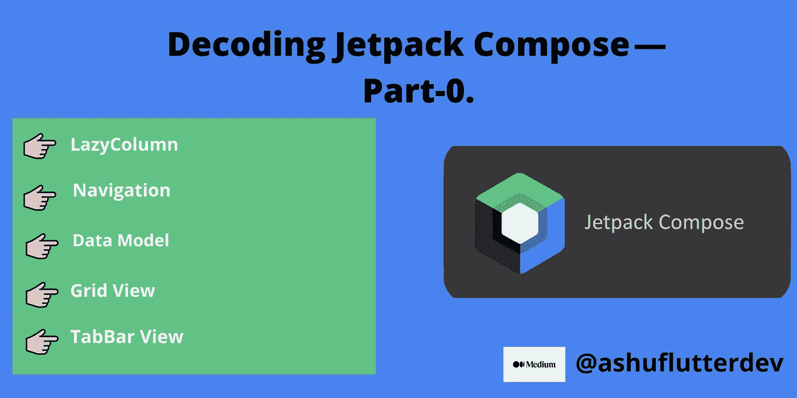
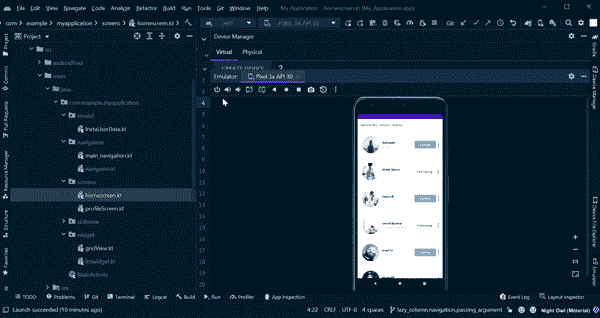
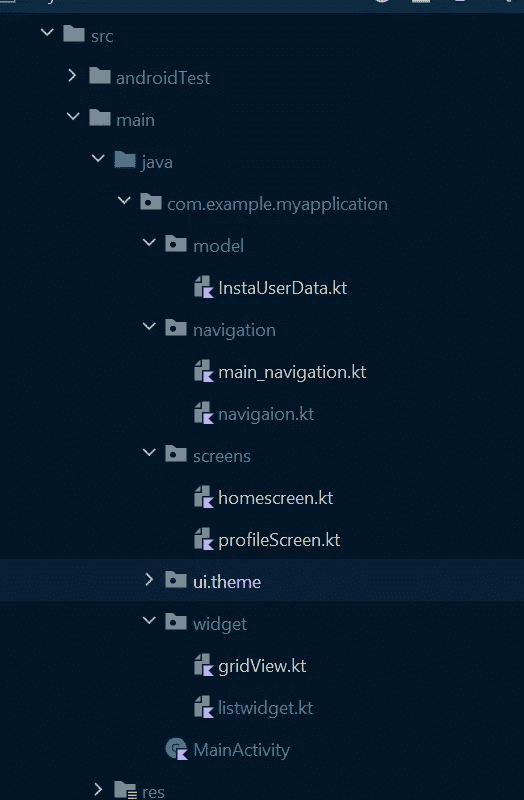

# 解码 Jetpack 组合— LazyColumn、导航架构、数据模型、网格和 TabBar 视图

> 原文：<https://betterprogramming.pub/decoding-jetpack-compose-part-0-48d9139f65db>

## 第 0 部分



自从**[**jetpack-compose 1.0**](https://android-developers.googleblog.com/2021/07/jetpack-compose-announcement.html)稳定发布后，我开始探索 UI 框架。**

**声明式用户界面是未来的趋势，所以我想我应该试一试——相信我，我很喜欢它。**

**如果你来自一个 [Flutter](http://flutter.dev/) 背景或者任何声明式 UI 背景，那么理解 Jetpack Compose 声明式 UI 实现是非常容易的。**

# **你将建造什么**

**让我们跳到精彩的部分:**

****

**[项目演示]**

**如果你是 jetpack-compose 的新手，你可以通过阅读这篇文章开始你的[旅程。](https://ashuflutterdev.medium.com/building-counter-app-like-flutter-using-jetpack-compose-1-0-67ac3b13a778)**

# **项目结构**

****

**[项目结构]**

*   **`Model` —该文件夹包含数据类和伪数据。**
*   **`Screens` —此文件夹包含应用程序的屏幕。**
*   **`Navigation` —该文件夹包含导航结构。**
*   **`Widget` —该文件夹包含一些可重用撰写小部件**

**让我们直接进入代码吧！**

# ****1。数据模型****

**开始创建数据类— `InstaUserData`是一个只读类(没有 setters)，所以我们需要使用如下所示的`val`关键字:**

```
data class InstaUserData
    (
    val id: String,
    val username: String,
    val name: String,
    val isFollow: Boolean,
    val bio: String,
    val profilePic: String,
    val post: Int,
    val noOfFollowers: Int,
    val noOfFollowing: Int,
    val imagePost: *List*<String>,

    )
```

**现在让我们用返回列表`InstaUserData` **的虚拟数据创建一个函数。****

```
fun getUsers(): *List*<InstaUserData> {
    return *listOf*(
        InstaUserData(
            id = "1",
            username = "ashu8", name = "Ashutosh",
            isFollow = false,
            post = 12,
            noOfFollowers = 30,
            noOfFollowing = 30,
            imagePost = *listOf*(
                "https://i.picsum.photos/id/1005/5760/3840.jpg?hmac=2acSJCOwz9q_dKtDZdSB-OIK1HUcwBeXco_RMMTUgfY",
                "https://i.picsum.photos/id/1024/1920/1280.jpg?hmac=-PIpG7j_fRwN8Qtfnsc3M8-kC3yb0XYOBfVzlPSuVII",
                "https://i.picsum.photos/id/1015/6000/4000.jpg?hmac=aHjb0fRa1t14DTIEBcoC12c5rAXOSwnVlaA5ujxPQ0I"
            ),
            bio = "Unapologetically Me.\\n\" +\n" +
                    "                    \"An introvert soul stuck into an extrovert body. ",
            profilePic = "https://i.picsum.photos/id/1005/5760/3840.jpg?hmac=2acSJCOwz9q_dKtDZdSB-OIK1HUcwBeXco_RMMTUgfY"
        ),
)
}
```

# **2.惰性柱**

**一个`[LazyColumn](https://developer.android.com/reference/kotlin/androidx/compose/foundation/lazy/package-summary#lazycolumn)`是一个垂直滚动的列表，它只组成和布局当前可见的项目。它类似于经典 Android View 系统中的一个`RecyclerView`。**

**`listview.kt`的代码如下所示:**

**[列表视图文件]**

**首先，在 widget 文件夹中添加`listwidget`文件。**

**在该文件中，编写"`BuildList`"可组合函数，其参数采用一个`InstaUserData`的`list`和一个`onClick`函数`onItemClick`。**

1.  **`BuildList`可组合函数取`LazyColumn`。在惰性列中有一个方法`item`，它采用`List<T>`，其中`T`是`Type`——在我们的例子中，item 是`List<InstaUserData>`。**
2.  **正如你所看到的，UI 列表有一个`User`图像、`name`、`username`和一个`button`在`Row`中，所以在 item 方法中，我们传递了可组合为 lambda 的`Row`。在`Row`中，有一个修饰符`clickable`使得每一行都是可点击的，它采用我们在`BuildList`函数中定义为参数的函数`onItemClick`，并借助于`it`(在后面的`lambda`函数中，参数将被隐式声明在名称`it)`下，关键字我们可以得到列表的 id。**
3.  **为了从互联网上获取用户图像，我们必须在依赖关系部分下的`build.gradle`文件中添加 [**线圈**](https://coil-kt.github.io/coil/compose/) 库:**

```
dependencies {
.....
    implementation "io.coil-kt:coil-compose:<latest-version>"
}
```

**现在使用`rememberImagePainter`函数创建一个可以由`Image`组件绘制的`ImagePainter`。**

**4.可组合垫片用于填充剩余空间。**

**5.制作一个带有参数的`BuildButton Composable`,参数包括按钮的名称和颜色。在`InstaUserData`类中有一个参数:`isFollow`，它接受布尔值，因此在`isFollow`的帮助下，我们可以在这里检查它是否为真，然后它返回下面的按钮 else Follow。**

**6.在`Image`的帮助下添加更多图标，可使用打印机资源功能从可绘制文件夹中获取图像。**

**那么我们完成了`ListView`让我们开始导航编码，当用户点击任何用户列表时，它导航到用户详细信息屏幕。**

# **3.导航建筑**

**导航组件——一套现代工具和库，用于处理 android 中复杂的导航案例。**

**导航组件有 3 个主要部分:**

**`NavigationGraph`I .)
ii .)`NavHost`
iii。)`NavController`**

**在`navigation`文件夹中添加`kotlin`文件`navigation.kt` **。**在这个文件中，我们将创建一个`enum`并列出应用程序所有可能的屏幕。**

**`Navigation_enum.kt`的代码是:**

**[导航枚举文件]**

1.  **创建枚举类名`NavigationScreen`并将所有屏幕定义为枚举
    ，因为第一个屏幕是`MainScreen`，下一个是`DetailsScreen` **。****
2.  **在 enum 类内部创建一个`companion`对象(companion object 就像一个`static`关键字来声明类的成员并使用它们而不创建任何对象)在 companion 对象内部创建一个从`NavigationScreen`继承而来的函数`fromRoute`，然后我们使用`when`关键字来检查路由。**

**完成`NavigationScreen`后，我们必须创建实际导航，只需转到导航文件夹创建一个新的`kotlin`文件。`main_navigation.kt`**

**基本上，在这个文件中，我们将创建一个我在上面讨论过的结构，让我们开始吧。**

# **创建**导航控制器****

**但是首先，您必须向您的`build.gradle`文件添加依赖项**

```
dependencies {
 .....
implementation("androidx.navigation:navigation-compose:<latest-version>")
}
```

**`NavController`是导航组件的核心 API。它是有状态的，跟踪组成应用程序屏幕的组件的堆栈以及每个屏幕的状态。**

**您可以通过使用您的可组合组件中的方法来创建一个`NavController`:**

```
val navController = rememberNavController()
```

# **创建 NavHost**

**每个`NavController`必须与一个单独的`NavHost`组件相关联。**

**创建`NavHost`需要之前通过`rememberNavController()`创建的`NavController`和您的图表的起始目的地的路线。**

```
NavHost(navController = navController, startDestination = NavigaionScreen.*MainScreen*.name) **{

//here we put actual graph builder( Nav Graph)** *composable*(
        NavigaionScreen.*MainScreen*.name
    ) **{** HomeScreen(navController = navController)
    **}** *composable*(
        NavigaionScreen.*DetailScreen*.name
    ) **{** DetailScreen(navController = navController)
    **}****}**
```

## ****传递导航参数****

**让我们假设当用户点击任何列表时，我们必须将用户 id 传递给下一个页面，并根据用户 id 获取用户数据。**

```
*composable*(NavigaionScreen.*DetailsScreen*.name +"/{userId}", **//1**
    arguments = *listOf*(*navArgument*(name = "userId") **{** type =
            NavType.StringType 
    **}**) **//2**
)

**{** backStackEntry **->  //3** DetailsScreen(
        navController = navController, backStackEntry.arguments?.getString("userId")

    )
**}**
```

1.  **在网络上，我们有像`https://facebook.com/user/id=4`这样的链接，我们还必须在路线中添加变量。因此，追加保存信息的变量名。**
2.  **在一个可组合函数中，有一个参数`argument`接受一个参数列表，这里我们只传递一个参数`navArgument` ，它接受的参数名称与传递的路径和参数类型相同，在本例中，它是一个字符串。**
3.  **`backStackEntry` —从`composable()`函数的λ中可用的`NavBackStackEntry`中提取`NavArguments`。**

**下面是`main_navigation.kt`文件的代码:**

**[导航结构文件]**

**现在我们已经完成了导航和 LazyColumn，所以让我们看看我们的主屏幕代码现在是什么样子的，它构建了用户 UI 列表。**

**`homescreen.kt`的代码是:**

**[主屏幕文件]**

1.  **在`HomeScreen`中，我们通过`NavController`进行导航操作**
2.  **这里我们使用的是`BuildList` composable，它接受在我们的数据类中定义的`InstaUserData`的列表。**
3.  **如果你记得`BuildList`可组合函数也有一个函数参数，它在这里接受字符串，当导航到`DetailScreen` **时，我们在`DeatilScreen`中传递`id`。****

**`MainActivity.kt`文件的代码为:**

**[主活动文件]**

**现在我们必须关注详细信息屏幕，在详细信息屏幕中有两个主要视图:**

*   **`GridView`**
*   **`TabBarView`**

# **4.网格视图**

**可组合函数允许我们创建一个懒惰的网格布局。**

```
@Composable
fun BuildGridView(data: *List*<String>) {
LazyVerticalGrid( 
       cells = GridCells.Fixed(3),**//1 **   
    contentPadding = PaddingValues(8.dp)
 )
 { 
       items(data.size)**//2**
 {         
   Card(     
           modifier = Modifier.padding(2.dp)                    .size(120.dp), backgroundColor = Color.Gray ) **//3**
{                
 Image(painter = rememberImagePainter(data = data[it]),                     contentDescription = null, contentScale = ContentScale.FillBounds,                 )           
 }      
 }  
}
}
```

1.  **要构建一个有三列的网格，我们可以使用参数`cells`的`GridCells.Fixed(3)`值。**
2.  **添加项目计数。**
3.  **定义`Card`可组合单个项目显示的内容。**

**`gridview.kt`的代码是:**

**[网格视图可组合]**

# ****5。标签栏视图****

**一个`TabRow`包含一行选项卡，并在当前选择的选项卡下显示一个指示器。**

```
@OptIn(ExperimentalFoundationApi::class)
@Composable

fun PostTabView(data:*List*<String>) {
    val tagData=*listOf*(
        "https://picsum.photos/id/121/1600/1067",
        "https://picsum.photos/id/123/4928/3264",
        "https://picsum.photos/id/128/3823/2549"
    );

    var selectedTabIndex by remember { **//1** *mutableStateOf*(0)
    }val imageList =
        *listOf*(painterResource(id = R.drawable.*layout*), painterResource(id = R.drawable.*tags*))  **//2**

    *Column* {TabRow(
            selectedTabIndex = selectedTabIndex, 
            backgroundColor = Color.Transparent,
            contentColor = Color.Black,

            ){imageList.*forEachIndexed* { index, item **->  //3** *Tab*(
                    selected = selectedTabIndex == index,
                    selectedContentColor = Color.Black,
                    unselectedContentColor = Color.Gray,
                    onClick = { **//4** selectedTabIndex = index  

                   }) {*Icon*(
                        painter = item,
                        contentDescription = "post",
                        tint = if (selectedTabIndex == index) Color.Black else Color.Gray,
                        modifier = Modifier
                            .*padding*(10.*dp*)
                            .*size*(30.*dp*)
                    )
                }  } }when (selectedTabIndex) { 
            0 -> BuildGridView(data)**// inflate the first tab**
            1 -> BuildGridView(tagData)**// inflate the second tab**
        }
    }}
```

1.  **这里我们用`mutableStateOf(0)`定义标签索引的状态。0 将是初始值。**
2.  **我们还定义了一个从 drawable 获取图像的列表`painterResource`。**
3.  **通过使用`forEachIndexed`循环我们绘制出`Tab`可组合。**

**可组合的选项卡包括:**

*   **`selected` —该页签是否被选中**
*   **`onClick` —选择该选项卡时调用的回调**
*   **`selectedContentColor` —该页签被选中时内容的颜色，以及波纹的颜色。**
*   **`unselectedContentColor` —未选中时该页签内容的颜色**

**所以我们完成了`GridView`和`TabBar View`的构建。**

**让我们看看`profilescreen.kt`文件中的`DetailsScreen`代码是什么样子的:**

**[配置文件屏幕文件]**

# **输出**

****

**[最终项目演示][作者提供的 gif**

**您可以在下面找到该项目的源代码:**

**[](https://github.com/ashut08/decoding_jetpack_compose_series/tree/main/decoding_jetpack_compose_part-0) [## decoding _ jetpack _ compose _ series/decoding _ jetpack _ compose _ part-0 at main…

### 在 GitHub 上创建一个帐户，为 ashut 08/decoding _ jetpack _ compose _ series 开发做贡献。

github.com](https://github.com/ashut08/decoding_jetpack_compose_series/tree/main/decoding_jetpack_compose_part-0) 

感谢阅读。**