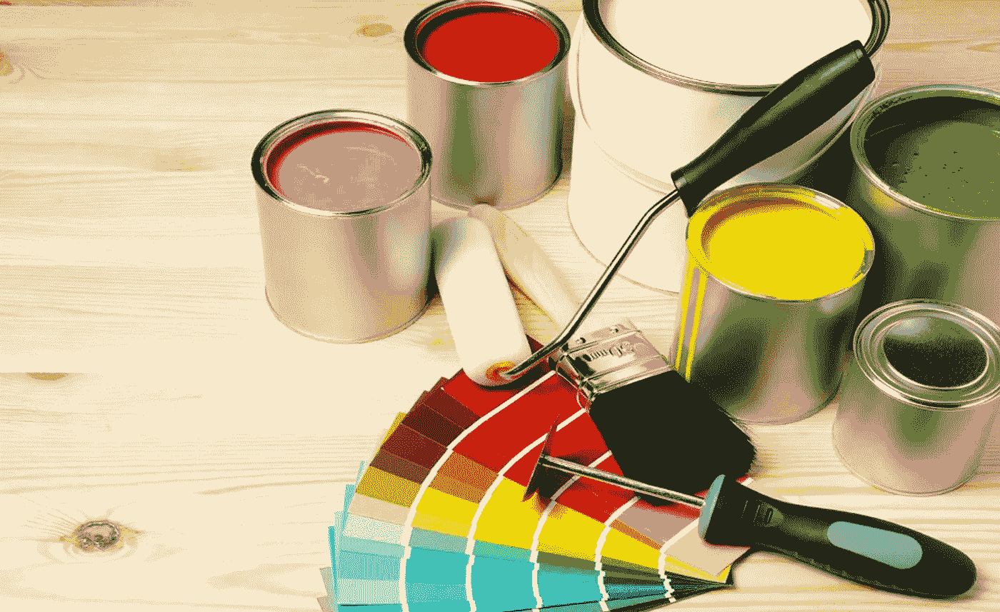
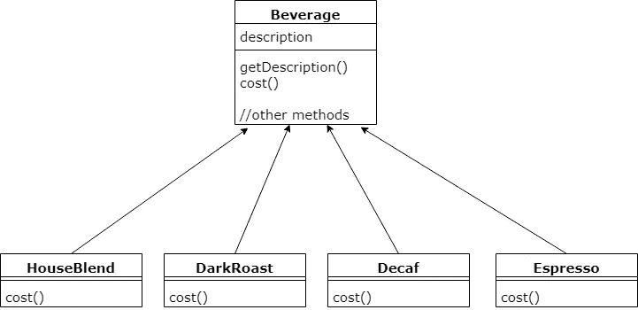
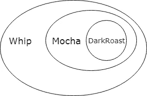
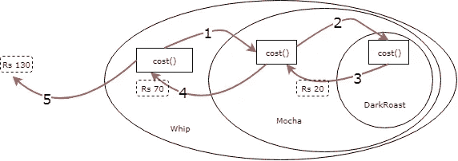
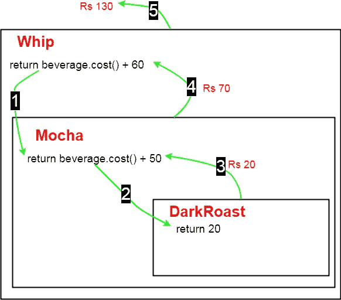

# 设计模式:装饰者模式

> 原文：<https://betterprogramming.pub/decorator-pattern-4f92897e4b4>

## 了解如何使用装饰模式使您的代码更加整洁和模块化



# 先决条件:

1.  如果你不是不熟悉“设计模式”这个术语，请务必查看我的 [*设计模式介绍。*](https://medium.com/@Nitin_code/design-patterns-introduction-30b9f3c5f7e)
2.  你懂 Java 或者其他任何面向对象的语言。
3.  你对[继承](https://en.wikipedia.org/wiki/Inheritance_(object-oriented_programming))、[多态](https://en.wikipedia.org/wiki/Polymorphism_(computer_science))和[接口](https://en.wikipedia.org/wiki/Interface_(computing))有了一个基本的概念。

要查看完整代码，请查看我的 GitHub 资源库:

[](https://github.com/Ni3verma/Coffe-Shop) [## ni 3 Verma/咖啡店

### Github 仓库，我的中等职位，解释装饰模式

github.com](https://github.com/Ni3verma/Coffe-Shop) 

假设你有一家咖啡店，它是周围发展最快的商店。只要看街对面，你就会看到它是另一个分支。你提供四种类型的饮料:自制混合饮料、黑咖啡、无咖啡因咖啡和浓缩咖啡。

当你第一次创业时，你这样设计你的类:



`Beverage`是抽象类，`cost`方法也是抽象的。子类将实现它。`Beverage`有四个子类:`HouseBlend`、`DarkRoast`、`Decaf`和`Espresso`。它们都覆盖了`cost` 方法并返回自己的`cost`。这里，我们使用了**继承**。

除了咖啡，你还可以要一些调味品，如蒸牛奶、大豆、摩卡咖啡和鲜奶。您可以像以前一样实现它，并使用继承。这样我们将拥有大量的类:`HouseBlendMilk`、`HouseBlendMocha`、`HouseBlendSoy`、`HouseBlendWhip`、`HouseBlendMilkMocha`、`HouseBlendMilkSoy`等等。这样的例子不胜枚举。我们将有大约 100 门课要上。

这就是当我们过度继承时发生事情。很容易导致班级爆炸**。显然有更好的方法来实现这一点。我们找一个吧。**

# 方法 1:

要查看与方法 1 相关的代码，请单击下面的链接:

[](https://github.com/Ni3verma/Coffe-Shop/tree/d6b1e42d7dca41c04d03654566889cb93eb136e8) [## ni 3 Verma/咖啡店

github.com](https://github.com/Ni3verma/Coffe-Shop/tree/d6b1e42d7dca41c04d03654566889cb93eb136e8) 

或者，如果您已经克隆了存储库，请检查`[simple approach](https://github.com/Ni3verma/Coffe-Shop/commit/d6b1e42d7dca41c04d03654566889cb93eb136e8)` [提交](https://github.com/Ni3verma/Coffe-Shop/commit/d6b1e42d7dca41c04d03654566889cb93eb136e8)。

在这种方法中，我们将在`Beverage`类中添加一些布尔变量作为标志。如果是`true`，说明有调味品，所以加上它的成本。这次的`cost()`方法是*而不是*抽象。

在我们像`DarkRoast`这样的具体`Beverage`类中，我们将覆盖`cost`方法，并在通过调用`super.cost()`计算调料成本后添加`cost`。

比如说黑咖啡，我们会多加 20 卢比。

```
@Override    
public int cost(){        
  return super.cost() + 20;  
}
```

下面是我们制作牛奶咖啡的方法。它的输出将是家庭混合咖啡的成本+蒸牛奶(调味品)的成本。

```
Beverage b = new HouseBlend();       
b.setMilk(true);        
System.out.println("total cost = "+b.cost());
```

我们的代码将完美地工作，但是这个简单的方法有一些问题:

*   如果调味品的价格发生变化，或者要添加新的调味品，我们将不得不修改现有的代码并制定新的方法。请注意，添加新的东西不应该改变现有的代码，因为它可能会导致错误。
*   我们可能会有一些新的饮料，像冰茶。对于这一点，没有添加牛奶调味品的意义，但我们会从饮料类继承。
*   如果顾客想要双份摩卡咖啡怎么办？

## 方法 2:

要查看与之相关的代码，请检查[提交](https://github.com/Ni3verma/Coffe-Shop/commit/ff45635a276aff23fed6875d77c9c14792f6520e#diff-e7de9043f1a8c235dcce04e119ea062cR9)。

在这种方法中，我们将使用装饰模式。在这个设计模式中，我们有一个**组件**(像`DarkRoast`)和**装饰者**(像`Whip`、`Mocha`等。).我们用装饰器包装这个组件。这就是我所说的包装:



现在，当我们想要计算成本时，我们将调用最外层装饰器上的`cost`方法，然后它将调用其内部装饰器/组件的`cost`方法。这将继续下去，直到它到达它的组成部分(`DarkRoast`这里)。然后`DarkRoast`会将自己的成本返回给`Mocha` , `Mocha`会将自己的成本加到上面，并将总数返回给`Whip`。`Whip`会加上自己的成本，并返回合计出来。流程是这样的:

`DarkRoast` = 20、`Mocha` = 50、`Whip` = 60 的成本。



总费用是 130 卢比

**装饰模式**动态地给一个对象附加额外的责任。它为子类化提供了一个灵活的选择来扩展一个功能。

既然我们已经对这种模式的工作原理有了一些想法，让我们看看我们将如何实现这种类型的行为。


1.  **组件:**是抽象类；具体组件和装饰抽象类都将继承它的行为。
2.  **混凝土构件:**延伸构件。这是我们将要动态添加新行为的对象。它可以单独使用，也可以由装饰者包装。(比如我们可以用`Mocha`点`DarkRoast`咖啡或者`DarkRoast`。)
3.  **Decorator:** 它也扩展了 component，是一个抽象类。
4.  **Concrete Decorator:** 每个 Decorator 都有一个组件，这意味着它有一个实例变量来保存对组件的引用(虚线表示这一点)。它扩展了 Decorator 抽象类，如`Milk`、`Soy`等。

现在让我们看看我们的抽象组件类，在我们的例子中是`Beverage.java`文件:

`cost`方法是抽象的，因为我们希望所有继承它的类(具体组件和装饰器)覆盖它并提供它们自己的`cost`。

现在让我们来看一个具体组件类:

每当我们定义一个具体的组件时，我们将在构造函数中给出它的描述，并覆盖`cost`方法并返回它的成本。

现在是时候看看魔法发生的主类了。让我们看看抽象装饰类；在我们这里是`CondimentDecorator.java`。

注意它还扩展了`Beverage`。`getDescription`方法是抽象的，因为我们希望所有具体的装饰者覆盖它，并为它提供自己的实现。因为我们在这里没有实现`cost`方法，所以每个具体的装饰者也必须覆盖它。此外，我们有一个实例变量`beverage`，因为我们将在 concrete decorator 类中需要它。正因为如此，我们才能像这样形成对父方法`cost`的调用链:


让我们来看看混凝土装饰师的一门课，`Mocha.java`:

在`constructor`中，它将接收一个`Beverage`，并将其实例变量设置为该变量，然后覆盖这些方法。注意`beverage`变量是从`CondimentDecorator`类继承的。

在点咖啡之前，记住装饰者(`Whip`、`Soy`)和组件(`DarkRoast`、`Decaf`)都扩展了组件(`Beverage`)类。所以我们可以说:

1.  `DarkRoast`是一个`Beverage`。
2.  `DarkRoast`与`Mocha`同为`Beverage`。
3.  `DarkRoast`同`Mocha`，`Whip`也是`Beverage`。

现在让我们点些咖啡吧！😃在您的 main 方法中，测试以下代码:

```
Beverage b1 = new Espresso();
System.out.println(b1.getDescription() + " Rs." + b1.cost());// ** OUTPUT **
// Espresso Rs.30
```

点一杯简单的咖啡，轻松简单；再加个调料吧。

```
Beverage b2 = new DarkRoast();
b2 = new Mocha(b2);
System.out.println(b2.getDescription() + " Rs." + b2.cost());// ** OUTPUT **
// Dark roast, Mocha Rs.70
// Rs 70 = Rs 20(of DarkRoast) + Rs 50(of Mocha)
```

`*b2 = new Mocha(b2)*`。这就是我们所说的装饰一个物体。我们取了一个对象`DarkRoast`，并用`Mocha`类来装饰。还记得 concrete decorator ( `Mocha`这里)类在它的`constructor`中收到了一个`beverage`？这里我们已经过了`b2`。所以你可以说在`Mocha`类中`beverage = b2`，而此时`b2`是`DarkRoast`类的一个对象。当我们计算成本时，`beverage.cost` 会返回 b2 的成本(`DarkRoast` = Rs 20)，然后我们在里面加上 50，所以结果是 Rs 70。

现在让我们添加两种调味品，`Mocha`和`Whip`:

```
Beverage b2 = new DarkRoast();
b2 = new Mocha(b2); // wrap it with mocha
b2 = new Whip(b2); // wrap it with whip
System.out.println(b2.getDescription() + " Rs." + b2.cost());// ** OUTPUT **
// Dark roast, Mocha, Whip Rs.130
// Rs 130 = Rs 20(of DarkRoast) + Rs 50(of Mocha) + Rs 60(of Whip)
```



我已经告诉你了，(`DarkRoast` + `Mocha`)也是饮料。这就是我们可以在`Whip`构造函数中传递`b2`对象的原因。同样，流程与之前类似。当我们调用`*b2.cost()*` *，*首先它会计算`beverage.cost()`，对于`Whip`，饮料就是`DarkRoast` + `Mocha`。当我们在这个`DarkRoast` + `Mocha`上调用`beverage.cost()`时，它会调用它的`beverage.cost()`，对于(`DarkRoast` + `Mocha`)系统，饮料是`DarkRoast`。这里`beverage.cost()`会给我们 20；我们给它加上 50 ( `Mocha` cost)，返回 70。这个 70 由`Whip`接收，它加 60，返回 130。

```
Beverage b2 = new DarkRoast();
b2 = new Mocha(b2); // wrap it with mocha
b2 = new Whip(b2); // wrap it with whip
```

我知道上面的代码有点混乱。但是当你学习*工厂*和*构建器*模式时，你将学会以一种更好的方式装饰物体。你们中的一些人可能会说，你从来没有见过这样的代码。但是如果你曾经用 Java 写了一段代码，那么要接受用户输入，你可以使用`Scanner` 或者`InputStreamReader` 或者其他方法。让我们看看如何通过`InputStreamReader`读取用户输入:

```
BufferedReader br = 
new BufferedReader(new InputStreamReader(System.in));
String s = br.readLine();
```

这里我们将一个`InputStreamReader`包装在一个`BufferedReader`中，所以你从一开始就在使用装饰模式，甚至不知道它！

最后要注意的重要一点是，尽管`Decorator`是`Component`类的子类，我们不能在不传入具体组件的情况下直接创建具体装饰器的对象。例如，这里我们不能直接只订购`Mocha`，因为它需要一个`Beverage`来传入构造函数。`Mocha`是一个装饰器，所以它必须用来装饰`Beverage`。所以先做一个像`DarkRoast`、`Decaf`这样的混凝土构件的物件，或者其他一些咖啡，然后用装修工来装修。

非常感谢你这么久以来一直支持我。希望你了解了装饰者和组件。

# 参考

*   [头先设计图案](https://www.amazon.com/Head-First-Design-Patterns-Brain-Friendly/dp/0596007124)(亚马逊)
*   [我的 GitHub 回购了这篇文章](https://github.com/Ni3verma/Coffe-Shop)