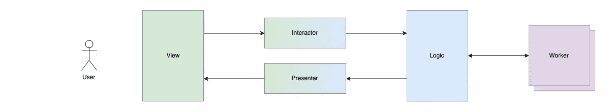
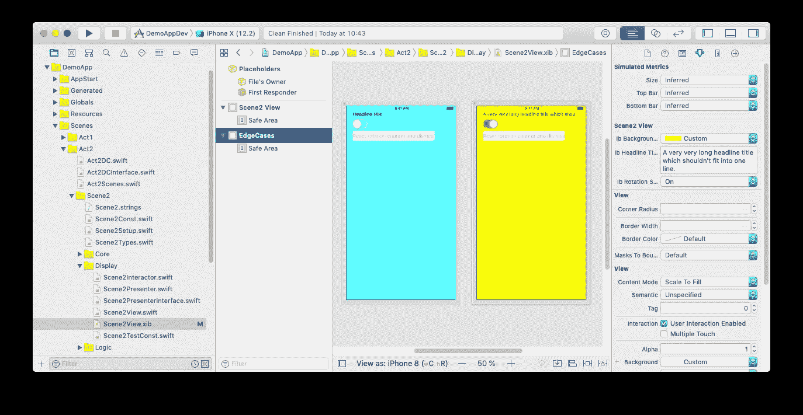
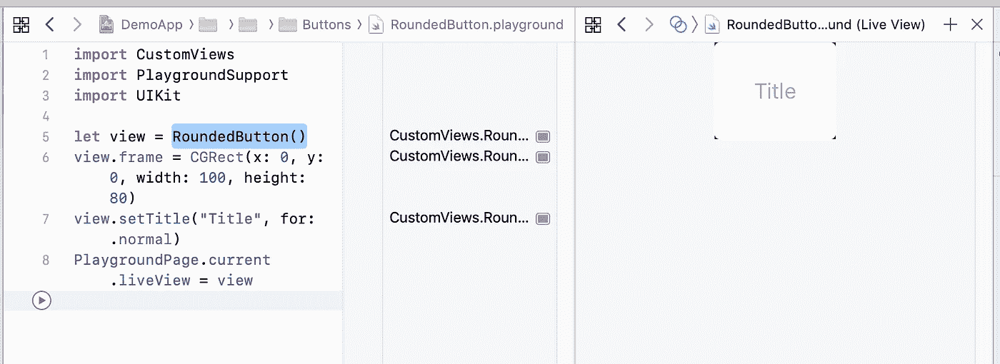

# 在 iOS 中分离显示和逻辑

> 原文：<https://betterprogramming.pub/decoupling-display-and-logic-in-ios-4de5a334ffbd>

## 可扩展 iOS 应用架构的组成部分

## 流程的循环:视图→交互者→逻辑→演示者→视图

在我的文章《[完美的 iOS 应用架构](https://medium.com/@sven.korset/the-perfect-ios-app-architecture-24259417843f)》中，我提出了一种架构，它将*场景*与其他场景划分为*视图*、*交互*、*逻辑*和*呈现者*。我想更详细地解释一下为什么我认为这种划分是有意义的。

流程循环将会是:

1.  *视图*提供了视图层次。
2.  *交互器*将自己挂接到*视图*中，以获得关于用户交互的通知。
3.  这些交互然后被映射到*逻辑*的方法。
4.  *逻辑*计算输入并管理任何状态变化。
5.  *逻辑*告诉*展示者*根据新的 app 状态更新*视图*。
6.  *演示者*更新*视图*。

顺便说一句，这是“可扩展的 iOS 应用架构系列的[部分”中的一篇文章。](https://medium.com/@sven.korset/pieces-of-a-scalable-ios-app-architecture-7c182f9dcd2c)

# 视角

一个*视图*的任务是向用户展示一些东西。在 iPhone 或 iPad 等基于触摸屏的设备上，*视图*也接收所有用户输入。因此，*视图*代表用户和应用程序之间的界面。

一个*视图*传统上有两个任务，展示和交互。通常，这由一个 *UIViewController* 处理，它通过动作监听用户输入，计算一些东西，然后格式化结果并用它填充*视图*。

然而，如果你想从**坚实的**原则中尊重**单一责任原则**(由 [Chidume Nnamdi 解释得很好🔥💻🎵🎮](https://medium.com/u/a1ee806e09de?source=post_page-----4de5a334ffbd--------------------------------)在他的文章“[每个开发人员都应该知道的坚实原则](https://blog.bitsrc.io/solid-principles-every-developer-should-know-b3bfa96bb688)”)中，那么这属于他们自己的类别。所以，让我们把这些任务放入自己的类中，称它们为*交互者*和*展示者*。

那么*视图*还剩下什么呢？🤔

*视图*提供了静态结构，视图层次结构。它创建并管理子视图，为它们提供一个接口。其他参与者，如*交互者*可以将自己钩入子视图来拦截用户输入，或者*演示者*可以直接用数据填充子视图。

如果视图层次发生变化，例如，因为要插入一个嵌入式视图，那么这将在*视图*的任务区域中。

子视图的初始值也可以由*视图*设置，因为*视图*创建这些子视图。例如，当创建*视图*时，可以设置视图层次结构中按钮的文本和样式，因为这些是静态默认值。

但是，如果一个风格或值应该在运行时改变，那么这取决于应用程序的特殊状态，这将不再是*视图*的任务，而是*呈现器*的任务。

因此，如果*演示者*得到*逻辑*的通知，登录按钮现在应该显示红色“取消”，那么*演示者*有责任相应地调整按钮，而不是*视图*。当然，按钮本身可以提供改变状态和调整外观的相应功能，但这仍然取决于*演示者*调用按钮上的功能。

*视图*除了提供视图层次之外什么也不做。🙂

## 以编程方式完成的视图

顺便说一下，在我的 [DemoApp 项目](https://github.com/indieSoftware/DemoArchitecture) (DAP)中，*视图*是以编程方式创建的，而不是通过 xib 或 storyboard。

为什么？😩

[张秀坤·维塞尔](https://medium.com/u/392098dd9008?source=post_page-----4de5a334ffbd--------------------------------)在他的文章《[iOS 上的用户界面编程](https://medium.com/ackee/user-interface-programming-on-ios-at-ackee-storyboards-vs-xib-vs-code-40f4d3e5ee6b)》中给出了一个很好的对比，我只能同意。用代码编写视图仅仅意味着:

*   合并冲突变得可以解决
*   查看-代码可以被审查
*   可以对视图层次结构和约束条件进行注释
*   相关代码变得不那么支离破碎

xib 和故事板的唯一优点是创建视图更快更直观。然而，如果您不想编写快速原型，而是想在可伸缩的团队中编写专业的、可维护的代码，那么您确实无法避免编程方法。

试试看。过一段时间你肯定会喜欢它。😘

我已经能听到你说“但是如果你只有视图的代码，那么在你的头脑中设计一个它的视觉图像是很困难的！”🤯

这也是我依赖 *IBDesignable* 并提供 xib 文件的原因。但是，这些 xib 不用于创建视图，因此不会在应用程序中提供。它们在开发中只是作为视觉辅助，因为有了 InterfaceBuilder 和 IBDesignable，您可以很容易地用 xib 可视化代码，这样您就可以相对快速地看到视图是什么样子。

使用 *IBInspectable* ，您甚至可以提供对不同状态和测试数据的访问，这样您甚至可以在 xib 中显示视图的不同表示。将多个视图实例添加到 xib 中，并为可检查的属性提供不同的数据，这样，您就可以一次看到所有的边缘案例。

如果你将定制视图外包到你自己的框架中，那么你甚至可以将它们嵌入到*的操场*中，并呈现一个实时的交互视图。

我用一个“圆形按钮”做到了这一点，你可以在 DAP 的“嵌入式框架/自定义视图/按钮”下找到它。

圆形按钮.游乐场

这样做的好处是可以看到甚至测试用户交互，比如点击按钮，而不必运行整个应用程序。是不是很酷？🤩

苹果似乎正朝着类似的方向前进，推出了新的 SwiftUI 框架及其声明式方法。这让我非常高兴，我相信我不是唯一一个。

*SwiftUI* 甚至用更少的代码和直接的、可操作的、可视化的表示来代替 xib 方法的*视图*部分。一旦 iOS 13 足够普及，一个项目的最低 iOS 需求允许，我们就应该切换到 *SwiftUI* 。😍

# 互动者

如前所述，*交互器*的任务是将所有用户交互映射到业务逻辑，并在*逻辑*调用适当的用例方法。

为此，*交互器*必须能够直接访问*视图*的子视图，以便注册相应的操作。你也可以把*视图*放在一个接口的后面，这样*交互器*就不会直接依赖于*视图*，但这只会不必要地扩大*视图*，使其变得比必要的复杂得多，而对可维护性或可测试性没有任何真正的好处。

不确定？🤨

与直接的*视图*类相比，*视图*的界面会是什么样子？你必须以某种方式暴露所有的子视图。嗯，这个视图除了提供一个到所有子视图的接口之外，什么也没做。你想测试什么？没有*视图*测试*交互器*是没有意义的。你只是不能用一个虚拟对象替换视图的类。那么，为什么要抽象出*视图*呢？

更有趣的是，实际上这种绑定在*视图*和*逻辑*之间是什么样子的。当你想到*绑定*，你肯定会想到 Rx。

事实上，在 DAP 中，我使用了 *RxSwift* 和 *RxCocoa* 将行为耦合到按钮点击、开关变化等。忠实于这样一句格言:如果发生了这种情况，那就应该执行。当然，Rx 不是强制性的，但是它使之变得容易得多，例如，如果您想为 textfield 的更改安装一个节流器，这样就不会在每次击键时都发送新的服务器请求。

*交互器*和*视图*一样，最终可能会被 *SwiftUI* 和*组合*所取代。不幸的是，你必须在这里等待一到三年才能获得足够的 iOS 13 发行版。😴

# 逻辑

啊，*逻辑*。这是一个应用程序的核心。它是用例的集合。它包含了业务逻辑。直到意识到海量视图控制器的问题，这段代码还在 *UIViewController* 中。现在它让*逻辑*变得庞大。耶！🤠

所以这种情况不会发生，代码应该进一步模块化和外包，这最好在框架中完成，由工人封装。因此，不是让*逻辑*执行任何服务器请求，而是应该由*服务器工作器*来完成，并且*逻辑*将只调用工作器上的适当方法。

这将*逻辑*的代码或多或少地简化为简单的检查、状态改变和委托。通常常见的用例需求可以直接映射成这样的东西:改变这个，如果这个和那个是真的，那么 *foo* 应该发生。但是 *foo* 则取决于*工人*、*主持人*或*导航员*。

当然，*逻辑*通过 DI 获得所有的依赖项，这样它们就可以被模拟用于*单元测试*。*逻辑*是*单元测试*的优秀候选。但对每个工人来说也是如此。

*逻辑*的方法主要由*交互器*调用，大多数时候是因为用户做了相应的输入，导致状态改变。然而，也可能是 *UIViewController* 需要向*逻辑*传递一些信息，例如设备的旋转。

反过来，*逻辑*并不真正了解关于*视图*的任何事情，而只是指示*呈现者*执行适当的视图更新。通过使用*接口*,*逻辑*因此与其他组件强烈解耦。

只是尽量保持逻辑尽可能的小。😅

# 提出者

*展示者*的职责是更新*视图*。因此，如果*逻辑*正在传输数据或特殊状态，那么*呈现器*必须相应地操纵视图。

*视图*只为视图层次结构提供子视图。*展示者*直接访问*视图*的子视图，并设置样式和值。

相应地，*表示器*中的代码也非常简单:获取这个参数并将其分配给那个子视图。有时，格式化程序可能会在赋值前对值进行格式化，但是在*表示器*中很少有更多的逻辑。

但是，还是有一些怪癖！🤬

## 警报

警告，意思是 *UIAlertController，*是 *UIViewController* 并且呈现它们，人们会期望，将是*导航器*的任务，因为它也呈现所有其他*UIViewController*，对吗？

不完全是。☹️

导航器不是用来显示 UIViewControllers 的，而是导航到其他场景。警报不是一个场景。因此，警报不是*导航员*的责任。

所以，如果*逻辑*想要显示类似 *serverError* 的东西，那不是场景变化，而是场景内信息的简单显示。这不一定要通过警告来实现，但也可以通过现有视图中的简单文本输出来实现。或者它可以是复杂的东西，比如带有模式化呈现的控制器的自定义视图。

啊哈，一个模态呈现的 *UIViewController* 几乎就是一个场景转换，不是吗？🤨

如果你把这个 *UIViewController* 实现写成*场景*，那么是的，因为这样你又传递了依赖关系。你有*核心*带着*导航仪*回来，也许*导航仪*也通向其他场景。

然而，使用 *UIAlertController* 永远不会导致其他场景或 *UIViewControllers* ，而是总是回到当前场景。您不需要移交任何依赖项，也不需要所有的架构开销。原则上，此警报与在当前层次结构中显示简单视图或嵌入式视图没有区别。

导航到*场景*是*导航员*的任务，而呈现其他东西如 *UIViewControllers* 是*呈现员*的任务。😜

弹出窗口也将通过*展示器*显示，而不是通过*导航器*显示。

## 嵌入式控制器

嵌入式 ViewController 怎么样？那么，一个拥有自己的 *UIViewController* 的视图，应该通过`addChild`添加到场景的当前 *UIViewController* 中？让我们假设为 *serverErrors* 定制一个错误显示控制器。🤔

这和警报的原理是一样的:它不是一个场景。*展示者*通过`addChild`将控制器添加到 *UIViewController* 中并展示视图。

然而，在这里，控制器的视图应该用`addSubview`插入到视图层次结构中，通常还有新的约束。这将是*视图*的任务，例如使用`addEmbeddedView`方法或类似方法，然后由*呈现器*调用。

但是谁创建了这个 *ViewController* 类的对象来嵌入，并因此获得了对它的依赖呢？🤨

同样，与警报一样，具体对象是由*呈现者*创建的。因此，*表示器*直接依赖于这些要嵌入的控制器，以及 *UIAlertController* 。

您还可以考虑通过*表示器*调用*工厂*来创建这些依赖关系。然而，这将大大增加复杂性。会有什么好处？

不会有什么好处，因为你不会用单元测试来测试演示者。由于所需的视图生命周期，这是不切实际的。你需要运行完整的 *UIViewController* ，包括动画、ViewController 演示等。如果你想在那里进行测试，那么 UITests 会更合适。

因此，您不必用 mock 替换对这个嵌入式控制器的依赖，因为您不会使用与控制器不同的东西。所以，保持简单，笨蛋！😝

# 结论

单一责任原则规定一个类应该只做一件事。这个“东西”是什么，有点主观，但是，在我看来，将交互外包给*交互者*，将演示外包给*演示者*是有意义的。*视图*只管理视图层次结构，而*逻辑*只包含业务逻辑。

*展示器*和*互动器*通常不由*单元测试*进行测试，而是由*单元测试*进行测试。*视图*也是如此，尽管您也可以使用快照测试通过单元测试来测试它。但是由于*视图*不依赖于任何其他东西，这也不是问题。

通过接口的抽象只对*呈现者*是必要的，因为这必须被*逻辑*引用。由于*逻辑*应该放在 *UnitTest* 之下，因此能够模仿*演示者*非常重要，这要归功于接口。

剩下的就是*工人*。工人是*逻辑*的追随者，当然也是通过接口抽象出来的。因此，*逻辑*并不直接依赖于*工人*。

脱钩就是一切！😎