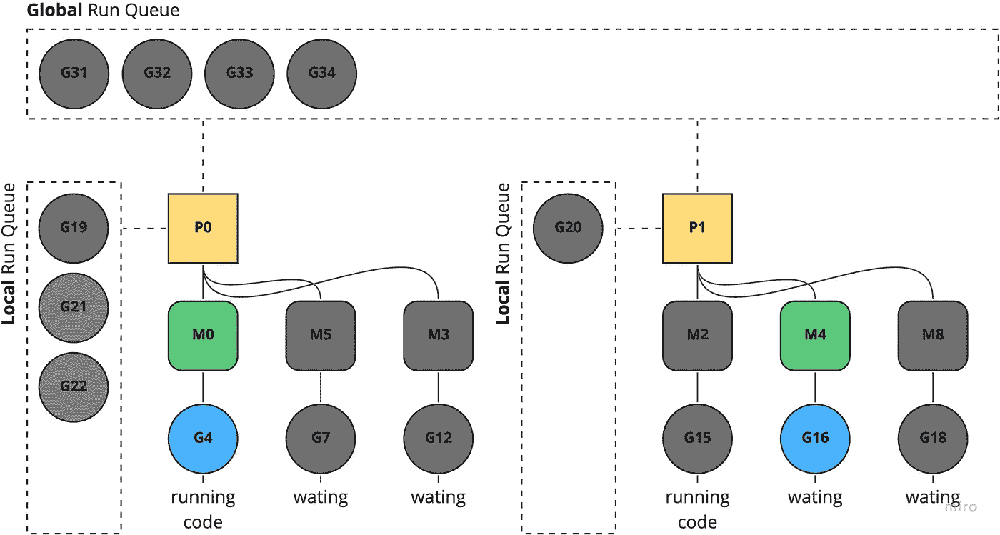
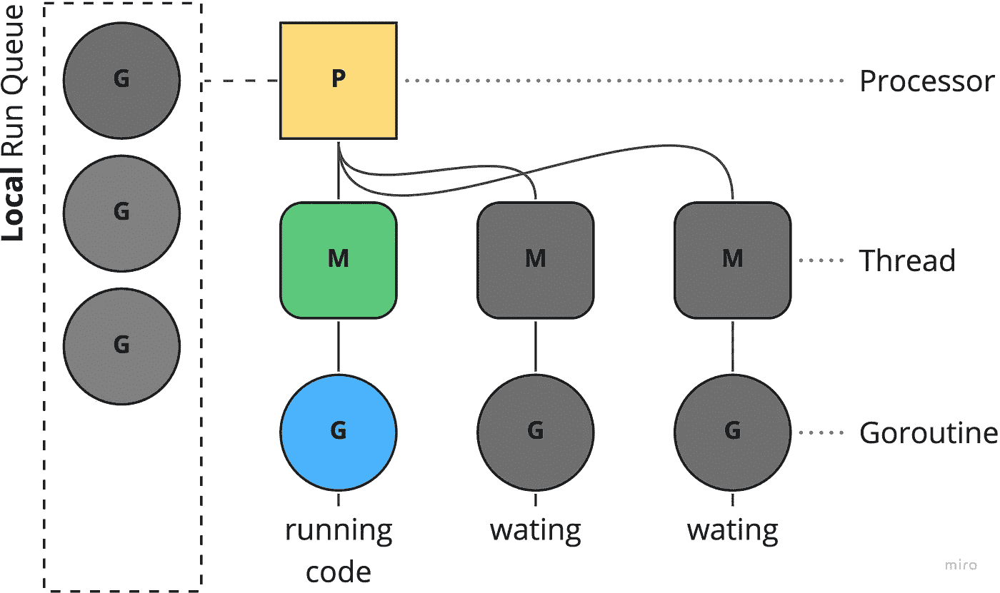
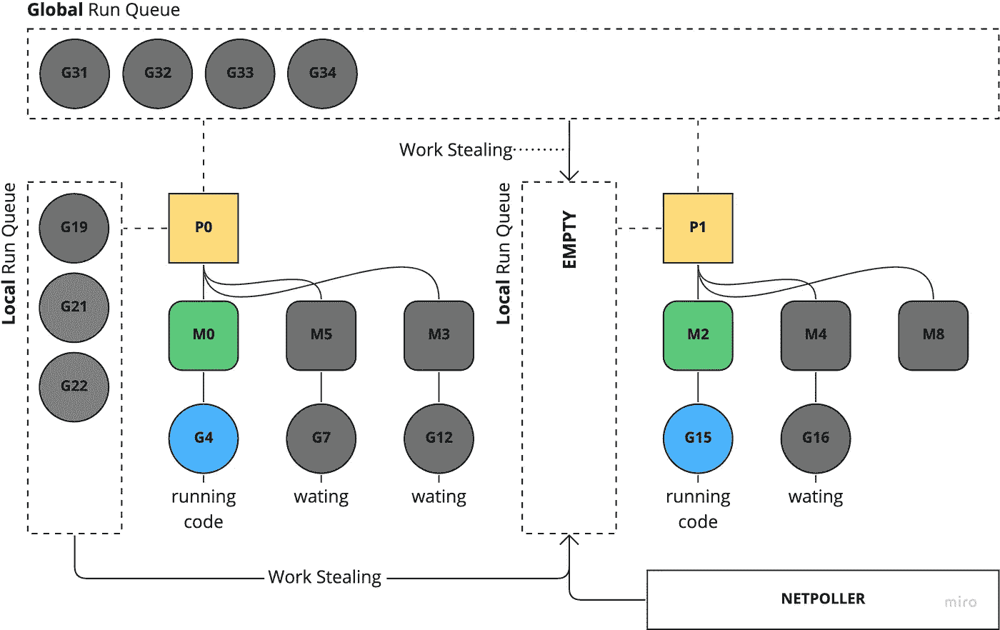

# 深入探究 Go 并发性

> 原文：<https://betterprogramming.pub/deep-dive-into-concurrency-of-go-93002344d37b>

## 在并发性方面最健壮的编程语言



根据 StackOverflow 开发者调查和 [TIOBE](https://www.tiobe.com/tiobe-index/go/) 指数，Go(或 Golang)已经获得了更多的关注，尤其是在后端开发者和从事基础设施自动化工作的 DevOps 团队中。这就有足够的理由来谈论 Go 和它处理并发性的聪明方法。

Go 以其对并发性的一流支持而闻名，即一个程序同时处理多件事情的能力。随着计算机从更快地运行单个代码流转到同时运行更多的代码流，并发运行代码正成为编程中更关键的部分。

程序员可以通过将程序设计成并发运行来使程序运行得更快，这样程序的每个部分都可以独立于其他部分运行。Go 中的三个特性，goroutines、channels 和 selects，在结合在一起时使并发变得更加容易。

Goroutines 解决了在一个程序中运行并发代码的问题，通道解决了并发运行代码之间安全通信的问题。

毫无疑问，Goroutines 是 Go 的最佳功能之一！它们是非常轻量级的，不像操作系统线程，而是数百个 Goroutines 可以复用到一个操作系统线程上(Go 有它的运行时调度程序),上下文切换的开销最小！简单地说，goroutines 是线程上的轻量级和廉价的抽象。

但是 Go 的并发方法是如何工作的呢？今天，我想试着向你们解释这一点。本文更关注 Go 的并发实体的编排，而不是这些实体本身。所以今天我们不会依赖太多的代码片段。

# 运行时调度程序

也就是说，它的工作是将可运行的 goroutines (G)分布到运行在一个或多个处理器(P)上的多个 worker OS 线程(M)上。处理器正在处理多个线程。线程正在处理多个 goroutines。处理器依赖于硬件；处理器的数量取决于 CPU 核心的数量。



*   **G** = Goroutine
*   M =操作系统线程
*   处理器

当一个新的 goroutine 被创建，或者一个现有的 goroutine 变为可运行时，它被推到当前处理器的可运行 go routine 列表中。当处理器执行完一个 goroutine 时，它首先尝试从它的可运行 goroutine 列表中弹出一个 go routine。如果列表是空的，处理器选择一个随机的处理器，并试图窃取一半的可运行的 goroutines。

# 什么是 Goroutine？

Goroutines 是与其他函数同时运行的函数。Goroutines 可以被认为是 OS 线程之上的轻量级线程。与线程相比，创建一个 Goroutine 的成本很小。因此，Go 应用程序同时运行数千个 Goroutines 是很常见的。

Goroutines 被复用到更少数量的 OS 线程。在一个有成千上万个 goroutines 的程序中，可能只有一个线程。如果该线程中的任何一个 Goroutine 阻塞说等待用户输入，那么就创建另一个 OS 线程，或者拉出一个暂停的(空闲的)线程，并将剩余的 go routine 移动到已创建的或未暂停的 OS 线程。所有这些都由 Go 的运行时调度程序负责。goroutine 有三种状态:正在运行、可运行和不可运行。

## Goroutines 与 Threads

为什么不像 Go 那样使用简单的操作系统线程呢？这是一个公平的问题。如上所述，Goroutines 已经运行在 OS 线程之上。但区别在于多个 Goroutines 运行在单个 OS 线程上。

创建一个 goroutine 不需要太多内存，只需要 2kB 的堆栈空间。它们通过按需分配和释放堆存储来增长。相比之下，线程从一个大得多的空间开始，还有一个称为保护页的内存区域，作为一个线程的内存和另一个线程的内存之间的保护。

Goroutines 在运行时很容易创建和销毁，但是线程有很大的安装和拆卸成本；它必须向操作系统请求资源，并在完成后返回。

运行时被分配了几个线程，所有的 goroutines 都在这些线程上被多路复用。在任何时间点，每个线程都将执行一个 goroutine。如果该例程被阻塞(函数调用、系统调用、网络调用等)。)，它将被另一个将在该线程上执行的 goroutine 换出。

总之，Go 使用了 Goroutines 和 Threads，这两者在并发执行函数的组合中是必不可少的。但是 Go 正在使用 Goroutines，这使得 Go 成为了一种比它初看起来更好的编程语言。

## Goroutines 队列

Go 在两个层次上管理 goroutines，本地队列和全局队列。本地队列附加到每个处理器，而全局队列是公共的。

只有当本地队列已满时，go routine 才进入全局队列，并且当 Go 将 Go routine 列表注入调度器时，例如从网络轮询器或在垃圾收集期间休眠的 Go routine，它们也被推入全局队列。

# 偷窃作品

当处理器没有任何 Goroutines 时，它会按顺序应用以下规则:

*   从自己的本地队列中提取工作
*   从网络轮询器提取工作
*   从另一个处理器的本地队列中窃取工作
*   从全局队列中提取工作

由于处理器可以在任务用完时从全局队列中取出工作，第一个可用的处理器将运行 goroutine。这个行为解释了为什么一个 goroutine 在不同的 P 上运行，并展示了 Go 如何通过在资源空闲时让其他 Go routine 运行来优化系统。



偷工减料图

在这个图表中，你可以看到 P1 用完了 goroutines。因此，Go 的运行时调度程序将从其他处理器获取 goroutines。如果每隔一个处理器运行队列为空，它将检查来自网络轮询器的已完成 IO 请求(系统调用、网络请求)。如果这个网络轮询器为空，处理器将尝试从全局运行队列中获取 goroutines。

# 运行并调试

在这个代码片段中，我们创建了 20 个 goroutine 函数。每个人都会休眠一秒钟，然后数到 1e10 (10，000，000，000)。让我们通过将 env 设置为`GODEBUG=schedtrace=1000`来调试 Go 调度程序。

## 密码

## 结果

结果显示了全局队列中带有`runqueue`的 goroutines 的数量，以及方括号`[5 8 3 0]`中的本地队列(分别为`P0`和`P1`)。正如我们在 grow 属性中看到的，当本地队列达到 256 个等待 goroutines 时，下一个队列将会在全局队列中堆积。

*   `gomaxprocs`:配置的处理器
*   `idleprocs`:处理器未被使用。Goroutine 跑步。
*   `threads`:线程正在使用中。
*   `idlethreads`:线程未被使用。
*   `runqueue`:全局队列中的 Goroutines。
*   `[1 0 0 0]`:每个处理器的本地运行队列中的 Goroutines。

```
idleprocs=1 threads=6 idlethreads=0 runqueue=0 [1 0 0 0]
idleprocs=2 threads=3 idlethreads=0 runqueue=0 [0 0 0 0]
idleprocs=4 threads=9 idlethreads=2 runqueue=0 [0 0 0 0]
idleprocs=0 threads=5 idlethreads=0 runqueue=0 [5 8 3 0]
idleprocs=4 threads=9 idlethreads=2 runqueue=0 [0 0 0 0]
idleprocs=0 threads=5 idlethreads=0 runqueue=8 [2 2 1 3]
idleprocs=4 threads=9 idlethreads=2 runqueue=0 [0 0 0 0]
idleprocs=0 threads=5 idlethreads=0 runqueue=10 [3 1 0 2]
idleprocs=4 threads=9 idlethreads=2 runqueue=0 [0 0 0 0]
idleprocs=0 threads=5 idlethreads=0 runqueue=9 [4 0 3 0]
idleprocs=4 threads=9 idlethreads=2 runqueue=0 [0 0 0 0]
idleprocs=0 threads=5 idlethreads=0 runqueue=10 [2 1 1 2]
idleprocs=4 threads=9 idlethreads=2 runqueue=0 [0 0 0 0]
idleprocs=0 threads=5 idlethreads=0 runqueue=6 [2 1 0 0]
```

感谢您阅读我关于 Go 并发性的文章。我希望你能学到一些新东西。

干杯！

[](/build-a-scalable-api-in-go-with-gin-131af7f780c0) [## 在 Go with Gin 中构建可伸缩的 API

### 使用 Gin、GORM 和 Postgres 在 Go 中创建可伸缩 API 的指南

better 编程. pub](/build-a-scalable-api-in-go-with-gin-131af7f780c0)