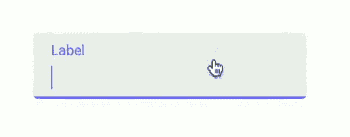
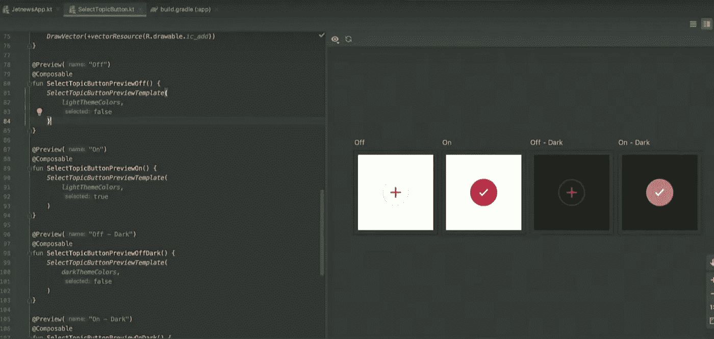
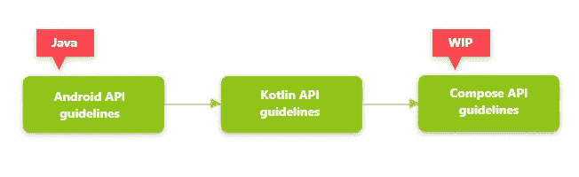
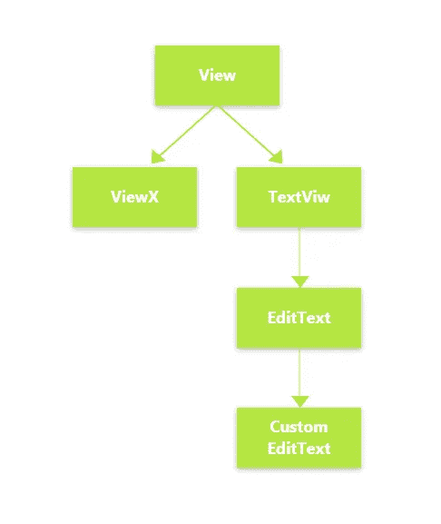
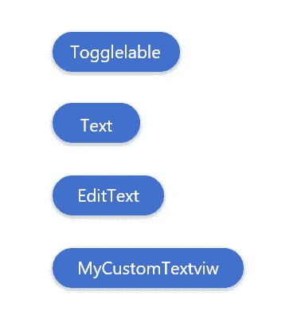
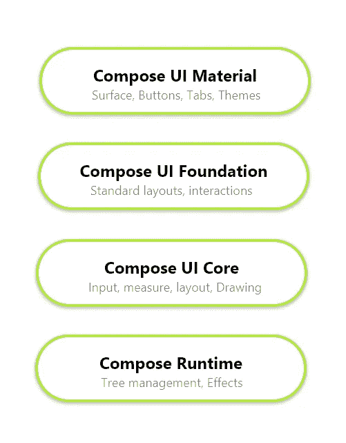
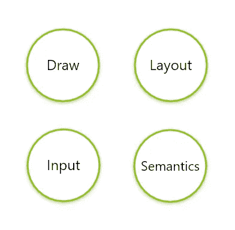

# 深入了解 Jetpack Compose

> 原文：<https://betterprogramming.pub/deep-dive-into-jetpack-compose-b09713760019>

## 设计 Kotlin-first UI 套件

> Jetpack Compose 是一个用于构建原生 Android UI 的现代工具包。Jetpack Compose 通过更少的代码、强大的工具和直观的 Kotlin APIs 简化并加速了 Android 上的 UI 开发。— [安卓开发者](https://developer.android.com/jetpack/compose/tutorial)

这篇文章不是关于如何使用 [Jetpack 撰写](https://developer.android.com/jetpack/compose)或其基础知识。它是关于如何以及为什么开发它的一些见解。

如果你想知道基础知识和如何使用 Jetpack Compose，请阅读我最新的关于如何使用 Jetpack Compose 的开发者预览版的[文章。](https://medium.com/better-programming/jetpack-compose-a-new-and-simple-way-to-create-material-ui-in-android-f49c6fcb448b)

# 新 UI 套件的需求是什么？

在 Android 中，UI 工具包可以追溯到历史，至少 10 年前。从那以后，事情发生了很大的变化，比如我们使用的设备，用户的期望，以及他们使用的工具和语言的开发者的期望。

以上是新 UI 工具包的原因之一，另一个重要原因是`View.java`类有这么多代码。Android UI 中的每个组件都是从这个类扩展而来的。

这个文件非常大，以至于你在 GitHub 上看不到它，因为它实际上包含了 30，000 行代码，这太疯狂了，对吧！

Android 团队的 Anna-Chiara 表示，他们已经实现了一些 API 遗憾，他们无法在不破坏功能的情况下收回并修复或改进 API，因此这是一个新的开始的好时机。

Jetpack Compose 就是这样诞生的。

# 喷气背包撰写主要焦点

1.  加速发展
2.  强大的工具
3.  直观的 [Kotlin](https://kotlinlang.org/) API

## 1.加速发展

当您开始开发时，您总是希望有更多的时间来编写业务逻辑，而不是花时间在某些事情上，如动画、颜色变化等等。看看下面的视图:

材料编辑-文本

这个素材编辑文本看起来很简单，但是在它的背后，有很多东西需要处理，比如动画，颜色变化，状态管理等等。

而 Jetpack Compose 提供了开箱即用的所有素材，无需任何工作。这使得用 Compose material 设计的 app 开发出来的 app 事半功倍。

## 2.强大的工具

没有正确工具的 UI 工具包是没有用的，因此从十年的经验中学习，Jetpack Compose 团队开始与 JetBrains 合作，提供强大的工具来支持 Android Studio 中具有 Compose 功能的开发人员。

看一看:

撰写开发者 03 预览版

上图是 Android Studio 开发 UI 时 Compose 功能的样子。当你在左边写代码的时候，你可以在右边看到输出设计，比如亮/暗模式下视图的状态变化。

它类似于目前 Android Studio 中的文本/设计，但更先进、更易于使用。这个特性只在 Canary 版本中可用，并且是专门为 Compose 开发的。

## 3.直观的 Kotlin API

Jetpack Compose 更多的是面向开发者，而不是 Android UI。因此，Android 团队正在与 Kotlin 一起开发开源代码。

当然，所有的 Android 代码都是开源的，但是特别是 Compose 代码，它在这里每天更新[。所以，你可以看到和玩代码，同时你可以在这里](http://goo.gle/compose-source)提供反馈[。](http://goo.gle/compose-feedback)

由于 Compose 仍在开发中，每个开发人员的反馈都很重要。

# API 设计

Android 团队有丰富的经验来创建 API，并在十年后重新审视它们，但是有一个问题——他们使用 Java 作为编程语言。

Jetpack Compose 是 Kotlin 开发的第一个大型项目，因此 Android 团队正在探索 Kotlin API 指南的新世界，以创建一套特定于 Compose API 的指南，这仍在进行中，还有很长的路要走。

# 组合 API 的原则

## 一切都是函数

正如我在之前的[文章](https://medium.com/better-programming/jetpack-compose-a-new-and-simple-way-to-create-material-ui-in-android-f49c6fcb448b)中提到的，Compose 是一个声明式 UI 系统，我们在其中设计了一组函数的 UI，其中一个函数调用另一个函数，并以树形结构构建所需的 UI。

在 Compose 中，这个树被称为 UI 图，这是另一个函数。每当需要的 UI 发生变化时，这个 UI 图就会刷新，比如函数中有`if`语句，Kotlin 编译器会处理这些。

## 顶级功能

在 Compose 中，没有类，只有函数，每个函数都是顶级函数，所以 Compose 中不会有任何继承或层次问题。

在这个过程中，一个可组合的函数总是根据它接收到的输入生成相同的 UI，所以当我们放弃类结构时不会有欺骗。

对于开发者和 Android 团队来说，从类结构转移到函数级 UI 构建是一个巨大的转变。这个顶级功能现在正在讨论中，它可能会也可能不会发布。

## 继承之上的组合

Jetpack Compose 更喜欢组合而不是继承。Compose 基于其他部分构建 ui，但不继承行为。

如果你在 Android 中观察，每一个 UI 组件都是继承自`View`类。像`EditText`是从`Textview`继承的，`Textview`是从一些其他视图继承的，层次结构到了根层次`View.class`，这个类有很多特性。

Android 中的视图层次结构

而 Compose 团队将整个系统从继承转移到顶级功能。

`Textview`、`EditText`、复选框和所有 UI 组件都是它们自己的函数，它们组成其他函数来创建，而不是从另一个类继承。

构建架构

## 真理的单一来源

事实的单一来源是一个非常重要的特性，整个 Jetpack Compose 就是建立在这个特性上的。如果你习惯于现有的 UI 工具包，那么你可能知道`perform-click`是如何工作的。

在 Android 架构中执行点击

首先，它改变视图的状态，然后执行动作。这导致了许多类似复选框的视图的错误，因为首先，它从选中变为未选中，反之亦然，然后，由于某种原因，如果操作失败，开发人员必须手动分配以前的状态。

在 Compose 中，功能是相反的。这里，像复选框这样的函数有两个参数。一个是在 UI 中显示状态，另一个是 lambda 函数，用来观察 UI 应该相应改变的状态的变化。

这是为了使类似复选框的视图不会保持任何状态。这允许开发人员正确地处理视图的状态变化。

撰写复选框

# 近距离观察作曲

运行时合成

如上图所示，在运行时 Compose 中有四个部分。让我们一个一个来看。

## 核心

这是 Compose 顾名思义的核心，不想深入学习可以跳过。

基本上，核心包含四个构件:

1.  画
2.  布局
3.  投入
4.  语义学

1.  Draw — Draw 允许您访问画布，以便您可以进行所有自定义绘制。
2.  布局——通过布局，我们可以测量事物并相应地放置视图。
3.  输入—开发人员可以通过输入访问事件并执行手势。
4.  语义—我们可以提供关于树的语义信息。

## 基础

基础的核心就是把上面提到的东西都集合起来，集体创建一个抽象层，方便开发者使用。

## 材料

在这一层中，所有的材质组件都是可用的，因此我们可以在构建复杂视图时使用现有的组件。

这是最精彩的部分，Compose 团队做了令人惊叹的工作，这里所有可用的视图都有物质支持，因此使用 Compose 构建的应用程序在默认情况下将是物质化的，开发人员方面的工作最少。

# 插槽 API

Slot APIs 的出现是为了给开发者空间，让他们可以做任何他们想要的定制。Android 团队试图猜测开发人员可能想到的许多定制，但他们无法一直想象开发人员的想法，就像 textview drawable 一样。

因此，Compose 团队给组件留出了空间，这样开发人员可以做他们想做的任何事情，比如按钮；您可以保留文本或带有图像的文本或任何您想要的内容，如下所示

# 有用的链接

 [## jetpack Compose——一种在 Android 中创建材质界面的简单新方法

### 了解如何创建没有任何 XML 文件的用户界面

medium.com](https://medium.com/better-programming/jetpack-compose-a-new-and-simple-way-to-create-material-ui-in-android-f49c6fcb448b)  [## 使用 Android Studio 和 Jetpack Compose | Android 开发人员

### Jetpack Compose 是一个用于构建原生 Android UI 的现代工具包。它基于声明式编程模型，所以…

developer.android.com](https://developer.android.com/jetpack/compose/setup) 

您还可以通过以下链接查看撰写团队的日常进展

 [## ui -平台/框架/支持-谷歌的 Git

### Jetpack Compose 是 AndroidX 生态系统中的一套库。有关更多信息，请参见我们的项目页面…

咕咕](http://goo.gle/compose-source) 

感谢您的阅读。