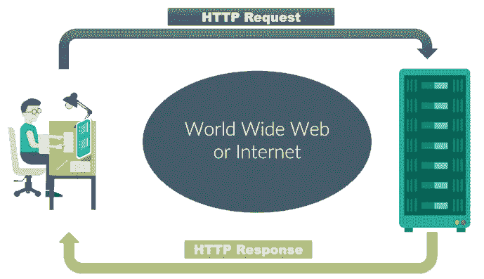

# 深入了解 JavaScript 的 Fetch API

> 原文：<https://betterprogramming.pub/deep-insights-into-javascripts-fetch-api-e8e8203c0965>

## 更深入地了解 fetch


Rob Fuller 在 [Unsplash](https://unsplash.com/s/photos/fetch?utm_source=unsplash&utm_medium=referral&utm_content=creditCopyText) 上拍摄的照片

从 API 请求资源是构建现代应用程序所需的一个流行且几乎至关重要的特性。无论您已经创建了自己的 API 还是正在实现第三方 API，您都需要一种方法来创建您的请求，而不会降低应用程序的速度。`fetch()`是`XMLHttpRequest`的升级版，用于在 JavaScript 脚本中进行 HTTP 请求。Fetch 和`XMLHttpRequest`的主要区别在于 Fetch API 使用承诺，因此避免了回调地狱。除了 Internet Explorer，所有现代浏览器都支持 fetch API。本文详细介绍了它的用法。这是我第 35 篇中型文章。

# 基本用法

`fetch()`的功能与`XMLHttpRequest`基本相同，但主要有三点不同。

*   `fetch()`用 promise 代替了回调函数，所以大大简化了书写，让书写更加简洁。
*   `fetch()`采用模块化设计，API 分散在多个对象中(响应对象、请求对象、头对象)。相比之下，XMLHttpRequest 的 API 设计不是很好——它只有输入、输出和状态。用同样的界面管理很容易写出非常乱的代码。
*   `fetch()`通过数据流(Stream object)处理数据，可以分块读取，有利于提升网站性能，减少内存占用。这对于需要大文件或者网速慢的情况非常有用。`XMLHTTPRequest`对象不支持数据流。所有数据都必须存储在缓存中。不支持块读取。你必须等到所有的都得到之后，才能一口气吐出来。

用法上，`fetch()`接受一个 URL 字符串作为参数，默认向该 URL 发送一个`GET`请求，返回一个`Promise`对象。其基本用法如下:

下面是一个从服务器获取 JSON 数据的示例:

在上面的例子中，`fetch()`接收到的`response`是一个流对象，`response.json()`是一个异步操作，取出所有的内容，转换成 JSON 对象。可以使用 await 语法重写 Promise，使语义更加清晰。

在上面的例子中，`await`语句必须放在`try...catch`中，以捕捉异步操作中可能出现的错误。以下文字使用`await`代替`.then()`。


照片由[西格蒙德](https://unsplash.com/@sigmund?utm_source=unsplash&utm_medium=referral&utm_content=creditCopyText)在 [Unsplash](https://unsplash.com/s/photos/basic?utm_source=unsplash&utm_medium=referral&utm_content=creditCopyText) 上拍摄

# 响应对象:处理 HTTP 响应

## 响应对象的同步属性

`fetch()`请求成功后，你得到一个`[Response](https://developer.mozilla.org/en-US/docs/Web/API/Response)` [对象](https://developer.mozilla.org/en-US/docs/Web/API/Response)。它对应于服务器的 HTTP 响应。

```
const response = await fetch(url);
```

如前所述，`Response`中包含的数据是通过`Stream`接口异步读取的，但它也包含一些同步属性，这些属性对应于 HTTP 响应的头信息(Headers)，可以立即读取。

在上面的例子中，`response.status`和`response.statusText`是`Response`的同步属性，可以立即读取。

## `Response.ok`

`Response.ok`属性返回布尔值，表示请求是否成功，`true`对应 HTTP 请求状态码 200 到 299，`false`对应其他状态码。

## `Response.status`

`Response.status`属性返回一个数字，表示 HTTP 响应的状态代码(例如，200，表示请求成功)。

## `Response.statusText`

`Response.statusText`属性返回一个表示 HTTP 响应状态信息的字符串(比如请求成功后，服务器返回“OK”)。

## `Response.url`

`Response.url`属性返回请求的 URL。如果 URL 有重定向，该属性返回最终的 URL。

## `Response.type`

`Response.type`属性返回请求的类型。可能的值如下:

*   `basic`:普通，同源请求。
*   `cors`:跨产地请求。
*   `error`:网络错误，主要用于服务人员。
*   `opaque`:如果`fetch()`请求的`mode`属性设置为`no-cors`，则返回该响应值。
*   `opaqueredirect`:如果`fetch()`请求的`redirect`属性设置为`manual`，则返回该响应值。

## `Response.redirected`

`Response.redirected`属性返回一个布尔值，表明请求是否被重定向。

## 确定请求是否成功

在`fetch()`发出请求后，有一点需要注意:`fetch()`只有在出现网络错误或无法连接时才会报错。在其他情况下，不会报告错误，但是请求被认为是成功的。

这意味着，即使服务器返回的状态码是 4xx 或 5xx，`fetch()`也不会报错(即承诺不会变成`rejected`)。只有通过`Responese.status`属性获取 HTTP 响应的真实状态码，才能确定请求是否成功。请看下面的例子:

在上面的例子中，`Responese.status`属性必须等于 2xx (200~299)才能确定请求成功。不需要考虑 URL 跳转(状态码为 3xx)，因为`fetch()`会自动将跳转的状态码转换为 200。另一种方法是确定`Responese.ok`是否为`true`。

## `Response.headers`属性

`Response`对象还有一个`Responese.headers`属性，指向一个`[Headers](https://developer.mozilla.org/en-US/docs/Web/API/Headers)` [对象](https://developer.mozilla.org/en-US/docs/Web/API/Headers)，对应 HTTP 响应的所有头。`Headers`使用`for...of`循环可以遍历对象。

`Headers`对象提供了以下方法来操作标题。

*   `Headers.get()`:根据指定的键名，返回键值。
*   `Headers.has()`:返回一个布尔值，表示是否包含标题。
*   `Headers.set()`:将指定的键名设置为新的键值，如果键名不存在，将被添加。
*   `Headers.append()`:添加表头。
*   `Headers.delete()`:删除表头。
*   `Headers.keys()`:返回一个可以依次遍历所有键的迭代器。
*   `Headers.values()`:返回一个可以依次遍历所有键值的迭代器。
*   `Headers.entries()`:返回一个可以依次遍历所有键值对的迭代器(`[key, value]`)。
*   `Headers.forEach()`:依次遍历表头。每个头将执行一个参数函数。

上面的一些方法可以修改头，因为它们继承自`Headers`接口。对于 HTTP 响应，修改头意义不大——许多头是只读的，浏览器不允许修改。在这些方法中，最常用的是`response.headers.get()`，用来读取某个表头的值。

`Headers.keys()`和`Headers.values()`方法分别用于遍历标题键和键值。

方法还可以遍历所有的键值和键名。

## 如何阅读内容

`Response`对象根据服务器返回的数据类型不同，提供不同的读取方法。

*   `response.text()`:获取文本字符串。
*   `response.json()`:获取 JSON 对象。
*   `response.blob()`:获取二进制`Blob`对象。
*   `response.formData()`:获得`FormData`物体。
*   `response.arrayBuffer()`:获取二进制`ArrayBuffer`对象。

以上五种读取方法都是异步的，都返回`Promise`对象。您必须等到异步操作结束，才能获得服务器返回的完整数据。

## `response.text()`

`response.text()`可用于获取文本数据，如 HTML 文件。

## `response.json()`

`response.json()`主要用于获取服务器返回的 JSON 数据。前面已经给出了例子。

## `response.formData()`

`response.formData()`主要用于服务工作者拦截用户提交的表单，修改一些数据，然后提交给服务器。

## `response.blob()`

`response.blob()`用于获取二进制文件。

上面的例子读取了`flower.jpg`图像文件并将其显示在网页上。

## `response.arrayBuffer()`

`response.arrayBuffer()`主要用于获取流媒体文件。

上面的例子是`response.arrayBuffer()`获取音频文件`song.ogg`然后在线播放的例子。

## Response.clone()

`Stream`对象只能读一次，读完就没了。这意味着只能使用上一节中的五种读取方法中的一种，否则会报错。

```
let text =  await response.text();
let json =  await response.json();  // Report an error
```

上面的例子首先使用`response.text()`，然后读取`Stream`。稍后调用`response.json()`后，没有内容可读，报错。`Response`对象提供了`response.clone()`方法，该方法创建了`Response`对象的副本并实现了多次读取。

在上面的例子中，`response.clone()`复制了一个`Response`对象，然后读取同一个图像两次。`Response`对象也有一个`Response.redirect()`方法，用于将`Response`结果重定向到指定的 URL。这种方法一般只在`Service Worker`中使用，这里就不介绍了。

## `Response.body`属性

`Response.body`属性是由`Response`对象公开的底层接口。它返回一个`ReadableStream`对象供用户操作。它可以用来读取块中的内容。一个应用程序是显示下载的进度。

在上面的例子中，`response.body.getReader()`方法返回一个迭代器。这个遍历器的`read()`方法每次返回一个对象，代表这次读取的内容块。这个对象的`done`属性是一个布尔值，用来判断是否被读取。`value`属性是一个`arrayBuffer`数组，代表内容块的内容。`value.length`属性是当前块的大小。



[https://www . bccfalna . com/ebooks/WP-content/uploads/ebooks/2018/12/HTTP-Hyper-Text-Transfer-Protocol-for-网页-% E2 % 80% 93-Request-and-Response-Core-JSP-in-Hindi . png](https://www.bccfalna.com/ebooks/wp-content/uploads/ebooks/2018/12/HTTP-Hyper-Text-Transfer-Protocol-for-Webpage-%E2%80%93-Request-and-Response-Core-JSP-in-Hindi.png)

# fetch()的第二个参数:自定义 HTTP 请求

`fetch()`的第一个参数是 URL，第二个参数也可以作为配置对象接受，自定义发出的 HTTP 请求。

```
fetch(url, optionObj)
```

上述命令的`optionObj`是第二个参数。HTTP 请求方法、头和数据体都在这个对象中设置。这里有一些例子。

## 发布请求

在上面的示例中，配置对象使用三个属性:

*   `method`:HTTP 请求方法、POST、DELETE、PUT 都在该属性中设置。
*   `headers`:用于定制 HTTP 请求头的对象。
*   `body`:POST 请求的数据体。

注意有些表头不能用`headers`属性设置，比如`Content-Length`、`Cookie`、`Host`等。它们由浏览器自动生成，不能修改。

## 提交 JSON 数据

在上面的例子中，标题`Content-Type`应该设置为`'application/json;charset=utf-8'`。因为默认是发送纯文本，`Content-Type`的默认值是`'text/plain;charset=UTF-8'`。

## 提交表单

## 文件上传

如果表单中有文件选择器，可以使用前面例子的写法。上传的文件包含在整个表单中并一起提交。另一种方法是用脚本添加文件，构造一个表单，然后上传，请看下面的例子。

上传二进制文件时，不需要修改文件头的`Content-Type`，浏览器会自动设置。

## 直接上传二进制数据

`fetch()`也可以直接上传二进制数据，将`Blob`或`arrayBuffer`数据放在`body`属性中。

# Fetch() API 的完整配置对象

`fetch()` API 的第二个参数完成如下:

`fetch()`请求的底层使用了`[Request()](https://developer.mozilla.org/en-US/docs/Web/API/Request/Request)` [对象](https://developer.mozilla.org/en-US/docs/Web/API/Request/Request)的接口。参数完全一样，所以上面的 API 也是`Request()`的 API。在这些属性中，`headers`、`body`和`method`之前已经给出了例子。下面是对其他属性的介绍。

## `**cache**`

`cache`属性指定了如何处理缓存。可能的值如下:

*   `default`:默认值是先在缓存中查找匹配的请求。
*   `no-store`:直接请求远程服务器，不更新缓存。
*   `reload`:直接请求远程服务器，更新缓存。
*   `no-cache`:将服务器资源与本地缓存进行比较，当有新版本时使用服务器资源。否则使用本地缓存。
*   `force-cache`:缓存优先，只有在没有缓存的情况下才请求远程服务器。
*   `only-if-cached`:只检查缓存。如果缓存不存在，将返回 504 错误。

## **模式**

`mode`属性指定了请求的模式。可能的值如下:

*   `cors`:默认值允许跨域请求。
*   `same-origin`:只允许同源请求。
*   `no-cors`:请求方法仅限于 GET、POST 和 HEAD，只能使用有限数量的简单头，不能添加跨域的复杂头，相当于提交表单就可以发出的请求。

## **全权证书**

`credentials`属性指定是否发送 cookies。可能的值如下:

*   `same-origin`:默认情况下，当从同一来源请求时，会发送 cookies，但跨域请求时不会发送。
*   `include`:无论同源请求还是跨域请求，总是会发送 cookies。
*   `omit`:从不发送。

对于发送 cookies 的跨域请求，`credentials`属性需要设置为`include`。

## **信号**

`signal`属性指定一个`AbortSignal`实例来取消`fetch()`请求，详见下一节。

## **keepalive**

页面卸载时使用`keepalive`属性，告知浏览器在后台保持连接，继续发送数据。一个典型的场景是，当用户离开网页时，脚本向服务器提交一些关于用户行为的统计信息。此时，如果不使用`keepalive`属性，可能会因为浏览器卸载了页面而无法发送数据。

## **重定向**

`redirect`属性指定 HTTP 重定向的处理方法。可能的值如下:

*   `follow`:默认情况下，`fetch()`跟随 HTTP 重定向。
*   `error`:如果发生跳跃，`fetch()`会报错。
*   `manual` : `fetch()`不跟随 HTTP 重定向，但是`response.url`属性会指向新的 URL，`response.redirected`属性会变成`true`。开发人员决定以后如何处理重定向。

## **完整性**

`integrity`属性指定一个哈希值，用于检查 HTTP 响应返回的数据是否等于预设的哈希值。例如，下载文件时，检查文件的 SHA-256 哈希值是否匹配，以确保它没有被篡改。

## **推荐人**

`referrer`属性用于设置`fetch()`请求的`referrer`报头。该属性可以是任何字符串或空字符串(即不发送`referrer`头)。

## **推荐者策略**

`referrerPolicy`属性用于设置`Referrer`表头的规则。可能的值如下:

*   `no-referrer-when-downgrade`:缺省值，总是发送`Referrer`头，除非从 HTTPS 页面请求 HTTP 资源时不发送。
*   `no-referrer`:不发送`Referrer`报头。
*   `origin`:`Referrer`头只包含域名，不包含完整路径。
*   `origin-when-cross-origin`:同源请求的`Referrer`头包含完整路径，跨域请求只包含域名。
*   `same-origin`:跨域请求不发送`Referrer`，但发送同源请求。
*   `strict-origin`:`Referrer`头只包含域名。当 HTTPS 页面请求 HTTP 资源时，不发送`Referrer`头。
*   `strict-origin-when-cross-origin`:`Referrer`头包含同源请求的完整路径，仅包含跨域请求的域名。当 HTTPS 页面请求 HTTP 资源时，不会发送此标头。
*   `unsafe-url`:无论什么情况，都要发送`Referrer`头。


[西格蒙德](https://unsplash.com/@sigmund?utm_source=unsplash&utm_medium=referral&utm_content=creditCopyText)在 [Unsplash](https://unsplash.com/s/photos/complete-configuration?utm_source=unsplash&utm_medium=referral&utm_content=creditCopyText) 上拍照

# 取消`fetch()` 请求

在`fetch()`请求发出后，如果想中途取消，需要使用`AbortController`对象:

在上面的例子中，首先创建一个`AbortController`实例，然后发送一个`fetch()`请求。配置对象的`signal`属性必须指定它接收由`AbortController`实例发送的信号`Controller.signal`。`Controller.abort`方法用于发出取消信号。此时会触发`abort`事件。这个事件可以被监控，或者您可以通过`Controller.signal.aborted`属性确定取消信号是否已经被发送。以下是一秒钟后自动取消请求的示例:


Peggy Anke 在 [Unsplash](https://unsplash.com/s/photos/cancel-request?utm_source=unsplash&utm_medium=referral&utm_content=creditCopyText) 上拍摄的照片

# 结论

在这里，我用 JavaScript 描述了获取 API 用法、处理 HTTP 响应、定制 HTTP 请求、配置对象和取消请求。Fetch API 可能有点让人不知所措，但在您继续学习 JavaScript 代码时，它绝对是至关重要的。

编码快乐！