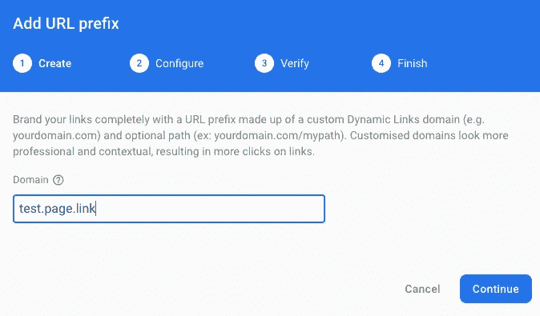
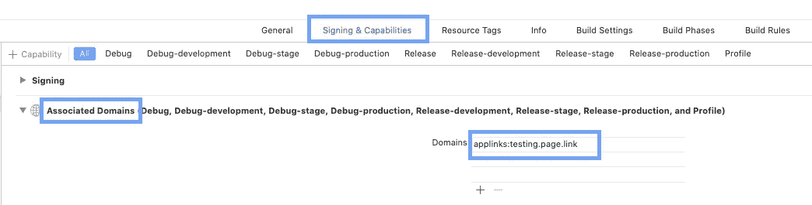
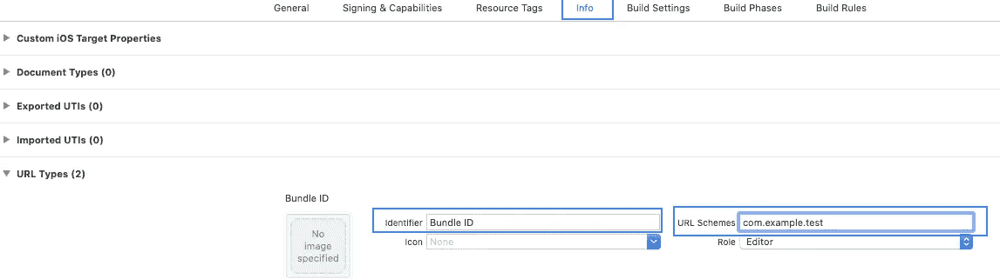
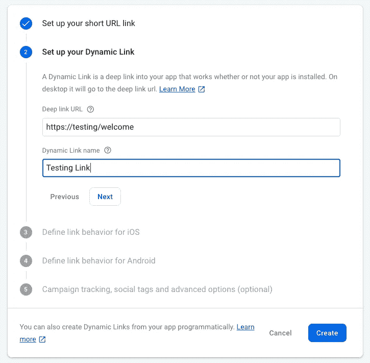

# 用 Firebase 动态连接进行颤振的深度连接

> 原文：<https://betterprogramming.pub/deep-linking-in-flutter-with-firebase-dynamic-links-8a4b1981e1eb>

## 使用深度链接提高用户保留率、参与度和用户体验


摘自 https://youtu.be/LvY1JMcrPF8

深度链接用于通过社交媒体活动推广应用程序或与其他用户共享数据，以链接到特定应用程序中的特定内容，无论您的应用程序是否已安装。

[Firebase 动态链接](https://firebase.google.com/docs/dynamic-links)为处理应用程序和网站的深度链接提供了丰富的功能。最棒的是，Firebase 深度链接对任何规模都是免费的。

在本文中，我将解释如何在 [Flutter](https://flutter.dev/) 中创建和使用动态链接。如果您希望了解更多关于 Firebase 动态链接的信息，您可以查看以下视频:

Firebase 动态链接处理以下情况:

1.  当用户打开动态链接时，如果您的应用程序未安装，用户将被重定向到 Play Store 或 App Store 以安装您的应用程序。
2.  如果您的应用程序已安装，但未在前台/后台打开，则该应用程序会在设备上打开。
3.  如果应用程序在前台/后台，那么用户可以在注册的侦听器中获得一个动态链接。

你需要按照以下步骤创建和接收动态链接。

# 1.在 Firebase 控制台中设置 URL P **refix**

*   打开 [Firebase 控制台](https://console.firebase.google.com/u/0/)并选择您想要添加深度链接的 Firebase 项目。
*   在 Firebase 项目中创建一个 Android 和 IOS 应用程序。
*   从侧面抽屉的*增长*部分打开*动态链接*。
*   为链接创建一个域，点击*开始* 按钮。
*   然后，创建一个 *URL 前缀*。URL 前缀是使用动态链接的域名。
*   创建一个选项卡，添加应用程序的自定义唯一域名。比如 test.page.link，这里域名后面加了`page.link`。
*   然后，按照:配置→验证→完成步骤。



# 2.iOS 应用程序的配置

*   在 Firebase 控制台打开*项目设置*，选择 *iOS* 应用。
*   添加应用程序的*应用商店 Id* 。您可以在应用的 URL 中找到您的应用商店 ID。在下面的例子中，`123456789`是应用商店 ID。[https://itunes.apple.com/us/app/yourapp/id**123456789**](https://itunes.apple.com/us/app/yourapp/id123456789)
*   如果您的应用程序尚未发布，您可以使用另一个已发布的应用程序 ID 进行测试(注意:当您的应用程序上线时，不要忘记用另一个项目 ID 替换它)。
*   添加*团队 Id* 。您可以在 Apple 会员中心的预置描述文件下找到您的团队 ID。

我们需要在 Xcode 中添加一些配置。遵循以下步骤。

*   在*签名&功能* 选项卡下，您想要打开一个关联的域并将该域添加到列表中。你的域名看起来是这样的:applinks:test . page . link .**这里的`test.page.link` 是我们已经在 Firebase 控制台中创建的 URL 域。**

****

****注意**:确保您的预配配置文件支持相关域的功能。**

*   **在项目的*信息选项卡*中，创建一个新的 *URL 类型*，它将被动态链接使用。**
*   **添加*标识符* 字段作为*包 ID* 和 *URL 模式*作为您的包 ID，类似于`com.example.test` *。***

****

**我们可以通过打开托管在动态链接域中的`apple-app-site-association`文件来确认 Firebase 项目是否正确配置为在应用程序中使用动态链接。例如:**

```
[https://test.page.link/apple-app-site-association](https://test.page.link/apple-app-site-association)
```

**如果您的应用程序已连接，则该文件包含对您的应用程序的 App Store ID 和捆绑包 ID 的引用。例如:**

```
{"applinks":{"apps":[],
"details":[{"appID":"1234567890.com.example.test","paths":["/*"]}]}}
```

****注意**:在 Android 应用中使用动态链接不需要额外的配置。**

# **3.在 Flutter 项目中添加依赖性**

**你必须包含插件才能使用动态链接。在`pubspec.yaml` 文件中添加 [firebase_dynamic_links](https://pub.dev/packages/firebase_dynamic_links#-readme-tab-) 插件。**

```
dependencies:
  firebase_dynamic_links: ^0.5.0+11
```

# **4.创建动态链接**

**有四种方法可以创建动态链接。在这里，我将解释两种创建链接的方法。关于其他方式的更多细节，请参考 [Firebase 文档](https://firebase.google.com/docs/dynamic-links/create-links)。**

## ****使用 Firebase 控制台**创建动态链接**

*   **从侧面抽屉的*增长*部分选择*动态链接*，然后点击*新动态链接*。**
*   **遵循下图中给出的所有步骤。在那之后，你得到这样一个最后的链接:[https://test.page.link/FwrkDi](https://sticksstage.page.link/FwrkDiHgDyrHosFC6)。**

****

## ****以编程方式创建动态链接****

**您可以通过设置以下参数并使用`DynamicLinkParameters.buildUrl()`方法以编程方式创建一个链接。要创建一个短链接，使用`DynamicLinkParameters.buildShortLink()`方法。**

**可以像**一样传递多个参数？userId=1 &类别=教育**。如果不想在链接中传递参数，则移除**？来自 URL 的 userId=1** 。**

# **5.**接收应用程序中的**链接**

**现在，要在应用程序中获得一个链接，需要在应用程序的主要小部件中初始化动态链接。**

**要接收一个动态链接，从`FirebaseDynamicLinks`调用`getInitialLink()`方法，获取打开应用程序的链接(如果不是通过动态链接打开的，则为空)。你需要添加两到三秒的延迟，因为有时候，当应用程序第一次打开时，链接会变得无效。**

**当应用程序在前台或后台调用`onLink`时，为链接回调配置监听器。**

# **就这样**

**我们已经看到了如何创建和接收 Firebase 动态链接。我希望你已经从中看到了 Firebase 动态链接的好处，以及它是多么容易设置！**