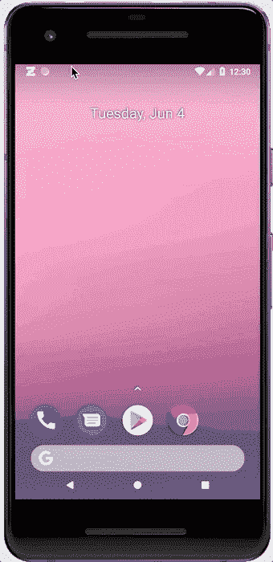
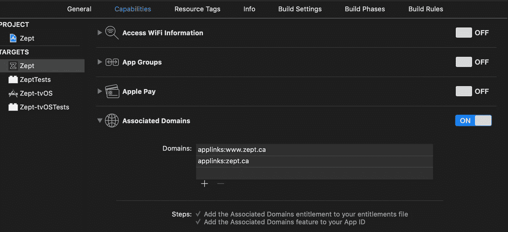
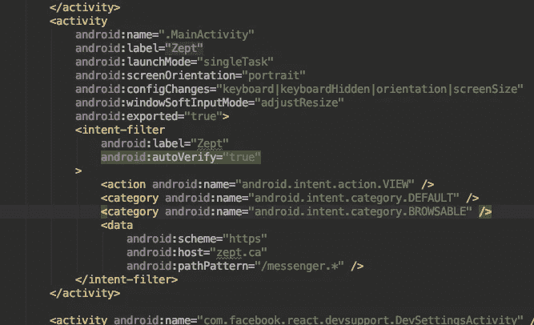

# React Native 中的深度链接和推送通知与推送波束

> 原文：<https://betterprogramming.pub/deep-linking-push-notifications-in-react-native-with-pusher-beams-23525ede30da>

## 创建、添加和测试推送通知


免费图片来自[https://www . pexels . com/photo/white-apple-iphone-on-wood-table-48605/](https://www.pexels.com/photo/white-apple-iphone-on-wooden-table-48605/)

在 Zept，我们努力帮助成千上万来自世界各地的合格的外国学生找到加拿大的大学和学院，不仅满足他们的需求，而且最有可能接受他们。对于我们的目标人群来说，电子邮件并不能解决问题，事实证明，短信也不可靠。推送通知是我们的最佳选择。

我们需要向学生发送学校的最新信息，并在大学招聘人员联系他们时通知他们。为此，我们使用[推杆梁](https://pusher.com/beams)。

我们已经为 websockets 使用了 Pusher，所以使用 Beams 进行推送通知(PN)应该不会很难，对吧？

这是一个艰难的旅程，但这里是我们如何让它工作



# 向您的应用程序添加深度链接

为了让 PN 跨两个平台工作，我们发现我们需要建立深度链接。有许多关于如何正确做到这一点的指南；这是一个节略部分。

## 深度链接？

我假设你明白什么是深度链接，但快速回顾一下:深度链接是设置你的应用程序来拦截来自你的网站的真实网址，并在应用程序中处理它们。例如，“https://test.com/message/abc”应打开应用程序以发送消息“abc”。

清楚了吗？如果没有，请在此阅读更多内容:

[](https://medium.com/react-native-training/deep-linking-your-react-native-app-d87c39a1ad5e) [## 深度链接您的 React 原生应用

### 在这篇文章中，我将快速介绍如何使用……

medium.com](https://medium.com/react-native-training/deep-linking-your-react-native-app-d87c39a1ad5e) [](https://hackernoon.com/react-native-deep-linking-for-ios-and-android-d33abfba7ef3) [## 反应 iOS 和 Android 的原生深度链接

### 我们生活在一个万物互联的新时代，我们比以前更频繁地分享链接。我们也希望我们的客户…

hackernoon.com](https://hackernoon.com/react-native-deep-linking-for-ios-and-android-d33abfba7ef3) [](https://facebook.github.io/react-native/docs/linking) [## 链接本地反应

### 本节仅适用于使用 react-native init 或 expo init 或 Create React…创建的项目

facebook.github.io](https://facebook.github.io/react-native/docs/linking) 

## 为什么推送通知需要深度链接

在发布时，推送包不能将来自推送通知的有效负载发送到代码的 JavaScript 部分。在添加之前，我们决定确保 PN 打开应用程序正确部分的最简单方法是[利用深度链接](https://github.com/pusher/push-notifications-android/pull/76)。

对于 Android，我们将随 PN 发送一个链接，该链接将被视为深度链接点击，并将用户发送到应用程序的正确部分。

## 创建`.well-known`文件夹和相关文件

要建立深度链接，你需要在你的网站根目录下创建一个名为`/.well-known/`的文件夹，并添加`/.well-known/assetlinks.json`文件。对于 Android，像这样:

```
[{
    "relation": ["delegate_permission/common.handle_all_urls"],
    "target": {
        "namespace": "android_app",
        "package_name": "package_name",
        "sha256_cert_fingerprints":
        ["package_cert_fingerprint"]
    }
}]
```

为 iOS 创建一个`/.well-known/apple-app-site-association`文件，像这样:

```
{
    "applinks": {
        "apps": [],
        "details": [
            {
                "appID": "appId",
                "paths": [ "/paths-you-want-to-support", "/messenger"]
            }
        ]
    }
}
```

## 向 iOS 添加深度链接

将授权添加到 XCode，以便 iOS 知道哪些域要连接到您的应用程序。

转到**功能** > **关联域，**并添加您想要连接到您的应用程序的域。你需要打开它。



## 向 Android 添加深度链接

你现在需要给`AndroidManifest.xml`添加意图过滤器来处理你在 Android 中的深层链接。

下面是一个如何设置你的清单文件来处理`/messenger/*`链接的例子:



## 在你的代码中处理深度链接

为了处理链接，我在我的根组件中使用了下面的代码版本来设置监听器并处理深度链接中发送的初始加载 URL。

稍后我将介绍`handleDeepLink`功能。现在，你可以简单地使用`console.log`和`url`。

```
const handleDeepLink = (url: string) => console.log(url);
```

## 测试深度链接

为了测试这些链接，我在我的测试设备上安装了 [Slack](https://slack.com) 应用程序，并给自己发了一个链接。然后，为了进行测试，我简单地点击了设备上的那个链接，看看它是否能在正确的应用程序中使用正确的 URL`console.log`打开。

# 为您的应用程序添加 Pusher Beams 推送通知

## 先决条件

*   创建一个 Pusher Beams 帐户，并按照他们的说明设置苹果和谷歌 Firebase 服务

*注意:我们调整了 react-native-pusher-push-notifications 包。Pusher 不支持这个包，他们目前也没有官方的 React 原生包*

为了实现这一点，我们使用第三方，非官方的包来连接 Pusher 的推送通知包，以反应我们已经稍微调整的本地工作。

那么，有哪些调整呢？

为了在 Android 中使用推送通知(PN)，我们制作了 Pusher 的推送通知-android 包[的一个分支，用于处理深度链接](https://github.com/ZeptInc/push-notifications-android/releases/tag/1.5.0-alpha)。特别感谢埃米尔·卡尔松，他做了很多繁重的工作。

## 为 iOS 安装 Pusher 的 Swift 包

我们使用 [Carthage](https://github.com/Carthage/Carthage) 来添加这种依赖性。只需将下面的代码添加到您的`/ios/Cartfile`文件中。然后运行`carthage bootstrap`安装。

```
github "pusher/push-notifications-swift" ~> 1.3.0
```

## 按照 iOS 和 Android 的说明安装软件包

遵循此处的**手册**说明:

[](https://github.com/ZeptInc/react-native-pusher-push-notifications/tree/v.2.4.0-zept-master) [## ZeptInc/react-本机推送通知

### 在 Javascript 中管理推送兴趣订阅和通知事件。…

github.com](https://github.com/ZeptInc/react-native-pusher-push-notifications/tree/v.2.4.0-zept-master) 

# 为用户订阅梁/兴趣

现在我们已经连接到推送 Beams，我们需要在我们的应用程序中初始化 Beams，并为用户订阅`interests` ，这样我们就可以向他们发送消息。

Zept 使用了 [Redux Observables](https://github.com/redux-observable/redux-observable) ，所以我们有了一个用户一登录就触发的 epic。它设置他们的推送订阅，当用户注销时，另一个单独的用户取消订阅。

我们为用户订阅了几个公共的`interests.`,每个用户都有一个由我们的服务器提供的自定义兴趣代码(例如`user-{userId}`)让我们可以给他们发送个性化的内容。

下面是我们的`util` 文件的代码示例:

因此，默认情况下，用户每次登录时都会订阅`general`和`user-{user.id}`。这一部分可能需要修改以满足您的需求。

# 测试推送通知

*注意:iOS 通知仅适用于物理设备。它们不能在模拟器上工作。*

您可以使用 Pusher 的调试控制台(登录后可用)或使用 [Postman](https://www.getpostman.com/) 。我更喜欢邮递员。这是一个示例负载:

如果你的应用设置正确，iOS 应该处理推送通知负载，Android 应该打开一个带有你的网站 URL 的`View intent`。两者都应该记录一条控制台消息`https://yourdomain/messenger/abcde`。

此外，在 iOS 上，这种推送通知应该在你的应用程序图标上添加一个徽章，上面写着 **5** 。

# 处理深层链接

最后一步是处理深层链接。在 Zept，我们在网站上使用 React-Router，在 React Native 中使用 React-Navigation。我们希望尽可能多地重用代码，并防止 URL 更改破坏未来的代码。因此，我们编写了一个`util` 函数来帮助我们在 web 中连接我们的路线，并做出本地反应，并且(希望)防止未来出现意外。

我们在网络和本地路由中使用常量。例如:

```
*// Web:*
ROUTE = {
    MESSENGER_CONVERSATION: (conversationId?: **string**) =>
        conversationId
            ? `/messenger/${conversationId}`
            : "/messenger/:conversationId"
}*// Native:* 
APP_STACK_ROUTE: {
    MESSENGER_CONVERSATION_SCREEN:
        "app_stack_routes/messenger_conversation"
}
// native then has a params object with conversationId included
```

现在，我希望能够将它们相互匹配/连接起来，就像这样:

```
**const** ROUTE_MATCHES: IRouteMatches = [
    {
        webPath: ROUTE.MESSENGER_CONVERSATION(),
        rnPath: APP_STACK_ROUTES.MESSENGER_CONVERSATION_SCREEN
    }
];
```

最后，我写了一个函数，它将接受我的`ROUTE_MATCHES`并自动进行转换。

## 去抖`handleDeepLink`功能

我用`rxjs` 去抖`handleDeepLink`，因为我发现它偶尔会发射多次。

```
**export const** handleDeepLink = (url: **string**): **void** => {
    **if** (!url) **return**;
    onChangeUrl$.next(url);
};
**const** onChangeUrl$: Subject<**string**> = **new** Subject<**string**>();
**const** urlSubscription: Observable<**string**> = onChangeUrl$.pipe(debounceTime(100));
urlSubscription.subscribe(processUrl);
```

## 处理 URL

第一步是使用 [regex](https://regexr.com/) 将 URL 分解成基本部分；`protocol`、`tld`、`path,`和`querystring.`

```
**const** REGEX_DECONSTRUCT_URL = /^(.*?):\/\/(.*?)(\/.*?)(\?(.*))?$/;**const** deconstructedUrl = REGEX_DECONSTRUCT_URL.exec(url);
    **if** (!deconstructedUrl) **return**;
    **const** [originalUrl, protocol, tld, path, ignore, querystring] = deconstructedUrl;
```

现在我们可以循环遍历路径，直到找到一个与上面的`ROUTE_MATCHES`匹配的路径。

```
**if** (protocol === "https" && tld.includes("yourdomain")) {
    **for** (**let** i = 0; i < ROUTE_MATCHES.length; i++) {
        **if** (matchPath(ROUTE_MATCHES[i], path, querystring)) {
            // loop until one matches
            **break**;
        }
    }
}
```

为了匹配到`webPath`的路径，我使用了`pathToRegexp`(React-Router 使用的同一个包)来匹配`webPath`模式和`rnPath`模式。

这是最终产品:

*注意:您可以使用这里的说明创建一个*`*NavigationService*`*:*

 [## 没有导航属性的导航反应导航

### 调用导航道具上的 navigate 或 popToTop 等函数并不是在你的应用中导航的唯一方式…

reactnavigation.org](https://reactnavigation.org/docs/en/navigating-without-navigation-prop.html) 

# 结论

所以现在你的应用应该能够:

1.  正确处理来自 web 应用程序的深层链接，允许您发送电子邮件、短信和其他将在本机应用程序中打开的链接
2.  给你的用户发送推送通知，这将会把你的深层链接直接发送给你的应用程序的正确部分。

感谢您的阅读，我希望这能帮助您改进您的项目。