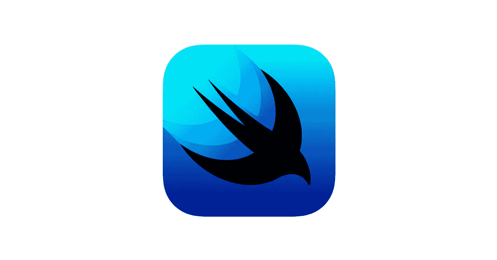
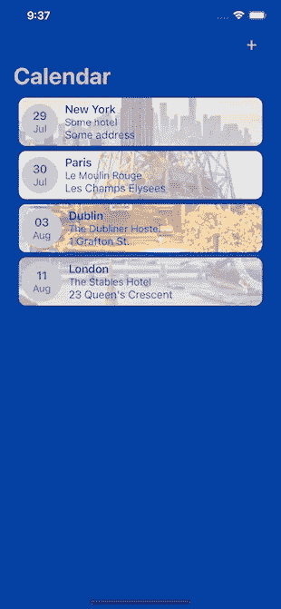
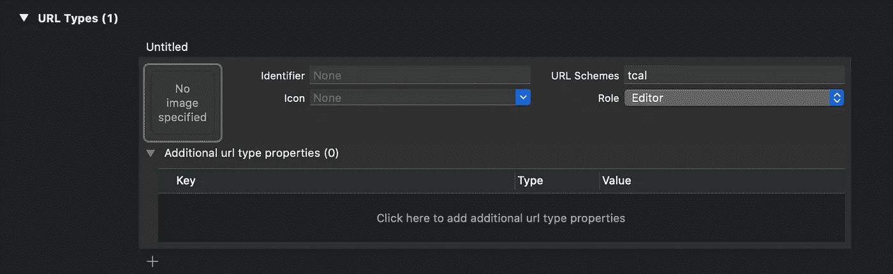
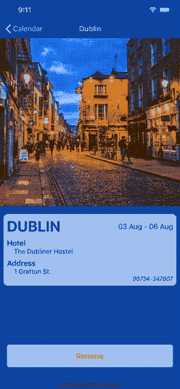
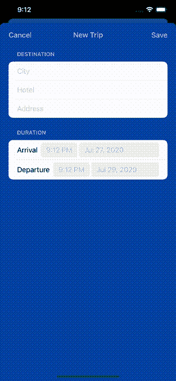

# 深度链接、通用链接和 SwiftUI 应用生命周期

> 原文：<https://betterprogramming.pub/deep-links-universal-links-and-the-swiftui-app-life-cycle-e98e38bcef6e>

## 了解如何在新的 SwiftUI 应用生命周期中处理深度链接，并发现一种管理它们的优雅方式



# 概观

在 WWDC20 上，苹果推出了 SwiftUI 2.0 和 iOS 14 的许多新功能。继去年的主题演讲之后，这些新功能将仅由 SwiftUI 提供支持。

为了让它更有吸引力，苹果发布了新的 SwiftUI 应用生命周期:100%用 SwiftUI 编写的应用。只要使用`@main`并符合新协议，`App`我们就可以告诉 Xcode 我们应用程序的起点在哪里。但是 UIKit 的`AppDelegate`会怎么样呢？该文件便于:

*   启动时配置第三方库
*   处理通知
*   处理深层和通用链接

在本教程中，我们将重点关注深层链接，并学习如何使用 SwiftUI 的新修饰符来监听这些事件，以及提供一种整洁干净的方法来处理它们。注意，我们所说的深度链接同样适用于通用链接。唯一增加的是你需要[支持相关域名](https://developer.apple.com/documentation/safariservices/supporting_associated_domains)。

# 简介:旅行日历

在本文中，我们将使用这个名为 Trips Calendar 的示例应用程序。该应用程序显示您的旅行列表，并让您导航到详细视图。您也可以添加或删除行程。



主屏幕

我们如何实现深度链接，以便用户只需使用 SwiftUI 代码就可以导航到详细视图？我们将在接下来的几节中看到如何处理深度链接。你可以在我的资源库[这里](https://github.com/fermoya/TripsCalendar)找到本教程的全部实现:

[](https://github.com/fermoya/TripsCalendar) [## 费尔莫亚/特里斯卡伦达

### 此时您不能执行该操作。您已使用另一个标签页或窗口登录。您已在另一个选项卡中注销，或者…

github.com](https://github.com/fermoya/TripsCalendar) 

# 设置应用深层链接

如果您熟悉在应用程序中设置 URL 类型，可以跳过这一部分。否则，继续读。

深层链接只是带有明确指向你的应用的方案的 URL。例如，对于旅行日历，我们可以想出一个类似`tcal` *的方案。*这样，任何带有此方案的 URL 都将启动我们的应用程序。

为此，请转到 Xcode 中的项目文件。选择你的目标，进入“信息”，向下滚动直到你找到“网址类型”点击+按钮，在“URL 方案”下添加您的方案



# 处理深层链接

SwiftUI 2.0 附带了一个新的修改器，`onOpenURL`。这个修改器在任何`View`中都有。尽管您可以简单地在任何可能需要的`View`上实现`onOpenURL`，但这并不是一个好主意——您很可能会重复代码来处理深层链接，也就是说，确定要对特定链接执行的操作。

我提议的解决方案是使用`App`来完成这一处理，并使用`environment`来传播链接，并相应地对更改做出反应。

```
@main
struct TripsCalendarApp: App {
    var body: some Scene {
        WindowGroup {
            ContentView()
                .onOpenURL {
                    // code here
                }
        }
    }
}
```

## 解析深层链接

`DeepLinker`的唯一目的是处理深层链接。现在，Trips Calendar 感兴趣的深层链接有两种:

*   `home`:在主屏幕上打开应用程序
*   `details`:导航至详细视图

```
class Deeplinker {
    enum Deeplink: Equatable {
        case home
        case details(reference: String)
    } ...
}
```

现在，我们为什么要处理主屏幕的 URL 呢？嗯，这是通常在应用程序启动时首先呈现给任何用户的屏幕，但如果用户在你的应用程序中的任何屏幕中，转到后台，并点击深层链接，会发生什么？在这种情况下，没有向前导航，只有向后导航。这也是我们希望能够处理的事情:

```
func manage(url: URL) -> Deeplink? {
    guard url.scheme == URL.appScheme else { return nil }
    guard url.pathComponents.contains(URL.appDetailsPath) else { return .home }
    guard let query = url.query else { return nil } let components = query.split(separator: ",").flatMap { $0.split(separator: "=") }
    guard let idIndex = components.firstIndex(of: Substring(URL.appReferenceQueryName)) else { return nil }
    guard idIndex + 1 < components.count else { return nil }

    return .details(reference: String(components[idIndex.advanced(by: 1)]))
}
```

所以基本上，Trips Calendar Deep Linker 会检查 URL 方案，以确保它与 app 方案匹配。如果没有找到 URL 路径，则默认为主屏幕。否则，它会在 URL 查询中查找一个参数来创建`details`深层链接。

所以现在从`App`文件中，我们可以处理深层链接并在 URL 被识别时执行操作:

```
.onOpenURL { url in
    let deeplinker = Deeplinker()
    guard let deeplink = deeplinker.manage(url: url) else { return } // do something
}
```

# 使用环境值

SwiftUI 中新增的是修饰符`onchange(of:perform:)`。这对于观察环境值的变化非常有用，例如，`scenePhase`取代了`SceneDelegate`应用生命周期通知(后台、活动、非活动等)。).我们可以利用同样的方法，为深度链接创建我们自己的`EnvironmentKey`:

```
struct DeeplinkKey: EnvironmentKey {
    static var defaultValue: Deeplinker.Deeplink? {
        return nil
    }
}extension EnvironmentValues {
    var deeplink: Deeplinker.Deeplink? {
        get {
            self[DeeplinkKey]
        }
        set {
            self[DeeplinkKey] = newValue
        }
    }
}
```

这样，`App`将接收一个深度链接，并将其作为一个环境值注入:

```
@main
struct TripsCalendarApp: App { @State var deeplink: Deeplinker.Deeplink?
    ... var body: some Scene {
        WindowGroup {
            ContentView()
                ...
                .environment(\.deeplink, deeplink)
                .onOpenURL { url in
                    let deeplinker = Deeplinker()
                    guard let deeplink = deeplinker.manage(url: url) else { return }
                    self.deeplink = deeplink
                }
        }
    }
}
```

注意`App`是如何定义一个`State`变量并将其作为一个`environment`变量注入到其`ContentView`中的。这将使它不仅在`ContentView`中可用，而且对它的所有子代都可用:

```
+ ContentView
  + CalendarView
    + List
      + CalendarView
```

比如《T21》里面:

```
@State var cellSelected: Int?
@Environment(\.deeplink) var deeplinkvar body: some View {
    List {
        ForEach((0..<trips.count)) { index in
            NavigationLink(destination: TripDetailView(trip: trips[index]), tag: index, selection: $cellSelected) {
                CalendarEntryView(trip: trips[index])
                    .onTapGesture {
                        cellSelected = index
                    }
         }
     }
     .onChange(of: deeplink, perform: { deeplink in
         // process deeplink
         cellSelected = indexInsideDeeplink
     }
}
```

**注意:**环境变量以及环境对象只能从视图层次结构中访问。这意味着如果推送或呈现另一个视图，您将需要再次传递环境值。

例如在`ContetnView`中:

```
.sheet(isPresented: $isNewTripPresented) {
    NavigationView {
        NewTripView()
            .environment(\.deeplink, deeplink)
        }
    }
}
```

然后在`NextTripView`里面:

```
@Environment(\.presentationMode) var presentationMode
@Environment(\.deeplink) var deeplinkvar body: some View {
    ...
    .onChange(of: deeplink, perform: { deeplink in
        guard let _ = deeplink else { return }
        presentationMode.wrappedValue.dismiss()
    })
}
```

## 重置环境值

一旦被消耗，环境值不会像现在这样被重置。这意味着如果用户再次点击同一个链接，什么也不会发生——因为环境`deepLink`没有改变。

在`App`文件中，几毫秒后重置深层链接:

```
.onOpenURL { url in
    // proccess deeplink
    DispatchQueue.main.asyncAfter(deadline: .now() + .milliseconds(200)) {
        self.deeplink = nil
    }
}
```

# 测试深层链接

如果你使用的是真实的设备，只需点击一个包含你的应用程序方案的自动生成的 URL(用它给自己发一封电子邮件，或者在笔记中记下 URL)。对于模拟器，您可以使用命令行发送到您的应用程序的深层链接。在我们的例子中，我们可以使用这个:

```
xcrun simctl openurl booted "tcal://www.trips.calendar.com/details?reference=55091-231959"
```

观看它的实际应用:



弹出视图并推出新视图的深层链接



深层链接消除一种模式，推出一种新的观点

# 结论

SwiftUI 的新版本提供了比其前身更多的工具，这显然是苹果试图提升 SwiftUI 并鼓励开发者使用它。在 SwiftUI 中不再需要`AppDelegate`。

我们已经看到了一个干净的实现，它遵循 SRP 并避免了代码的重复，使得扩展和修改变得容易。我们还研究了 WWDC20 中引入的一些新修饰符，并在示例应用程序中实现了它们。