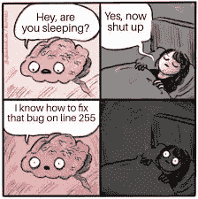
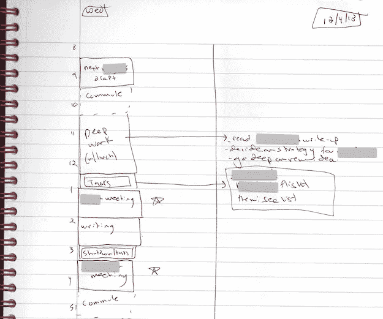
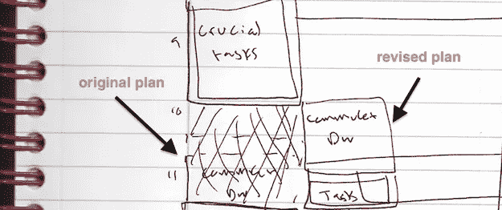
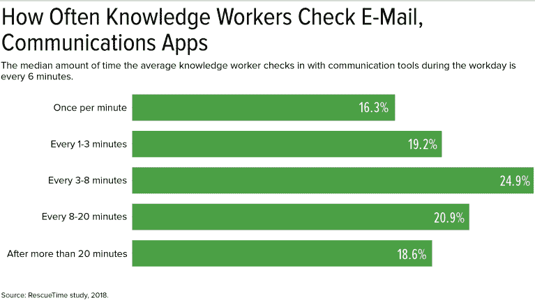

# 深度编程

> 原文：<https://betterprogramming.pub/deep-programming-da7dc58a7104>

## Cal Newport 的书《深度工作》应用于编程

布莱克·康纳利在 [Unsplash](https://unsplash.com?utm_source=medium&utm_medium=referral) 上的照片

你可能有过这样的日子，你在办公桌前坐了 7 到 8 个小时，甚至更多，但是在第二天的每日站立时却没有任何东西可以展示给你的 scrum 主管。开会，回复无聊的 DM 和电子邮件，浏览有趣的 Twitter 页面，每五分钟查看一次智能手机，嗯，你可能已经在电脑前坐了七个多小时，但这不会改变你已经被一种叫做浅层工作的东西所困的事实，或者你作为一名程序员，可能会称之为浅层编程。

# 浅层编程

在我们谈论深度编程之前，让我们谈一谈它的反面。卡尔·纽波特(Cal Newport)是一些非常有趣的书籍的作者，其中一本是本文的精华，名为*深度工作*，他将浅层工作定义为“在注意力分散的状态下执行的非认知、后勤或次要职责”

大多数人每天都在做肤浅的工作，通常是这些低价值的任务，基本上，这些任务不会创造新的价值，容易复制，经常在分心的情况下执行，例如上面提到的那些，像大多数时间写电子邮件和垃圾邮件，这些任务让我们无法做更重要、更高价值的工作。

更糟糕的是，越来越多的证据表明，向“肤浅”的转变不是一个容易逆转的选择。花足够的时间在肤浅的状态中，你会永久地降低你执行深层编程的能力。

> “网络似乎正在削弱我集中注意力和沉思的能力。无论我是否在线，我的大脑现在都希望以网络传播信息的方式接收信息:以快速移动的粒子流的形式。我曾经是文字海洋中的潜水员。现在，我像一个在水上摩托艇上的人一样在水面上滑行。”尼古拉斯·卡尔

卡尔将这一观点扩展到一本名为《浅滩:互联网对我们大脑的影响》的书中为了恰当地写这本书，他他必须搬到一个小木屋里并断开连接！

还有其他一些书，比如《电子邮件的暴政:四千年的收件箱之旅》、《T9》、《T10》、《哈姆雷特的黑莓》、《T11》、《T12》或《注意力分散成瘾》(T13)，都认为网络工具让我们更难专注于创造价值的任务，同时降低了我们保持专注的能力。

# 深度编程

另一方面，我们有深入的工作。深度工作是专注于一项认知要求高的任务而不分心的能力。这是一种能让你快速掌握复杂信息并在更短时间内产生更好结果的技能。深度工作是 21 世纪最有价值的技能。

1975 年 4 月 4 日，在大多数美国人使用打字机的时候，童年的朋友比尔·盖茨和保罗·艾伦创立了微软，一家制作计算机软件的公司。

正如作者沃尔特·伊萨克森[在 2013 年一期《哈佛公报》中写道:](https://news.harvard.edu/gazette/story/2013/09/dawn-of-a-revolution/)

> 凌晨时分，盖茨有时会在终端睡着。艾伦说:“他会在一行代码的中间逐渐前倾，直到他的鼻子碰到键盘。”"在打盹一两个小时后，他会睁开眼睛，眯着眼看屏幕，眨两下眼睛，然后准确地回到他停下的地方，这是一个注意力集中的惊人壮举。"

这篇文章揭示了另一个在故事的美好结局中扮演重要角色的行业，盖茨的深度工作能力，或者你可以称之为深度编程。

深度工作不仅仅是一套好习惯。这是一种需要学习的技能，一种在这个时代会增加你价值的技能。正如卡尔·纽波特所说:

> “从事深度工作的能力正变得越来越罕见，与此同时，它在我们的经济中越来越有价值。因此，少数培养这种技能并将其作为工作核心的人将会茁壮成长。”

如果你确信深度工作的价值和重要性，你的下一个问题可能是，“我怎样才能获得这项技能？”

# 掌握深度编程

## 1.方法

Cal Newport 描述了四种方法，供你用来将深度工作持续融入日常生活:

1.  **修道士:**“这种哲学试图通过消除或从根本上最小化肤浅的义务来最大化深层的努力。”
2.  **双峰:**“这种哲学要求你划分自己的时间，将一些明确界定的时间用于深度追求，将其余的时间留给其他事情。”
3.  “这种哲学认为，持续开始深度工作的最简单方法是将它们转化为简单的常规习惯。”
4.  “在这种情况下，你可以在你的时间表中尽可能多地安排深度工作。”

修道哲学是最难做深度工作的方法，因为你必须计划每天几乎每个小时都练习深度工作，而双峰哲学允许你分割时间，这样你既可以练习深度工作，也可以在白天有时间做其他活动。有节奏的方法对很多人来说更方便，尤其是那些每天有固定时间表的人，当你知道你的一天是什么样子的时候，就很容易把一些时间用于深度编程，然后把剩下的时间用于一些肤浅的工作。最后一个是新闻哲学，它告诉你，只要有机会，就要花时间做深度报道。这一哲学最常被那些工作要求他们几乎一直在移动的人实践，他们今天和前一天的时间表没有相似之处。

**深度编程的最佳途径** 作为一名程序员，我应该选择哪种哲学？好吧，在这种情况下，你应该回答这个问题，你应该弄清楚哪一个最适合你，取决于你的日常安排，取决于你的安排是否是静态的(意思是每天几乎都一样)，取决于你在一天中的几个小时内处于不间断的专注状态，这对于你的同事/雇主来说是否不是一件大事，等等。

也许在决定之前尝试每种方法，可能是决定符合你个人需求的正确哲学的关键因素。既然你是一名程序员，至少尝试第二种和第三种方法。

## 2.选择环境

持续专注地编码的能力确实受到你工作地点的严重影响，如果你是一个正常人，关上门专注于你的家庭办公室比在拥挤的地铁里做要容易得多。因为不同的原因不能在这样的位置，拥有降噪耳机应该是 b 计划。

## **3。识记**

记忆东西可以帮助你提高认知能力，这也是 Cal Newport 推荐的策略:

> "记忆训练的一个副作用是……提高了你集中注意力的能力。"

几个你可以尝试的练习:

*   学习新语言中的单词
*   用心学习你的圣书中最喜欢的诗句
*   背一首诗
*   记住你最喜欢的名言

## 4.优先考虑停机时间

> "定期让大脑休息会提高你深度工作的质量."

你是否曾经在一个项目中遇到一个恼人的 bug，并在愤怒中结束了一天的工作，认为需要几天才能解决这个问题，但第二天早上，甚至在上班之前就想出了解决方案？这就是停工期的有效性。

图片由作者提供。

在工作日结束时，设法完全停止任何与工作有关的想法，这对于为第二天的精英表现补充所需的能量至关重要。

# 摆脱肤浅的编程

## 1.时间阻塞

作为一名程序员，计划你的一天是练习深度编程的一个关键因素，记住这一点，一天很少会 100%按计划进行，但是无论如何，仍然有一个每日计划是非常重要的。

时间分块是一种时间管理方法，它把你的一天安排成时间块，每个时间块专门用来完成一项特定的任务。不像有一个不受控制的待办事项列表，时间块给你一个具体的时间表，定义你在什么时候做什么任务。

作者计划他们一天的例子。

加州新港[写道](https://www.calnewport.com/blog/2013/12/21/deep-habits-the-importance-of-planning-every-minute-of-your-work-day/?utm_source=zapier.com&utm_medium=referral&utm_campaign=zapier):

> “上图显示了我本月早些时候的一个随机星期三的计划。我的计划被记录在一张 24 磅重的纸上，放在一个[黑红双线笔记本](https://www.amazon.com/gp/product/B00015YORE/ref=as_li_qf_sp_asin_il_tl?ie=UTF8&camp=1789&creative=9325&creativeASIN=B00015YORE&linkCode=as2&tag=stuhac-20)里。此页面分为两栏。在左栏中，我用两行字标出一天中的每一个小时，然后将这段时间分成标有具体任务的几块。在右栏中，我在需要的地方为这些块添加了注释。"

请注意，我在我的时间段旁边留出了一些额外的空间。这样，如果一天以一种意想不到的方式展开，我就可以根据需要做出修正:

作者计划笔记本。

> “有时人们会问我为什么要费心做这么详细的计划。我的答案很简单:它产生了巨大的生产力。我估计，一周 40 个小时的工作时间和一周 60 多个小时的工作时间产生的产出是一样的。—加州新港

## 2.战胜数字干扰

图片由作者提供。

RescueTime 对 50，000 名员工进行了数据分析，研究显示，约 40%的人从未进行过完整、不间断的 30 分钟深度专注工作。普通员工每六分钟使用一次通讯工具，40 分钟是普通员工在不使用任何通讯工具/应用的情况下能够工作的最长时间。

比如 Slack，一个被很多程序员使用的交流工具。尽管这是一个非常有用的应用程序，有一个很棒的 UX，但交流似乎是一件好事，除非你有太多的交流。

它的超级干净的 UX 使它非常容易与我们的同事交流，同时也是它的弱点。因为这很简单，我们中的许多人打字太多了。说白了，沟通是低成本的，而我们正在疯狂地花钱。

可能有很多原因会导致这些工具的滥用，从通知和同步通信方法开始，同步通信是指当你一收到通知就必须回复消息，很多时候你打开通信应用程序只回复一条消息，最终浏览工作区中的所有频道。还有一些人在某种压力下，通过发帖和懈怠来展示他们是积极的，在做他们的工作。

一旦你被打断，平均需要 25 分钟才能回到深度编程状态，这意味着每次你将注意力转移到其他地方，你就会失去时间和注意力来发挥精英水平。

# **解决方案**

## 如何有效地使用 Slack:

设置你的 Slack 工作空间:优化 Slack 的界面

*   [切换到 Slack 的紧凑主题](https://blog.rescuetime.com/slack-focus-guide#Compact)
*   [创建自定义部分来组织您的频道](https://blog.rescuetime.com/slack-focus-guide#Sections)
*   [“启动”您最重要的渠道和对话](https://blog.rescuetime.com/slack-focus-guide#Star)
*   [使用“显示所有未读邮件”将所有未读邮件集中在一个地方](https://blog.rescuetime.com/slack-focus-guide#Unread)
*   [使用 RescueTime](https://blog.rescuetime.com/slack-focus-guide#Status) 自动更新您的时差状态
*   [摆脱自动加载 gif 和图像](https://blog.rescuetime.com/slack-focus-guide#Images)

## 松弛渠道:以正确的方式创建、使用和离开渠道

*   [阅读更多](https://blog.rescuetime.com/slack-focus-guide#Compact)

## **松弛的替代方案**

异步通信& [扭](https://twist.com/slack-alternative)。

简而言之，异步通信是指发送消息时不期望立即得到响应。例如，你发送一封电子邮件。几个小时后，我打开并回复了邮件。([阅读更多](https://blog.doist.com/asynchronous-communication/))

## **社交媒体**

在你发现自己在浏览脸书页面或花一个小时在 YouTube 兔子洞里之前，检查这些工具和提示来避免这种情况:

**需要关注时如何屏蔽网站:**

*   [如何使用家长控制阻止网站](https://blog.rescuetime.com/getting-the-most-out-of-rescuetimes-website-blocking#parental)
*   [如何在谷歌 Chrome 和其他浏览器上屏蔽网站](https://blog.rescuetime.com/getting-the-most-out-of-rescuetimes-website-blocking#chrome)
*   [如何屏蔽手机上的网站](https://blog.rescuetime.com/getting-the-most-out-of-rescuetimes-website-blocking#mobile)
*   [充分利用网站拦截器的 10 个强大技巧](https://blog.rescuetime.com/getting-the-most-out-of-rescuetimes-website-blocking#tips)
*   [阅读更多](https://blog.rescuetime.com/getting-the-most-out-of-rescuetimes-website-blocking/)

# 结论

作为一名程序员，你想成为最好的自己，你想在更短的时间内掌握复杂的技能并产生更好的结果，不像肤浅的工作需要很少的努力和专注，你想从事创造高价值的事情，那些事情渴望高度专注和不间断的专注，当生活在一个越来越分散的世界时，这可能有点困难，这就是深度编程开始发挥作用的时候， 一些非常有价值的东西，改变你编码和处理工作的方式，并允许你生产创新的产品，功能，应用程序，很难被任何人复制。