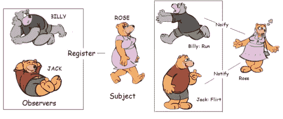
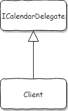

# 用 TypeScript 委托接口

> 原文：<https://betterprogramming.pub/delegate-interfaces-with-typescript-1768e7677c6b>

## 如何使用 TypeScript 让你的代码更优雅

委托接口是在类中实现事件的一种方式(但不限于此)。

委托接口在 OOP 语言中被广泛使用，如 [C++](https://chromium.googlesource.com/chromium/src/+/master/services/content/service_delegate.h#16) 和 [Java](https://github.com/elastic/elasticsearch/blob/0cd03d358140193cc84434d385947e84e0b70607/x-pack/plugin/core/src/main/java/org/elasticsearch/xpack/core/common/IteratingActionListener.java#L45) ，通常被称为[观察者模式](https://en.wikipedia.org/wiki/Observer_pattern)。

在函数式编程语言(如 JavaScript)中很少看到它的使用，在这些语言中，事件发射器是更受欢迎的方式。

# **为什么要打字稿？**

用普通的 JavaScript 实现委托接口是可能的，但是它非常混乱和不自然，因为没有简单的方法来表达接口。

“TypeScript 起源于 JavaScript 对于大规模应用开发的不足。”它通过添加诸如类型注释和接口等特性来实现这一点。

TypeScript 使实现和使用委托接口变得简单，同时使您的代码更加优雅和富于表现力:

# **优雅的代码**

我们可以用回调来实现我们的事件，或者创建一个[通用事件发射器类](https://stackoverflow.com/questions/12881212/does-typescript-support-events-on-classes)——看起来像这样(我忽略了封装规则以使它更短):

这是调用者使用它的方式(当使用 **EventEmitter** 示例时):

添加新事件需要在**日历**和**客户端**中添加更多的定义和初始化代码。在某些情况下，您可能还需要对某些/所有事件调用 removeListener。

如果您想要一个也期望从客户端返回一个值的事件(例如，返回 true 以在 onReminder 之后暂停)，该怎么办？

这是相当麻烦的。

带代理界面的**日历**代码可以在这篇文章的开头找到。

这是来电者的样子:

这需要较少的初始化代码，添加新事件只需要在 **ICalendarDelegate** 中添加一个新的函数定义+在**客户端**中添加事件处理程序。

如果有不止一个类使用 **ICalendarDelegate** 来触发事件( **MayaCalendar** )的话，这个好处会更加明显。).

**ICalendarDelegate** 也可以包含可选事件，这样**客户端**就不需要**拥有**来实现每一个功能——为此，只需添加**？**(问号)在界面中的函数名称后:

# **更有表现力**

仅仅通过查看类图或类定义，就可以清楚地看出**客户端**是**日历**事件的消费者。

还可以预测在哪里可以找到事件处理函数，它们被称为什么，以及代码序列如何流动。

也很清楚(多亏了 TypeScript)哪些事件处理程序是**日历**需要实现的，哪些不是需要的(使用？符号)。

任何想要实现类似**日历**的功能的新类(例如 **MayaCalendar** )都可以接受 **ICalendarDelegate** 并拥有与其调用者通信的标准方式。

# 结论

来自 OOP 语言的程序员可能不会对在 TypeScript 中使用委托接口的想法感到惊讶。

函数式程序员可能会觉得有点陌生——但是如果您已经决定使用 TypeScript(和类/接口)——我相信通过使用委托接口，您可以创建更简洁、更易于维护的代码。