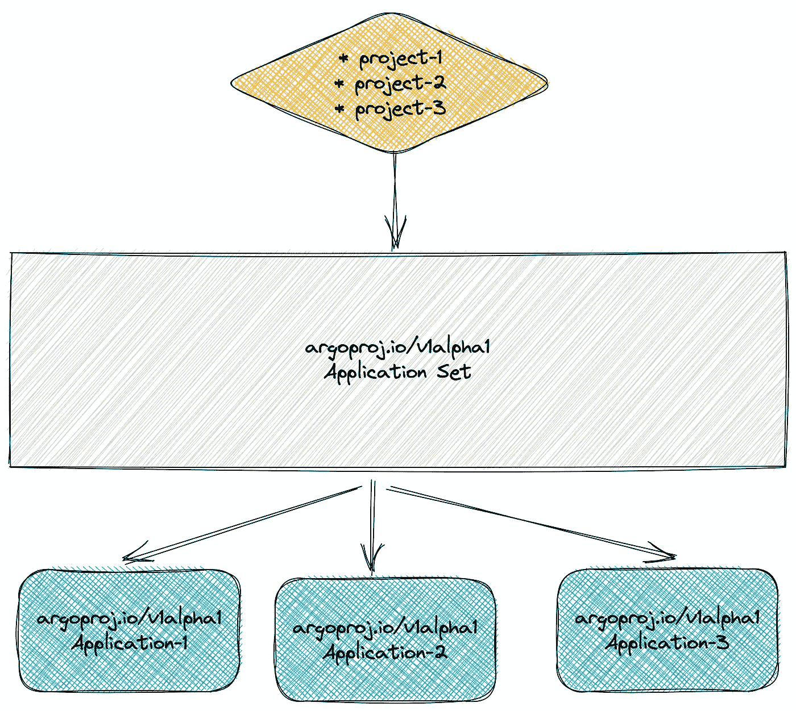
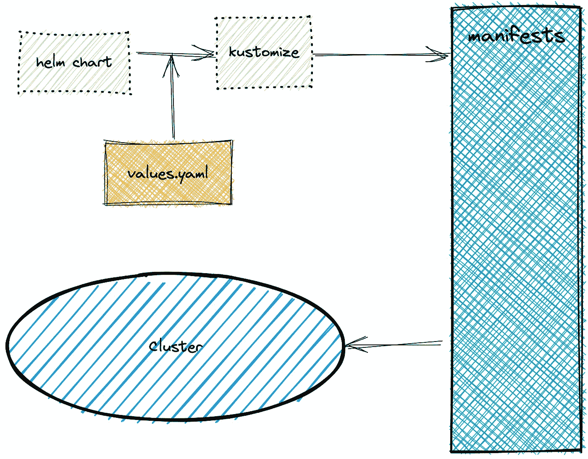
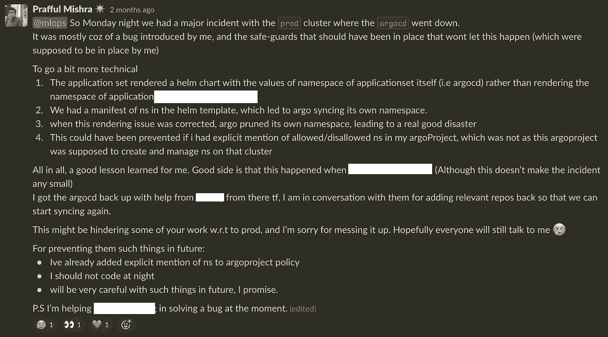

# 删除我的第一个生产集群

> 原文：<https://betterprogramming.pub/deleting-my-first-production-cluster-3ce6291168ff>

## 拥抱失败，成长为一名开发人员

米盖尔·Á的照片。佩克斯公司的帕德里安

在我们的职业生涯中，总有一天，至少有一次(或者不止一次)，我们都经历过。

要么是你今天过得很糟糕，你对自己的一个小决定会给整个世界带来怎样的影响不太谨慎，要么是这个错误非常复杂，需要所有的星星都聚集在一起才能让这个不幸降临到你身上。

但是这些经历带来了大量的经验，以及对您的灾难恢复资源、团队力量和压力处理能力的测试。这是我如何做到这一点的故事，更重要的是，我们如何让一切恢复正常？

# 集群设置是什么样的？

我们有一个内部数据科学平台(DSP)，为机器学习和数据科学相关项目运行工作负载。我们正在发布平台的新版本(比如说`v2`)。

所有现有用户都在 DSP( `v1`)上，当我们添加更多服务、测试和配置它们时，一些团队在`v2`上运行一些实验性工作负载。从现在开始，我们将讨论这个 DSP `v2`。

所以，我猜你已经发现，即使这应该是一个`prod`集群，使用它的团队数量非常少，而且使用它的团队预计会有干扰，因为一切都还在`dev/alpha`阶段(但这并没有使情况变得不那么危急)。

## **部署设置**

我们使用 argoCD 来确保一切与自我修复和修剪保持同步(这在后面会很有趣)。

我们为希望使用已经在集群上建立的平台的新团队提供了自动化的入职培训(每个项目都有一个专用的名称空间)。

生成多个应用程序的应用程序集

这是在 argoCD 中最新可用的[应用程序集](https://argo-cd.readthedocs.io/en/stable/user-guide/application-set/)的帮助下完成的，这些应用程序集将生成 Argo 应用程序。

ArgoCD 使用 kustomize-helm 插件生成清单

这些单独的应用程序使用 kustomize 来呈现一个带有自定义插件的舵图，这里描述的是。本质上，一旦使用`values.yaml`呈现了来自舵图的清单，`kustomize`就被用在上面来生成最终清单，这些清单使用`argoCD`被同步到集群。

# 发生了什么事？

这是导致灾难的时间线:

*   当舵图自动呈现新加入项目的清单时，它有一个`v1/Namespace`的清单
*   我没有为呈现舵图的`kustomize-helm`插件显式声明`namespace`参数，因此将传递给舵图的名称空间作为当前名称空间(即`argocd`)。
*   灾难还没有降临，但是一切都准备好了。
*   如果你还不明白，下次项目上线时，argoCD 开始管理自己的名称空间。
*   `argoproj.io/v1alpha1/Appproject`应该将权限设置为不允许这样的事情，但是由于这个`AppProject`应该创建新的名称空间，权限被设置为至少不明确拒绝对关键名称空间的访问。(但由于事情仍处于`dev/alpha`阶段，并非一切都是稳健的)。
*   所以，我在这一刻意识到发生了什么，为了增加更多的背景，我在深夜工作，因为我失眠了，并决定完成一些工作是好的(尽管不是我一生中最好的决定)。

Kustomize-helm 插件的新旧配置有序

*   为了尽快解决问题，我把插件命令从`helm template …`更新到了`helm template -n project-namespace …`，据我说，这肯定能解决问题。(很简单，是吧？)

*   当现在一切都正确呈现时，argoCD 被要求将名称空间从 argoCD 更新到`project-namespace`，并且 argoCD 删除了名称空间`argocd`。

现在灾难降临了。一开始我有点困惑，但后来现实击中了我，我意识到明天将是我的大日子。我决定平静地睡一觉，第二天早上正面应对这场风暴。

# 集群的哪些部分发生了故障？

使用该集群的所有项目应用程序都由 argoCD 管理，因此一旦 argoCD 关闭，集群上的几乎所有项目都会关闭。

幸运的是，还有其他一些基本服务不由 argoCD 管理；它们仍然是可用的。但是我们已经直接影响了这个集群上的所有用户。

# 我们怎么把它弄回来的？

第二天早上，我们与中央基础架构团队进行了一次长时间的通话，向他们解释了所发生的事情。

## **第一天**

由于该集群是生产集群，因此该事件非常严重，基础架构团队必须进行适当的调查(这有助于我了解一些缺失的部分)，准备一份事件报告，并提及确切的原因。

调查完成后，他们花了几个小时让 argocd 恢复运行。(基本集群应用程序和 argoCD 之后的一切都归我的团队所有)。

我和我的团队通了一个简短的电话，告诉他们我深夜冒险的最新情况。为我的粗心道歉。我们决定在所有服务重新上线后，重新评估 DSP `v2`产品发布的截止日期。

## 第二天

到目前为止，infra 团队已经做好了一切准备，现在轮到我了，让一切尽快恢复，以便在最后期限内将损失降至最低。

当我们开始从我们的存储库中同步所有受影响的服务时，一些我们没有意识到的问题浮出了水面。我们有机会测试我们完整的基础架构代码实现和我们的团队协作。

我们陷入了几次困境，但保持了运转，并在当天晚些时候让所有服务恢复工作，同时产生了一些新问题，如 w . r . t bug、灾难恢复脚本、更好的维护模式等。

一旦事情回到正轨，我就发信息解释一切。

给我的团队的信息的编辑版本

# **结论**

> 为灾难做好准备，因为灾难每天都会降临。发展到你永远也不会碰到一个。

我们从这个事件中学到的几个要点

*   当你累了的时候编码是一个坏主意
*   对所有事情(实际上是所有事情)进行更好的检查
*   有应对灾难的计划
*   定期测试您的灾难计划
*   经常模拟灾难(大、小、最大)
*   你的团队最重要(积极性、支持和专业知识)

我和我所有的团队成员经常以有趣的方式开玩笑，我喜欢拥抱这些失败来变得更好。