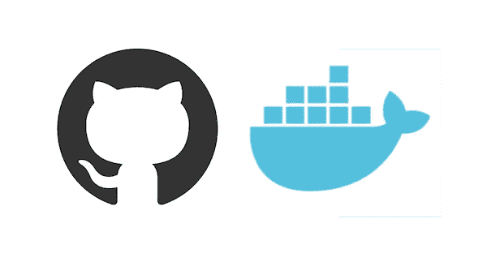
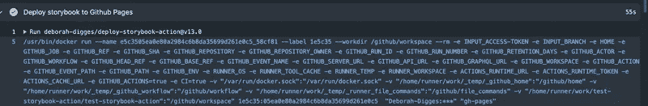

# 深入研究 Docker 容器动作

> 原文：<https://betterprogramming.pub/delving-into-docker-container-actions-588332af5869>

## 概述了在 GitHub 中何时使用 Docker 容器动作而不是 JavaScript 动作，并深入探讨了如何构建 Docker 容器动作

资料来源:github.com 和 docker.com

在我的[上一篇文章](https://medium.com/better-programming/a-deep-dive-into-github-actions-51e234da0c50)中，我详细描述了 GitHub 动作背后的动机、它们的架构、事件如何流经 GitHub，以及如何使用 JavaScript 从头开始创建一个定制的 GitHub 动作。

我讨论了两种类型的动作:JavaScript 动作和 Docker 容器动作。我所探索的许多开源动作都是使用 Javascript 动作构建的——可能是出于以下原因:

1.  他们可以利用一个方便的 GitHub [工具包](https://github.com/actions/toolkit)，它提供了对动作输入的库访问，以及一个可以用令牌配置的 GitHub 客户端。
2.  所有 GitHub 运行者都支持 Node 12 开箱即用，这使得基于这个版本的 Node 编写动作变得非常简单。不需要额外的配置。要了解 GitHub Runner 环境支持哪些软件，请看一下文档。

# 什么时候使用 Docker 容器动作？

Docker 容器动作在一些情况下很出色。

## 当使用 JavaScript 不是一个选项时

*   也许你的团队熟悉其他语言或框架。
*   也许你更喜欢保持所有工具的一致性。也许您在 Go 中编写了所有的工具，并且愿意继续这样做。
*   也许您想利用 Node 中没有的实用程序或库。例如，您的团队已经编写了一个用于管理或解析数据的 Python 脚本，但您不想将其移植到 JavaScript。

## **当 u** sing 节点(12)的特定版本不可选项

也许您想让您的操作基于不同的节点版本。

即使您使用 Node 12 的受支持版本来构建您的操作，使用 Docker 容器操作仍然对您有好处，原因如下:

1.  你不再需要将`node_modules`文件夹直接包含在你的动作报告中。您可以使用一个`package.json`文件来枚举依赖项，并让 Docker 容器在操作运行时下拉依赖项。
2.  将运行动作所需的环境与动作本身捆绑在一起，可以防止在 GitHub runner 环境的软件升级过程中可能出现的破坏性变化。

# 创建 Docker 容器操作

在寻找有趣的动作时，我在还没有完全充实的[故事书 GitHub 组织](http://github.com/storybookjs)中偶然发现了[这个动作](https://github.com/storybookjs/action/)！

这是一个旨在构建故事书站点并将其部署到 GitHub 页面或 AWS S3 存储桶的操作。在本文中，我将介绍如何为这个用例构建一个 GitHub Docker 容器动作。

关于 Docker 容器动作的 hello world 介绍，请查看 GitHub 文档。

## 定义行动

我们首先在存储库根目录下的一个`action.yml`文件中定义动作的接口——它的输入、输出和环境:

## **动作的输入**

我们为 GitHub 动作指定以下输入:

1.  `access-token`:推送至存储库特定分支所需的 GitHub 个人访问令牌。
2.  `branch`:story book 站点部署到的目标分支。

## **动作的 Docker 图像**

Docker 容器动作指定用于启动容器的图像，动作代码在该容器中运行。对于 Docker 动作，我们使用`docker`指定要运行的动作。`image`可以用两种方式之一来表示:

1.通过使用动作库中的`Dockerfile`:

这就是我们在示例中使用的内容。

2.通过使用公共 Docker 注册表中的图像:

## **将输入传递给 Docker 容器**

理想情况下，我希望为 Docker 动作指定的输入在它启动时自动传递给 Docker 容器。然而，这样做还需要一个额外的步骤。`args`指定当作业运行程序运行动作时，要传递给 Docker 容器的参数。

当容器启动时，作业运行程序将参数传递给容器的`ENTRYPOINT`。

## 创建 Dockerfile 文件

我们遵循编写 docker 文件的标准语法和原则，并在文档中列出了一些针对 GitHub 实现的注意事项。

这个动作的 Dockerfile 使用`alpine` Linux 作为映像的基础，添加 Node 和 Git，并指示 Docker 在容器开始使用这个映像时运行`entrypoint.sh`。

GitHub runner 将从我们的 docker 文件构建一个映像，使用这个映像启动一个容器，并在容器启动时运行`entrypoint.sh`中的代码。

GitHub 作业运行器使用以下命令启动容器，该命令将许多必需的参数传递给容器:

一些重要的是:

1.  `--workdir /github/workspace`:它将容器的工作目录设置为 runner 工作区(在本例中，存储库应该已经被克隆)。这个目录也作为`GITHUB_WORKSPACE`环境变量传递。
2.  在`action.yml`中指定的`args`作为最后一个参数传递:

*   `Deborah-Digges:***`:混淆的 GitHub 令牌
*   `gh-pages`:推送到仓库上的分支

## 在容器中运行代码！

我们已经指定我们的`ENTRYPOINT`是一个 bash 脚本，我们可以运行一个节点脚本，一个 Python 模块，或者几乎任何我们想要的东西！

在这种情况下，我们将使用 [storybook-deployer](https://github.com/storybookjs/storybook-deployer) ，而不是编写代码来构建故事书站点并将其推送到 GitHub pages。对不起出轨了！它并不完整，因为，如你所见，它假设了项目的许多事情(例如，它使用 npm 而不是 yarn)。

部署故事书站点的步骤如下:

1.  安装`storybook-deployer`依赖项。
2.  使用正确的分支和令牌参数运行`storybook-deployer`。

在 GitHub 上查看已完成动作[的代码。](https://github.com/Deborah-Digges/publish-storybook-action)

# 在 GitHub 工作流程中使用 Docker 容器动作

让我们看看如何在一个使用 Storybook 构建 Storybook 站点并在每次 push to master 时将 story book 站点部署到 GitHub 的`gh-pages`分支中。

我们需要在位于`.github/workflows`的存储库中创建一个工作流文件:

我们指定希望这个工作流在每个*推*到*主*分支时运行。该工作流有一个名为`build`的作业，有三个步骤:

1.  使用`actions/checkout@v2`动作签出存储库。
2.  通过运行脚本安装依赖项。
3.  使用我们刚刚创建的操作将 Storybook 站点部署到 GitHub 页面。

我们使用语法`deborah-digges/deploy-storybook-action@v13.0`引用一个动作，包括:

1.  所有者或组织名称
2.  存储库名称
3.  版本可以是存储库中的标记或提交 ID

要在[动作](https://github.com/Deborah-Digges/test-storybook-action/actions/runs/334499434)(没有双关语)中查看这个工作流，请查看[这个](https://github.com/Deborah-Digges/test-storybook-action)存储库，它使用我们刚刚构建的动作将一个故事书站点部署到 [GitHub 页面](https://deborah-digges.github.io/test-storybook-action/)。

# 你需要 GitHub 动作吗？

思考我们是否需要一个单独的 GitHub 动作来封装一个步骤中的逻辑，或者它是否可以在工作流本身中执行，这是一个很好的练习。

为了更好地理解这一点，记住工作流中的一个步骤可以是:

1.  一种动作，它封装了使用所需输入调用的一些逻辑。
2.  bash 命令在工作流本身中运行。

在这种情况下，我们刚刚构建的动作中可重用逻辑的数量可以忽略不计，并且该动作只是已经存在的`deploy-storybook`工具的一个薄薄的包装。我们也可以直接在工作流程中运行这个工具。

更改工作流文件以运行工作流文件中的操作代码可以完成相同的工作，而不必创建和维护一个全新的操作存储库！

在开始编写独立的 GitHub 动作之前，我们真正应该回答的问题是“其他人会从这个抽象中受益吗？”

如果答案是否定的，我们很可能不需要编写新的 GitHub 动作。

# 包扎

在本文中，我们学习了何时使用 Docker 容器动作，如何编写一个动作，以及何时编写一个单独的动作，而不是在工作流本身中执行内联步骤。

如果你想快速复习什么是 GitHub 动作，为什么它们有用，或者如何编写 JavaScript 动作，请查看我的前一篇文章。