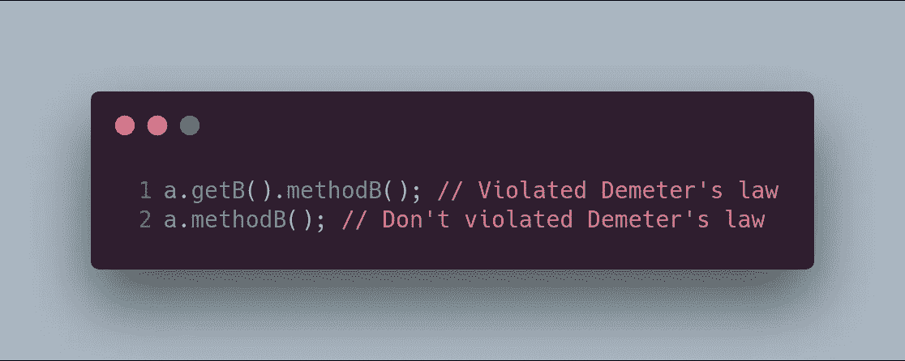
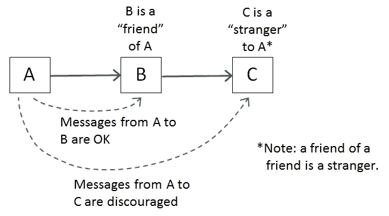
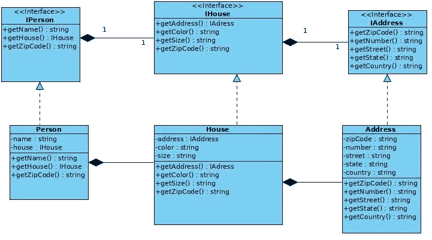
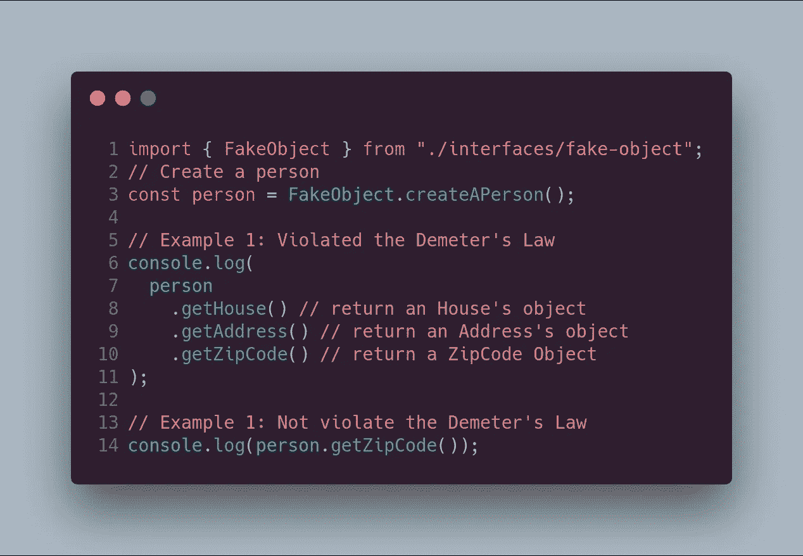
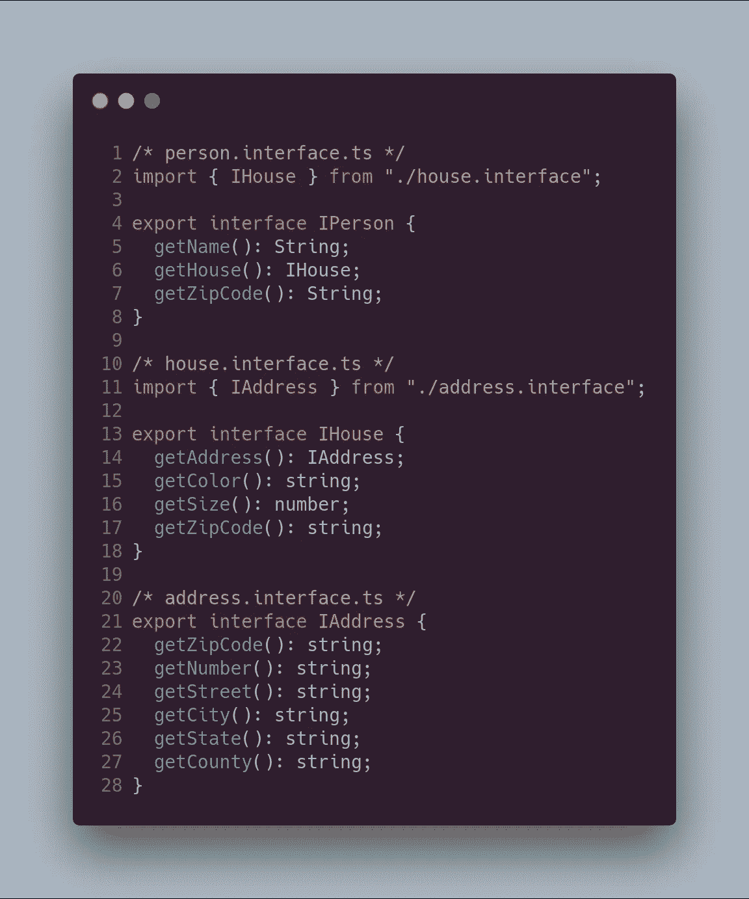
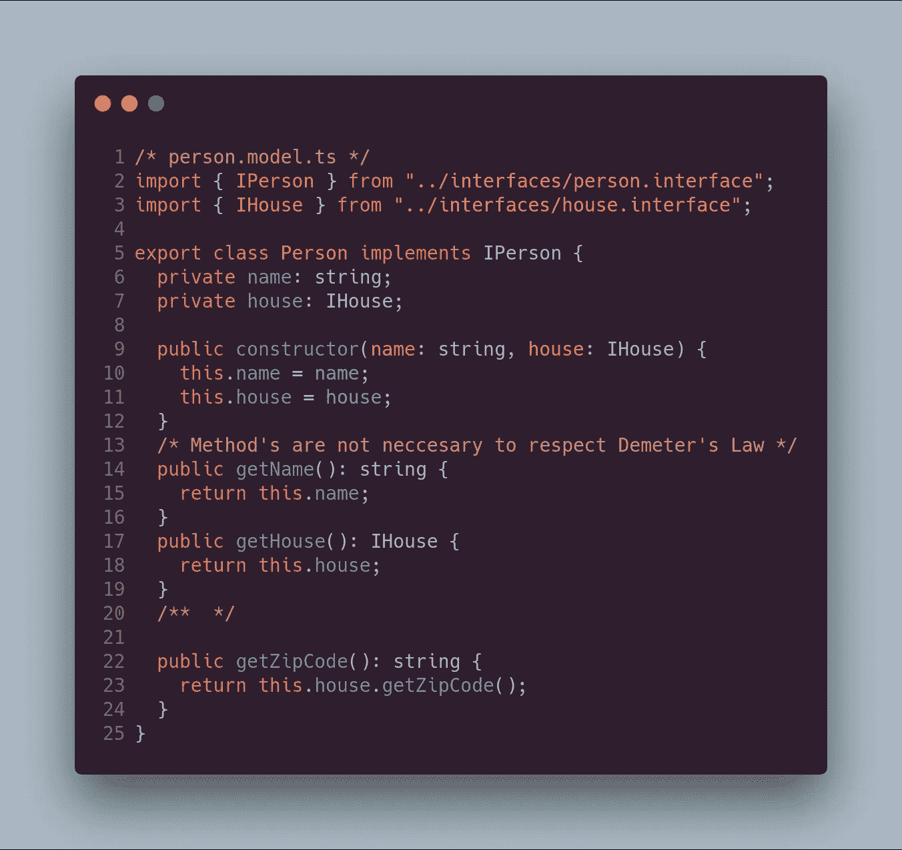
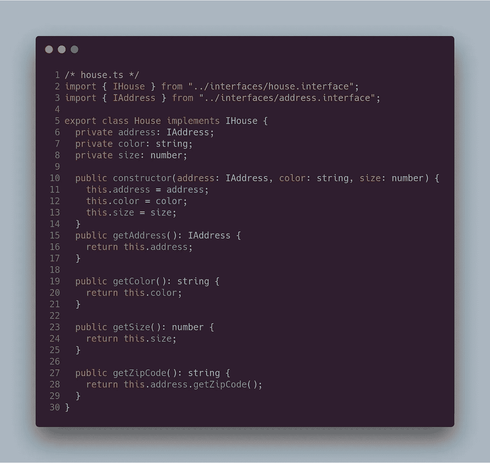
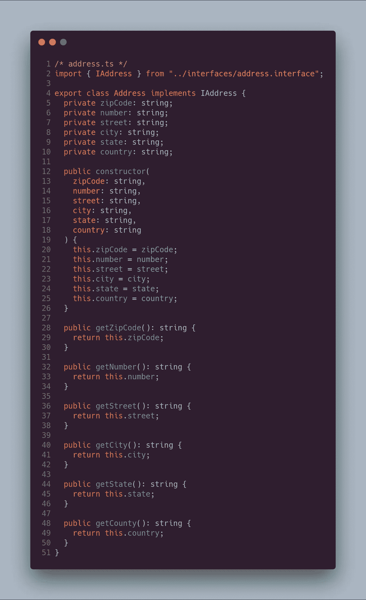
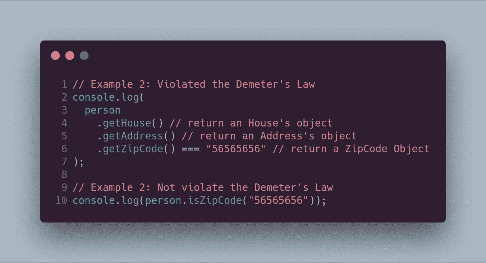
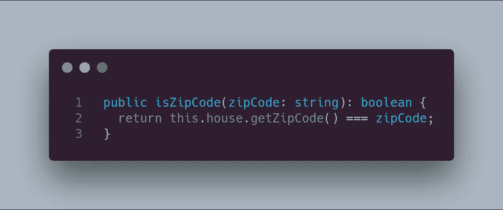

# 德米特里定律:不要和陌生人说话！

> 原文：<https://betterprogramming.pub/demeters-law-don-t-talk-to-strangers-87bb4af11694>

## 软件工程原理

> 德米特定律(LoD)或最少知识原则(T10)是开发软件，尤其是面向对象程序的设计指南。

— *维基百科*

这个定律是伊恩·霍兰德在 1987 年提出的。Holland 和他的同事正在使用面向对象编程来设计一个叫做 *Demeter* 的系统。在系统开发过程中，他们意识到满足一系列规则的代码耦合度较低。

德米特里定律被称为“不要和陌生人说话”，因为:

1.  每个单元应该只对其他单元有有限的了解——只有与当前单元“密切”相关的单元。
2.  各单位只和自己的朋友说话— *不要和陌生人说话*。
3.  只和你最亲近的朋友说话。

更正式地说，Demeter 法则要求对象*或*的方法 *m* 只能调用以下类型对象的方法:

*   *O* 本身。
*   *m 的*参数。
*   在 m 内创建/实例化的任何对象*。*
*   o 的直接组件对象。
*   一个全局变量，*可由 O 访问，在 m* 的范围内。

总之，上面所有的规则都可以总结为:应该避免调用由另一个方法返回的成员对象的方法。在现代面向对象语言中，使用的标识符是`dot`或`->`。因此，当代码在类之间有多个步骤时，就违反了德米特定律。例如，以下代码显示了违反德米特里定律的示例:

在这种情况下，来自 A 类的对象`a`可以请求 B 类的对象实例的方法，但是对象 A *不应该直接到达*对象 B，因为这意味着对象 A 对对象 B 的内部结构有更多的了解(紧耦合)。

下图说明了阶级之间谁是朋友的关系:

# 真实例子—人→房子→地址

现在，我将展示一个用 TypeScript 实现的真实例子。在下面的 UML 图中，您可以看到,`Person`与`House`相关，而`House`与`Address`相关。

原代码来自[https://github.com/tavaresasilva/LoDRaV](https://github.com/tavaresasilva/LoDRaV)，用 JAVA 编码。

下面的代码可以在客户端/上下文中运行，而第一个代码违反了德米特定律，因为`Person`需要了解类`House`的内部实现。另一方面，第二种实现遵循 Demeter 定律，代码耦合度较低。

下面的步骤表明，您必须实现代码以遵守 Demeter 定律，并获得耦合度较低的代码。因此，第一步是创建将在我们的具体类中实现的接口:

下一步将是具体类的实现，如下所示:

代码中最重要的一点是，没有任何方法违反了德米特里定律(被包含对象的连续调用不超过两次)。

这是另一个违反德米特里定律的例子:

在这种情况下，解决方案是在类`person`中实现`isZipCode`方法，如下面的代码所示:

# 优势

满足德米特里定律的主要优点是:

1.  减少了类之间的依赖性和耦合。
2.  可以轻松地重用类。
3.  代码更容易测试。
4.  代码更易维护，对变化更灵活。

# 越来越多

【http://www.ccs.neu.edu/home/lieber/LoD.html
[https://en.wikipedia.org/wiki/Law_of_Demeter](https://en.wikipedia.org/wiki/Law_of_Demeter)
[https://hacker noon . com/the-law-of-Demeter-in-the-era-of-micro-services-3186 f4c 399 a1](https://hackernoon.com/the-law-of-demeter-in-the-era-of-microservices-3186f4c399a1)
[https://testing . Google blog . com/2008/07/breaking-law-of-of-Demeter-is-like-looking . html](https://testing.googleblog.com/2008/07/breaking-law-of-demeter-is-like-looking.html)
[http://www](http://www.virtuouscode.com/2011/07/05/demeter-its-not-just-a-good-idea-its-the-law/)

这个岗位的 GitHub 分支是[https://github.com/Caballerog/blog/tree/master/demeter](https://github.com/Caballerog/blog/tree/master/demeter-law)