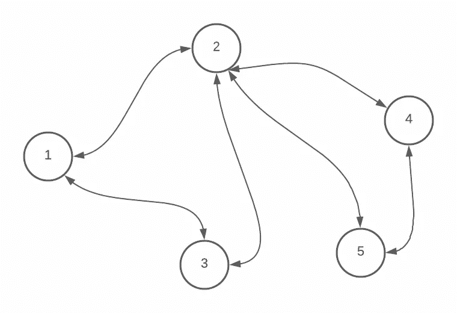
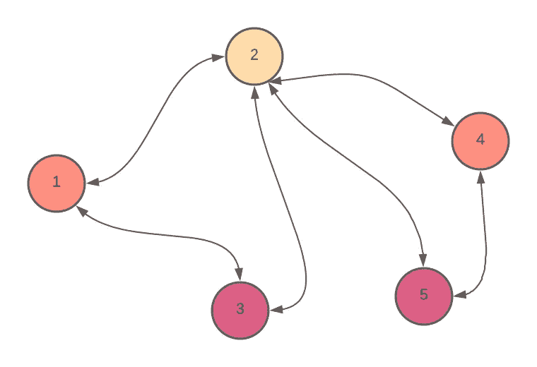
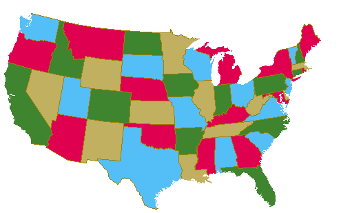
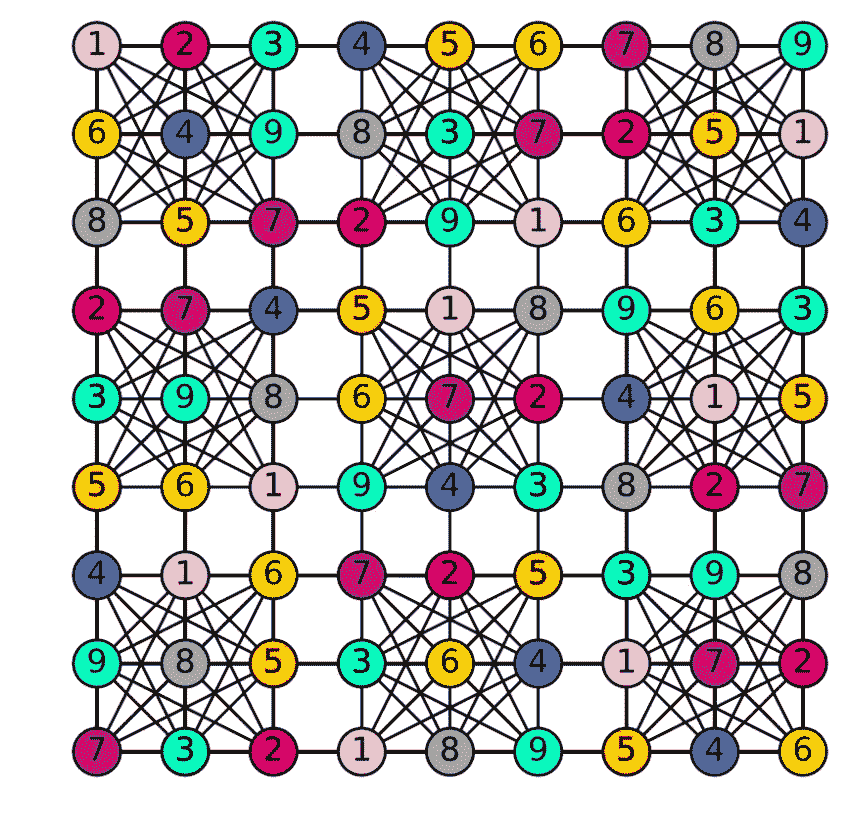

# 揭开图着色算法的神秘面纱

> 原文：<https://betterprogramming.pub/demystify-graph-coloring-algorithms-9ae51351ea5b>

## 解决边着色，地图着色，和其他有趣的问题

萨尔瓦托·文图拉在 [Unsplash](https://unsplash.com?utm_source=medium&utm_medium=referral) 上拍摄的照片

图着色是一个问题，其中某些颜色被分配给图中的特定约束。例如，您可能必须给一个图形着色，无论是顶点还是边，这样就不会有两个相同的颜色彼此相邻——不会有两个相邻的顶点或边具有相同的颜色。

我偶然发现了这个算法，我在想它的目的是什么。随着我对图着色问题及其用例的深入研究，我意识到它们在我们使用的应用程序中被广泛使用。本文将简单谈谈这种算法和图着色的用例。

# 该算法

图的着色问题有很多方法。你可以做[顶点着色](https://mathworld.wolfram.com/VertexColoring.html#:~:text=A%20vertex%20coloring%20is%20an,colors%20for%20a%20given%20graph.)，边缘着色，地理[地图着色](https://en.wikipedia.org/wiki/Map_coloring#:~:text=Map%20coloring%20is%20the%20act,different%20features%20on%20a%20map.&text=The%20second%20is%20in%20mathematics,features%20have%20the%20same%20color.)。在这个算法中你可以问不同的问题。例如，我们可以回答不同时分配彼此依赖的相同资源的问题。我们还可以回答这个问题:给这个图着色所需的最少颜色数是多少。而且，我们可以把这变成一个回溯问题，在这里我们要找到所有可能的可以给这个图着色的着色方法。

这将是一个简单的用例。一旦我们知道了基本算法，我们总是可以回答这些问题。

假设是顶点着色，我想给图着色，这样没有两个相邻的顶点有相同的颜色。

假设一个图中有五个顶点。我们可以分配给每个顶点的最大颜色数是五。因此，我们可以将颜色列表初始化为五种颜色。

接下来，我们可以开始给空白图上的第一个顶点着色。你可以随便选一个——没关系。

在下面的算法中，我们基于下面的操作对图中的每个顶点进行着色:

*   循环通过它所有相邻顶点。如果相邻顶点有颜色，将该颜色放入桶(集)中。
*   选择不在该桶(集合)中的第一个颜色，并将其分配给当前顶点。
*   清空桶，转到下一个还没有着色的顶点。

这种贪婪算法足以解决图着色。虽然它不保证最小颜色，但它保证了分配给图形的颜色数的上限。

我们遍历顶点，总是选择第一个不存在于相邻顶点的颜色。我们开始算法的顺序很重要。

如果我们迭代的顶点有更少的输入边，我们可能需要更多的颜色来给图着色。因此，还有一种算法叫做威尔士-鲍威尔算法。

我想解释一下威尔士-鲍威尔算法是如何工作的。为了证明它可以保证一个图的最小着色数，请查看下面的参考资料。在这个主题中有很多东西可以深入研究。

算法如下:

1.  计算每个顶点上的传入边，并按降序排列。
2.  选择第一个具有最大输入顺序的顶点，并将这些顶点分配给一种颜色——我们称之为顶点 a。
3.  循环遍历其他顶点，如果为 1，则为顶点指定一种颜色。它是*而不是*顶点 A. 2 的邻域。顶点尚未着色。3.该顶点的邻居与顶点 a 的颜色不同。
4.  继续做第 3 步，直到所有的顶点都着色。

现在你已经看到了图着色算法的样子，你可能会想，这样做有什么用呢？

# 用例

通常，图着色算法用于解决资源有限和其他限制的问题。颜色只是你试图优化的任何资源的抽象。图表是你的问题的抽象。

图通常被建模为现实世界的问题，我们可以使用算法在图中找到任何属性来回答我们的一些问题。

让我们看一些图着色的用例。

# 调度算法

想象你有一组工作要做，有几个工人。如果您在特定时间段内将工人分配到某项工作，将会有所帮助。您可以按任何顺序分配作业，但是一对作业可能在一个时间段内发生冲突，因为它们共享相同的资源。你如何有效地分配工作，使得没有工作冲突？在这种情况下，顶点可以是作业，边可以是两个作业的连接，如果它们依赖相同的资源。如果您有无限数量的工人，您可以使用图着色算法获得最佳时间来调度所有无冲突的作业。在这种情况下，颜色将是工人的编号。如果将相同的颜色分配给两个顶点(作业)，则该工人将处理这两个作业。

另一个例子是制定时间表或时间表。你想做一个考试时间表。每个科目都有一个学生名单，每个学生都要上多门课。您希望确保您安排的考试不会相互冲突。在这种情况下，顶点可以是类，并且如果同一个学生在两个类中，则两个类之间存在边。在这种情况下，图表中的颜色将是安排考试所需的时间段数。因此，顶点 A 和顶点 B 上的相同颜色意味着 A 和 B 将在相同的时隙中进行。

通常，在这种类型的问题中有共享资源，我们希望有一个调度器来确保系统中没有两个实体冲突。颜色通常代表时间段或工作人员。

# 地图着色

地理地图着色是一个问题，其中没有两个相邻的城市或州可以在地图上被分配相同的颜色。根据[四色定理](https://mathworld.wolfram.com/Four-ColorTheorem.html#:~:text=The%20four%2Dcolor%20theorem%20states,conjectured%20the%20theorem%20in%201852.)，四种颜色足以给任何地图上色。在这种情况下，顶点代表每个区域，并且它的每个相邻区域可以被分类为一个边。

# 数独谜题

来自研究之门网

数独是图着色问题的一种变体，其中每个单元代表一个顶点。如果两个顶点在同一行、列和块中，则在这两个顶点内形成一条边。每个方块都有不同的颜色。

# 编译器的寄存器分配

编译器是将源代码从高级代码(Java、Scala)转换成机器代码的程序。这通常在单独的步骤中完成。最后一步是将寄存器分配给程序中最常用的值，而将其他值放入内存。我们可以将符号寄存器(变量)建模为顶点，如果同时需要两个变量，就会形成一条边。如果图可以用 K 色着色，那么变量可以用 K 注册存储。

图着色算法还有很多其他的用例。希望你学到了一些东西！

# 资源

有一些很棒的关于图着色算法的资源，以及它的用例。如果您想了解更多信息，请查看以下资源:

*   [图形算法](https://www.cs.cornell.edu/courses/cs3110/2012sp/recitations/rec21-graphs/rec21.html)
*   [使用图着色调度并行任务。(发布会)| OSTI.GOV](https://www.osti.gov/servlets/purl/1524829)
*   [图着色|集合 1(简介及应用)— GeeksforGeeks](https://www.geeksforgeeks.org/graph-coloring-applications/?ref=rp)